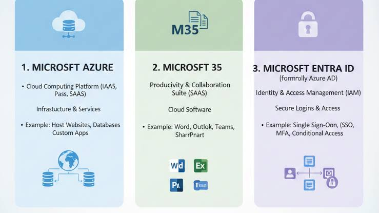
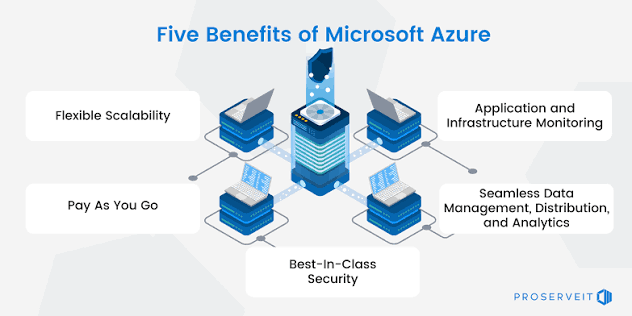

# Topic 1: Microsoft Cloud & Security Ecosystem Foundations

> Prerequisite knowledge for SC-200 (Microsoft Security Operations Analyst). Before diving into Sentinel, Defender XDR, and KQL, you need to know the three core Microsoft platforms an SOC analyst works across: **Azure**, **Microsoft 365**, and **Microsoft Entra ID**.

---

## 1. The Three Pillars

| Platform | Category | What it does | Examples |
|---|---|---|---|
| **Microsoft Azure** | Cloud Computing Platform (IaaS, PaaS, SaaS) | Infrastructure & services — hosting, compute, storage | Hosting websites, databases, custom apps |
| **Microsoft 365** | Productivity & Collaboration Suite (SaaS) | Cloud software for everyday work | Word, Excel, Outlook, Teams, SharePoint |
| **Microsoft Entra ID** *(formerly Azure AD)* | Identity & Access Management (IAM) | Secure logins & access control | Single Sign-On (SSO), MFA, Conditional Access |

**Why this matters for SC-200:** almost every domain of the exam sits on top of one of these three platforms.
- **Microsoft Sentinel** and **Defender for Cloud** protect Azure workloads.
- **Defender for Office 365** and **Purview** protect Microsoft 365 data and communications.
- **Defender for Identity** and **Entra ID** investigations protect identity — usually the first thing attackers compromise (credential theft, phishing, lateral movement).

---

## 2. Why Organizations Use Azure

As a security analyst, understanding *why* a business adopts Azure helps you understand what you're defending and why certain controls exist:

- **Flexible Scalability** — resources scale up/down with demand, which also means your attack surface can change dynamically. Monitoring must scale with it.
- **Pay As You Go** — cost model tied to consumption; unusual spikes in resource usage can itself be a signal of compromise (e.g., cryptomining).
- **Best-in-Class Security** — built-in platform protections (Defender for Cloud, Entra ID Protection, encryption at rest/in transit) that SOC analysts configure and tune.
- **Application & Infrastructure Monitoring** — native telemetry (Azure Monitor, Activity Logs, Diagnostic Settings) that feeds directly into Microsoft Sentinel as data connectors.
- **Seamless Data Management, Distribution & Analytics** — centralized logging is what makes KQL-based hunting and analytics rules possible in the first place.

---

## 3. How This Maps to the SC-200 Exam Domains

| SC-200 Domain | Weight | Relies on |
|---|---|---|
| Manage a security operations environment | 40–45% | Azure (Sentinel platform, data ingestion) + Defender XDR |
| Respond to security incidents | 35–40% | M365 (Purview, Defender for Office 365) + Entra ID (identity compromise) + Azure (Defender for Cloud) |
| Perform threat hunting | 20–25% | Azure (Sentinel data lake, KQL) + Defender XDR (Advanced Hunting) |

---

## 4. Key Terms to Know

- **IaaS / PaaS / SaaS** — Infrastructure/Platform/Software as a Service; Azure spans all three, M365 is SaaS only.
- **IAM (Identity and Access Management)** — the discipline Entra ID belongs to; core to Zero Trust.
- **SSO (Single Sign-On)** — one login, multiple apps.
- **MFA (Multi-Factor Authentication)** — a second proof of identity beyond a password.
- **Conditional Access** — policy engine in Entra ID that grants/blocks access based on signals (location, device, risk level).

---

## 5. Quick Self-Check

- [ ] Can you explain the difference between Azure, M365, and Entra ID in one sentence each?
- [ ] Can you name which SC-200 tool protects which platform (Azure → Defender for Cloud, M365 → Defender for Office 365 / Purview, Identity → Entra ID / Defender for Identity)?
- [ ] Do you understand why centralized logging in Azure enables Sentinel's KQL-based hunting?

---

*Images in this README are stored alongside it (`azure-benefits.png`, `entra-ms365-azure.jpg`) — keep them in the same folder as this file so they render correctly on GitHub.*
