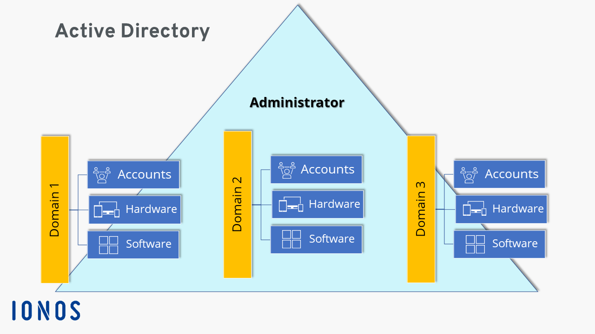
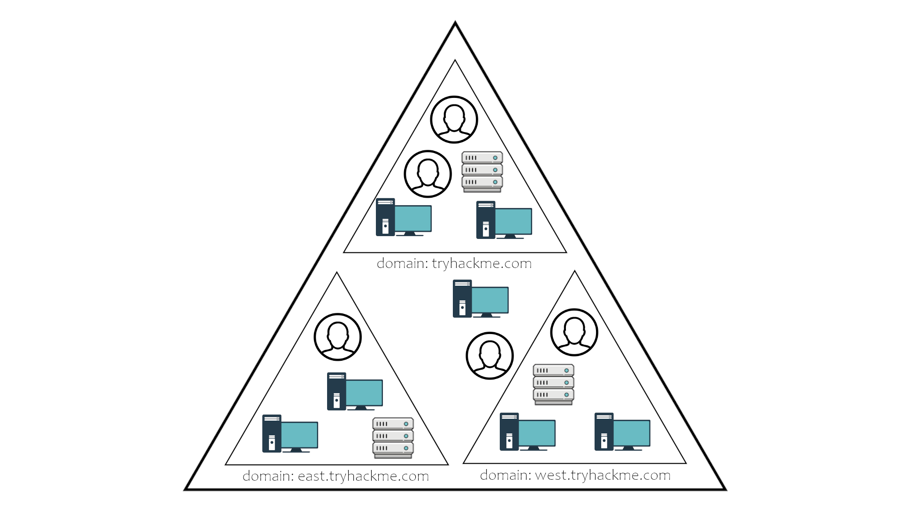
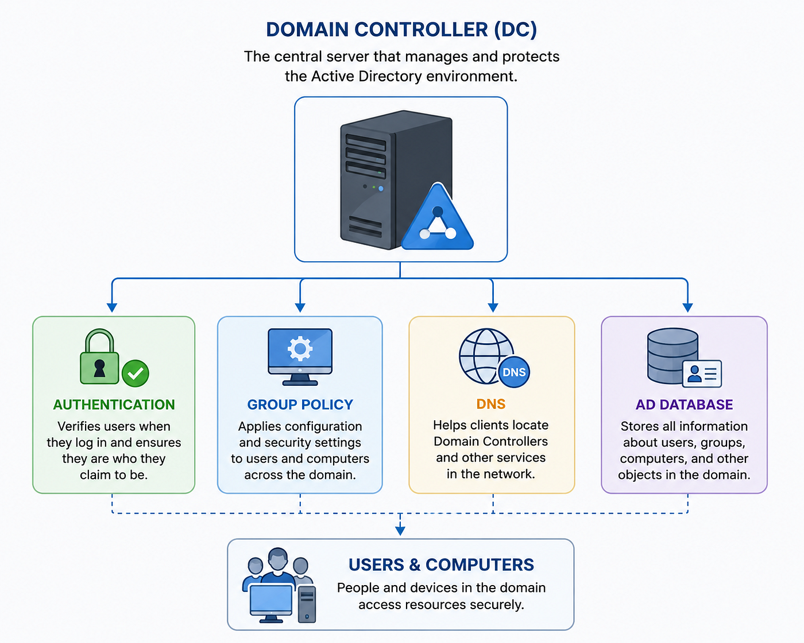

# Topic 2: Active Directory (AD) Fundamentals

> On-prem identity foundation. Before Entra ID/hybrid identity and Defender for Identity investigations in SC-200 make sense, you need to understand how traditional Active Directory Domain Services (AD DS) is structured and what a Domain Controller actually does — since most enterprises still run AD alongside (or hybrid-joined to) Entra ID.

---

## 1. What Active Directory Is

**Active Directory (AD)** is Microsoft's directory service for Windows domain networks. It centrally organizes and manages:

- **Accounts** — users, groups, service accounts
- **Hardware** — computers, servers, printers, other devices
- **Software** — policies and configuration pushed to machines

An **Administrator** sits above one or more **domains**, each of which independently manages its own accounts, hardware, and software — but all are part of the same overall AD structure.

---

## 2. Domains, Trees, and Forests

AD is organized hierarchically:

| Term | Definition |
|---|---|
| **Domain** | A logical group of objects (users, computers, servers) sharing a common AD database and security policies — e.g., `tryhackme.com` |
| **Child domain** | A domain nested under a parent, inheriting a namespace — e.g., `east.tryhackme.com`, `west.tryhackme.com` under `tryhackme.com` |
| **Tree** | A parent domain + its child domains, connected by trust relationships |
| **Forest** | The top-level container — one or more trees, sharing a common schema, catalog, and configuration. The **security boundary** in AD |

**Why this matters for SC-200:** understanding domain/forest boundaries helps you scope an incident. If an attacker compromises `east.tryhackme.com`, trust relationships determine whether that risk can extend to `west.tryhackme.com` or the root domain — this is core to lateral movement analysis during incident response.

---

## 3. The Domain Controller (DC)

The **Domain Controller (DC)** is the central server that manages and protects the AD environment. It's one of the highest-value targets for attackers — compromising a DC often means compromising the entire domain.

| Function | What it does |
|---|---|
| **Authentication** | Verifies users at login and confirms they are who they claim to be (Kerberos/NTLM) |
| **Group Policy** | Applies configuration and security settings to users and computers across the domain |
| **DNS** | Helps clients locate Domain Controllers and other services on the network |
| **AD Database** | Stores all information about users, groups, computers, and other domain objects (NTDS.dit) |

All four functions ultimately serve **Users & Computers** — people and devices accessing domain resources securely.

---

## 4. Why This Matters for SC-200 / SOC Work

| SC-200 Domain | Relevance |
|---|---|
| Manage a security operations environment | Onboarding on-prem AD logs (via Microsoft Defender for Identity sensors) into Sentinel/Defender XDR |
| Respond to security incidents | Investigating DC compromise, Golden Ticket/Kerberoasting attacks, lateral movement across domains |
| Perform threat hunting | Hunting for anomalous authentication patterns, suspicious Group Policy changes, DNS-based C2 |

**Key attack concepts to connect later in the course:**
- **Kerberoasting** — targeting service accounts via Kerberos tickets
- **Golden/Silver Ticket attacks** — forging Kerberos tickets after compromising the DC
- **Pass-the-Hash / Pass-the-Ticket** — reusing captured credentials without knowing the plaintext password
- **DCSync** — an attacker impersonating a DC to pull password hashes

Microsoft Defender for Identity (part of Defender XDR) is the SC-200 tool that specifically monitors DCs for these behaviors and feeds alerts into Sentinel incidents.

---

## 5. Key Terms to Know

- **AD DS** — Active Directory Domain Services, the core AD role
- **Domain** — administrative/security boundary for a group of objects
- **Forest** — the true outer security boundary containing one or more domain trees
- **Trust relationship** — allows authentication across domains/forests
- **Group Policy Object (GPO)** — a collection of settings applied to users/computers
- **NTDS.dit** — the database file on a DC storing all AD objects and password hashes
- **SYSVOL** — shared folder on DCs replicating Group Policy and scripts

---

## 6. Quick Self-Check

- [ ] Can you explain the difference between a domain, a tree, and a forest?
- [ ] Can you list all four core functions of a Domain Controller?
- [ ] Do you understand why a compromised DC is a "crown jewel" incident, not just another endpoint?
- [ ] Can you name the SC-200 tool that monitors AD-specific attacks (Defender for Identity)?

---

*Keep `active-directory.png`, `active-directory-tree.png`, and `DC.png` in this same folder as this README so the image links resolve correctly on GitHub.*
