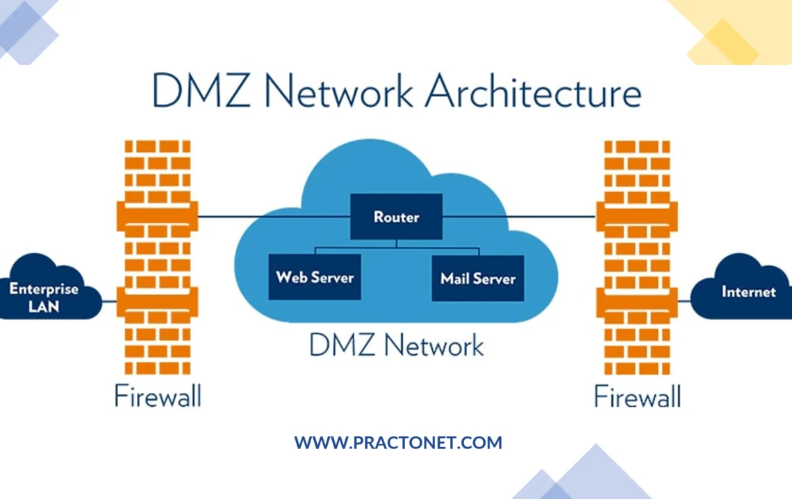
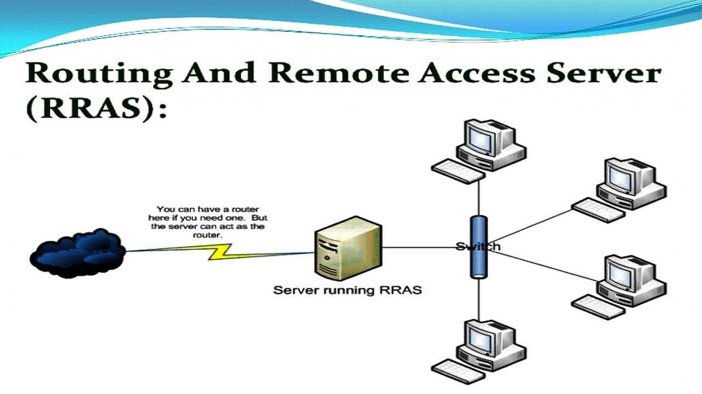
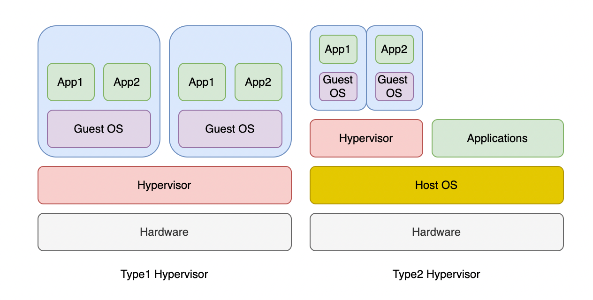

# Topic 3: Network Infrastructure & Virtualization Foundations

> Continuing the pre-SC-200 foundations: how traffic is exposed/segmented at the network edge (DMZ), how remote access into a network is provided (RRAS), and how virtualization underpins both on-prem servers and cloud VMs (which Defender for Cloud / Defender for Servers will protect later in the course).

---

## 1. DMZ (Demilitarized Zone) Network Architecture

A **DMZ** is a buffer subnet sitting between the trusted internal network (**Enterprise LAN**) and the untrusted **Internet**, isolated by **two firewalls**.

- **Outer firewall** — filters traffic coming from the Internet into the DMZ
- **Router** inside the DMZ directs traffic to public-facing services
- **Web Server / Mail Server** — internet-facing services live *here*, not on the internal LAN
- **Inner firewall** — filters traffic between the DMZ and the Enterprise LAN

**Why a DMZ exists:** if an attacker compromises the web or mail server, they land in the DMZ — a segmented zone — not directly inside the corporate network. The inner firewall is a second barrier they still have to bypass.

**SC-200 relevance:**
- DMZ segmentation is a core network security control you'll see referenced in incident response — e.g., determining whether an alert originated in the DMZ (lower blast radius) or the internal LAN (higher severity).
- Azure equivalents: **Network Security Groups (NSGs)**, **Azure Firewall**, and **hub-spoke network topology** replicate this same "public-facing tier vs. internal tier" segmentation in the cloud — relevant to Defender for Cloud recommendations.

---

## 2. Routing and Remote Access Server (RRAS)

**RRAS** is a Windows Server role that allows a server to act as a **router** and/or provide **remote access** (VPN, dial-up) into a network.

- The server running RRAS sits between the **Internet/external network (cloud icon)** and the internal **switch**
- It can act as the router itself — no separate router hardware required
- Internal client PCs connect through the switch to reach external resources, with RRAS controlling and routing that traffic

**Why this matters for SC-200:**
- RRAS servers are a classic **remote access attack surface** — historically abused for VPN brute-forcing, credential attacks, and as a pivot point for lateral movement.
- Understand this as the on-prem ancestor of concepts you'll meet later: **Azure VPN Gateway**, **Conditional Access** for remote sign-ins, and **Defender for Cloud Apps** monitoring anomalous remote access patterns.
- Legacy RRAS/VPN servers are frequently flagged in real SOC investigations as an initial access vector (e.g., unpatched VPN appliances).

---

## 3. Virtualization: Type 1 vs Type 2 Hypervisors

A **hypervisor** is software that creates and runs virtual machines (VMs) by abstracting physical hardware.

| | **Type 1 (Bare-Metal)** | **Type 2 (Hosted)** |
|---|---|---|
| **Runs on** | Directly on hardware | On top of a Host OS |
| **Structure** | Hardware → Hypervisor → Guest OS(es) → Apps | Hardware → Host OS → Hypervisor → Guest OS(es) → Apps |
| **Performance** | Faster, lower overhead | Slower, extra OS layer overhead |
| **Examples** | Hyper-V, VMware ESXi, Xen | VMware Workstation, VirtualBox, Parallels |
| **Typical use** | Production servers, data centers, cloud platforms (Azure runs on Type 1) | Developer/test machines, personal use |

**Why this matters for SC-200:**
- **Azure VMs run on Type 1 hypervisors (Hyper-V-based)** — understanding this layer clarifies what **Defender for Servers / Defender for Cloud** actually protects (the Guest OS and Apps layer, not the hypervisor itself, which Microsoft manages in Azure).
- VM-level telemetry (process creation, file changes, network connections inside the Guest OS) is what gets ingested into Sentinel/Defender XDR for detection.
- Concepts like **VM escape attacks** (breaking out of Guest OS into the hypervisor) are an advanced threat category worth knowing exists, even if rare in practice.

---

## 4. How This Connects to SC-200 Exam Domains

| SC-200 Domain | Relevance |
|---|---|
| Manage a security operations environment | Understanding network topology (DMZ) and VM architecture to correctly scope data connectors and monitored assets |
| Respond to security incidents | Assessing blast radius of an incident based on where it occurred (DMZ vs internal LAN vs VM guest OS) |
| Perform threat hunting | Hunting for anomalous remote access (RRAS/VPN) logins, lateral movement across segmented zones |

---

## 5. Key Terms to Know

- **DMZ (Demilitarized Zone)** — buffer network segment between internal LAN and Internet
- **NSG (Network Security Group)** — Azure's equivalent of a firewall rule set for subnet/NIC-level segmentation
- **RRAS** — Windows Server role providing routing and remote access (VPN/dial-up)
- **Hypervisor** — software layer that creates/runs virtual machines
- **Type 1 / Bare-Metal Hypervisor** — runs directly on hardware (e.g., Hyper-V)
- **Type 2 / Hosted Hypervisor** — runs on top of a host OS (e.g., VirtualBox)
- **VM escape** — an attack breaking out of a guest VM into the hypervisor/host

---

## 6. Quick Self-Check

- [ ] Can you explain why a DMZ uses *two* firewalls instead of one?
- [ ] Can you describe what RRAS does and why legacy VPN servers are a common attack target?
- [ ] Can you name the structural difference between a Type 1 and Type 2 hypervisor?
- [ ] Do you understand which layer (Guest OS vs hypervisor) Defender for Servers actually monitors in Azure?

---

*Keep `DMZ.webp`, `RAS.jpg`, and `virtualization.png` in this same folder as this README so the image links resolve correctly on GitHub.*
