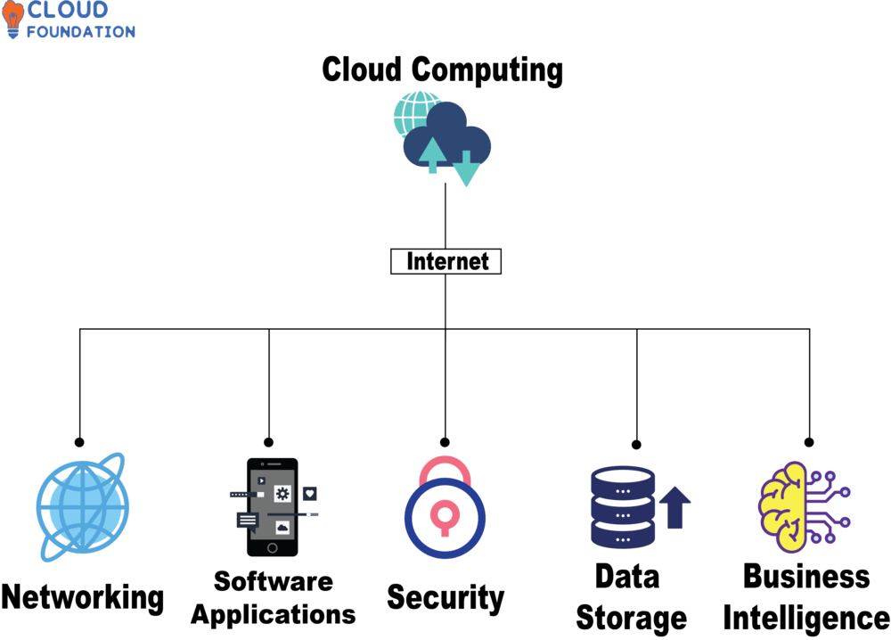

# Topic 4: Cloud Computing Fundamentals

> Zooming out from AD/on-prem infrastructure to the cloud delivery model. Cloud Computing is the umbrella concept that Azure (Topic 1), and everything SC-200 protects, sits under. This is the "why" behind why security telemetry now lives in the cloud instead of on a local server room.

---

## 1. What Cloud Computing Is

**Cloud Computing** is the delivery of computing services — servers, storage, databases, networking, software, analytics — over the **Internet**, instead of owning and running physical infrastructure yourself.

The diagram breaks it into five core service areas that the cloud delivers:

| Area | What it covers |
|---|---|
| **Networking** | Connectivity between users, apps, and services globally |
| **Software Applications** | Apps delivered and accessed remotely (SaaS) |
| **Security** | Identity, access control, and protection of cloud resources |
| **Data Storage** | Centralized, scalable storage for data of all types |
| **Business Intelligence** | Analytics and insights derived from stored data |

---

## 2. Why This Matters for SC-200

Every one of these five areas maps directly onto something you'll work with as a security analyst:

| Cloud Area | SC-200 / SOC Equivalent |
|---|---|
| **Networking** | NSGs, Azure Firewall, VPN Gateway — network-layer telemetry ingested into Sentinel |
| **Software Applications** | Defender for Cloud Apps monitors SaaS usage and shadow IT |
| **Security** | Entra ID, Conditional Access, Defender XDR, Sentinel itself |
| **Data Storage** | Log Analytics workspace, Sentinel data lake — where all security data lives |
| **Business Intelligence** | KQL analytics, workbooks, dashboards — turning raw logs into detections and insights |

**Key insight:** Microsoft Sentinel is essentially the "Security" + "Business Intelligence" areas of this diagram combined — it stores security data (like the Data Storage node) and lets you query/analyze it (like the Business Intelligence node) to detect threats.

---

## 3. The Cloud Shared Responsibility Model (context for later)

Even without a dedicated diagram yet, it's worth noting early: in cloud computing, security responsibility is **shared** between Microsoft (the cloud provider) and you (the customer). What Microsoft manages vs. what you must manage changes depending on whether you're using IaaS, PaaS, or SaaS (see Topic 1) — and this directly determines what Defender for Cloud can and cannot protect for you.

---

## 4. Key Terms to Know

- **Cloud Computing** — on-demand delivery of IT resources over the Internet
- **SaaS / PaaS / IaaS** — service delivery models (see Topic 1)
- **Shared Responsibility Model** — division of security duties between cloud provider and customer
- **Business Intelligence (BI)** — turning raw data into actionable insight (conceptually, what KQL + Sentinel workbooks do for security data)

---

## 5. Quick Self-Check

- [ ] Can you name the five core service areas of cloud computing shown in this diagram?
- [ ] Can you map each of the five areas to a specific Microsoft security tool you'll use in SC-200?
- [ ] Do you understand why "Security" and "Business Intelligence" together roughly describe what Sentinel does?

---

*Keep `cloud-computing.png` in this same folder as this README so the image link resolves correctly on GitHub.*
