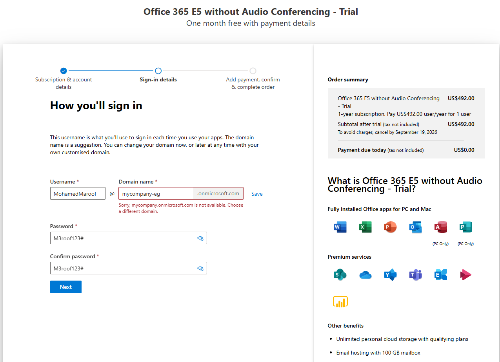
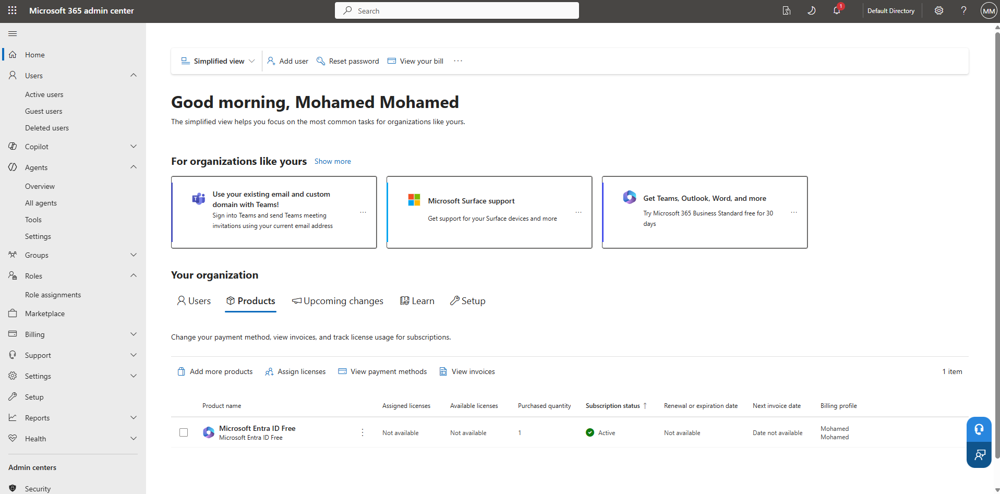
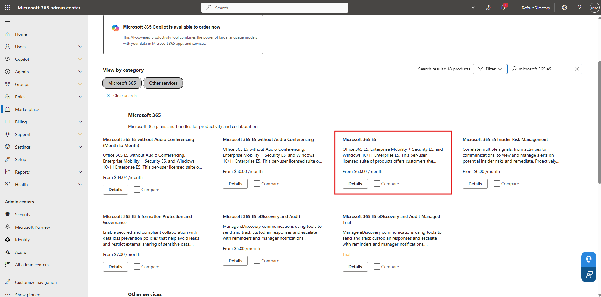
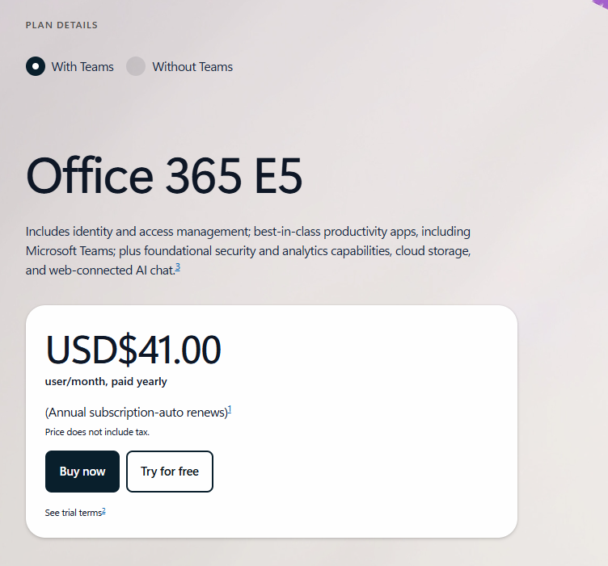
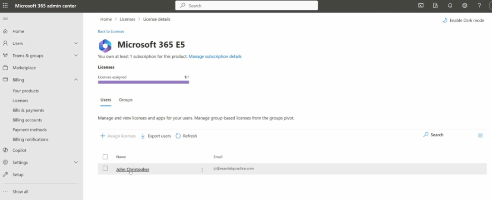

# Topic 5: Lab — Setting Up a Microsoft 365 E5 Trial Tenant

> Your first hands-on SIM. Before you can practice Sentinel, Defender XDR, or KQL, you need a real (trial) tenant to work in. This lab walks through signing up for an Office 365 E5 trial, landing in the Microsoft 365 admin center, finding the E5 SKU in the marketplace, and assigning the license to a user — the exact foundation every later SC-200 lab builds on.

---

## Why This Lab Matters

Microsoft 365 E5 / Office 365 E5 is the SKU that unlocks the **security workload** used throughout SC-200: Microsoft Defender for Office 365 (Plan 2), Microsoft Purview, Entra ID P2, and eligibility for Microsoft Sentinel data connectors. A lower-tier license (E1/E3, Business Standard) won't expose these features — so getting E5 provisioned correctly is a prerequisite, not busywork.

---

## Step 1: Sign Up — Choose Your Sign-In Details

During sign-up for **Office 365 E5 without Audio Conferencing – Trial**, you define:

- **Username** — the account you'll sign in with (e.g., `MohamedMaroof`)
- **Domain name** — your tenant's `.onmicrosoft.com` namespace (e.g., `mycompany-eg.onmicrosoft.com`)
- **Password / Confirm password**

⚠️ **Gotcha:** domain names are globally unique across all Microsoft 365 tenants. If you see *"Sorry, `<name>`.onmicrosoft.com is not available. Choose a different domain,"* just pick a more unique name — this is normal, not an error in your setup.

The order summary confirms this is a **trial**: full price billed only if not cancelled before the trial end date. Note the date shown — that's when charges would begin if the subscription isn't cancelled.

---

## Step 2: Land in the Microsoft 365 Admin Center

Once sign-up completes, you land in the **Microsoft 365 admin center** — your central hub for the whole tenant. Key areas visible here that you'll return to constantly throughout SC-200:

| Menu Item | Why it matters for SOC work |
|---|---|
| **Users** | Where you manage identities — the objects every security alert is ultimately about |
| **Roles** | Role assignments (RBAC) — controls who can do what, including SOC analyst permissions |
| **Billing → Your organization → Products** | Where you confirm what's licensed (note: only *Microsoft Entra ID Free* shows here by default — E5 hasn't been added yet) |
| **Security** *(left nav, bottom)* | Direct link into the Microsoft Defender portal |
| **Microsoft Purview** *(left nav, bottom)* | Compliance and data governance workload |
| **Azure** *(left nav, bottom)* | Jumps to the Azure portal — where Sentinel actually lives |

At this point, your tenant only has a **free Entra ID** license — the E5 product itself still needs to be added via the Marketplace.

---

## Step 3: Find Microsoft 365 E5 in the Marketplace

From **Marketplace**, search `microsoft 365 e5`. You'll see several similarly-named SKUs — it's easy to grab the wrong one:

| SKU | Includes |
|---|---|
| Microsoft 365 E5 without Audio Conferencing (Month to Month) | No Teams calling minutes, monthly billing |
| Microsoft 365 E5 without Audio Conferencing | No Teams calling minutes, annual |
| **Microsoft 365 E5** ✅ | Office 365 E5 + Enterprise Mobility + Security E5 + Windows 10/11 Enterprise E5 — the **full bundle** |
| Microsoft 365 E5 Insider Risk Management | Add-on only, not a base license |

For SC-200 labs, you want the **full Microsoft 365 E5** bundle (highlighted) — it's the one that includes Enterprise Mobility + Security E5, which is where Entra ID P2 and Defender for Identity licensing live.

---

## Step 4: Confirm Plan Details

Before buying/trialing, the plan details page confirms what you're getting:

> *"Includes identity and access management; best-in-class productivity apps, including Microsoft Teams; plus foundational security and analytics capabilities, cloud storage, and web-connected AI chat."*

- **With Teams / Without Teams** toggle — keep **With Teams** unless you specifically don't need it
- **USD $41.00/user/month**, paid yearly (auto-renews — cancel before renewal if this is trial-only)
- **Try for free** — this is the button that starts your trial without immediate payment

---

## Step 5: Assign the License to a User

Once the product is active, go to **Billing → Licenses → Microsoft 365 E5**:

- The **Licenses assigned** bar shows usage (e.g., `1/1`) — the license does nothing until it's assigned to a user
- Under the **Users** tab, select a user (e.g., `John Christopher`, `jc@examlabpractice.com`) and use **Assign licenses**

⚠️ **Common mistake:** buying/activating the E5 trial but forgetting this step. Defender/Sentinel features won't show up for a user until the license is actually assigned to their account — the subscription existing at the tenant level isn't enough.

---

## Lab Recap (Do This In Order)

1. Sign up for the Office 365/Microsoft 365 E5 trial → choose username + unique domain
2. Land in the Microsoft 365 admin center → confirm tenant is provisioned
3. Go to Marketplace → search and select the **full Microsoft 365 E5** SKU (not a partial/add-on variant)
4. Review plan details → click **Try for free**
5. Go to Billing → Licenses → assign the E5 license to your working user account

---

## Key Terms to Know

- **Tenant** — your organization's dedicated instance of Microsoft 365/Entra ID (`yourdomain.onmicrosoft.com`)
- **SKU (Stock Keeping Unit)** — a specific licensed product bundle (e.g., "Microsoft 365 E5")
- **License assignment** — the step that grants a specific *user* access to a SKU's features; tenant-level purchase ≠ user-level access
- **Enterprise Mobility + Security (EMS) E5** — the sub-bundle inside M365 E5 containing Entra ID P2 and Defender for Identity

---

## Quick Self-Check

- [ ] Do you know why picking the *full* Microsoft 365 E5 SKU matters vs. the "without Audio Conferencing" or Insider Risk variants?
- [ ] Can you explain why a purchased license still requires a separate assignment step per user?
- [ ] Do you know where in the admin center to check current license/product status for your tenant?
- [ ] Can you name which sub-bundle inside M365 E5 unlocks Entra ID P2 / Defender for Identity?

---

*Keep `create-domain.png`, `microsoft-admin-center.png`, `office-365-free-trial.png`, `activate-ms-365-e5.png`, and `assign-license.png` in this same folder as this README so the image links resolve correctly on GitHub.*
