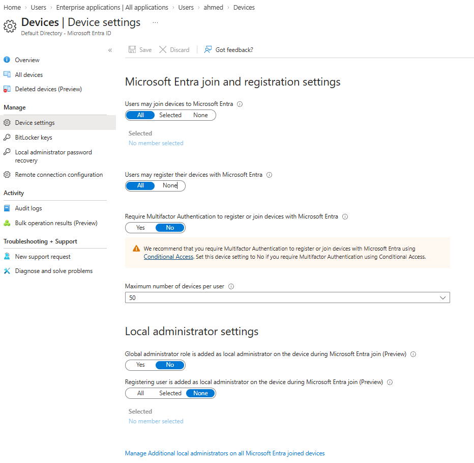
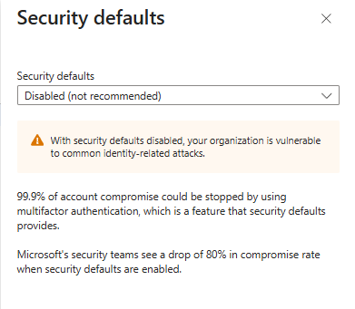
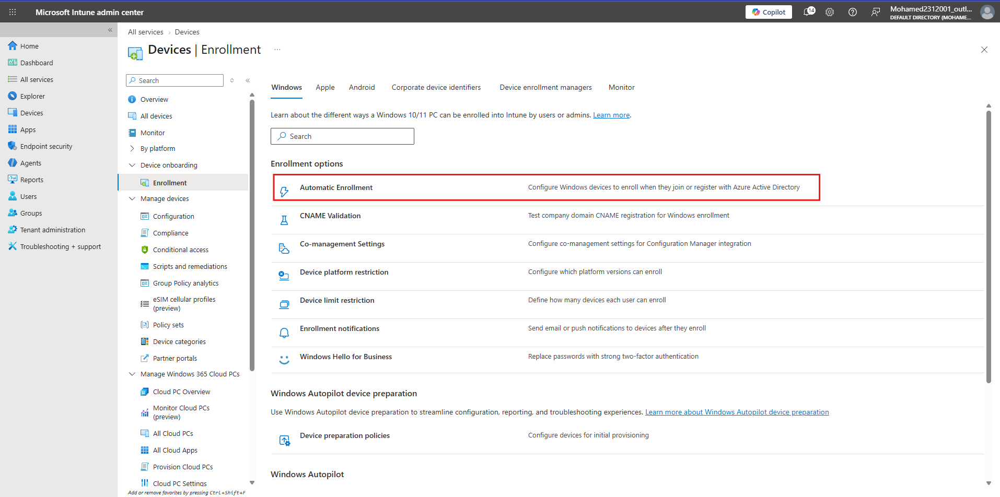

# Topic 6: Lab — Device Join, Security Defaults & Intune Automatic Enrollment

> With the M365 E5 tenant provisioned (Topic 5), the next step is preparing it to accept devices. This lab covers three connected settings: Microsoft Entra device join/registration policy, disabling Security Defaults (so Conditional Access can take over MFA enforcement instead — a pattern you'll need later in the course), and enabling Intune Automatic Enrollment so joined/registered devices get managed.

---

## Why This Lab Matters

Every SC-200 investigation eventually touches a **device**: an endpoint that got phished, a device with a risky sign-in, a machine flagged by Defender for Endpoint. None of that telemetry exists unless devices are actually **joined/registered to Entra ID** and **enrolled in Intune** first. This lab sets up that plumbing.

---

## Step 1: Configure Microsoft Entra Join & Registration Settings

Path: **Entra ID → Devices → Manage → Device settings**

Key controls on this page:

| Setting | Options | What it controls |
|---|---|---|
| **Users may join devices to Microsoft Entra** | All / Selected / None | Whether users can Entra-join a device (full org-managed join) |
| **Users may register their devices with Microsoft Entra** | All / None | Whether users can Entra-*register* a personal/BYOD device (lighter-weight than join) |
| **Require Multifactor Authentication to register or join devices** | Yes / No | MFA gate specifically for the join/register action |
| **Maximum number of devices per user** | Numeric (e.g., 50) | Caps device sprawl per identity |
| **Global administrator role is added as local administrator on device (Preview)** | Yes / No | Whether Global Admins auto-get local admin on every joined device |
| **Registering user is added as local administrator (Preview)** | All / Selected / None | Whether the person joining a device becomes its local admin |

⚠️ **Important nuance shown on this page:** Microsoft explicitly recommends requiring MFA to register/join devices via **Conditional Access** rather than this legacy toggle — *"Set this device setting to No if you require Multifactor Authentication using Conditional Access."* This is a deliberate hint: Conditional Access is the modern, more flexible control, and this basic toggle is a fallback for tenants not yet using it.

**Security/local-admin consideration:** leaving *"Global administrator role is added as local administrator"* set to **Yes** means every Global Admin gets local admin on every device joined to the tenant — a large lateral-movement risk if a Global Admin account is compromised. Best practice (and what you'll later validate via Defender/Secure Score) is **No**, with local admin rights scoped deliberately instead.

---

## Step 2: Disable Security Defaults

Path: **Entra ID → Properties → Manage security defaults** (or **Entra ID → Overview → Security defaults**)

**Security defaults** are Microsoft's free, baked-in baseline protections (enforced MFA for admins, blocking legacy authentication, etc.) enabled by default on new tenants.

Microsoft's own warning on this screen is blunt about the tradeoff:
- Disabling security defaults leaves the organization vulnerable to common identity-related attacks.
- Multifactor authentication (which security defaults enforces) is credited with stopping the vast majority of account compromise.
- Microsoft's security teams report a large drop in compromise rate when security defaults are left enabled.

**Why disable them in a lab, then?** Security Defaults are all-or-nothing and can't be customized. In real production tenants — and in SC-200 labs that build custom **Conditional Access policies** — you disable Security Defaults specifically so Conditional Access can take over identity protection with granular, tunable rules (per-app, per-group, per-risk-level) instead of Microsoft's one-size-fits-all baseline.

🚩 **Do not disable Security Defaults on a production tenant without Conditional Access policies already in place to replace that protection** — doing so leaves the tenant genuinely less secure, exactly as the warning states. This step belongs in a lab/trial context or as part of a deliberate CA rollout.

---

## Step 3: Enable Intune Automatic Enrollment

Path: **Intune admin center → Devices → Enrollment → Windows → Automatic Enrollment**

This is described directly on the page: *"Configure Windows devices to enroll when they join or register with Azure Active Directory."*

Once configured, any device that becomes Entra-joined or Entra-registered (per the policy from Step 1) automatically enrolls into **Intune** for management — no manual enrollment step needed per device.

Other enrollment options visible on this screen worth knowing for later labs:

| Option | Purpose |
|---|---|
| **Device platform restriction** | Configure which platform versions can enroll |
| **Device limit restriction** | Define how many devices each user can enroll |
| **Enrollment notifications** | Email/push notifications after a device enrolls |
| **Windows Hello for Business** | Passwordless, strong two-factor sign-in replacing passwords |
| **Windows Autopilot / Device preparation policies** | Streamlined, zero-touch provisioning for new devices |

**Why this matters for SC-200:** Intune-managed devices are what feed **Defender for Endpoint** compliance state, configuration baselines, and device risk signals into Sentinel/Defender XDR. Without automatic enrollment, devices can be Entra-joined but still unmanaged and blind to Intune/Defender policy — a gap attackers can exploit and a gap you'll be asked to identify in exam scenarios.

---

## Lab Recap (Do This In Order)

1. Set Entra device join/registration policy — decide All/Selected/None per your lab scope, and be deliberate about the local-admin toggles
2. Disable Security Defaults **only if** you intend to build Conditional Access policies to replace that protection (later topic)
3. Enable Intune Automatic Enrollment so any joined/registered device is picked up for management automatically

---

## Key Terms to Know

- **Entra Join** — a device becomes fully organization-managed and Entra-identity-bound
- **Entra Registration** — a lighter-weight link for BYOD devices, still gets device identity in Entra without full org control
- **Security Defaults** — Microsoft's free, non-customizable baseline identity protections
- **Conditional Access (CA)** — the customizable, policy-driven replacement for Security Defaults
- **Intune Automatic Enrollment** — auto-enrolls Entra-joined/registered devices into Intune MDM without manual steps
- **Windows Hello for Business** — passwordless strong authentication tied to device + biometrics/PIN

---

## Quick Self-Check

- [ ] Can you explain the difference between Entra *join* and Entra *registration*?
- [ ] Do you understand why Microsoft recommends using Conditional Access over the basic MFA device-registration toggle?
- [ ] Can you explain the security tradeoff of disabling Security Defaults, and when it's appropriate to do so?
- [ ] Do you know what Automatic Enrollment does and why unmanaged-but-joined devices are a security gap?

---

*Keep `device-settings.png`, `diable-security-default.png`, and `intune-automatic-enrollment.png` in this same folder as this README so the image links resolve correctly on GitHub.*
