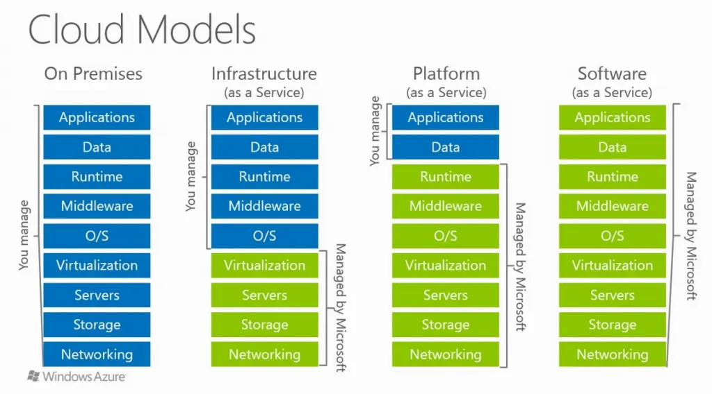
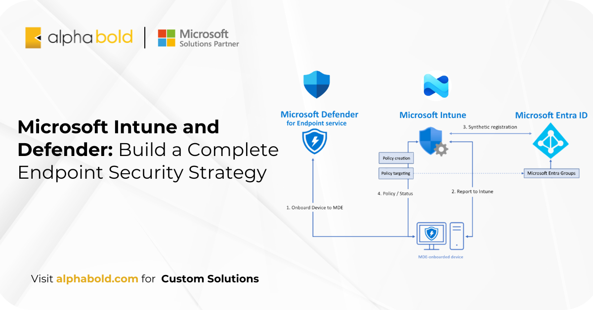
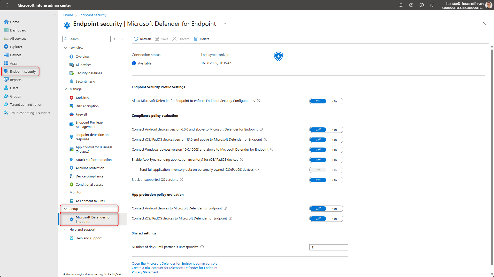
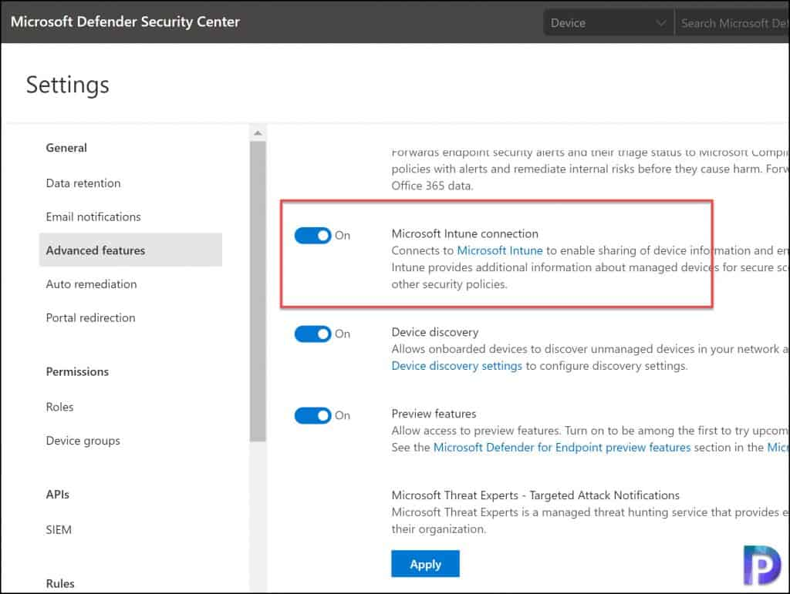
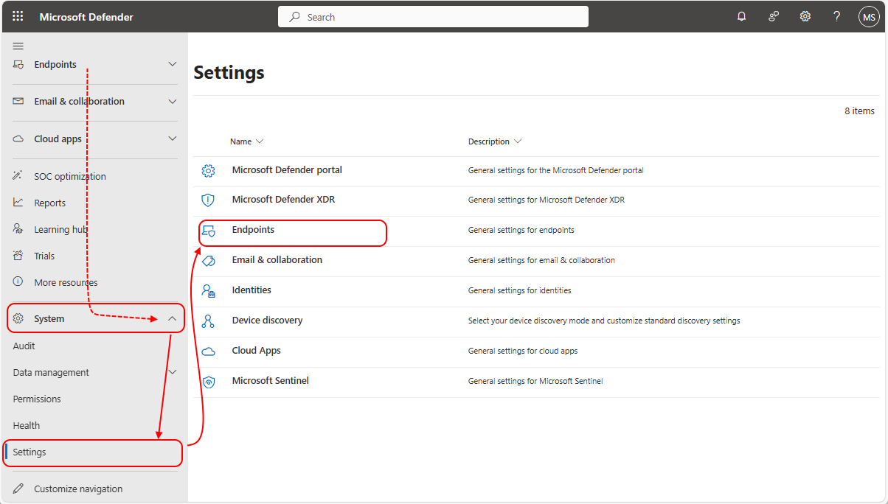

# Topic 8: Cloud Service Models & Defender for Endpoint ↔ Intune Integration

> Two related threads in this topic: (1) the **IaaS/PaaS/SaaS shared-responsibility model**, which explains exactly what Microsoft manages vs. what you manage — and therefore what Defender *can* and *can't* see — and (2) how to actually wire **Microsoft Defender for Endpoint (MDE)** together with **Intune** and **Entra ID**, since device compliance signals only flow into Conditional Access and Sentinel once this integration is turned on.

---

## 1. Cloud Service Models & the Shared Responsibility Model

This expands on Topic 1's IaaS/PaaS/SaaS mention with the full stack, layer by layer:

| Layer | On-Premises | IaaS | PaaS | SaaS |
|---|---|---|---|---|
| Applications | You manage | You manage | You manage | Microsoft manages |
| Data | You manage | You manage | You manage | Microsoft manages |
| Runtime | You manage | You manage | Microsoft manages | Microsoft manages |
| Middleware | You manage | You manage | Microsoft manages | Microsoft manages |
| O/S | You manage | You manage | Microsoft manages | Microsoft manages |
| Virtualization | You manage | Microsoft manages | Microsoft manages | Microsoft manages |
| Servers | You manage | Microsoft manages | Microsoft manages | Microsoft manages |
| Storage | You manage | Microsoft manages | Microsoft manages | Microsoft manages |
| Networking | You manage | Microsoft manages | Microsoft manages | Microsoft manages |

**Why this matters for SC-200:** this table is the answer key for "who's responsible when something goes wrong."

- An **Azure VM (IaaS)** — you're responsible for OS patching, endpoint protection (this is why you install Defender for Endpoint on it yourself), and application security. Microsoft only guarantees the hypervisor/hardware/network layer beneath it.
- An **Azure App Service or SQL Database (PaaS)** — Microsoft patches the OS and runtime; you're only responsible for your app code and data. Defender for Cloud's recommendations differ accordingly.
- **Microsoft 365 / Defender XDR itself (SaaS)** — Microsoft manages almost the entire stack; you're responsible mainly for **data** and **identity/access configuration** (this is exactly why Entra ID, Conditional Access, and Authentication Methods from Topic 7 are *your* job even in a fully SaaS world).

This is precisely why so much of SC-200 revolves around **identity and configuration** — in a SaaS-heavy environment, that's the one layer left that's fully your responsibility, and it's the layer attackers target most (phishing, credential theft, misconfigurations) because the infrastructure underneath is already hardened by Microsoft.

---

## 2. Why Defender for Endpoint + Intune + Entra ID Integrate

This diagram shows the actual data flow between the three services:

1. **Onboard Device to MDE** — a device is onboarded into Microsoft Defender for Endpoint
2. **Report to Intune** — MDE reports the device's risk/security signal to Intune
3. **Synthetic registration** — Intune uses Microsoft Entra Groups to synthetically register the device's compliance state
4. **Policy / Status** — Intune pushes policy back down to the MDE-onboarded device based on that status

The **policy creation** and **policy targeting** steps (assigning compliance/configuration policies to device groups) sit inside Intune, feeding both directions of this loop.

**Why this matters for SC-200:** this is the mechanism behind the Conditional Access example from Topic 7 — *"Users in the Managers group must be on an Intune compliant device."* That compliance state doesn't come from nowhere: it's Defender for Endpoint's risk signal, synthesized through Intune, back into Entra ID, where Conditional Access reads it as a condition. Break any link in this chain and CA compliance checks silently stop working — a real troubleshooting scenario you may be tested on.

---

## 3. Enabling the Integration — Two Sides of the Same Switch

There are **two places** this integration must be turned on — one in Intune, one in the Defender portal. Missing either side means the loop above doesn't complete.

### Side A: Intune → Microsoft Defender for Endpoint

Path: **Intune admin center → Endpoint security → Setup → Microsoft Defender for Endpoint**

- **Connection status: Available**, with a **Last synchronized** timestamp confirming the link is live
- **Allow Microsoft Defender for Endpoint to enforce Endpoint Security Configurations** — lets MDE push its own hardening configs through Intune
- **Compliance policy evaluation** toggles — per-platform switches (Android, iOS/iPadOS, Windows) controlling whether each platform's devices report into MDE for compliance evaluation
- **App protection policy evaluation** — separate toggles for mobile app-level protection signals (Android/iOS)
- **Shared settings → Number of days until partner is unresponsive** (default: 7) — if MDE stops reporting for this many days, Intune treats the device as non-compliant, which can cascade into Conditional Access blocking access

⚠️ **Gotcha:** all these toggles default to **Off**. If device compliance checks aren't working as expected in a lab or exam scenario, this page — not Conditional Access itself — is often the real root cause.

### Side B: Defender Portal — Advanced Features / Microsoft Intune Connection

Path (older Defender Security Center layout): **Settings → Advanced features → Microsoft Intune connection**

- **Microsoft Intune connection: On** — *"Connects to Microsoft Intune to enable sharing of device information and enforce compliance...Intune provides additional information about managed devices for secure score and other security policies."*
- Nearby related toggles:
  - **Device discovery** — lets onboarded devices discover unmanaged devices on the network (useful for finding shadow IT/unmanaged endpoints)
  - **Preview features** — early access to upcoming MDE capabilities

### Side C (Newer Unified Portal): Microsoft Defender → System → Settings → Endpoints

In the newer **unified Microsoft Defender portal**, the same endpoint settings live under **System → Settings → Endpoints** — one of eight settings categories alongside Email & collaboration, Identities, Device discovery, Cloud Apps, and **Microsoft Sentinel** (its own settings entry, confirming Sentinel connects into this same unified portal).

**Why this matters:** Microsoft has been actively merging the old Defender Security Center, Intune admin center references, and Sentinel into one **Defender unified portal** experience. Expect SC-200 material (and the exam itself) to reference both the legacy and unified navigation paths — recognize both.

---

## 4. Putting It All Together — The Full Chain

1. **Cloud model awareness** tells you which layer you're responsible for securing (usually identity + data + endpoint config)
2. **Device is onboarded to MDE** → generates security/risk signal
3. **Intune's MDE connector (Side A)** must be On for that signal to flow into Intune
4. **Defender's Intune connection (Side B)** must be On for the reverse — Intune's compliance data feeding back into Defender for secure score and policy
5. **Compliance state lands in Entra ID via Intune** → available as a **Conditional Access condition** (Topic 7's "Intune compliant device" example)
6. All of it is visible/configurable centrally in the **newer unified Defender portal (Side C)**

---

## Key Terms to Know

- **Shared Responsibility Model** — division of security duties between Microsoft and the customer, varying by IaaS/PaaS/SaaS
- **Microsoft Defender for Endpoint (MDE)** — endpoint detection and response (EDR) platform
- **Synthetic registration** — Intune registering device compliance state into Entra ID Groups based on MDE signal
- **Compliance policy evaluation** — per-platform toggle controlling whether device compliance is assessed via MDE integration
- **Secure Score** — Microsoft's aggregate security posture score, partly fed by Intune/MDE integration data
- **Unified Defender portal** — the newer, consolidated Microsoft Defender console merging Endpoint, Identity, Cloud Apps, Email, and Sentinel settings

---

## Quick Self-Check

- [ ] Can you explain, layer by layer, what changes between IaaS, PaaS, and SaaS in terms of who manages what?
- [ ] Can you trace the 4-step Defender-for-Endpoint ↔ Intune ↔ Entra ID data flow from the diagram?
- [ ] Do you know there are two separate switches (Intune side + Defender side) that both need to be enabled for this integration to fully work?
- [ ] Can you explain what "Number of days until partner is unresponsive" controls and why it matters for compliance-based Conditional Access?
- [ ] Do you recognize that Microsoft Sentinel has its own settings entry inside the same unified Defender portal as Endpoints/Identities/Cloud Apps?

---

*Keep `microsoft-cloud-models.webp`, `Microsoft-Intune-and-Defender.webp`, `microsoft-intune-defender-for-endpoint-integration-settings.png`, `Enable-Microsoft-Defender-for-Endpoint.jpg`, and `defender-console-settings-endpoints.png` in this same folder as this README so the image links resolve correctly on GitHub.*
