# Topic 9: Lab — Deploy an Azure VM & Connect via RDP (with Entra ID Join)

> A full end-to-end SIM: pick a subscription, find the lowest-latency Azure region, create a resource group, provision a Windows Server VM, connect to it over RDP, then confirm it's actually **Microsoft Entra joined** (not just domain-joined) and check the **Azure RBAC roles** that control who's even allowed to log into it. This is the exact "stand up a monitored endpoint" workflow that later SC-200 labs (Defender for Endpoint onboarding, Sentinel data connectors) build directly on top of.

---

## Task 1: Confirm Your Azure Subscription

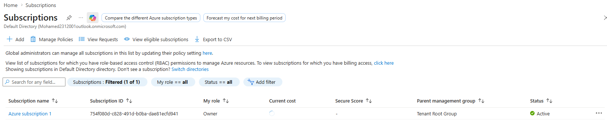

Path: **Azure Portal → Subscriptions**

Before creating anything, confirm you have an active subscription with the right access:

- **Subscription name / ID** — e.g., `Azure subscription 1`, ID `754f080d-c828-491d-b0ba-dae81ecfd941`
- **My role** — here: **Owner** (full control — required to create resource groups and assign RBAC roles later)
- **Status** — must show **Active**
- **Secure Score** — shown as `-` here since no resources/recommendations exist yet; this fills in once workloads (like the VM you're about to create) are protected by Defender for Cloud

⚠️ **Gotcha:** if your role here is lower than Owner/Contributor, later steps (creating a resource group, assigning VM RBAC roles in the bonus section) will fail with a permissions error — check this first if anything downstream doesn't work.

---

## Task 2: Run an Azure Latency Test

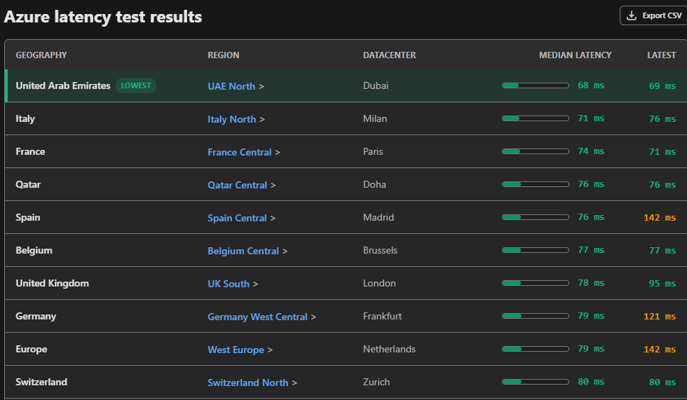

Tool: [azurespeed.com](https://www.azurespeed.com) or Azure's latency test tool (not an Azure portal feature — an external diagnostic)

This measures round-trip latency from your current location to various Azure regions/datacenters:

| Region | Datacenter | Median Latency |
|---|---|---|
| **UAE North** *(lowest)* | Dubai | 68 ms |
| Italy North | Milan | 71 ms |
| France Central | Paris | 74 ms |
| Qatar Central | Doha | 76 ms |
| ... | ... | ... |

**Why this matters:** choosing the lowest-latency region for a VM directly affects RDP responsiveness and application performance. This is standard pre-deployment due diligence — in a real SOC/infra scenario, you'd pick region based on latency *and* compliance/data-residency requirements, not latency alone.

---

## Task 3: Create a Resource Group

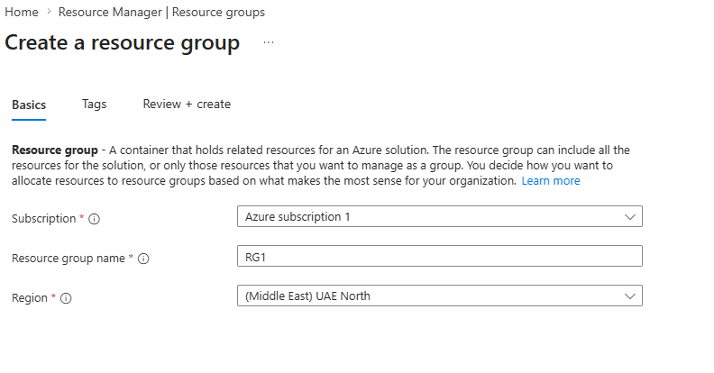

Path: **Azure Portal → Resource groups → + Create**

A **resource group** is a logical container that holds related resources for a solution — you decide how to organize resources based on what makes sense for your org (by project, by environment, by team, etc.).

| Field | Value used |
|---|---|
| Subscription | Azure subscription 1 |
| Resource group name | `RG1` |
| Region | (Middle East) UAE North |

**Why this matters for SC-200:** resource groups are a common scoping boundary for **Azure RBAC** and **Defender for Cloud** policy assignment — you'll often apply security policies or Conditional Access-adjacent controls at the resource group level rather than per-resource.

---

## Task 4: Create the Virtual Machine (5 Sub-Steps)

Path: **Azure Portal → Virtual machines → + Create**

### 4a. Basics — Project Details & Instance Details

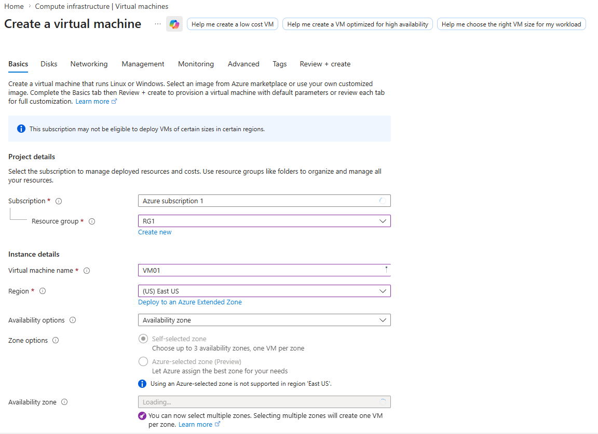

| Field | Value |
|---|---|
| Subscription | Azure subscription 1 |
| Resource group | RG1 |
| Virtual machine name | `VM01` |
| Region | (US) East US *(note: different from the lowest-latency region found in Task 2 — a deliberate lab choice, or worth reconsidering in a real deployment)* |
| Availability options | Availability zone |
| Zone options | Self-selected zone |

### 4b. Basics — Security Type, Image, Size, Admin Account

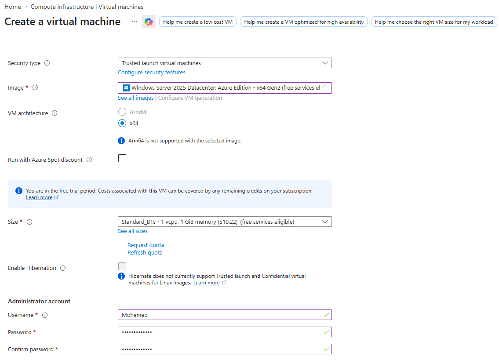

| Field | Value |
|---|---|
| **Security type** | **Trusted launch virtual machines** — enables Secure Boot + vTPM, a modern security baseline |
| Image | Windows Server 2025 Datacenter: Azure Edition - x64 Gen2 |
| VM architecture | x64 |
| Size | Standard_B1s – 1 vCPU, 1 GiB memory |
| Username | Mohamed |
| Password / Confirm password | (set, hidden) |

⚠️ **Security type matters here:** choosing **Trusted launch** over the legacy "Standard" security type is directly relevant to SC-200 — Defender for Cloud's recommendations specifically flag VMs without Trusted launch/Secure Boot as a hardening gap.

### 4c. Disks

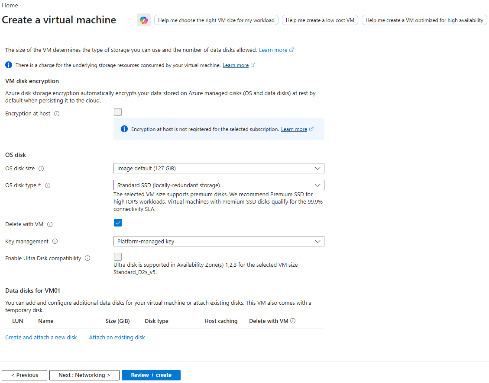

| Field | Value |
|---|---|
| Encryption at host | Not enabled *(not registered for this subscription)* |
| OS disk size | Image default (127 GiB) |
| OS disk type | Standard SSD (locally-redundant storage) |
| Delete with VM | ✅ Checked |
| Key management | Platform-managed key |

**Note:** Azure disk storage encryption is **on by default** for OS/data disks at rest, even without "Encryption at host" enabled — that's a separate, additional layer.

### 4d. Networking

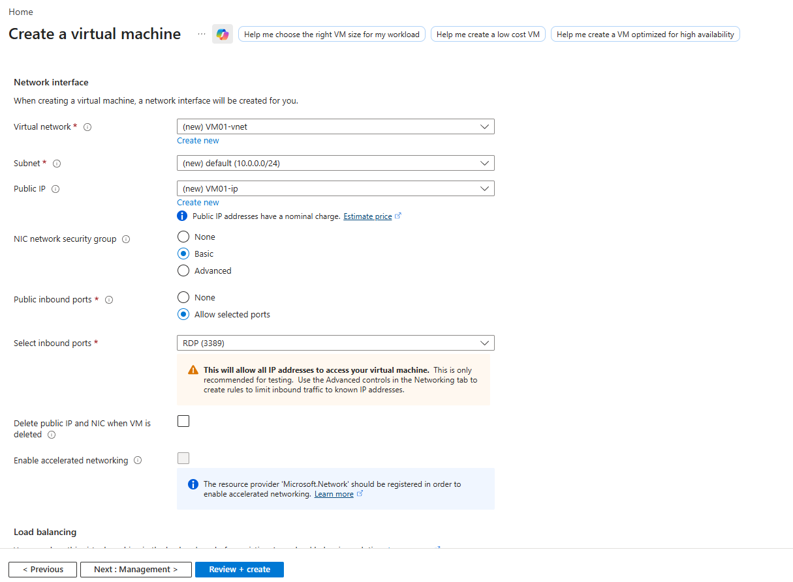

| Field | Value |
|---|---|
| Virtual network | (new) VM01-vnet |
| Subnet | (new) default (10.0.0.0/24) |
| Public IP | (new) VM01-ip |
| NIC network security group | **Basic** |
| Public inbound ports | **Allow selected ports** |
| Select inbound ports | **RDP (3389)** |

🚩 **Critical security warning shown by Azure itself:** *"This will allow all IP addresses to access your virtual machine. This is only recommended for testing. Use the Advanced controls in the Networking tab to create rules to limit inbound traffic to known IP addresses."*

This is a textbook SC-200 exam scenario: an internet-facing RDP port open to `0.0.0.0/0` is one of the most common real-world initial access vectors (RDP brute-force, credential stuffing). In production, this should be restricted via NSG rules to specific source IPs, or better, accessed via **Azure Bastion** instead of a public IP + open RDP port at all.

### 4e. Monitoring

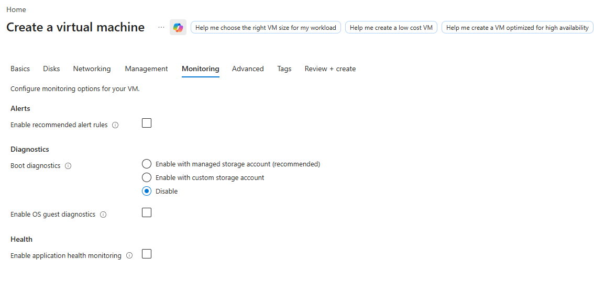

| Field | Value |
|---|---|
| Enable recommended alert rules | ☐ Not checked |
| Boot diagnostics | **Disable** |
| Enable OS guest diagnostics | ☐ Not checked |
| Enable application health monitoring | ☐ Not checked |

⚠️ **Lab gotcha:** disabling boot diagnostics and monitoring here is fine for a quick lab VM, but in a real SOC context this is exactly the telemetry (boot diagnostics, guest diagnostics) that later gets ingested into **Azure Monitor → Log Analytics → Microsoft Sentinel**. Skipping this at VM creation means you'd need to enable it retroactively before this VM shows up properly in Sentinel workbooks/analytics rules.

---

## Task 5: Review + Create

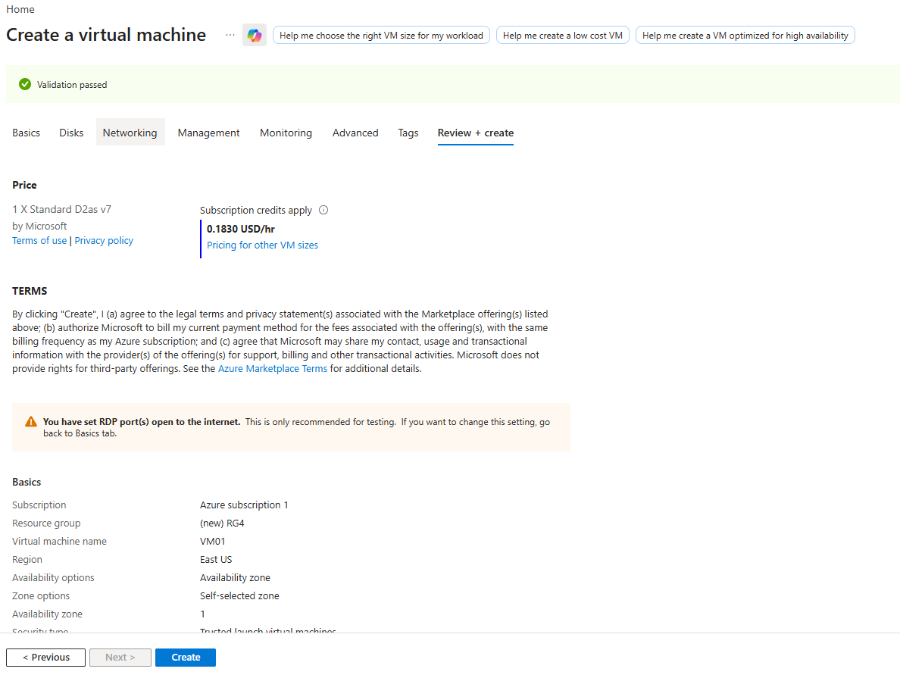

- **Validation passed** ✅
- Pricing shown: `1 x Standard D2as v7` at `0.1830 USD/hr` *(note: final size differs slightly from Task 4b's B1s selection — pricing tab reflects the actual size selected, worth double-checking before clicking Create)*
- Azure repeats the same **RDP open to internet** warning seen in Task 4d, one last chance to go back and restrict it
- Clicking **Create** deploys the VM

---

## Task 6: Confirm the VM Was Created

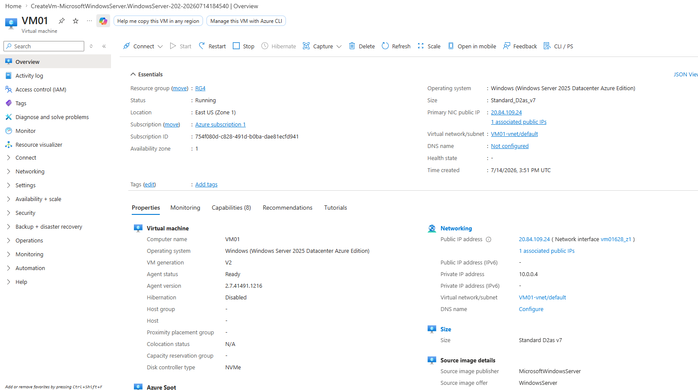

Path: **VM01 → Overview**

| Field | Value |
|---|---|
| Status | **Running** |
| Operating system | Windows (Windows Server 2025 Datacenter Azure Edition) |
| Size | Standard_D2as_v7 |
| Primary NIC public IP | 20.84.109.24 |
| Private IP | 10.0.0.4 |
| Availability zone | 1 |
| Time created | 7/14/2026, 3:51 PM UTC |

The left-hand nav here is worth knowing for later topics — **Access control (IAM)**, **Networking**, **Security**, and **Monitoring** blades all live on this same VM resource page and are where you'll configure RBAC, NSGs, and Defender for Cloud recommendations for this specific VM.

---

## Task 7: Connect via RDP

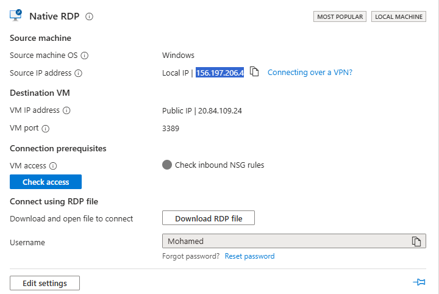

Path: **VM01 → Connect → RDP → Native RDP**

| Field | Value |
|---|---|
| Source machine OS | Windows |
| Source IP address | Local IP shown (e.g., `156.197.206.4`) |
| Destination VM IP address | Public IP `20.84.109.24` |
| VM port | 3389 |
| Check access | Button to verify inbound NSG rules allow your current IP |
| Username | Mohamed |

Click **Download RDP file** → open it → sign in with the admin username/password set in Task 4b.

**Tip:** the **Check access** button is genuinely useful — it validates against the NSG rule from Task 4d *before* you attempt to connect, saving you from a failed-connection troubleshooting loop if your IP isn't allowed.

---

## Task 8: Accept the Certificate Warning and Connect

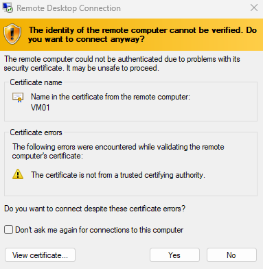

On first connection, Windows shows:

> *"The identity of the remote computer cannot be verified... The certificate is not from a trusted certifying authority."*

This is **expected and normal** for a fresh Azure VM — it hasn't been issued a certificate from a trusted CA (that's a separate, deliberate configuration step, not a default). Click **Yes** to proceed, since you're connecting to a VM you just created and trust.

⚠️ **Real-world nuance:** in a genuine incident-response context, an unexpected certificate warning like this on a *known, previously-trusted* server would be a red flag (possible AitM/certificate substitution). Here, since it's a brand-new VM with no cert configured, it's simply expected — but recognizing the *difference* between "expected on first connect" vs. "suspicious on an established connection" is exactly the kind of judgment call SC-200 incident scenarios test.

---

## Bonus: Microsoft Entra Join & RBAC Roles for the VM

### Confirming Entra ID Join (not just Domain Join)

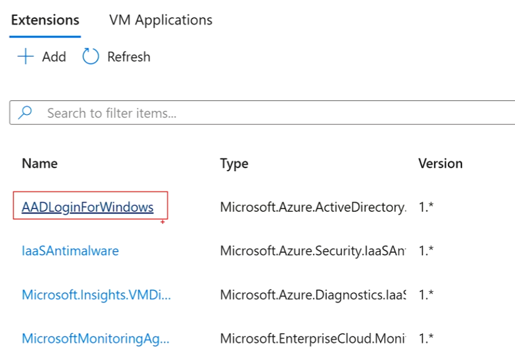

Path: **VM01 → Extensions + Applications**

The **AADLoginForWindows** extension (type `Microsoft.Azure.ActiveDirectory.*`) being installed is what enables users to sign into this Windows VM using their **Microsoft Entra ID** credentials directly — rather than a separate local Windows account or traditional AD domain join.

Other extensions visible alongside it:
- **IaaSAntimalware** — Microsoft Antimalware for Azure VMs
- **Microsoft.Insights.VMDiagnosticsSettings** — diagnostics extension
- **MicrosoftMonitoringAgent** — legacy Log Analytics agent (feeds data into Sentinel/Log Analytics workspaces)

### Verifying Join Status from Inside the VM

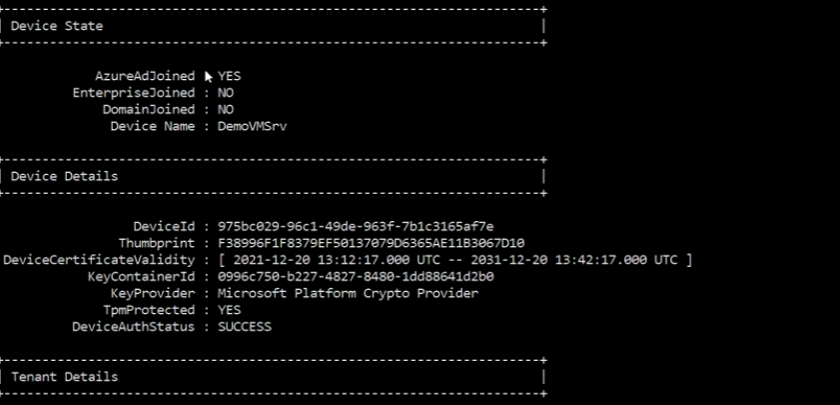

Run `dsregcmd /status` inside the VM (via RDP session) to confirm:

| Field | Value |
|---|---|
| **AzureAdJoined** | **YES** ✅ |
| EnterpriseJoined | NO |
| DomainJoined | NO |
| Device Name | DemoVMSrv |
| TpmProtected | YES |
| DeviceAuthStatus | SUCCESS |

This confirms the VM is a **pure Entra-joined** device — not hybrid, not traditional on-prem AD domain-joined (tying back to Topic 2's AD vs. Topic 1's Entra ID distinction). `TpmProtected: YES` also confirms the device has a hardware-backed identity key, relevant to the "Trusted launch" security type chosen in Task 4b.

### Required Azure RBAC Roles to Log In

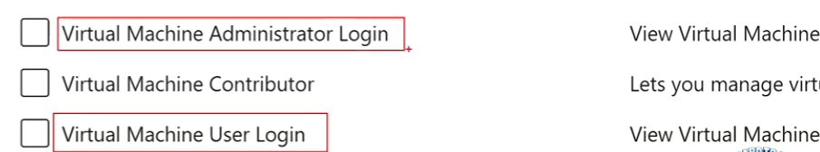

Path: **VM01 → Access control (IAM) → Add role assignment**

Because this VM uses Entra ID sign-in (via the AADLoginForWindows extension) instead of local accounts, **Azure RBAC roles** — not just Windows local group membership — control who can log in:

| Role | Grants |
|---|---|
| **Virtual Machine Administrator Login** | Sign in with **admin** privileges (local admin on the VM) |
| Virtual Machine Contributor | Manage the VM resource itself (start/stop/resize) — does **not** grant login rights |
| **Virtual Machine User Login** | Sign in as a **standard user** (no admin rights) |

⚠️ **Common exam trap:** **Virtual Machine Contributor** lets someone manage the VM (resize, restart, delete) but does **not** by itself grant the ability to actually log into the OS. That requires one of the two "Login" roles specifically. This separation — resource management vs. actual sign-in rights — is a frequently tested RBAC nuance.

---

## Full Lab Recap (Do This In Order)

1. Confirm subscription access and role (Owner/Contributor)
2. Run a latency test to identify the best-performing region
3. Create a resource group to contain the deployment
4. Create the VM — Basics (project + security/image/size/admin) → Disks → Networking (NSG/RDP) → Monitoring
5. Review + Create — check pricing and heed the RDP-open-to-internet warning
6. Confirm the VM shows **Running** with the expected public/private IPs
7. Connect via RDP — use **Check access** to pre-validate NSG rules
8. Accept the (expected, first-connection) certificate warning
9. *(Bonus)* Confirm Entra ID join via the AADLoginForWindows extension and `dsregcmd /status`
10. *(Bonus)* Assign the correct RBAC role — **VM Administrator Login** or **VM User Login** — to control who can actually sign in

---

## Key Terms to Know

- **Resource group** — logical container organizing related Azure resources
- **Trusted launch** — VM security type enabling Secure Boot + vTPM
- **NSG (Network Security Group)** — firewall rules controlling inbound/outbound traffic to a VM's NIC/subnet
- **AADLoginForWindows** — VM extension enabling Microsoft Entra ID-based sign-in to a Windows VM
- **dsregcmd /status** — Windows command showing device join state (Entra/Hybrid/Domain)
- **Azure RBAC (Role-Based Access Control)** — role assignments controlling access to Azure resources, separate from Windows-local permissions
- **VM Administrator Login / VM User Login** — RBAC roles specifically granting OS sign-in rights on an Entra-joined VM

---

## Quick Self-Check

- [ ] Can you explain why exposing RDP (3389) to all IPs is flagged as a security risk, and what the safer alternative is (restricted NSG rules or Azure Bastion)?
- [ ] Do you know the difference between **Virtual Machine Contributor** and **Virtual Machine Administrator/User Login** roles?
- [ ] Can you interpret `dsregcmd /status` output to determine whether a device is Entra-joined, hybrid-joined, or domain-joined?
- [ ] Do you understand why the AADLoginForWindows extension is required for Entra ID-based VM sign-in?
- [ ] Can you explain why a certificate warning on first RDP connection to a new VM is expected, but the same warning on an established connection would be suspicious?

---

*Keep all 15 image files in this same folder as this README so the image links resolve correctly on GitHub.*
