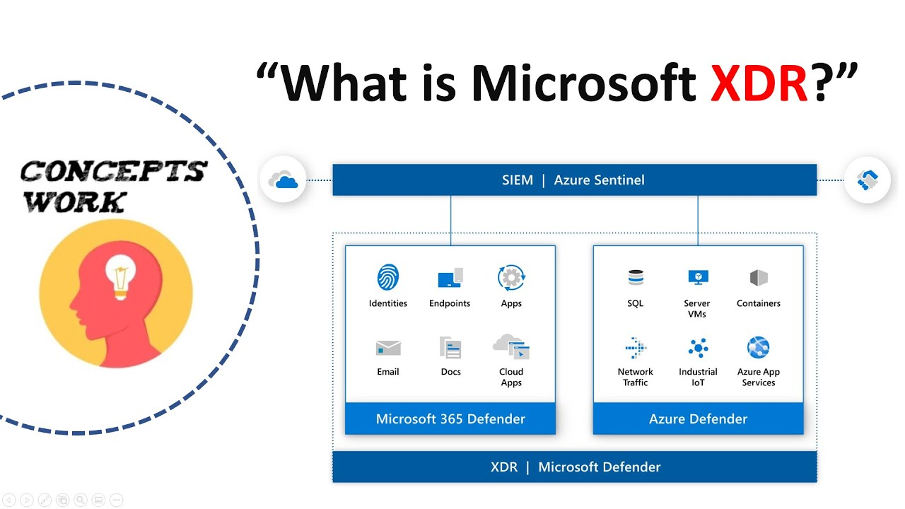
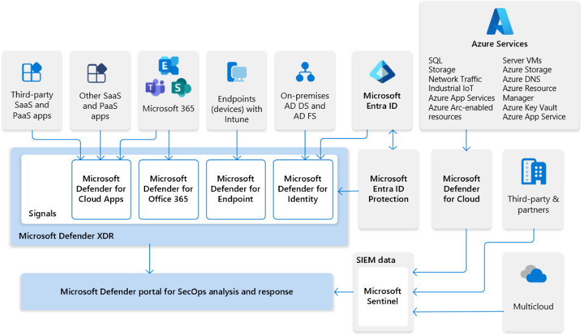

# Topic 10: Microsoft Defender XDR & Sentinel — Unified Security Architecture

> This is the conceptual centerpiece of SC-200. Every prior topic — AD (Topic 2), network segmentation (Topic 3), M365/cloud foundations (Topics 1, 4, 8), Conditional Access (Topic 7), device/Intune integration (Topics 6, 8), and the VM you deployed (Topic 9) — all exist to generate **signals**. This topic is where those signals converge: into **Microsoft Defender XDR** for cross-domain detection, and into **Microsoft Sentinel** as the SIEM sitting on top of everything.

---

## 1. What is Microsoft XDR? (The Simple Version)

This diagram shows the conceptual layering (note: it uses the older product names — "Microsoft 365 Defender" and "Azure Defender," now unified as **Microsoft Defender XDR** and **Microsoft Defender for Cloud**):

| Layer | Role |
|---|---|
| **SIEM \| Azure Sentinel** (top) | Sits above everything — ingests, correlates, and lets you hunt across *all* signal |
| **Microsoft 365 Defender** (left) | Protects **Identities, Endpoints, Apps, Email, Docs, Cloud Apps** |
| **Azure Defender** (right) | Protects **SQL, Server VMs, Containers, Network Traffic, Industrial IoT, Azure App Services** |
| **XDR \| Microsoft Defender** (bottom) | The unifying layer correlating signal *across* both halves into a single incident |

**XDR = Extended Detection and Response.** The "extended" part is the key word: instead of separate, siloed alerts from an identity tool, an endpoint tool, and an email tool, XDR **correlates** those signals into one incident — because a real attack usually touches multiple domains (e.g., phishing email → compromised identity → lateral movement to a server).

---

## 2. The Full Production Architecture

This is the current, accurate architecture (matches the vector diagram too — same structure, drawn two ways):

### Signal sources feeding into Microsoft Defender XDR

| Signal Source | Feeds Into |
|---|---|
| Third-party SaaS/PaaS apps | Microsoft Defender for Cloud Apps |
| Other SaaS/PaaS apps | Microsoft Defender for Cloud Apps |
| Microsoft 365 (Teams, SharePoint) | Microsoft Defender for Office 365 |
| Endpoints (devices) with Intune | Microsoft Defender for Endpoint |
| On-premises AD DS and AD FS | Microsoft Defender for Identity |
| Microsoft Entra ID | Microsoft Entra ID Protection |

These four/five workloads — **Defender for Cloud Apps, Defender for Office 365, Defender for Endpoint, Defender for Identity**, plus **Entra ID Protection** — are collectively what makes up **Microsoft Defender XDR**.

### Azure-side signal sources → Microsoft Defender for Cloud

Azure Services (SQL, Storage, Network Traffic, Industrial IoT, Azure App Services, Server VMs, Azure DNS, Azure Resource Manager, Key Vault, Arc-enabled resources) feed into **Microsoft Defender for Cloud** — the CSPM/CWPP layer protecting Azure (and Arc-enabled multicloud) infrastructure. This is the workload directly relevant to the VM you provisioned in Topic 9.

### Where it all converges

- **Microsoft Defender XDR** + **Microsoft Defender for Cloud** + **Third-party & partners** + **Multicloud** signals all flow into **Microsoft Sentinel** as **SIEM data**
- Sentinel and Defender XDR both surface into the **same Microsoft Defender portal** for SecOps analysis and response — confirming what Topic 8 already showed you (Sentinel has its own settings entry inside the unified Defender portal)

**Why this matters for SC-200:** this diagram *is* the syllabus. The three exam domains (Manage a security operations environment / Respond to security incidents / Perform threat hunting) all assume you understand this data flow — which product owns which signal, and where correlation/investigation actually happens (the unified Defender portal, powered by both XDR correlation and Sentinel's KQL-based analytics).

---

## 3. The Vector/Detailed Version (Same Architecture, More Precise Labels)

The included `common-attack-defense.svg` is a more precisely labeled version of the same architecture, confirming the exact same structure top-to-bottom:

- **Microsoft Sentinel** (top band) — the SIEM
- **Microsoft Defender XDR** (middle band) — containing **Microsoft Defender for Office 365**, **Microsoft Defender for Endpoint**, **Microsoft Entra ID and Entra ID Protection**, **Microsoft Defender for Cloud Apps** — each shown as its own labeled signal source ("Signals") feeding upward
- **SIEM data** arrow explicitly labeled, showing XDR's correlated output flowing into Sentinel

This confirms the mental model: **Defender XDR = correlation across Microsoft's own security products. Sentinel = the broader SIEM that also ingests Defender XDR's output plus everything else (Azure resources, third-party tools, multicloud).**

---

## 4. Why This Matters — Tying It Back to Every Prior Topic

| Prior Topic | Signal it generates | Where it lands |
|---|---|---|
| Topic 2 (Active Directory) | On-prem AD DS/AD FS authentication events | Microsoft Defender for Identity |
| Topic 6/7 (Entra ID, CA, Auth Methods) | Sign-in risk, MFA events, CA policy decisions | Microsoft Entra ID Protection |
| Topic 6/8 (Intune, device compliance) | Device compliance/risk state | Microsoft Defender for Endpoint |
| Topic 9 (Azure VM) | VM security posture, OS-level telemetry | Microsoft Defender for Cloud |
| M365 apps (email, Teams, SharePoint) | Phishing, malicious attachments, data exfil | Microsoft Defender for Office 365 |
| SaaS/PaaS app usage | Shadow IT, risky app behavior | Microsoft Defender for Cloud Apps |

Every lab you've done so far was quietly building one of these signal sources. Sentinel and Defender XDR are simply where they all become visible together.

---

## Key Terms to Know

- **XDR (Extended Detection and Response)** — correlates signal across multiple security domains (identity, endpoint, email, apps) into unified incidents, rather than siloed per-tool alerts
- **SIEM (Security Information and Event Management)** — Sentinel's role: broad log ingestion, correlation rules (KQL-based), and long-term retention/hunting across *all* sources, not just Microsoft's own
- **Microsoft Defender for Cloud Apps** — CASB (Cloud Access Security Broker) protecting SaaS/PaaS app usage
- **Microsoft Defender for Office 365** — protects email/collaboration (Teams, SharePoint) from phishing and malicious content
- **Microsoft Defender for Endpoint** — EDR platform (Topic 8) for devices
- **Microsoft Defender for Identity** — monitors on-prem AD DS/AD FS for identity-based attacks (ties to Topic 2's Kerberoasting/Golden Ticket concepts)
- **Microsoft Entra ID Protection** — risk-based identity signal feeding Conditional Access (Topic 7)
- **Microsoft Defender for Cloud** — CSPM/CWPP protecting Azure (and Arc-enabled multicloud) infrastructure

---

## Quick Self-Check

- [ ] Can you name the four/five Microsoft products that together make up Microsoft Defender XDR?
- [ ] Can you explain the difference between what Defender XDR correlates vs. what Sentinel additionally ingests?
- [ ] Can you map each of your prior labs (AD, Entra ID/CA, Intune, Azure VM) to the specific Defender workload that consumes its signal?
- [ ] Do you understand why "XDR" specifically means cross-domain correlation, not just another single-product detection tool?
- [ ] Can you explain why Sentinel and Defender XDR share the same unified portal for SecOps analysis?

---

*Keep `defender-xdr.jpg`, `sentinel-xdr-unified-security-experience.png`, and `common-attack-defense.svg` in this same folder as this README so the image links resolve correctly on GitHub.*
