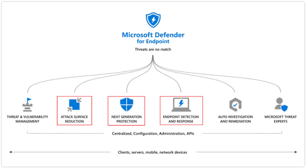
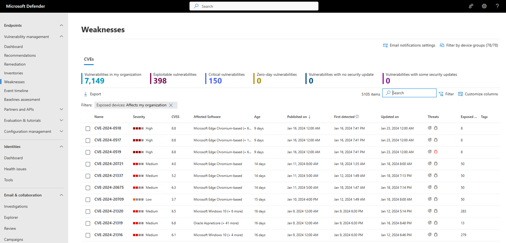

# Topic 12: Microsoft Defender for Endpoint — Capabilities & Threat & Vulnerability Management

> Zooming into one specific Defender workload from Topic 10's architecture: **Microsoft Defender for Endpoint (MDE)**. This topic covers its six core pillars (classic model), the newer capability framing Microsoft now uses, and a hands-on look at **Threat & Vulnerability Management (TVM)** — the "Weaknesses" view where CVEs affecting your fleet actually surface.

---

## 1. Microsoft Defender for Endpoint — The Six Pillars (Classic Model)

This is the foundational MDE model, still referenced throughout Microsoft's own documentation and the SC-200 syllabus:

| Pillar | What it does |
|---|---|
| **Threat & Vulnerability Management** | Discovers, prioritizes, and helps remediate vulnerabilities/misconfigurations — covered in detail below |
| **Attack Surface Reduction** | Rules that block risky behaviors (e.g., Office apps spawning child processes, script-based attacks) before they succeed |
| **Next Generation Protection** | Real-time antivirus/anti-malware (Microsoft Defender Antivirus) |
| **Endpoint Detection and Response (EDR)** | Behavioral monitoring, alerting, and investigation timeline for a device |
| **Auto Investigation and Remediation** | Automated triage and remediation of common alert types, reducing analyst workload |
| **Microsoft Threat Experts** | Managed threat hunting service — human experts augmenting your SOC |

All six are unified under **Centralized Configuration, Administration, and APIs**, and apply across **clients, servers, mobile, and network devices**.

**Why this matters for SC-200:** these six pillars map almost one-to-one onto exam objectives. "Configure attack surface reduction rules" and "investigate an EDR alert" are both directly testable tasks referencing specific pillars from this diagram.

---

## 2. The Newer Capability Framing (Current Marketing/Docs Language)

Microsoft's more recent framing covers the same ground with updated emphasis and two genuinely new capabilities:

**Device coverage:** Productivity devices, Servers, Mobile, IoT/OT *(note: IoT/OT coverage is a meaningful expansion beyond the "clients, servers, mobile" scope of the classic diagram)*

**Comprehensive capabilities:**

| Capability | Relationship to the Classic 6 Pillars |
|---|---|
| **Posture management** | Evolution of Threat & Vulnerability Management — broader security posture, not just CVEs |
| **Operating system-specific protections** | Evolution of Next Generation Protection, emphasizing OS-tailored defenses |
| **Built-in deception techniques** | **New** — honeytoken-style decoys designed to detect attackers *before* they reach real assets |
| **Endpoint detection and response** | Same as classic EDR pillar |
| **Automatic attack disruption** | **New** — MDE can now automatically contain a compromised device/account mid-attack (e.g., disabling a user, isolating a device) without waiting for analyst action |

⚠️ **Exam-relevant nuance:** **Automatic attack disruption** is a genuinely new, heavily-emphasized capability — it's Microsoft's answer to "attacks move faster than analysts can respond." Expect SC-200 material to test your understanding of *when* automatic disruption triggers (high-confidence, fast-moving attacks like ransomware or business email compromise) and what it actually does (contains the device/user, it doesn't fully remediate).

---

## 3. Threat & Vulnerability Management — The "Weaknesses" View

Path: **Microsoft Defender portal → Endpoints → Vulnerability management → Weaknesses**

This is the practical, hands-on face of the "Threat & Vulnerability Management" pillar — a live CVE feed scoped to *your* actual environment, not a generic vulnerability database.

### Top summary tiles

| Metric | Value (example tenant) |
|---|---|
| Vulnerabilities in my organization | 7,149 |
| Exploitable vulnerabilities | 398 |
| Critical vulnerabilities | 150 |
| Zero-day vulnerabilities | 0 |
| Vulnerabilities with no security update | 0 |
| Vulnerabilities with some security updates | 0 |

⚠️ **Interpretation note:** "Vulnerabilities in my organization" (7,149) vs. "Exploitable vulnerabilities" (398) is an important distinction — not every CVE present is actively exploitable in the wild. **Prioritize the exploitable + critical intersection first**, not the raw count. This maps directly to how a real SOC triages: 7,149 items is unmanageable to act on all at once, but 398 exploitable ones is a tractable, risk-ranked worklist.

### The CVE list itself — columns worth understanding

| Column | Meaning |
|---|---|
| **Severity** | High / Medium / Low — Microsoft's risk rating |
| **CVSS** | The industry-standard Common Vulnerability Scoring System score (0–10) |
| **Affected Software** | What's actually vulnerable in your environment (e.g., Microsoft Edge Chromium-based, Windows 10, Oracle Asprntcore) |
| **Age** | Days since disclosure — older + still unpatched is a worse signal |
| **Published on / First detected / Updated on** | Timeline tracking — when Microsoft published it vs. when *your* environment was first found to have it |
| **Threats** | Icons indicating known exploit activity, malware association, etc. — hover/click for detail |
| **Exposed devices** | How many devices in your org currently have this vulnerability — this is your remediation scope |

### Filters and tools

- **Filters: "Exposed devices: Affects my organization"** — already applied here, scoping the list to real, current exposure rather than the full global CVE catalog
- **Filter by device groups (78/78)** — lets you scope to specific device groups if your org segments assets that way
- **Export / Customize columns** — for reporting or feeding data elsewhere

**Why this matters for SC-200:** this page is where "Manage a security operations environment" (the largest exam domain) gets concrete — proactively reducing exposure *before* an incident, not just responding after one. Expect scenario questions like "which CVE should the analyst remediate first" — the answer usually hinges on combining **exploitability + severity + exposed device count**, not any single column alone.

---

## Key Terms to Know

- **MDE (Microsoft Defender for Endpoint)** — the EDR/endpoint security platform this whole topic covers
- **Attack Surface Reduction (ASR) rules** — pre-emptive rules blocking common attack techniques
- **Automatic attack disruption** — MDE's newer capability to auto-contain a compromised device/identity mid-attack
- **CVSS (Common Vulnerability Scoring System)** — standardized 0–10 vulnerability severity score
- **Exploitable vulnerability** — a CVE with a known, usable exploit in the wild, as opposed to a theoretical weakness
- **Exposed devices** — the count of devices in your org actually affected by a given CVE
- **TVM (Threat & Vulnerability Management)** — the pillar/module surfacing this CVE data scoped to your environment

---

## Quick Self-Check

- [ ] Can you name all six classic MDE pillars and roughly what each does?
- [ ] Can you explain what's genuinely new about "Automatic attack disruption" vs. the classic EDR pillar?
- [ ] Do you understand why "Exploitable vulnerabilities" (398) is a more actionable number than "Vulnerabilities in my organization" (7,149)?
- [ ] Can you list the three factors you'd combine to prioritize which CVE to patch first (severity, exploitability, exposed device count)?
- [ ] Do you know where in the Defender portal to find this CVE-scoped Weaknesses view (Endpoints → Vulnerability management → Weaknesses)?

---

*Keep `endpoint-defender.png`, `endpoint-defender-2.png`, and `tvm-weaknesses-overviewnew.png` in this same folder as this README so the image links resolve correctly on GitHub.*

**Note:** the third source image was provided as `.avif` — converted to `.png` here for universal GitHub/Markdown rendering support (some browsers/renderers don't display `.avif` inline).
