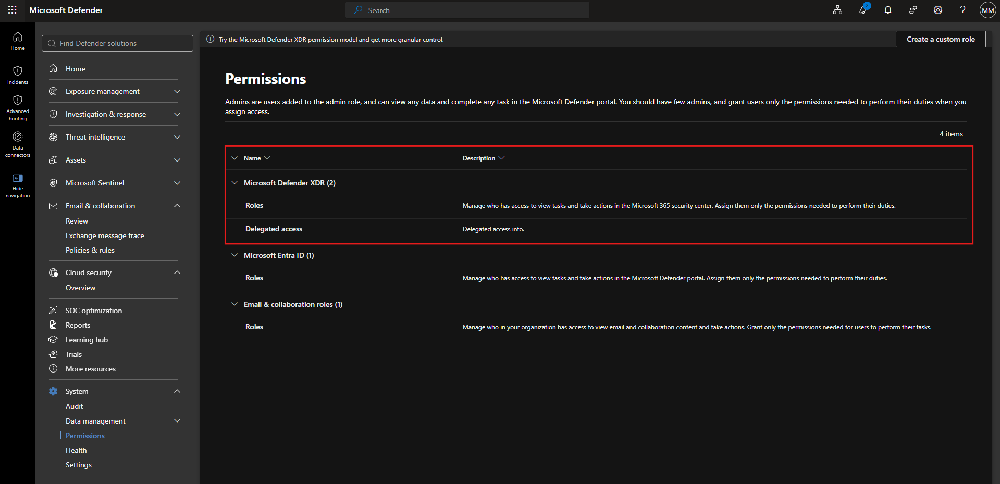
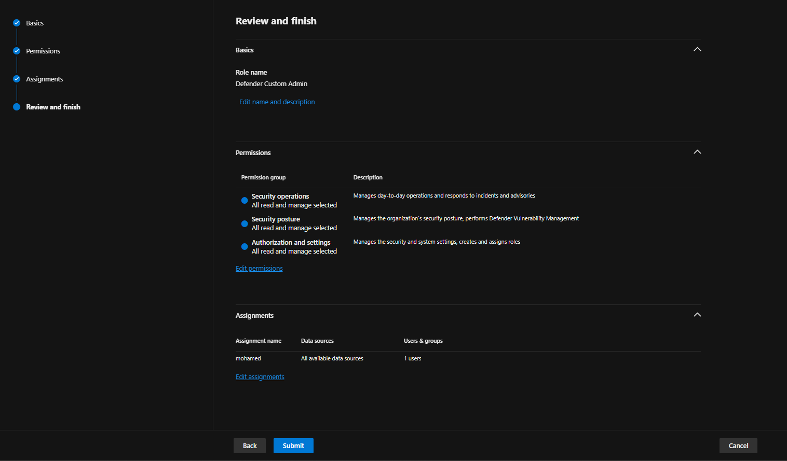
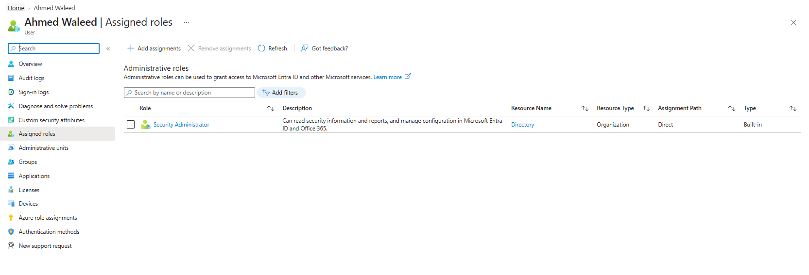

# Topic 13: Access Control — Defender Custom Roles vs. Entra ID Admin Roles

> Continuing the "who can do what" thread from Topic 9's VM RBAC roles — this topic is about **admin-level access control** across two different systems: **Microsoft Defender's own granular custom roles** (scoped just to the Defender portal) and **Microsoft Entra ID's built-in administrative roles** (scoped tenant-wide across Entra ID and Office 365). Getting these two systems confused is a common real-world misconfiguration and a testable exam distinction.

---

## 1. Defender Portal — Permissions Overview

Path: **Microsoft Defender portal → System → Permissions**

The page states the core RBAC principle directly:

> *"Admins are users added to the admin role, and can view any data and complete any task in the Microsoft Defender portal. You should have few admins, and grant users only the permissions needed to perform their duties when you assign access."*

This is the **principle of least privilege**, applied specifically to the Defender portal.

### Role categories shown

| Category | Scope |
|---|---|
| **Microsoft Defender XDR (2)** | Roles + Delegated access — controls who can view/act within the Microsoft 365 security center |
| **Microsoft Entra ID (1)** | Roles controlling access to tasks in the Microsoft Defender portal, sourced from Entra ID role assignments |
| **Email & collaboration roles (1)** | Scoped specifically to who can view/act on email and collaboration content (ties to Defender for Office 365 from Topic 10) |

**"Create a custom role"** button (top right) is the entry point for the next section — building a role more granular than the built-in defaults.

⚠️ **Notice:** *"Try the Microsoft Defender XDR permission model and get more granular control"* — this banner signals Microsoft has been actively expanding *custom, granular* RBAC options beyond the older, coarser built-in roles. Expect newer SC-200 material to emphasize custom roles over broad built-ins as the recommended practice.

---

## 2. Creating a Custom Defender Role

Path: **Defender portal → System → Permissions → Create a custom role**

This example builds a role called **"Defender Custom Admin"** through a 4-step wizard (Basics → Permissions → Assignments → Review and finish):

### Permission groups assigned (all set to "All read and manage selected")

| Permission Group | Description |
|---|---|
| **Security operations** | *"Manages day-to-day operations and responds to incidents and advisories"* |
| **Security posture** | *"Manages the organization's security posture, performs Defender Vulnerability Management"* — ties directly to Topic 12's TVM/Weaknesses view |
| **Authorization and settings** | *"Manages the security and system settings, creates and assigns roles"* |

### Assignment

| Assignment name | Data sources | Users & groups |
|---|---|---|
| `mohamed` | All available data sources | 1 user |

**Why build a custom role instead of using a built-in one?** Built-in roles are often all-or-nothing (e.g., full admin). A custom role lets you grant *exactly* the three permission groups a specific analyst needs — say, someone who triages incidents and manages vulnerabilities, but should **not** be able to change tenant-wide authorization settings themselves, even though this example grants all three together.

⚠️ **Gotcha:** notice this custom role's permissions are scoped **entirely within the Defender portal** — it does not touch Entra ID directly. This is the key structural difference covered next.

---

## 3. Microsoft Entra ID — Built-In Administrative Roles

Path: **Microsoft Entra ID → Users → [user] → Assigned roles**

This shows a **different system entirely** — a user (`Ahmed Waleed`) assigned the built-in Entra ID role **Security Administrator**:

| Field | Value |
|---|---|
| Role | Security Administrator |
| Description | *"Can read security information and reports, and manage configuration in Microsoft Entra ID and Office 365."* |
| Resource Name | Directory |
| Resource Type | Organization |
| Assignment Path | Direct |
| Type | Built-in |

**This is a tenant-wide Entra ID role**, not a Defender-portal-scoped custom role. It grants configuration access across **Entra ID and Office 365** broadly — a much wider blast radius than the custom Defender role in Section 2, which was scoped only to specific permission groups inside one portal.

---

## 4. The Key Distinction — Two Separate RBAC Systems

| | Defender Custom Roles (Section 2) | Entra ID Built-In Roles (Section 3) |
|---|---|---|
| **Where it applies** | Scoped to the Microsoft Defender portal only | Tenant-wide — Entra ID, Office 365, and beyond |
| **Granularity** | Fine-grained (specific permission groups: operations, posture, authorization) | Coarser — broad built-in roles like "Security Administrator" |
| **Where you assign it** | Defender portal → Permissions → Create a custom role | Entra ID → Users → Assigned roles (or Roles & administrators) |
| **Best practice direction** | Microsoft is actively pushing toward *more* custom, granular roles here | Still relies on a fixed catalog of built-in roles (Security Admin, Global Admin, etc.) |

⚠️ **Common exam trap:** assigning someone the Entra ID **Security Administrator** role does *not* automatically give them fine-grained Defender-portal permissions matching a custom role, and vice versa — a custom Defender role does *not* grant Entra ID directory-wide admin rights. These are **two separate access control planes** that both need to be considered when scoping an analyst's access, and mixing them up (assuming one covers the other) is exactly the kind of misconfiguration a SOC audit or exam scenario would flag.

---

## 5. Why This Matters for SC-200

- **Least privilege enforcement** is directly tested — knowing *which* system to use (custom Defender role vs. Entra built-in role) to grant the minimum necessary access for a given analyst's job function
- **Auditing access** — if an incident involves a compromised admin account, you need to check *both* systems to fully understand what that account could do (Defender portal permissions AND Entra ID role assignments)
- Ties back to Topic 9's VM RBAC roles (VM Administrator Login vs. VM Contributor) — this is the same "resource management access ≠ full access" pattern, now at the tenant/portal level instead of the VM level

---

## Key Terms to Know

- **Principle of least privilege** — granting only the minimum access needed to perform a job function
- **Custom role (Defender)** — a granular, purpose-built role scoped to specific permission groups within the Defender portal
- **Permission group** — a bundle of related capabilities (e.g., Security operations, Security posture, Authorization and settings) assignable to a custom role
- **Security Administrator** — a built-in Entra ID role granting read/manage access to security config across Entra ID and Office 365
- **Delegated access** — a Defender XDR permission category for granting scoped, delegated administrative access
- **Assignment path: Direct** — indicates the role was assigned directly to the user, not inherited via group membership

---

## Quick Self-Check

- [ ] Can you explain the difference in scope between a Defender custom role and an Entra ID built-in role like Security Administrator?
- [ ] Can you name the three permission groups used to build the "Defender Custom Admin" example role?
- [ ] Do you understand why Microsoft is pushing toward custom Defender roles rather than relying only on built-in roles?
- [ ] Can you explain why an analyst might need role assignments in *both* systems, and why checking only one during an audit would be incomplete?
- [ ] Do you know where to go to view a specific user's assigned Entra ID administrative roles?

---

*Keep `defender-permissions.png`, `create-custome-role.png`, and `security-admin-role.png` in this same folder as this README so the image links resolve correctly on GitHub.*
