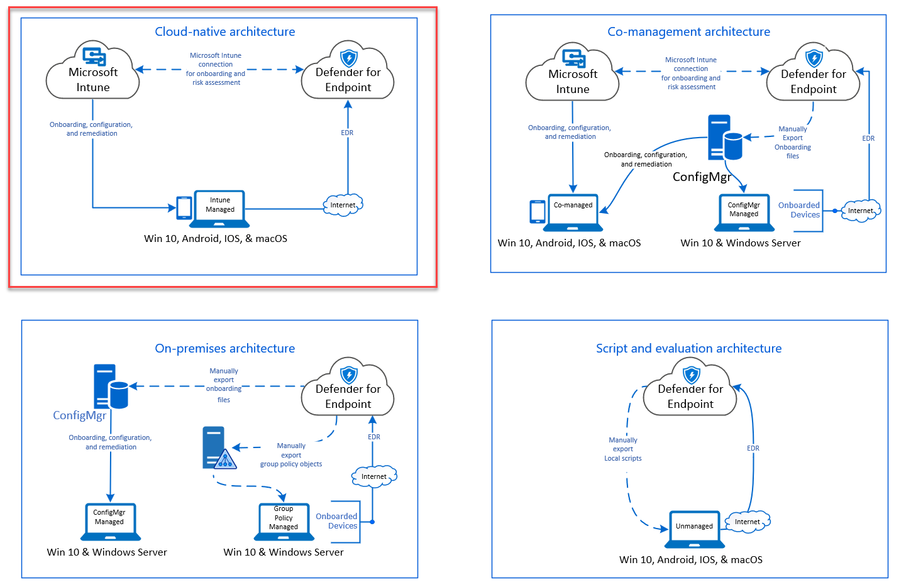
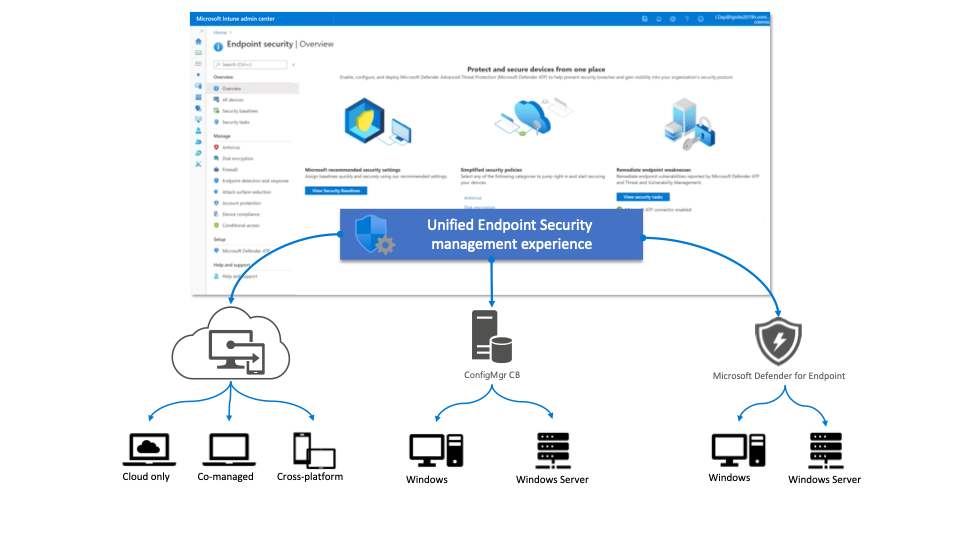
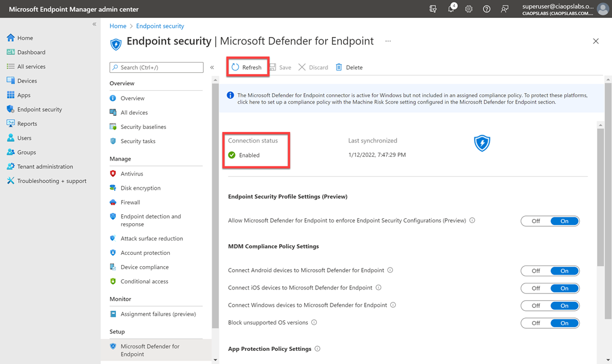
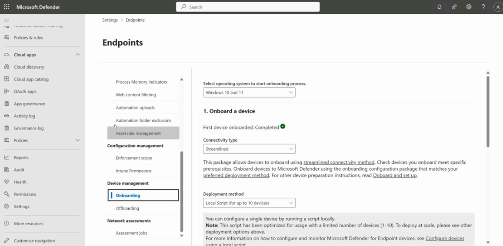
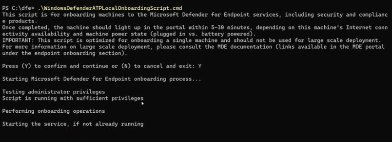
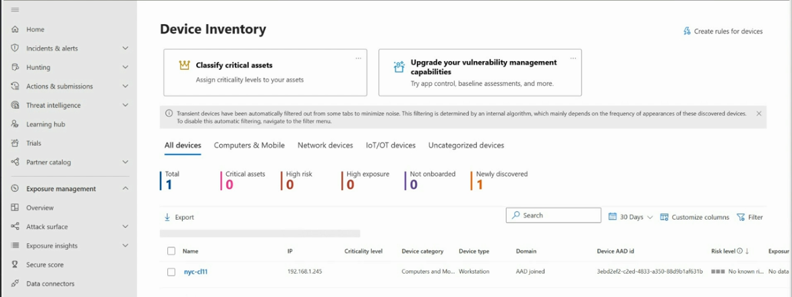

# Topic 14: Onboarding Devices to Microsoft Defender for Endpoint

> Topic 12 covered what MDE *does* (six pillars, TVM). This topic covers how a device actually **gets onboarded** in the first place — the architectures available, the Intune-based unified management path, and the manual local-script path — plus how onboarded devices show up in **Device Inventory**. Without onboarding, none of Topic 12's capabilities apply to a device at all.

---

## 1. The Four Onboarding Architectures



Microsoft supports four distinct architectures depending on how your organization already manages devices. Choosing the right one matters — it determines which tool actually pushes the onboarding configuration.

### a. Cloud-native architecture *(highlighted — the modern default)*
- **Microsoft Intune** connects directly to **Defender for Endpoint** for onboarding + risk assessment
- Intune handles **onboarding, configuration, and remediation** for Intune-managed devices
- Devices then send **EDR** telemetry back to Defender for Endpoint
- Covers: **Win 10, Android, iOS, & macOS**
- **This is the path used in Topics 6 and 8** — Intune Automatic Enrollment (Topic 6) + the Intune↔MDE connector (Topic 8) together implement exactly this architecture

### b. Co-management architecture
- A hybrid: some devices are **Intune Co-managed** (Win 10, Android, iOS, macOS), others are **ConfigMgr Managed** (Win 10 & Windows Server)
- ConfigMgr and Intune both feed onboarding/configuration, with onboarding files manually exported between them where needed
- Useful for organizations mid-migration from on-prem management to cloud-native

### c. On-premises architecture
- **ConfigMgr** manages onboarding, configuration, and remediation for **Win 10 & Windows Server**
- **Group Policy Objects (GPOs)** — tied back to Topic 2's Domain Controller/Group Policy function — push onboarding to **Group Policy Managed** devices
- Onboarding files are **manually exported** from Defender for Endpoint into ConfigMgr/GPO, since there's no direct cloud connector in this model
- No Intune involvement at all — purely on-prem device management

### d. Script and evaluation architecture
- For **Unmanaged** devices (no Intune, no ConfigMgr, no GPO)
- Onboarding via **manually exported local scripts**, run directly on each machine
- Covers **Win 10, Android, iOS, & macOS**
- Intended for **small-scale or evaluation/proof-of-concept scenarios** — not a scalable production management story

**Why this matters for SC-200:** exam scenarios will describe an organization's existing device management setup (fully cloud, ConfigMgr-only, mixed, or unmanaged) and ask which onboarding method fits. Recognizing "ConfigMgr-managed Windows Server" → **on-premises architecture**, or "small pilot group, no MDM" → **script and evaluation architecture**, is the actual tested skill.

---

## 2. Unified Endpoint Security Management (Intune's Role)



Path: **Intune admin center → Endpoint security → Overview**

This confirms the cloud-native architecture from Section 1 in the actual product UI. Intune's Endpoint security overview page positions itself as the **unified management layer** across three device populations:

| Population | Managed via |
|---|---|
| Cloud only, Co-managed, Cross-platform | **Microsoft Intune** |
| Windows, Windows Server | **ConfigMgr CB** (Configuration Manager, current branch) |
| Windows, Windows Server | **Microsoft Defender for Endpoint** |

The three feature cards on this page describe what "unified" actually delivers:
- **Protect and secure devices from one place** — Antivirus, Disk encryption, Firewall, EDR, Attack surface reduction, Account protection, Device compliance, Conditional access all live under one **Endpoint security** menu (visible in Topic 8's screenshot, revisited here)
- **Microsoft recommended security settings** — pre-built security baselines you can assign quickly
- **Simplified security policies** — jump-start policy categories instead of building from scratch
- **Remediate endpoint weaknesses** — direct link into Security tasks, which pulls from Defender Vulnerability Management (Topic 12's TVM) to turn identified CVEs into actionable remediation tasks *inside Intune itself*

**Why this matters:** this is the connective tissue between Topic 8 (Intune↔MDE connector), Topic 12 (TVM/Weaknesses), and this topic (onboarding) — Intune isn't just an onboarding mechanism, it's where the vulnerability data from Defender gets turned into actual remediation action.

---

## 3. Confirming the Intune ↔ MDE Connector Is Active



Path: **Intune admin center (older "Microsoft Endpoint Manager" branding) → Endpoint security → Microsoft Defender for Endpoint**

This is the same connector settings page from Topic 8, shown here specifically for its onboarding-relevant fields:

| Field | Value |
|---|---|
| **Connection status** | ✅ Enabled |
| **Last synchronized** | 1/12/2022, 7:47:29 PM |

⚠️ **Notable warning banner:** *"The Microsoft Defender for Endpoint connector is active for Windows but not included in an assigned compliance policy. To protect these platforms, click here to set up a compliance policy with the Machine Risk Score setting configured in the Microsoft Defender for Endpoint section."*

This is a real, common gap: **having the connector enabled is not the same as having a compliance policy that actually uses the risk signal it provides.** Without a compliance policy referencing "Machine Risk Score," a device could be flagged as high-risk by MDE, and Conditional Access (Topic 7) would never know to act on it. This exact warning is the kind of misconfiguration SC-200 scenario questions test — "connector enabled but nothing consumes the signal."

Below this, the same **MDM Compliance Policy Settings** toggles from Topic 8 reappear (Connect Android/iOS/Windows devices to MDE, Block unsupported OS versions) — confirming this page is the control point for *which platforms* actually get onboarded through this connector.

---

## 4. Manual Onboarding — the "Endpoints" Settings Page



Path: **Microsoft Defender portal → Settings → Endpoints → Device management → Onboarding**

This is the manual/direct onboarding configuration screen — relevant to the **on-premises** and **script and evaluation** architectures from Section 1, where there's no Intune connector doing this automatically.

| Field | Value |
|---|---|
| Select operating system to start onboarding process | Windows 10 and 11 |
| First device onboarded | ✅ Completed |
| Connectivity type | **Streamlined** |
| Deployment method | **Local Script (for up to 10 devices)** |

**Streamlined vs. other connectivity types:** the streamlined connectivity method simplifies the network requirements devices need to reach Microsoft's cloud services — fewer URLs/endpoints to allow through firewalls compared to the standard method.

⚠️ **Explicit scale limit called out on-screen:** *"This script has been optimized for usage with a limited number of devices (1-10). To deploy at scale, please see other deployment options above."* Local Script is explicitly **not** meant for production-scale rollout — it maps directly to the "Script and evaluation architecture" quadrant from Section 1, confirming that quadrant really is for pilots/small tests, not a production onboarding strategy.

Other deployment methods available from that same dropdown (not pictured, but referenced) typically include Group Policy, Microsoft Intune/Configuration Manager, VDI onboarding scripts, and a local script for up to 10 devices — matching the four architectures directly.

---

## 5. Running the Local Onboarding Script



Executing the downloaded onboarding package:

```
PS C:\dfe> .\WindowsDefenderATPLocalOnboardingScript.cmd
```

Key output shown:
- *"This script is for onboarding machines to the Microsoft Defender for Endpoint services, including security and compliance products."*
- *"Once completed, the machine should light up in the portal within 5-30 minutes, depending on this machine's Internet connectivity availability and machine power state (plugged in vs. battery powered)."*
- **Important warning repeated in the script itself:** *"This script is optimized for onboarding a single machine and should not be used for large scale deployment."*
- Prompts: `Press (Y) to confirm and continue or (N) to cancel and exit: Y`
- Confirms: `Testing administrator privileges` → `Script is running with sufficient privileges` → `Performing onboarding operations` → `Starting the service, if not already running`

⚠️ **Practical gotcha:** the script **must be run with administrator privileges** — if it's not, onboarding silently fails at the privilege test step. Also budget the stated **5–30 minute delay** before the device appears in the portal; a "device isn't showing up" concern immediately after running the script is often just this expected propagation delay, not a failure.

---

## 6. Confirming the Device Appears — Device Inventory



Path: **Microsoft Defender portal → Assets / Exposure management → Device Inventory**

Once onboarding succeeds (whether via Intune connector, GPO, ConfigMgr, or local script), the device shows up here:

| Summary tile | Value (example) |
|---|---|
| Total | 1 |
| Critical assets | 0 |
| High risk | 0 |
| High exposure | 0 |
| **Not onboarded** | 0 |
| Newly discovered | 1 |

Device row detail:

| Field | Value |
|---|---|
| Name | nyc-cl11 |
| IP | 192.168.1.245 |
| Device category / type | Computers and Mobile / Workstation |
| Domain | AAD joined |
| Device AAD id | 3ebd2ef2-c2ed-4833-a350-88d9b1af631b |
| Risk level | No known risk |
| Exposure | No data |

Tabs also split devices by **All devices / Computers & Mobile / Network devices / IoT/OT devices / Uncategorized devices** — reflecting the broader device coverage from Topic 12's newer capabilities diagram (Productivity devices, Servers, Mobile, IoT/OT).

⚠️ **Note the "Domain: AAD joined" field** — this directly ties back to Topic 9's `dsregcmd /status` output and the AADLoginForWindows extension. Device Inventory surfaces the same Entra ID join state you verified manually inside the VM, now visible centrally across your whole fleet.

Also worth noting: **"Newly discovered: 1"** and the banner about transient devices being auto-filtered — Defender doesn't just show what you explicitly onboarded, it also surfaces devices it *discovers* on the network (tying back to Topic 8's "Device discovery" toggle) that may not be onboarded yet.

---

## Full Topic Recap

1. Pick the right **architecture** based on existing device management (Cloud-native / Co-management / On-premises / Script and evaluation)
2. If cloud-native: confirm the **Intune ↔ MDE connector** is Enabled *and* that a compliance policy actually references the risk signal
3. If manual: go to **Settings → Endpoints → Onboarding**, pick OS + connectivity type + deployment method
4. For small-scale/pilot: download and run the **Local Script**, with admin privileges, and wait 5–30 minutes
5. Confirm success in **Device Inventory** — check "Not onboarded" count and the device's Domain/AAD join field

---

## Key Terms to Know

- **Streamlined connectivity method** — simplified network/firewall requirements for devices reaching Microsoft cloud services
- **ConfigMgr (Configuration Manager)** — on-prem device management tool, alternative to Intune for Windows/Windows Server
- **Local Script (onboarding)** — manual onboarding method, explicitly limited to 1–10 devices, not for production scale
- **Machine Risk Score** — the MDE-derived risk signal that a compliance policy must explicitly reference to be usable by Conditional Access
- **Device Inventory** — the Defender portal's live view of all discovered/onboarded devices and their risk/exposure state
- **Transient devices** — devices auto-filtered from some views due to infrequent appearance, to reduce noise

---

## Quick Self-Check

- [ ] Can you match each of the four onboarding architectures to the device-management scenario it fits (fully cloud, hybrid, on-prem-only, unmanaged/pilot)?
- [ ] Do you understand why an enabled Intune↔MDE connector still might not protect devices, if no compliance policy references Machine Risk Score?
- [ ] Can you explain why Local Script deployment is capped at 10 devices and isn't meant for production rollout?
- [ ] Do you know the expected propagation delay (5–30 minutes) after running the onboarding script, and why that matters when troubleshooting?
- [ ] Can you interpret Device Inventory's summary tiles (Not onboarded, Newly discovered, High risk) to assess your fleet's onboarding coverage at a glance?

---

*Keep `cloud-native-architecture.png`, `endpoint-security-overview.png`, `onboarding.png`, `defender-endpoint-onboarding.png`, `run-onboarding-script.png`, and `devices-assets.png` in this same folder as this README so the image links resolve correctly on GitHub.*
