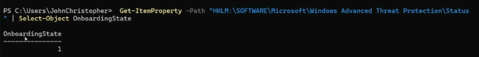
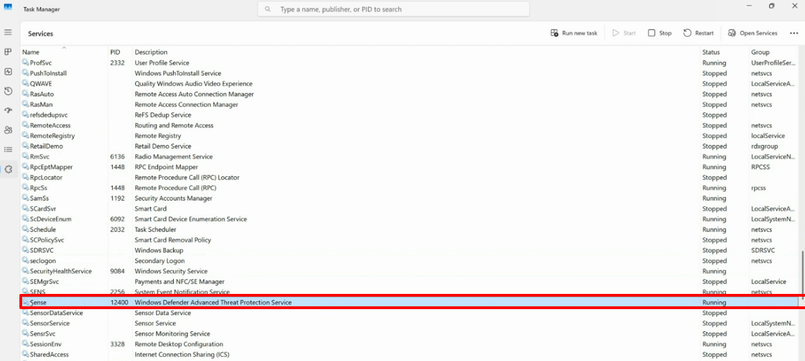
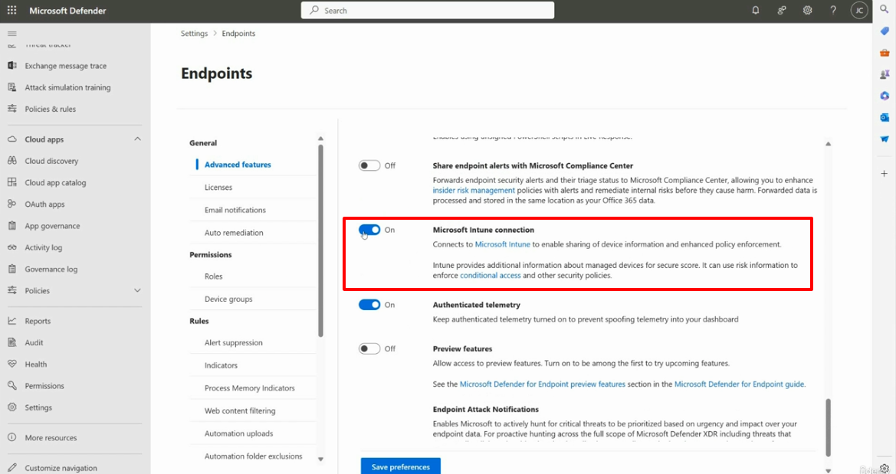
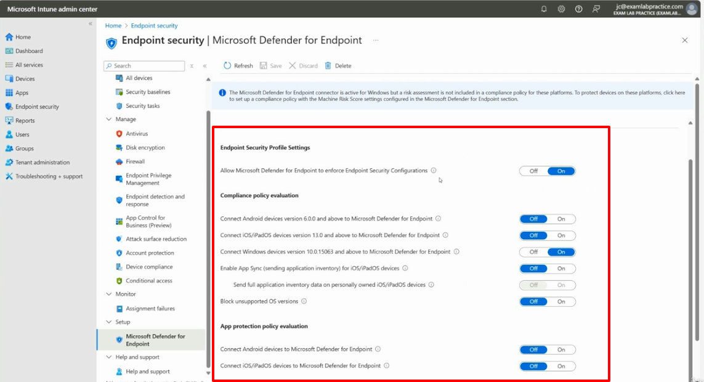
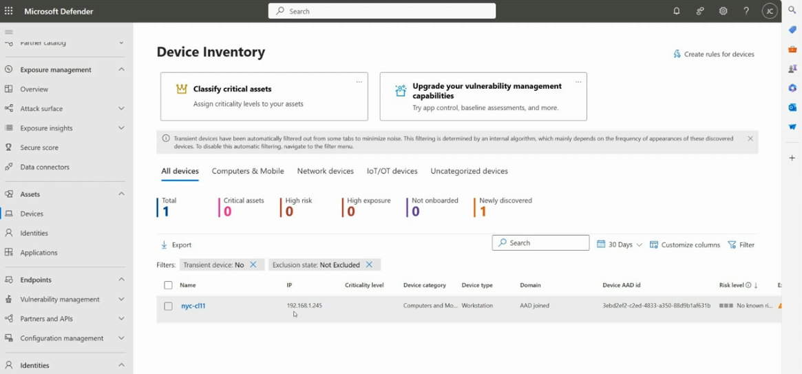

# Topic 15: Verifying Microsoft Defender for Endpoint Onboarding Success

> Topic 14 covered *how* to onboard a device. This topic covers the equally important follow-up question: **how do you actually confirm it worked?** There are four independent ways to check — a registry key, a running service, the Intune-side connector settings, and the Defender portal's Device Inventory. Knowing all four matters because each one tells you something different when troubleshooting a device that *isn't* showing up as expected.

---

## 1. Verify via Registry Key (Local Machine Check)



Command run directly on the device:

```powershell
Get-ItemProperty -Path "HKLM:\SOFTWARE\Microsoft\Windows Advanced Threat Protection\Status" | Select-Object OnboardingState
```

Result:
```
OnboardingState
---------------
1
```

**`OnboardingState = 1` means the device has successfully completed onboarding locally.** This registry key is the most direct, local-machine-level proof that the onboarding script (Topic 14, Section 5) actually applied its configuration — independent of whether the device has yet appeared in the cloud portal.

⚠️ **Why this check matters separately from the portal:** recall Topic 14's note that a device can take 5–30 minutes to "light up" in the Defender portal after running the script. If you check the portal too early, the device won't be there yet — but this registry key updates **immediately** once the local onboarding process completes. This is your fastest way to confirm "did the script actually work on this machine," independent of cloud propagation delay.

---

## 2. Verify via Running Service (Task Manager)



Path: **Task Manager → Services tab** → look for **Sense**

| Field | Value |
|---|---|
| Name | Sense |
| Description | Windows Defender Advanced Threat Protection Service |
| Status | **Running** |

**The `Sense` service is the actual MDE sensor** — it's the background process responsible for collecting telemetry and sending it to the cloud. If `OnboardingState = 1` (Section 1) but `Sense` is **not** Running, the device is configured to be onboarded but isn't actually reporting — this is a meaningfully different failure mode than "onboarding never happened at all."

⚠️ **Troubleshooting distinction worth internalizing:**

| Registry (`OnboardingState`) | Sense service | What it means |
|---|---|---|
| 1 | Running | ✅ Fully onboarded and actively reporting |
| 1 | Stopped | ⚠️ Onboarded but not reporting — service issue, investigate why Sense stopped |
| 0 or missing | Stopped | ❌ Onboarding never completed — rerun the onboarding script |

This two-check combination is exactly how a SOC analyst would triage "why isn't this device showing telemetry" without needing portal access at all.

---

## 3. Verify via Defender Portal — Intune Connection Toggle



Path: **Defender portal → Settings → Endpoints → General → Advanced features**

This is the Defender-side half of the connector (the Intune-side half was shown in Topic 14, Section 3). Highlighted here:

| Setting | State | Description |
|---|---|---|
| **Microsoft Intune connection** | **On** | *"Connects to Microsoft Intune to enable sharing of device information and enhanced policy enforcement. Intune provides additional information about managed devices for secure score. It can use risk information to enforce conditional access and other security policies."* |

Nearby related settings on this page:

| Setting | State | Purpose |
|---|---|---|
| Share endpoint alerts with Microsoft Compliance Center | Off | Would forward alerts to Purview (Topic 11) for insider risk management correlation |
| **Authenticated telemetry** | **On** | *"Keep authenticated telemetry turned on to prevent spoofing telemetry into your dashboard"* — a security control against fake/spoofed sensor data |
| Preview features | Off | Early access toggle |
| Endpoint Attack Notifications | (described) | *"Enables Microsoft to actively hunt for critical threats to be prioritized based on urgency and impact over your endpoint data"* — Microsoft Threat Experts (Topic 12's sixth pillar), in action |

⚠️ **Security note on Authenticated telemetry:** this setting existing at all is a reminder that **telemetry spoofing is a real threat model** — an attacker could theoretically try to inject fake sensor data to mask their activity or create false signal noise. Keeping this **On** is the recommended default specifically to prevent that.

---

## 4. Verify via Intune Admin Center — Full Connector Detail



Path: **Intune admin center → Endpoint security → Setup → Microsoft Defender for Endpoint**

This expands on Topic 14 Section 3's warning banner, showing the **full toggle set** underneath it:

⚠️ **Same warning repeated here, worded slightly differently:** *"The Microsoft Defender for Endpoint connector is active for Windows but a risk assessment is not included in a compliance policy for these platforms. To protect devices on these platforms, click here to set up a compliance policy with the Machine Risk Score settings configured in the Microsoft Defender for Endpoint section."*

### Endpoint Security Profile Settings
| Setting | State |
|---|---|
| Allow Microsoft Defender for Endpoint to enforce Endpoint Security Configurations | **On** |

### Compliance policy evaluation
| Setting | State |
|---|---|
| Connect Android devices version 6.0.0+ to MDE | On |
| Connect iOS/iPadOS devices version 13.0+ to MDE | On |
| **Connect Windows devices version 10.0.15063+ to MDE** | **Off** ⚠️ |
| Enable App Sync (iOS/iPadOS app inventory) | On |
| Send full application inventory data (personally-owned iOS/iPadOS) | Off (greyed out — depends on the above) |
| Block unsupported OS versions | On |

### App protection policy evaluation
| Setting | State |
|---|---|
| Connect Android devices to MDE | Off |
| Connect iOS/iPadOS devices to MDE | Off |

🚩 **This is a genuine, specific misconfiguration worth catching:** **"Connect Windows devices...to Microsoft Defender for Endpoint" is toggled Off**, even though Android and iOS/iPadOS are On. Combined with the warning banner explicitly calling out Windows compliance/risk assessment as unprotected, this is a real gap: **Windows devices in this tenant are onboarded to MDE (per Sections 1–2) but their risk signal isn't flowing into Intune compliance policy evaluation.** This is a textbook "spot the misconfiguration" exam scenario — everything *looks* connected (Sections 1–3 all show green/On), but this one specific toggle breaks the Windows risk-to-Conditional-Access chain from Topic 7.

---

## 5. Verify via Defender Portal — Device Inventory



Path: **Defender portal → Assets → Devices** (same view as Topic 14, now with filters applied)

Same device (`nyc-cl11`) as Topic 14, but note the **active filters** now shown:

| Filter | Value |
|---|---|
| Transient device | No |
| Exclusion state | Not Excluded |

These filters explain *why* you're seeing exactly the devices you're seeing — a device could be legitimately onboarded but hidden from this default view if it's flagged as **transient** (appears too infrequently — Topic 14 already flagged this) or if it's been explicitly **excluded**. If a known-onboarded device is missing from Device Inventory, checking these two filter states is the first troubleshooting step before assuming onboarding failed.

---

## Putting the Full Verification Chain Together

| Layer | Where to check | Confirms |
|---|---|---|
| **Local registry** | `OnboardingState` key | Onboarding script executed successfully on this specific machine |
| **Local service** | `Sense` service Running | The MDE sensor is actively alive and able to report |
| **Defender-side connector** | Settings → Endpoints → Advanced features | Defender is willing to share/receive data with Intune |
| **Intune-side connector** | Endpoint security → Microsoft Defender for Endpoint | Intune is willing to share/receive data with Defender — **and** which platforms' risk data actually flows through |
| **Cloud inventory** | Device Inventory | The device is visible centrally, accounting for transient/exclusion filtering |

**A device can pass some of these checks and fail others** — that's the entire point of having five independent verification points instead of just trusting one green checkmark.

---

## Key Terms to Know

- **OnboardingState** — registry value under `HKLM:\SOFTWARE\Microsoft\Windows Advanced Threat Protection\Status` confirming local onboarding completion
- **Sense** — the Windows service name for the Microsoft Defender for Endpoint sensor
- **Authenticated telemetry** — a Defender setting preventing spoofed telemetry from being injected into the dashboard
- **Machine Risk Score** — the specific compliance policy setting that must reference MDE's risk assessment for Conditional Access to act on it
- **Transient device** — a device auto-filtered from some views due to low frequency of appearance
- **Exclusion state** — whether a device has been explicitly excluded from inventory/policy scope

---

## Quick Self-Check

- [ ] Can you name all five independent places to verify MDE onboarding, and what each one specifically confirms?
- [ ] Do you understand why `OnboardingState = 1` but `Sense` stopped is a meaningfully different problem than both being in a "bad" state?
- [ ] Can you spot the misconfiguration in Section 4 (which platform's compliance policy evaluation was toggled Off despite others being On)?
- [ ] Do you know why checking the local registry key is faster/more immediate than waiting on the cloud portal to reflect a new onboarding?
- [ ] Can you explain what "Authenticated telemetry" protects against?

---

*Keep `command-onboarding-check.png`, `taskmanager-device-onboarding-check.png`, `defender-intune-connection-enable.png`, `intune-defender-connection.png`, and `assets-device-onboarding-check.png` in this same folder as this README so the image links resolve correctly on GitHub.*
