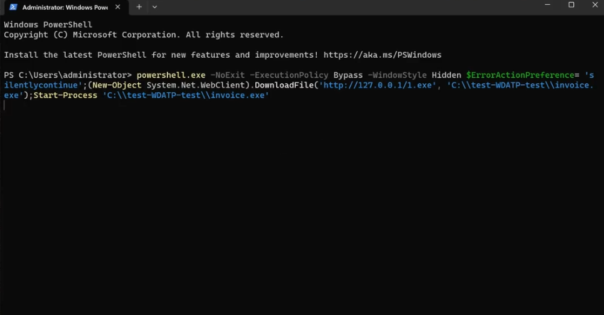
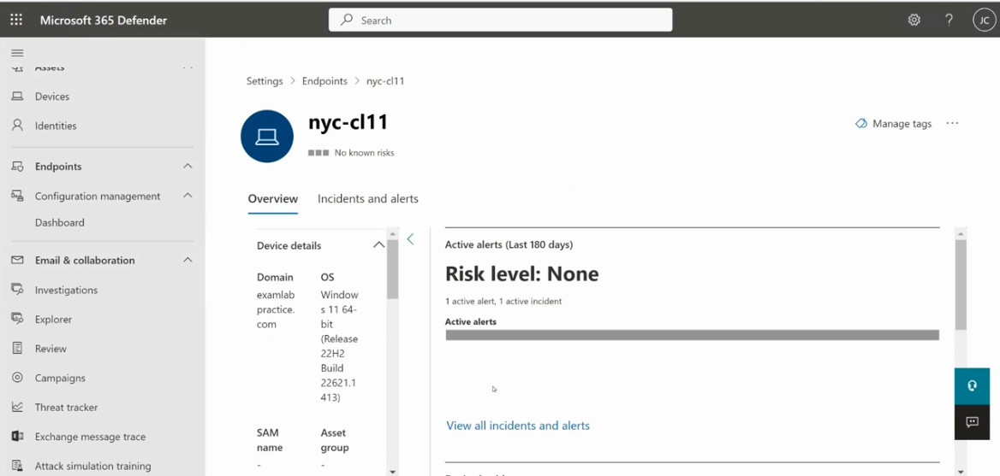
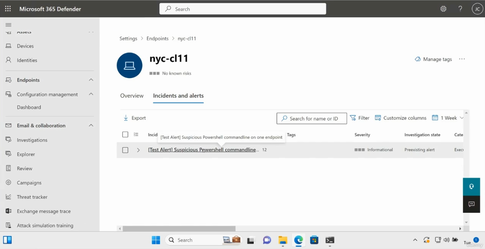
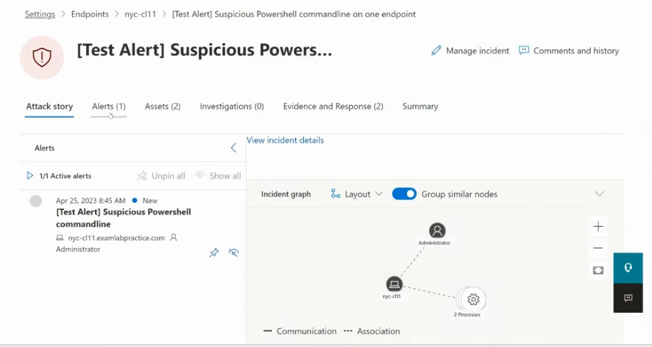
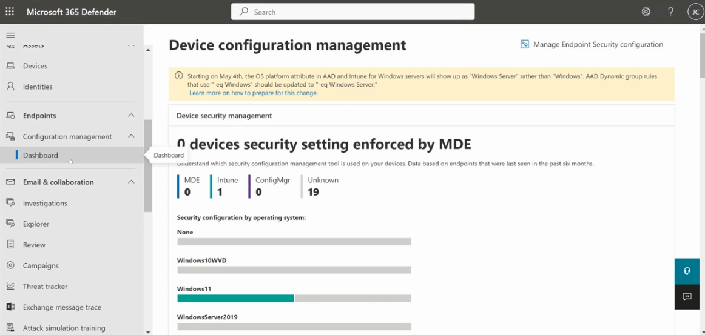

# Topic 16: Testing Detection — Simulate an Attack & Investigate the Resulting Alert

> With a device onboarded (Topic 14) and verified (Topic 15), the natural next step is: **does it actually detect anything?** This topic runs Microsoft's official EDR test scenario — a PowerShell command that mimics real attacker behavior (fileless download + execute) — then walks through where that detection surfaces: the device's Overview page, the Incidents and alerts list, and the full Attack story/incident graph investigation view.

---

## 1. Running the Test Detection Script



Command run in an elevated PowerShell window on the onboarded device (`nyc-cl11`):

```powershell
powershell.exe -NoExit -ExecutionPolicy Bypass -WindowStyle Hidden $ErrorActionPreference= 'silentlycontinue';(New-Object System.Net.WebClient).DownloadFile('http://127.0.0.1/1.exe', 'C:\test-WDATP-test\invoice.exe');Start-Process 'C:\test-WDATP-test\invoice.exe'
```

**This is Microsoft's own official MDE test script** — designed specifically to trip EDR detection logic without being genuinely malicious. Breaking down *why* this specific command is flagged:

| Suspicious element | Why MDE flags it |
|---|---|
| `-WindowStyle Hidden` | Attempts to run PowerShell invisibly — a classic evasion technique |
| `-ExecutionPolicy Bypass` | Circumvents PowerShell's script execution restrictions |
| `DownloadFile(...)` | Fileless download pattern — pulling an executable directly into memory/disk via .NET, not through a browser |
| Filename `invoice.exe` | Classic social-engineering-themed malware naming (mimics phishing lure filenames) |
| `C:\test-WDATP-test\` path | The specific test path Microsoft's official EDR test script uses — this alone is a recognized signature |
| `Start-Process` immediately after download | Download-then-execute in a single command — the core "dropper" behavior pattern |

⚠️ **Important safety note:** this is a **safe, Microsoft-sanctioned test** — it downloads from `127.0.0.1` (localhost) and doesn't fetch or run anything genuinely malicious. It exists specifically so SOC teams can validate their MDE detection pipeline end-to-end without needing real malware. This is the standard, recommended way to test whether onboarding (Topics 14–15) is actually *working*, not just configured.

---

## 2. Confirming Detection on the Device Overview Page



Path: **Defender portal → Assets → Devices → nyc-cl11 → Overview**

| Field | Value |
|---|---|
| Device name | nyc-cl11 |
| Risk level (badge) | ●●● No known risks *(top badge)* |
| **Active alerts (Last 180 days) → Risk level** | **None** *(this specific widget)* |
| Active alerts count | 1 active alert, 1 active incident |
| Domain | examlabpractice.com |
| OS | Windows 11 64-bit (Release 22H2, Build 22621.1413) |

⚠️ **Interesting nuance worth noticing:** the top-level device badge says *"No known risks"* while the Active alerts widget directly below it shows **"Risk level: None"** but still lists **"1 active alert, 1 active incident."** This isn't a contradiction — it reflects that this specific test alert was classified as **low/informational severity** (confirmed in Section 3), so it didn't elevate the device's overall computed risk level, even though it *did* generate a real, trackable alert and incident. Recognizing that "an alert exists" and "risk level increased" are two separate, independently-computed things is a genuine SC-200 nuance.

---

## 3. Finding the Alert — Incidents and Alerts Tab



Path: **Device page → Incidents and alerts** tab

| Field | Value |
|---|---|
| Alert name | **[Test Alert] Suspicious PowerShell commandline on one endpoint** |
| Severity | **Informational** |
| Investigation state | Preexisting alert |
| Category | Execution *(partially visible)* |

**"[Test Alert]" in the name is Microsoft's own labeling** — MDE explicitly tags detections generated by its official test scripts this way, so analysts (and you, reviewing screenshots later) can immediately distinguish test/validation activity from a genuine incident. This is a deliberate design choice worth remembering: if you ever see `[Test Alert]` in a real tenant's incident queue, it's validation noise, not an active threat, and should be filtered out or closed accordingly rather than escalated.

Also note the toolbar tools available here — **Export, Filter, Customize columns**, and a time range selector (currently "1 Week") — the same investigative tooling pattern seen in Topic 12's Weaknesses view and Topic 14's Device Inventory.

---

## 4. Investigating the Full Alert — Attack Story & Incident Graph



Path: **Click the alert → opens full alert/incident details**

### Top-level tabs
**Attack story** | Alerts (1) | Assets (2) | Investigations (0) | Evidence and Response (2) | Summary

This tab structure is the standard MDE/Defender XDR incident investigation layout — worth memorizing since it's the same structure you'll use for *every* real incident, not just this test:

| Tab | Purpose |
|---|---|
| **Attack story** | Visual timeline + graph reconstructing what happened |
| **Alerts** | The individual alert(s) that make up this incident |
| **Assets** | Devices/identities involved (here: 2 — likely the device and the user account) |
| **Investigations** | Automated investigation results (0 here — none triggered, since this is low-severity test activity) |
| **Evidence and Response** | Files, processes, or other artifacts collected as evidence (2 items) |
| **Summary** | High-level incident overview |

### Alert detail
- **Date:** Apr 25, 2023, 8:45 AM
- **Status:** New
- **Alert name:** [Test Alert] Suspicious PowerShell commandline
- **Device:** nyc-cl11.examlabpractice.com
- **Account:** Administrator

### Incident graph
A visual node graph showing:
- **Administrator** (the account) — connected via **Association**
- **nyc-cl11** (the device) — connected via **Communication**
- **2 Processes** — the actual PowerShell process chain (the outer PowerShell invocation and the spawned `invoice.exe` process)

Toggle available: **"Group similar nodes"** (currently On) — collapses repetitive/similar graph nodes for readability on more complex, real-world incidents with many more entities.

**Why this matters for SC-200:** this incident graph *is* the core investigative tool for the "Respond to security incidents" exam domain (35–40% of the exam — Topic content overview from your original outline). Being able to read "who (Administrator) did what (ran 2 processes) on which device (nyc-cl11)" directly from this graph — rather than piecing it together from raw logs — is exactly the skill this interface exists to support, and exactly what's tested.

---

## 5. Device Configuration Management Dashboard (Related Context)



Path: **Defender portal → Endpoints → Configuration management → Dashboard**

While not directly about this test alert, this dashboard was captured alongside it and is worth understanding here since it reveals a broader environment gap:

| Management tool | Devices |
|---|---|
| **MDE** | 0 |
| **Intune** | 1 |
| **ConfigMgr** | 0 |
| **Unknown** | 19 |

⚠️ **19 devices with "Unknown" configuration management is a significant visibility gap.** This dashboard answers "which tool is actually enforcing security settings on each device" — distinct from onboarding (Topic 14) or alerting (this topic). A device can be onboarded to MDE and generate alerts (like `nyc-cl11` did above) while *still* having no clear configuration management source, meaning baseline security settings (antivirus config, ASR rules, firewall rules — Topic 12's pillars) may not be centrally enforced or auditable on it at all.

**Also note the banner:** *"Starting on May 4th, the OS platform attribute in AAD and Intune for Windows servers will show up as 'Windows Server' rather than 'Windows.' AAD Dynamic group rules that use '-eq Windows' should be updated to '-eq Windows Server.'"* — a real, dated platform change notice. If you maintain **dynamic device groups** (Entra ID groups auto-populated by device attributes — relevant to Topic 6/7's Conditional Access targeting), a rule like `deviceOSType -eq "Windows"` would silently stop matching Windows Server devices after this change, unless updated. This is a good example of the kind of "platform changed underneath you" gotcha that breaks previously-working CA/compliance policies without any error being thrown.

---

## Full Topic Recap

1. Run Microsoft's official test detection script (safe, localhost-only, Microsoft-sanctioned) to validate the end-to-end detection pipeline
2. Check the device's **Overview** page — note that "Risk level: None" and "1 active alert/incident" can coexist; they're computed independently
3. Find the alert under **Incidents and alerts** — look for the `[Test Alert]` prefix to distinguish validation noise from real threats
4. Open the alert to review the **Attack story** and **incident graph** — the core visual tool for incident investigation
5. *(Bonus)* Check **Configuration management → Dashboard** to see whether devices have a *known* security configuration enforcement source, separate from whether they're onboarded/alerting

---

## Key Terms to Know

- **[Test Alert] prefix** — Microsoft's labeling convention marking alerts generated by official test/validation scripts
- **Attack story** — the visual timeline/graph tab summarizing what happened in an incident
- **Incident graph** — the node-based visualization connecting accounts, devices, and processes involved in an incident
- **Group similar nodes** — a graph display toggle collapsing repetitive entities for readability
- **Investigation state** — an alert's triage status (e.g., "Preexisting alert")
- **Device configuration management dashboard** — shows which tool (MDE, Intune, ConfigMgr, or Unknown) enforces security settings per device

---

## Quick Self-Check

- [ ] Can you explain, line by line, why the test PowerShell command is flagged as suspicious (hidden window, execution policy bypass, download-then-execute pattern)?
- [ ] Do you understand why a device can show "Risk level: None" while still having 1 active alert and 1 active incident?
- [ ] Can you explain what the `[Test Alert]` prefix means and why you should never escalate it as a real incident?
- [ ] Can you name the six tabs in the full alert/incident detail view and what each one shows?
- [ ] Do you understand why 19 devices showing "Unknown" in Configuration management is a visibility gap, separate from whether those devices are onboarded to MDE?

---

*Keep `run-endpoint-detection-script.png`, `machine-alerts-and-incidents.png`, `test-alert-display.png`, `alert-details.png`, and `endpoint-vulnerability-dashboard.png` in this same folder as this README so the image links resolve correctly on GitHub.*
