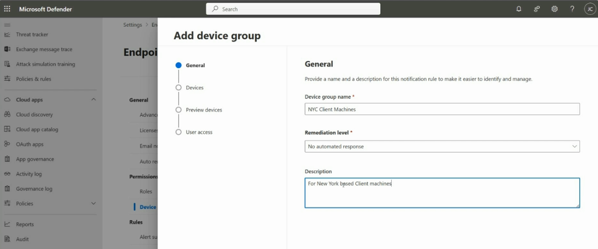
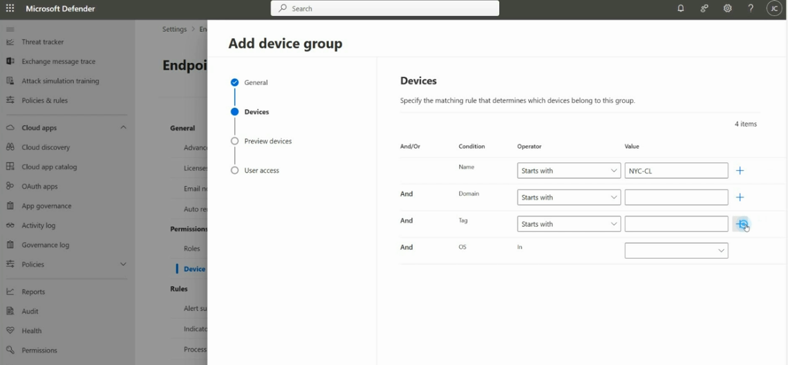
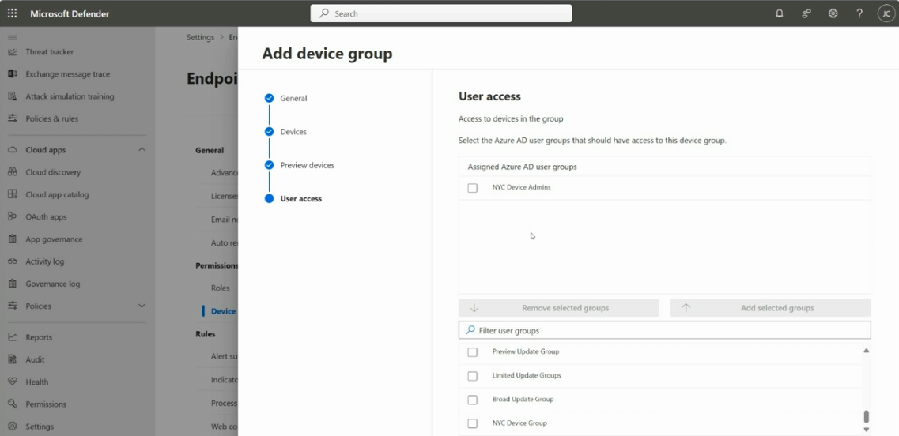
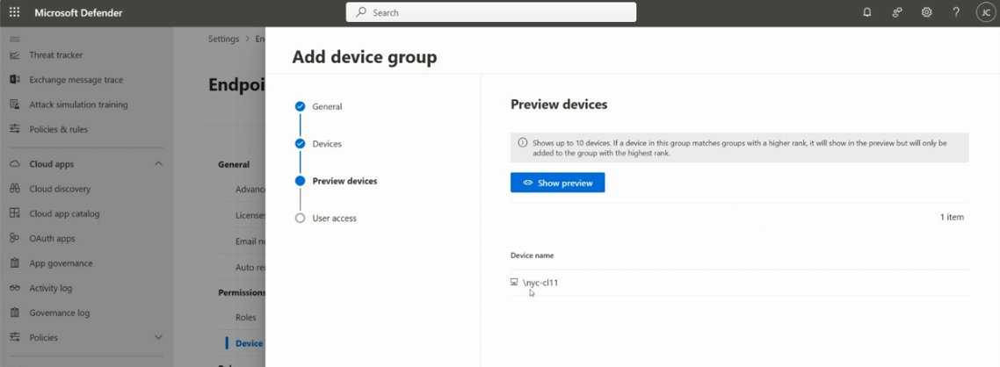
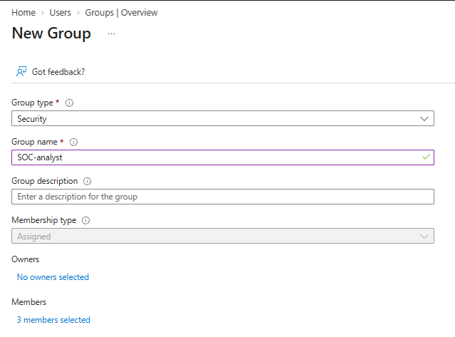
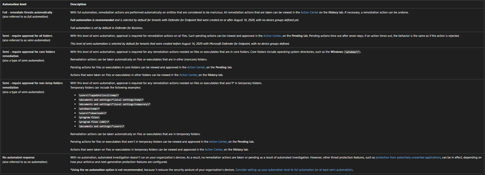

# Topic 17: Device Groups — Scoping Access & Automation Levels in Defender for Endpoint

> This topic ties together three threads from earlier: Topic 13's RBAC/custom roles, Topic 9's VM RBAC roles, and Topic 12's Auto Investigation and Remediation pillar. **Device groups** are how you combine all three — grouping devices logically (e.g., by location), controlling *which analysts* can see/act on that group, and deciding *how aggressively* automated remediation should behave for it.

---

## 1. Why Device Groups Exist

In a real organization, not every SOC analyst should see or act on every device. A regional analyst might only need visibility into their region's machines; a junior analyst might need read access without remediation rights. **Device groups** let you:

1. **Logically bucket devices** using matching rules (name, domain, tag, OS)
2. **Scope which Entra ID user groups** can see/manage that specific bucket
3. **Set a remediation automation level** independently per group — a finance server group might need stricter human approval than a low-risk kiosk device group

This is the practical mechanism that makes Topic 13's "least privilege" principle enforceable at the *device* level, not just the portal-permission level.

---

## 2. Step 1 — General: Name, Description, Remediation Level

Path: **Defender portal → Settings → Endpoints → Permissions → Device groups → + Add device group**

| Field | Value (example) |
|---|---|
| Device group name | `NYC Client Machines` |
| **Remediation level** | `No automated response` |
| Description | "For New York based Client machines" |

The **Remediation level** dropdown set here is the group-specific automation policy — covered in full detail in Section 6. Setting it per-group (rather than tenant-wide) is exactly what lets you apply different automation postures to different populations of devices.

---

## 3. Step 2 — Devices: Matching Rules

This is where you define **which devices automatically belong to this group**, using an AND/OR condition builder:

| And/Or | Condition | Operator | Value |
|---|---|---|---|
| — | Name | Starts with | `NYC-CL` |
| And | Domain | Starts with | *(blank)* |
| And | Tag | Starts with | *(blank)* |
| And | OS | In | *(blank)* |

In this example, only the **Name starts with `NYC-CL`** condition is actually filled in — devices like `nyc-cl11` (the same test device from Topics 14–16) would automatically match and join this group. The other conditions (Domain, Tag, OS) are available but unused here, showing how you *could* further narrow the match (e.g., only Windows devices in a specific domain).

⚠️ **This is dynamic, rule-based membership** — not manual device-by-device assignment. As new devices are onboarded that match the naming convention, they automatically join the group without any manual step. This mirrors the dynamic Entra ID group concept referenced back in Topic 16's platform-attribute warning.

---

## 4. Step 3 — Preview Devices

Before finalizing, Defender lets you **preview which real devices currently match your rule**:

> *"Shows up to 10 devices. If a device in this group matches groups with a higher rank, it will show in the preview but will only be added to the group with the highest rank."*

In this case: **1 item — `\nyc-cl11`** — confirming the `NYC-CL` naming rule correctly catches the test device from earlier topics.

⚠️ **Important nuance on group ranking:** device groups have a **rank/priority order**, and a device can only ever belong to **one** group at a time — whichever group ranks highest among those it matches. This matters a lot in practice: if you have both a broad "All Windows Devices" group and a narrow "NYC Client Machines" group, and a device matches both, **rank determines which group's remediation level and user access actually apply** to that device. Getting rank order wrong is a realistic misconfiguration — e.g., accidentally leaving a sensitive server in a low-security default group because a more specific, higher-security group was ranked lower.

---

## 5. Step 4 — User Access: Scoping by Entra ID Group

This is where **RBAC scoping** actually happens — tying this device group to specific **Entra ID (Azure AD) user groups**:

| Assigned Azure AD user groups |
|---|
| NYC Device Admins |

Below, a searchable list of available Entra ID groups to add: Preview Update Group, Limited Update Groups, Broad Update Group, NYC Device Group, etc.

**This is the connective link back to Topic 13:** an analyst's Defender custom role (Topic 13, Section 2) grants *what kind* of actions they can take, while **device group user access** determines *which devices* they can take those actions on. A "Defender Custom Admin" role holder who is **not** added to `NYC Device Admins` here would still be unable to see or act on devices in this specific group, regardless of their broader role permissions — true least-privilege enforcement combining both systems.

---

## 6. Supporting Piece — Creating the Entra ID Security Group First

Path: **Entra ID → Groups → + New Group**

Before a group like `NYC Device Admins` can be assigned in Section 5, it has to exist as an actual **Entra ID Security group**:

| Field | Value |
|---|---|
| Group type | Security |
| Group name | `SOC-analyst` |
| Membership type | Assigned |
| Members | 3 members selected |

This confirms the full chain: **Entra ID Security group (who) → assigned as User access on a Defender device group (which devices) → combined with a Defender custom role (what actions)** — three separate configuration steps, in three different places, that together define one analyst's real effective access.

---

## 7. Remediation Automation Levels — Full Reference

This is the complete reference for the **Remediation level** dropdown from Section 2. Ties directly back to Topic 12's "Auto Investigation and Remediation" pillar — this table is where that pillar's behavior is actually configured, per device group.

| Automation Level | Behavior |
|---|---|
| **Full — remediate threats automatically** *(full automation)* | Remediation actions performed automatically on entities considered malicious. Viewable/undoable in **Action Center → History** tab. **Recommended and default** for tenants created on/after Aug 16, 2020 with no device groups yet defined. Also the default in Defender for Business. |
| **Semi — require approval for all folders** *(semi-automation)* | Approval required for remediation on *all* files. Pending actions appear in **Action Center → Pending** tab; time out after 7 days (timeout = treated as rejected). Was the default for tenants created *before* Aug 16, 2020. |
| **Semi — require approval for core folders remediation** | Approval required only for files/executables in **core (OS) folders** like `\windows\*`. Non-core folder actions happen automatically. |
| **Semi — require approval for non-temp folders remediation** | Approval required for files *outside* temp folders (a long list of temp path patterns is explicitly excluded: `\users\*\appdata\local\temp\*`, `\windows\temp\*`, `\program files\*`, etc.). Temp-folder items remediate automatically without approval. |
| **No automated response** *(no automation)* | Automated investigation **does not run at all**. No remediation actions taken or pending. Other protections (e.g., potentially unwanted application blocking) may still apply depending on antivirus/NGP config. **Not recommended** — explicitly reduces security posture. |

⚠️ **This directly explains the Section 2 example:** the `NYC Client Machines` group was set to **"No automated response."** Per this reference table, that means automated investigation simply **doesn't run** on any device in that group — a deliberate choice that might make sense for a group of devices under active manual investigation or a testing/staging environment, but would be a real gap if applied broadly or by accident to production endpoints.

**Why the four "Semi" variants matter:** they let you tune *where* human approval is required based on risk tolerance for different file locations — core OS folders (higher blast radius if wrong) vs. temp folders (lower risk, safe to auto-remediate) vs. everything non-temp. This is a genuinely nuanced, testable distinction: knowing that "semi-automation" isn't one setting but four different granularities of it.

---

## Full Topic Recap

1. **General** — name the group, pick a description, and set its **Remediation level** (automation posture)
2. **Devices** — define matching rules (Name/Domain/Tag/OS) for dynamic, rule-based membership
3. **Preview devices** — confirm which real devices match before committing; remember only the **highest-ranked matching group** actually applies
4. **User access** — assign the **Entra ID Security groups** allowed to see/manage this device group
5. *(Prerequisite)* — the Entra ID Security group referenced in step 4 must already exist
6. Understand the full **automation level spectrum** — Full, three flavors of Semi, and No automated response — and their real security tradeoffs

---

## Key Terms to Know

- **Device group** — a logical, rule-based bucket of devices in Defender, with its own remediation level and user-access scoping
- **Matching rule** — the And/Or condition set (Name, Domain, Tag, OS) determining dynamic group membership
- **Group rank** — determines which single group a device belongs to when it matches multiple groups' rules
- **Remediation level** — the automation posture for a device group, ranging from Full automation to No automated response
- **Action Center — History / Pending tabs** — where completed (History) vs. awaiting-approval (Pending) remediation actions are reviewed
- **Core folders** — OS directories like `\windows\*`, treated as higher-risk locations requiring approval under some semi-automation levels
- **Security group (Entra ID)** — the underlying identity-group mechanism used to scope device group user access

---

## Quick Self-Check

- [ ] Can you explain the three-part chain that determines an analyst's real effective access (Entra ID Security group → Device group user access → Defender custom role)?
- [ ] Do you understand what happens when a device matches the rules of two different device groups?
- [ ] Can you name all five remediation automation levels and explain the practical difference between the three "Semi" variants?
- [ ] Do you know why "No automated response" is explicitly flagged as reducing security posture, and what it actually disables (automated investigation entirely, not just remediation)?
- [ ] Can you explain why dynamic, rule-based device group membership (vs. manual assignment) matters for a growing/changing fleet?

---

*Keep `add-device-group-1.png`, `add-device-group-2.png`, `device-group-4.png`, `device-group-3.png`, `create-security-group.png`, and `device-groups-automation-level.png` in this same folder as this README so the image links resolve correctly on GitHub.*
