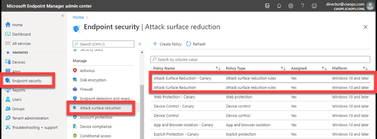
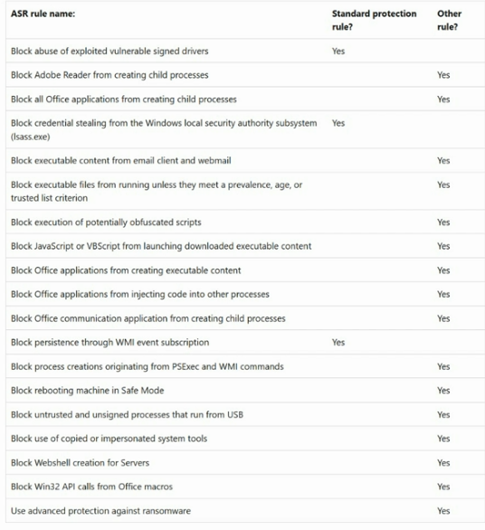
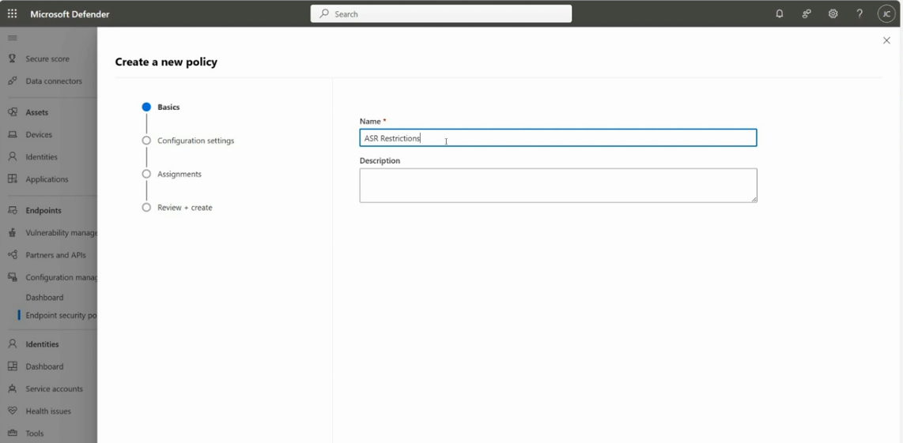
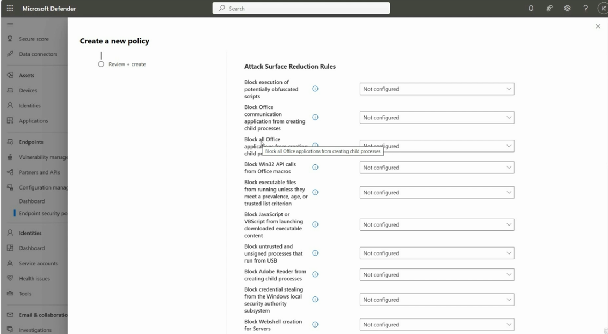
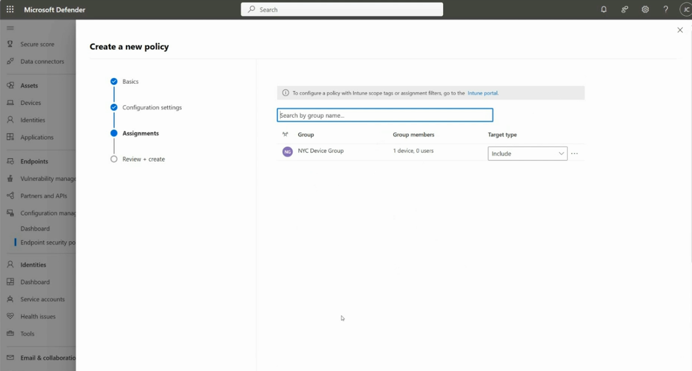
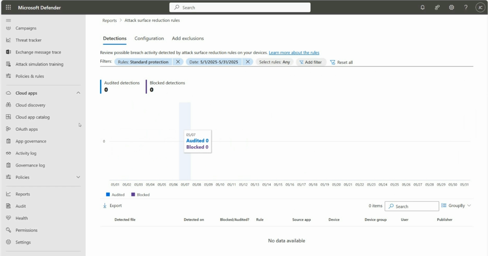

# Topic 20: Attack Surface Reduction (ASR) Rules — Configuration & Reporting

> Zooming into the second pillar from Topic 12's six-pillar MDE model: **Attack Surface Reduction**. This topic covers the full lifecycle — viewing existing ASR policies in Intune, understanding the Standard protection rule set, building a new policy through the Defender portal's policy wizard, scoping it to a device group (Topic 17), and reviewing what it actually detected/blocked afterward.

---

## 1. Existing ASR Policies — Intune Endpoint Security View

Path: **Intune admin center (Microsoft Endpoint Manager) → Endpoint security → Attack surface reduction**

This tenant already has several ASR-related policies deployed, each with a **Policy Type**, targeting **Windows 10 and later**:

| Policy Name | Policy Type | Assigned |
|---|---|---|
| Attack Surface Reduction - Canary | Attack surface reduction rules | Yes |
| Attack Surface Reduction | Attack surface reduction rules | Yes |
| Web Protection - Canary | Web protection | Yes |
| Device Control - Canary | Device control | Yes |
| Device Control | Device control | Yes |
| App and Browser isolation - Canary | App and browser isolation | Yes |
| Exploit Protection | Exploit Protection | Yes |

**Note the "- Canary" naming pattern.** This is a common, deliberate practice: a **Canary** policy is a smaller, lower-risk pilot deployment of a new/changed policy — tested on a limited device group first, before the full policy is rolled out broadly. If the Canary version doesn't cause unexpected breakage (false-positive blocks on legitimate business apps), the org proceeds to update the main policy. This directly reflects the device-group-based rollout approach from Topic 17 — you'd assign the Canary policy to a small test device group, and the full policy to the broader fleet.

**Why "Attack surface reduction" appears as its own distinct category** alongside Web Protection, Device Control, App and Browser Isolation, and Exploit Protection: these are all separate but related *endpoint security profile types* under the broader ASR pillar umbrella from Topic 12 — ASR rules specifically target application/script/macro behavior, while the others cover network/web, removable media, browser isolation, and memory-exploit protections respectively.

---

## 2. The Standard Protection Rule Set — Reference Table

This table is the canonical reference for **which ASR rules are part of Microsoft's "Standard protection" bundle** vs. which require individual configuration ("Other rule"):

| ASR Rule | Standard protection? | Other rule? |
|---|---|---|
| Block abuse of exploited vulnerable signed drivers | — | Yes |
| Block Adobe Reader from creating child processes | — | Yes |
| Block all Office applications from creating child processes | — | Yes |
| **Block credential stealing from the Windows local security authority subsystem (lsass.exe)** | **Yes** | — |
| Block executable content from email client and webmail | — | Yes |
| Block executable files from running unless they meet a prevalence, age, or trusted list criterion | — | Yes |
| Block execution of potentially obfuscated scripts | — | Yes |
| Block JavaScript or VBScript from launching downloaded executable content | — | Yes |
| Block Office applications from creating executable content | — | Yes |
| Block Office applications from injecting code into other processes | — | Yes |
| Block Office communication application from creating child processes | — | Yes |
| **Block persistence through WMI event subscription** | **Yes** | — |
| Block process creations originating from PSExec and WMI commands | — | Yes |
| Block rebooting machine in Safe Mode | — | Yes |
| Block untrusted and unsigned processes that run from USB | — | Yes |
| Block use of copied or impersonated system tools | — | Yes |
| Block Webshell creation for Servers | — | Yes |
| Block Win32 API calls from Office macros | — | Yes |
| Use advanced protection against ransomware | — | Yes |

⚠️ **Only two rules are part of "Standard protection":**
1. **Block credential stealing from LSASS** — directly ties back to Topic 2's Golden Ticket/DCSync/credential-theft concepts. LSASS memory is where Windows caches credentials in memory; this rule blocks the classic "Mimikatz-style" credential dumping technique.
2. **Block persistence through WMI event subscription** — blocks a well-known fileless persistence technique where malware registers a WMI event filter/consumer to re-execute itself, surviving reboots without leaving a traditional file/registry artifact.

**Why this distinction matters for SC-200:** "Standard protection" is Microsoft's recommended, low-friction *baseline* — these two rules are considered safe to enable broadly with minimal risk of breaking legitimate business processes. The remaining rules ("Other rule") are more aggressive and can have **higher false-positive potential** against specific legitimate workflows (e.g., "Block all Office applications from creating child processes" could break a legitimate macro-driven business process), so they're deliberately left for the organization to evaluate and enable individually rather than bundled automatically.

---

## 3. Building a New ASR Policy — Step 1: Basics

Path: **Defender portal → Endpoints → Configuration management → Endpoint security policies → + Create Policy**

| Field | Value |
|---|---|
| Name | `ASR Restrictions` |
| Description | *(blank)* |

The wizard's four steps: **Basics → Configuration settings → Assignments → Review + create** — the same overall pattern used throughout Intune/Defender policy creation (compare to Topic 6's device settings, Topic 7's Conditional Access wizard).

---

## 4. Step 2: Configuration Settings — Individual Rule Toggles

Each ASR rule gets its own independent dropdown (visible: Block execution of potentially obfuscated scripts, Block Office communication application from creating child processes, Block all Office applications from creating child processes, Block Win32 API calls from Office macros, Block executable files from running unless prevalence/age/trusted-list criterion met, Block JavaScript or VBScript from launching downloaded executable content, Block untrusted and unsigned processes from USB, Block Adobe Reader from creating child processes, Block credential stealing from LSASS, Block Webshell creation for Servers).

**Every rule shown here is currently "Not configured"** — this is the default, blank-slate state before an admin makes a deliberate choice. Each dropdown typically offers:

| Mode | Effect |
|---|---|
| **Not configured** | Rule has no effect (inherited from elsewhere, or simply off) |
| **Block** | Rule actively blocks and logs the matched behavior |
| **Audit** | Rule logs what *would* have been blocked, without actually blocking — used for safe testing before enforcing |
| **Warn** | Rule warns the user but allows them to bypass |
| **Disabled** | Rule explicitly turned off |

⚠️ **Best practice tie-in:** this is exactly why the "Canary" policy pattern from Section 1 exists — you'd set rules to **Audit** mode on a Canary policy assigned to a small test group first, review what *would* have been blocked (Section 6's reporting view), confirm no legitimate business processes are affected, then switch to **Block** mode for the full rollout.

---

## 5. Step 3: Assignments — Scoping to a Device Group

| Group | Group members | Target type |
|---|---|---|
| NYC Device Group | 1 device, 0 users | Include |

This is Topic 17's device group concept in direct action — this ASR policy is being scoped specifically to the **NYC Device Group** rather than applied tenant-wide. The banner above also notes: *"To configure a policy with Intune scope tags or assignment filters, go to the Intune portal"* — a reminder that some more advanced targeting options (scope tags, assignment filters) require switching to the Intune admin center rather than the Defender portal wizard.

**Target type: Include** — this device group is being *added into* scope for this policy (as opposed to "Exclude," which would carve a group *out* of an otherwise broader assignment).

---

## 6. Reviewing ASR Effectiveness — Reports

Path: **Defender portal → Reports → Attack surface reduction rules**

Three tabs: **Detections | Configuration | Add exclusions**

### Detections tab (shown)

| Filter applied | Value |
|---|---|
| Rules | Standard protection |
| Date | 5/1/2025–5/31/2025 |
| Select rules | Any |

| Metric | Value |
|---|---|
| Audited detections | 0 |
| Blocked detections | 0 |

The chart shows a daily breakdown across the month (05/01–05/31) — currently flat at zero for every day, with the detailed table below showing **"No data available"** (columns: Detected file, Detected on, Blocked/Audited, Rule, Source app, Device, Device group, User, Publisher).

**Why this matters:** this report is the practical feedback loop for the entire ASR configuration process (Sections 3–5) — it's how you'd verify whether your Canary/Audit-mode rollout is triggering on real activity, and whether a full Block-mode rollout is generating expected detections (or unexpectedly high false-positive volume, which would mean dialing back or refining the rule). Zero detections here could mean either "the environment is genuinely clean" or "the rules aren't actually configured/assigned yet" — worth cross-checking against the Configuration tab and Section 4's "Not configured" state to determine which.

---

## Full Topic Recap

1. Review existing ASR-related policies in Intune, noting the **Canary vs. full-rollout** naming pattern
2. Understand which ASR rules are in Microsoft's **Standard protection** baseline (only 2: LSASS credential theft, WMI persistence) vs. requiring individual opt-in
3. Build a new policy: **Basics** (name/description) → **Configuration settings** (per-rule Block/Audit/Warn/Disabled) → **Assignments** (scope to a device group, Include/Exclude) → Review + create
4. Use **Audit mode** on a Canary/pilot group before switching to **Block mode** broadly, to catch false positives safely
5. Monitor results in **Reports → Attack surface reduction rules → Detections** to confirm rules are actually triggering as expected

---

## Key Terms to Know

- **Attack Surface Reduction (ASR) rules** — rules blocking specific risky application/script/macro behaviors before they can be exploited
- **Standard protection** — Microsoft's curated baseline subset of ASR rules considered safe to enable broadly (LSASS credential theft + WMI persistence)
- **Canary policy** — a small-scale pilot deployment of a policy, tested before broader rollout
- **Audit mode** — a rule mode that logs what would be blocked without actually blocking, used for safe pre-rollout testing
- **LSASS (Local Security Authority Subsystem Service)** — the Windows process where credentials are cached in memory; a primary target for credential-dumping tools
- **WMI event subscription persistence** — a fileless technique where malware persists via a registered WMI event filter/consumer

---

## Quick Self-Check

- [ ] Can you name the two ASR rules included in Microsoft's "Standard protection" baseline, and explain what each specifically blocks?
- [ ] Do you understand the purpose of a "Canary" policy and how it relates to Audit vs. Block mode?
- [ ] Can you walk through the four steps of building a new ASR policy (Basics → Configuration settings → Assignments → Review + create)?
- [ ] Do you understand why scoping a policy to a specific device group (Topic 17) matters for a safe rollout strategy?
- [ ] If the Detections report shows zero audited/blocked events, what two different explanations should you consider (clean environment vs. rules not actually configured)?

---

*Keep `ASR-endpoint.png`, `ASR-standard-rules.png`, `create-new-policy.png`, `define-rules.png`, `define-device-groups.png`, and `display-asr-reports.png` in this same folder as this README so the image links resolve correctly on GitHub.*
