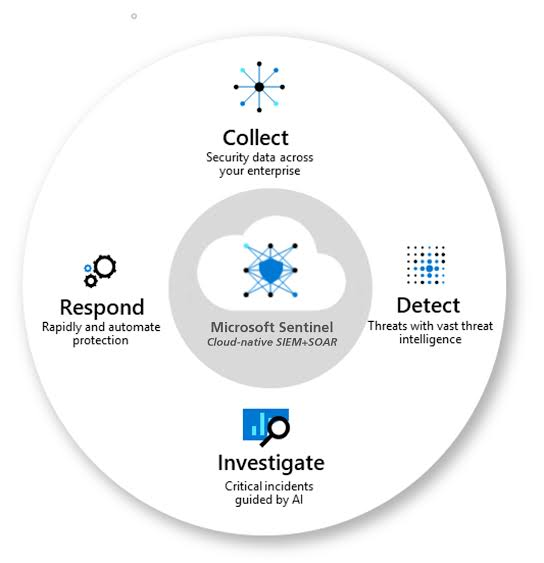
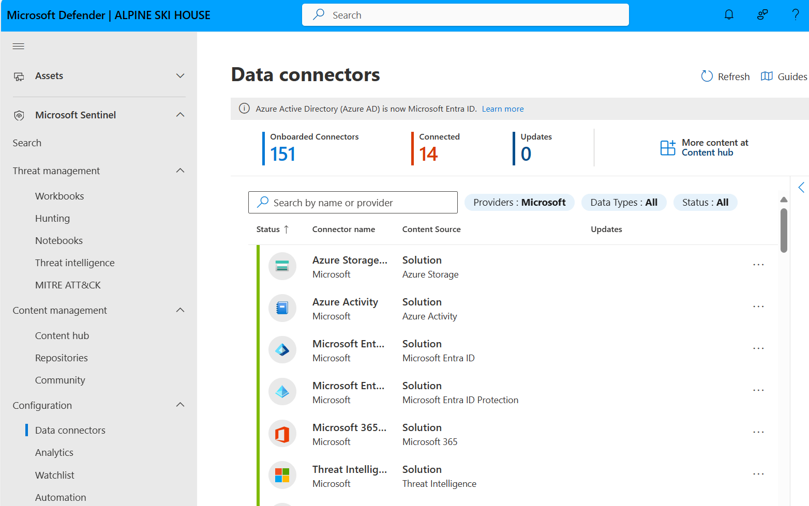
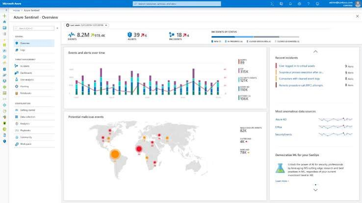
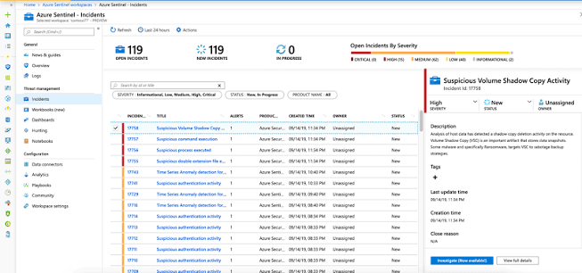
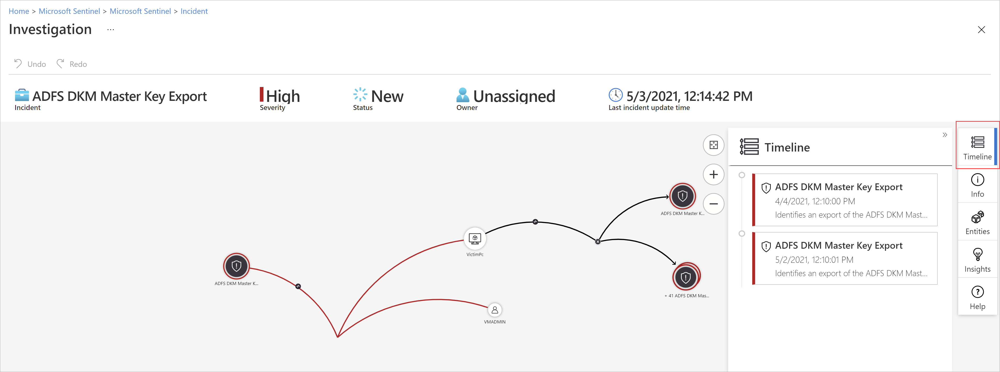
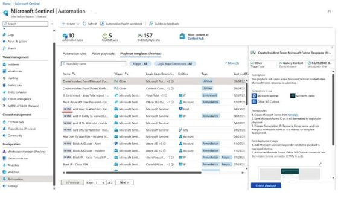
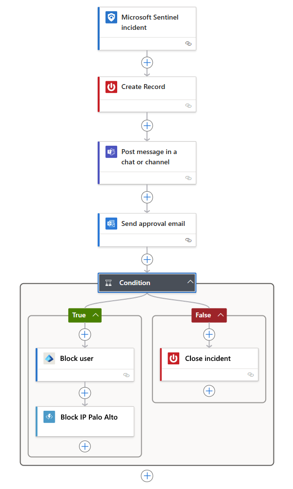

# Topic 21: Concepts of Microsoft Sentinel

> This is the "Concepts of Microsoft Sentinel" topic promised a while back — and it lands right after Topic 19's "which data sources to ingest" groundwork. Together they form the natural sequence: **why Sentinel exists → what data it needs → the four-stage lifecycle it runs → what each stage actually looks like in the portal** (dashboard, incidents, investigation graph, automation/playbooks).

---

## 1. The Core Definition — Cloud-Native SIEM + SOAR



Microsoft Sentinel describes itself as: **"Cloud-native SIEM + SOAR."** Two acronyms worth unpacking, since this single label is the most-tested definition in this whole topic:

| Acronym | Stands for | What it means here |
|---|---|---|
| **SIEM** | Security Information and Event Management | Broad log collection, correlation, and long-term retention/search across your entire environment — the "detect and investigate" half |
| **SOAR** | Security Orchestration, Automation, and Response | Automated playbooks that take action in response to what's detected — the "respond" half |

**Sentinel is both, in one product** — historically, SIEM and SOAR were often separate tools that had to be integrated together. This is the core value proposition worth remembering.

### The four-stage cycle

| Stage | Description (as shown) |
|---|---|
| **Collect** | *"Security data across your enterprise"* — this is Topic 19's entire subject matter: identifying and connecting data sources |
| **Detect** | *"Threats with vast threat intelligence"* — analytics rules, ML-based detection, correlation |
| **Investigate** | *"Critical incidents guided by AI"* — the investigation graph (Section 4) |
| **Respond** | *"Rapidly and automate protection"* — playbooks/Logic Apps (Section 5) |

**Why this matters for SC-200:** this exact four-stage cycle maps directly onto the exam's three domains — "Manage a security operations environment" spans Collect + some Detect, "Respond to security incidents" is Investigate + Respond, and "Perform threat hunting" cuts across Detect and Investigate using raw collected data. Every hands-on Sentinel skill you learn fits into one of these four buckets.

---

## 2. Data Connectors — Confirming "Collect" in Practice



Path: **Microsoft Defender portal → Microsoft Sentinel → Configuration → Data connectors**

This is Topic 19's concepts made concrete, in the newer **unified Defender portal** (Topic 11's unification, now hosting Sentinel's own configuration menus directly):

| Metric | Value |
|---|---|
| **Onboarded Connectors** | 151 *(available in the catalog)* |
| **Connected** | 14 *(actually active in this tenant)* |
| Updates | 0 |

Visible connectors, all **Solution: Microsoft** (packaged via **Content Hub** — Topic 19's concept, seen live here):

- Azure Storage
- Azure Activity
- **Microsoft Entra ID** *(the connector, distinct from "Microsoft Entra ID Protection" below it)*
- **Microsoft Entra ID Protection**
- Microsoft 365
- Threat Intelligence

⚠️ **Notice the banner:** *"Azure Active Directory (Azure AD) is now Microsoft Entra ID"* — a rebranding note confirming the same terminology shift already tracked throughout this course (Topics 1, 2, 6, 7).

**151 available vs. 14 connected** is a good illustration of Topic 19's prioritization framework in action — no real tenant connects all 151 possible sources; the skill is picking the right 14 (or however many) based on actual environment and risk priorities.

---

## 3. The Classic Sentinel Overview Dashboard



Path: **Azure Portal → Microsoft Sentinel → Overview** *(classic Azure-portal-based experience, alongside the newer unified Defender portal shown in Section 2)*

| Metric | Value (example week) |
|---|---|
| **Events** | 8.2M (↗ 978.4K change) |
| **Alerts** | 39 (↗ 6) |
| **Incidents** | 18 (↗ 4) |
| Incidents by status | New, In progress, Closed (resolved), Closed (unresolved) |

### Events and alerts over time
A combined bar/line chart breaking down: Alerts, Recent events, Azure events, Systems (numbers like 315K, 121K, 110K, 106K) — giving a volume trend at a glance.

### Potential malicious events — world map
A geographic heat-map of malicious activity source locations, with counts for **Malicious IP events (82K), Outbound (4K), Blocked (78K)**.

### Most anomalous data sources
Ranked list: **Azure AD, Office, SecurityEvents** — showing which connected data source is currently generating the most unusual/anomalous activity, a quick triage starting point.

**Why this matters:** this dashboard is the "at a glance, is anything on fire" view — the first thing a SOC analyst checks at the start of a shift. The **Events → Alerts → Incidents** funnel (8.2M events distilled down to just 18 incidents) is itself an important concept: Sentinel's entire analytics engine exists to compress an unmanageable volume of raw events into a small, actionable set of incidents worth human attention.

---

## 4. Incidents — The Working Queue



Path: **Microsoft Sentinel → Incidents**

| Metric | Value |
|---|---|
| Open incidents | 119 |
| New incidents | 119 |
| In progress | 0 |
| **Open Incidents By Severity** | Critical (8), High (55), Medium (52), Low (49), Informational (0) |

Incident list columns: **Incident ID, Title, Alerts, Product name, Created time, Owner, Status** — with a searchable/filterable table (Status: New/In Progress/Closed, Severity: Informational/Low/Medium/High/Critical).

### Detail panel — example incident
> **Suspicious Volume Shadow Copy Activity** (Incident ID 13758)
> Severity: **High** | Status: **New** | Owner: **Unassigned**
> *"Analysis of host data has detected a shadow copy deletion activity on the resource. Volume Shadow Copy (VSC) is an important artifact that stores volume snapshots. Some malware and specifically ransomware, targets VSC to sabotage backup strategies."*

⚠️ **This specific incident is a textbook ransomware precursor.** Deleting Volume Shadow Copies is a well-known step ransomware takes *before* encrypting files — it removes the easy local recovery path (Windows' built-in "previous versions" snapshots), forcing the victim to either pay the ransom or restore from external backups. Recognizing "shadow copy deletion = likely ransomware staging, not a routine IT action" is exactly the kind of pattern-recognition skill tested in SC-200 incident scenarios — this alert should be treated as high-urgency even before encryption activity is observed.

Also visible: **Investigate (Now available)** and **View full details** buttons — the entry points into Section 5's investigation graph.

---

## 5. Investigation — The Entity Graph & Timeline



Path: **Incident → Investigate**

### Incident header
> **ADFS DKM Master Key Export** | Severity: **High** | Status: **New** | Owner: **Unassigned** | Last update: 5/3/2021, 12:14:42 PM

⚠️ **This is a genuinely serious finding, worth understanding deeply.** ADFS (Active Directory Federation Services) uses a **DKM (Distributed Key Manager)** master key to encrypt its token-signing certificates. If an attacker exports this key, they can potentially **forge SAML tokens** and impersonate *any* user in the federated environment — bypassing MFA and Conditional Access entirely, since a forged token looks like a fully legitimate authentication. This is one of the most severe possible findings in a hybrid identity environment, directly connecting back to Topic 2 (AD/DC concepts) and Topic 7 (Conditional Access) — a compromised DKM key can undermine both.

### The entity graph
Nodes shown: **VictimPc**, **VMADMIN**, and multiple **"ADFS DKM Master K..."** entities (including a **"+41 ADFS DKM Mast..."** grouped node — 41 additional related entities collapsed for readability, echoing Topic 16's "Group similar nodes" concept).

Red connection lines indicate the correlated relationship path Sentinel's AI has drawn between the account, device, and the repeated key-export events — this is "Investigate: Critical incidents guided by AI" (Section 1) made concrete.

### Right-hand panel — Timeline tab (highlighted)
Shows chronological entries:
- **4/4/2021, 12:10:00 PM** — ADFS DKM Master Key Export — *"Identifies an export of the ADFS DKM Mast..."*
- **5/2/2021, 12:10:01 PM** — ADFS DKM Master Key Export — same description

Other available tabs in this panel: **Info, Entities, Insights, Help** — a consistent side-panel investigation toolkit.

**Why the timeline matters:** notice the **nearly one-month gap** between the first (4/4) and second (5/2) occurrence, with the incident only reaching "Last update" on 5/3. A single key export might be a false positive or legitimate admin action; a **repeated** export over weeks, especially feeding into a grouped node of 41 related events, is a much stronger signal of sustained, deliberate attacker activity — exactly the kind of pattern that raw log-watching would miss, but that Sentinel's correlation/graph view surfaces clearly.

---

## 6. Automation — Playbooks Built on Logic Apps



Path: **Microsoft Sentinel → Automation**

| Metric | Value |
|---|---|
| Automation rules | 10 |
| Active playbooks | 5 |
| Enabled playbooks | 157 |

Tabs: **Automation rules | Active playbooks | Playbook templates (Preview)**

### Playbook template example (right panel)
> **Create Incident From Microsoft Forms Response (Pr...)**
> Trigger type: Other | Logic Apps Connector: Microsoft Forms
> *"This playbook can create a new Sentinel incident when Microsoft Forms response is submitted."*
>
> Prerequisites:
> 1. Create Sentinel incident from Forms response
> 2. New Microsoft Forms ID as it will be needed to deploy the template
> 3. Prepare Subscription ID, Resource Group and Log Analytics Workspace names
>
> Post-deployment steps:
> 1. Add Microsoft Sentinel Responder role to the newly deployed managed identity
> 2. Authorize Microsoft Sentinel, Office 365 Outlook connector, and Connection connector (HTML) to be used

**Why this specific example is worth noting:** it shows Sentinel automation isn't limited to reacting to *security telemetry alone* — it can trigger from a **business process input** (a Microsoft Forms submission, e.g., an employee self-reporting a phishing email they received) and turn that into a formal Sentinel incident automatically. Automation triggers can originate from many places, not just analytics rules.

Playbook categories visible in the list (all built on **Logic Apps Connectors**): Create Incident From Microsoft Forms Response, Create Incident From Shared Mailbox, IP Enrichment - Virus Total Match, Reset Azure AD Password if Compromised, Add IP Entity To Watchlist, Add IP To Named Locations, Add User To Watchlist, Block AAD User - Alert, Block AAD IP - Account IP Revoked, Block IP - Cisco ASA.

**Notice how these tie back to earlier topics:** *"Reset Azure AD Password if Compromised"* and *"Block AAD User - Alert"* are automated versions of exactly the kind of manual remediation actions discussed in Topics 7 (Conditional Access), 13 (RBAC), and 17 (device group remediation levels) — automation is what lets a SOC scale those same responses without a human clicking through every single time.

---

## 7. Anatomy of a Playbook — Logic App Designer View



Path: **Automation → (a playbook) → Edit in Logic Apps designer**

This shows the actual **visual flow** underneath a playbook — Sentinel playbooks are literally built on **Azure Logic Apps**, a low-code workflow automation service:

```
Microsoft Sentinel incident (trigger)
        ↓
   Create Record
        ↓
Post message in a chat or channel
        ↓
   Send approval email
        ↓
     Condition
    ↙         ↘
 True          False
   ↓             ↓
Block user    Close incident
   ↓
Block IP Palo Alto
```

**Reading this flow as a real-world scenario:**
1. A Sentinel incident triggers the playbook
2. A ticket/record is created (e.g., in a case management system)
3. A Teams/Slack message notifies the SOC channel
4. An **approval email** is sent — a human must approve before the automation proceeds to act
5. Based on the approver's response (**Condition: True/False**):
   - **True (approved)** → automatically **block the user** in Entra ID, then **block the IP** at the Palo Alto firewall — cross-platform automated containment
   - **False (rejected/no action)** → simply **close the incident** as a false positive

⚠️ **The human-approval gate here is a deliberate, important design choice** — this is "semi-automation" (echoing Topic 17's remediation-level spectrum) applied at the SOAR/playbook level: fast enough to act within minutes of an incident, but not so fully automatic that a false positive results in blocking a legitimate user or IP without any human check. This pattern — notify → request approval → conditionally act — is a common, realistic playbook structure worth recognizing, since "should this action be fully automatic or require approval" is a genuine design decision every SOC has to make per use case.

---

## Full Topic Recap — The Concepts, Tied Together

1. Sentinel = **Cloud-native SIEM + SOAR**, organized around a **Collect → Detect → Investigate → Respond** cycle
2. **Collect**: Data connectors (Topic 19's concepts) — a tenant typically connects a small, prioritized subset of the available catalog
3. **Detect**: The Overview dashboard compresses millions of raw events down into a small, actionable incident count
4. **Investigate**: The Incidents queue (severity-ranked) → the entity graph + timeline for a specific incident, revealing patterns (like a recurring, escalating threat) that raw logs alone would obscure
5. **Respond**: Automation rules and Logic Apps-based playbooks — which can include human-approval gates before taking containment actions across multiple platforms (identity, firewall, ticketing, chat)

---

## Key Terms to Know

- **SIEM (Security Information and Event Management)** — log collection, correlation, and search across the environment
- **SOAR (Security Orchestration, Automation, and Response)** — automated response workflows
- **Analytics rule** — the mechanism that turns raw collected events into alerts/incidents (referenced conceptually here; configuring one would be a natural next topic)
- **Entity graph** — Sentinel's AI-assisted visual correlation of accounts, devices, and events within an incident
- **Playbook** — a Logic App-based automated response workflow triggered by a Sentinel incident or alert
- **Automation rule** — logic that determines which playbook(s) run, and under what conditions, for a given incident
- **DKM (Distributed Key Manager)** — the ADFS component managing the master key used to protect token-signing certificates
- **Volume Shadow Copy (VSC)** — Windows' snapshot mechanism; its deletion is a common ransomware precursor

---

## Quick Self-Check

- [ ] Can you explain what SIEM and SOAR each stand for, and which half of Sentinel's four-stage cycle each corresponds to?
- [ ] Do you understand why "151 onboarded connectors, 14 connected" reflects Topic 19's prioritization principle rather than a configuration gap?
- [ ] Can you explain why Volume Shadow Copy deletion is treated as a high-urgency, ransomware-precursor signal rather than routine activity?
- [ ] Can you explain the real-world severity of an ADFS DKM Master Key Export, and why it potentially undermines both MFA and Conditional Access?
- [ ] Can you walk through the example playbook's logic (trigger → record → notify → approval → conditional block-or-close) and explain why the human-approval step matters?

---

*Keep `sentinel-cycle.jpg`, `data-connector-list-defender.png`, `microsoft-sentinel-SIEM.jpg`, `sentinel-incidents.png`, `microsoft-sentinel-investigate.png`, `microsoft-sentinel-automation-SIEM.jpg`, and `microsoft-sentinel-logic-app.png` in this same folder as this README so the image links resolve correctly on GitHub.*
