# Microsoft Sentinel SIEM Deployment Lab

A hands-on lab that builds a working Microsoft Sentinel SIEM environment from scratch: provisioning the Log Analytics backend, onboarding Sentinel, standing up a Linux log-forwarder VM, and integrating six distinct log sources (CEF, Syslog, Microsoft Entra ID, Microsoft Defender XDR, Microsoft 365, and Windows Security Events) — then proving with a KQL query that everything is actually flowing into the workspace.

---

## Table of Contents

1. [Objectives](#objectives)
2. [Architecture](#architecture)
3. [Environment Summary](#environment-summary)
4. [Prerequisites](#prerequisites)
5. [Step-by-Step Walkthrough](#step-by-step-walkthrough)
   - [Task 1 — Create the Log Analytics Workspace](#task-1--create-the-log-analytics-workspace)
   - [Task 2 — Add Microsoft Sentinel to the Workspace](#task-2--add-microsoft-sentinel-to-the-workspace)
   - [Task 3 — Review Sentinel Data Connectors](#task-3--review-sentinel-data-connectors)
   - [Task 4 — Create the Ubuntu VM](#task-4--create-the-ubuntu-vm)
   - [Task 5 — Connect CEF Logs to Sentinel](#task-5--connect-cef-logs-to-sentinel)
   - [Task 6 — Verify the Connection (and Fix the Errors)](#task-6--verify-the-connection-and-fix-the-errors)
   - [Task 7 — Connect Syslog to VM02](#task-7--connect-syslog-to-vm02)
   - [Task 8 — Configure Microsoft Entra ID Logs](#task-8--configure-microsoft-entra-id-logs)
   - [Task 9 — Connect Microsoft Defender XDR](#task-9--connect-microsoft-defender-xdr)
   - [Task 10 — Connect Microsoft 365](#task-10--connect-microsoft-365)
   - [Task 11 — Connect Windows Security Events](#task-11--connect-windows-security-events)
   - [Task 12 — Verify Log Ingestion with KQL](#task-12--verify-log-ingestion-with-kql)
6. [Troubleshooting Log](#troubleshooting-log)
7. [Key Takeaways](#key-takeaways)
8. [Repo Structure](#repo-structure)

---

## Objectives

- Deploy a Log Analytics workspace and layer Microsoft Sentinel on top of it as a cloud-native SIEM.
- Onboard a Linux VM as a log forwarder using the Azure Monitor Agent (AMA), sending both **CEF** and **Syslog** data.
- Enable first-party connectors for **Microsoft Entra ID**, **Microsoft Defender XDR**, **Microsoft 365**, and **Windows Security Events**.
- Validate ingestion end-to-end with a KQL query that summarizes log volume per source table.
- Document real errors encountered during setup (service conflicts, missing interpreters) and how each was resolved.

## Architecture

```
                         ┌───────────────────────────┐
                         │   Microsoft Sentinel       │
                         │  (workspace: MyLogWorkspace)│
                         └──────────────┬────────────┘
                                         │
                     ┌───────────────────┼───────────────────────┐
                     │                   │                       │
             ┌───────▼───────┐   ┌───────▼────────┐     ┌────────▼────────┐
             │  VM02 (Ubuntu) │   │ Cloud connectors│     │  VM01 (Windows) │
             │  AMA + rsyslog │   │ Entra ID, XDR,   │     │  AMA            │
             │  CEF + Syslog  │   │ Microsoft 365    │     │  Security Events│
             └───────┬────────┘   └────────┬─────────┘     └────────┬────────┘
                     │                     │                        │
                     └─────────────┬───────┴────────────────────────┘
                                   ▼
                     Log Analytics Workspace tables:
              CommonSecurityLog · Syslog · SecurityEvent
       AADSignInLogs · AuditLogs · DeviceProcessEvents · EmailEvents ...
```

Each data connector writes into its own table(s) in the shared Log Analytics workspace. Sentinel reads across all of these tables for analytics rules, hunting, workbooks, and incidents.

## Environment Summary

| Item | Value |
|---|---|
| Subscription | Azure subscription 1 |
| Resource Groups | `RG1` (VMs), `RG4` (workspace / DCRs) |
| Log Analytics Workspace | `MyLogWorkspace` |
| Region | East US |
| Linux VM (log forwarder) | `VM02` — Ubuntu, `Standard D2as v7` |
| Windows VM (security events) | `VM01` |
| Data Collection Rules | `VM02-CEF`, `VM02-syslog`, `VM01-swe` |

## Prerequisites

- An Azure subscription with rights to create resource groups, Log Analytics workspaces, and VMs.
- **Global Administrator** or **Security Administrator** role in the Microsoft Entra tenant (required for the Entra ID, Defender XDR, and Microsoft 365 connectors).
- Microsoft Entra ID **P1/P2** license if you want Sign-In Logs exported (a free/trial tenant will still let you enable it, but data may be limited).
- SSH access (port 22) to the Ubuntu VM for the AMA/Syslog forwarder installer.
- Basic familiarity with KQL (Kusto Query Language) for the verification step.

---

## Step-by-Step Walkthrough

### Task 1 — Create the Log Analytics Workspace

**What it is:** A Log Analytics workspace is the storage/query engine underneath every Sentinel deployment — logs live here as tables, and Sentinel is essentially a security layer on top.

**Steps:**
1. In the Azure Portal, search for **Log Analytics workspaces** → **+ Create**.
2. **Subscription:** Azure subscription 1.
3. **Resource group:** `RG4` (created new for this lab).
4. **Name:** `MyLogWorkspace`.
5. **Region:** East US.
6. Leave defaults on the **Tags** tab, then **Review + Create** → **Create**.

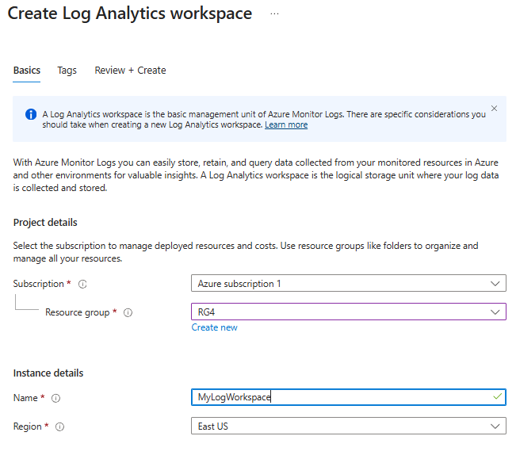

> **Tip:** Pick a region close to where most of your resources (VMs, other services) will live — cross-region ingestion works but adds latency and, for some sources, may cross data-residency boundaries (see the note in Task 10).

---

### Task 2 — Add Microsoft Sentinel to the Workspace

**What it is:** Sentinel isn't a separate storage system — it's "attached" to an existing Log Analytics workspace, which becomes its data lake.

**Steps:**
1. Search for **Microsoft Sentinel** in the portal → **+ Create**.
2. On the **Add Microsoft Sentinel to a workspace** screen, select the workspace created in Task 1 (`MyLogWorkspace`, `eastus`, `rg4`).
3. Click **Add**. Microsoft Sentinel offers a 31-day free trial on new workspaces.

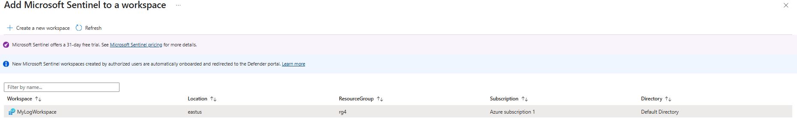

> **Note:** New Sentinel workspaces created by authorized users are automatically onboarded and redirected to the unified **Defender portal**. That's expected — you can still manage the same workspace from either the Azure portal or the Defender portal.

---

### Task 3 — Review Sentinel Data Connectors

**What it is:** The **Data connectors** blade is the control plane for every log source feeding Sentinel. It shows connector health, last log received, and available data types.

**Steps:**
1. Open **Microsoft Sentinel → MyLogWorkspace → Data connectors**.
2. Confirm the workspace shows 7 connectors already listed and connected out of the box (tenant-level Defender/Entra connectors: Insider Risk Management, Defender for Cloud Apps, Defender for Endpoint, Defender for Identity, Defender for Office 365, Defender XDR, Entra ID Protection).

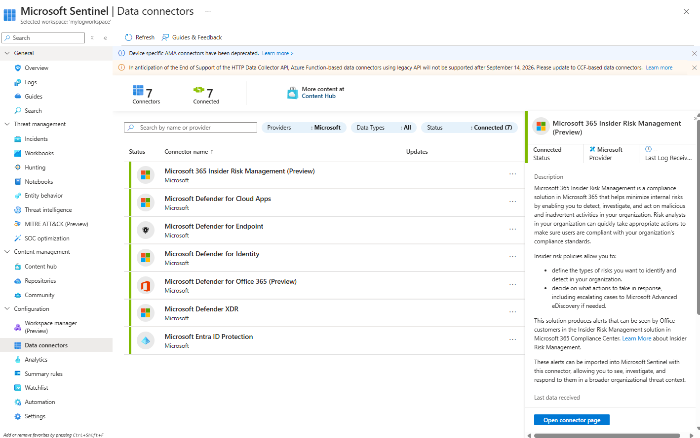

> **Note:** A banner in this view also flags that **legacy Azure Function–based connectors using the HTTP Data Collector API** will stop being supported after **September 14, 2026** — a good reminder to migrate any custom/legacy connectors to the newer **Codeless Connector Framework (CCF)** before that date.

---

### Task 4 — Create the Ubuntu VM

**What it is:** `VM02` acts as the on-prem/Linux stand-in that will forward CEF and Syslog data into Sentinel — this simulates a real network device or Linux host sending security logs.

**Steps:**
1. **Create a virtual machine** → **Basics**: Resource group `RG1`, name `VM02`, region East US, image Ubuntu (latest LTS), size `Standard D2as v7`.
2. **Availability options:** Availability zone → zone 1 (self-selected).
3. On the **Networking** tab, allow inbound **SSH (port 22)** — acceptable for a lab, **not** recommended for production (Azure explicitly flags this with a warning).
4. **Review + create** → confirm validation passed → **Create**.

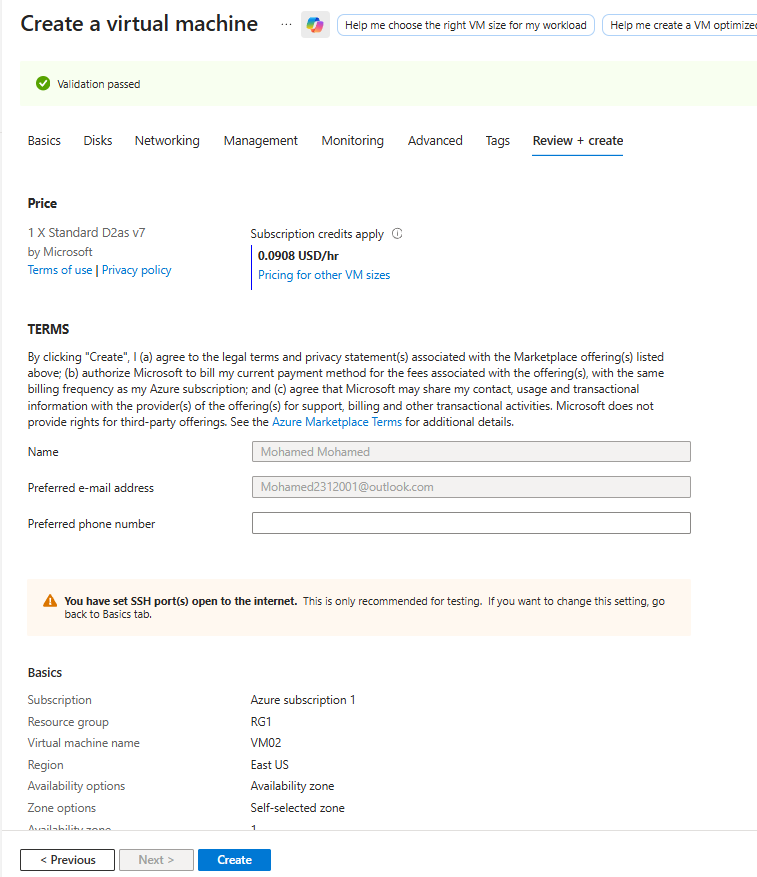

> **Security note:** The portal warns *"You have set SSH port(s) open to the internet. This is only recommended for testing."* In a real deployment, use **Azure Bastion**, a VPN, or restrict the NSG rule to your own IP instead of `0.0.0.0/0`.

---

### Task 5 — Connect CEF Logs to Sentinel

**What it is:** CEF (Common Event Format) is a standardized log format used by many security appliances (firewalls, IDS/IPS). Sentinel ingests CEF via the Azure Monitor Agent and a Data Collection Rule (DCR).

**Steps:**
1. In **Data connectors**, open the **Common Event Format (CEF) via AMA** connector.
2. Click **+ Create data collection rule**.
3. **Basic:** name it `VM02-CEF`, subscription = Azure subscription 1, resource group = `RG4`.
4. **Resources:** select `VM02` (type `microsoft.compute/virtualmachines`).
5. **Collect:** choose **Linux syslog** as the event source (CEF rides on top of the syslog transport).
6. **Review + create** → confirm **Validation passed** → **Create**.

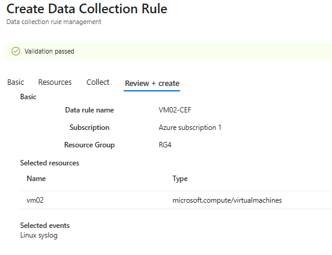

This DCR tells the Azure Monitor Agent on `VM02` to watch local syslog facilities and forward matching (CEF-formatted) messages to the `CommonSecurityLog` table.

---

### Task 6 — Verify the Connection (and Fix the Errors)

**What it is:** After creating the DCR, the VM itself needs the **AMA** and a properly configured **rsyslog** daemon to actually ship logs. This step SSHs into `VM02` to confirm both are healthy — and documents two real issues hit along the way.

**Steps & issues encountered:**

1. Downloaded the official Syslog/CEF forwarder helper script:
   ```bash
   sudo wget -O Forwarder_AMA_installer.py \
     https://raw.githubusercontent.com/Azure/Azure-Sentinel/master/DataConnectors/Syslog/Forwarder_AMA_installer.py
   ```
2. Attempted to run it with `sudo python Forwarder_AMA_installer.py` → **got `sudo: python: command not found`**.

   **Cause:** Ubuntu 22.04+ ships only with `python3`, not the legacy `python` alias.

   **Fix:** Re-run using the correct interpreter:
   ```bash
   sudo python3 Forwarder_AMA_installer.py
   ```
   (or create a symlink: `sudo ln -s /usr/bin/python3 /usr/bin/python`).

3. Checked the AMA service status:
   ```bash
   sudo systemctl status azuremonitoragent.service
   ```
   Result: **active (running)** ✅ — confirms the agent daemon (`mdsd`) is up and its config (`azuremonitoragent.xml`) loaded correctly.

4. Checked rsyslog:
   ```bash
   sudo systemctl status rsyslog.service
   ```
   Result: **active (running)**, but with warnings in the log:
   ```
   rsyslogd: cannot create '/run/systemd/journal/syslog': Address already in use
   rsyslogd: imuxsock does not run because we could not acquire any socket
   ```

   **Cause:** Another process (in this case `systemd-journald`, which also listens on `/run/systemd/journal/syslog`) was already bound to the socket rsyslog's `imuxsock` module wanted to use — a common conflict on modern Ubuntu where journald owns the local syslog socket by default.

   **Fix / solution applied:** This is a known, generally *harmless* warning as long as rsyslog is still active and the AMA's own listener (used for CEF/Syslog forwarding to Sentinel) is bound correctly — rsyslog doesn't need `imuxsock` for forwarding messages it receives directly. To fully silence it if desired:
   - Disable the conflicting module in `/etc/rsyslog.conf` (comment out `module(load="imuxsock")`), **or**
   - Configure `journald` to not forward to syslog (`ForwardToSyslog=no` in `/etc/systemd/journald.conf`) if journald is the one holding the socket, then restart both services:
     ```bash
     sudo systemctl restart systemd-journald rsyslog
     ```
   Since both services reported **active (running)** and log data was later confirmed in Sentinel (Task 12), this warning was not blocking ingestion for this lab and was left as an observed/documented issue rather than a hard failure.

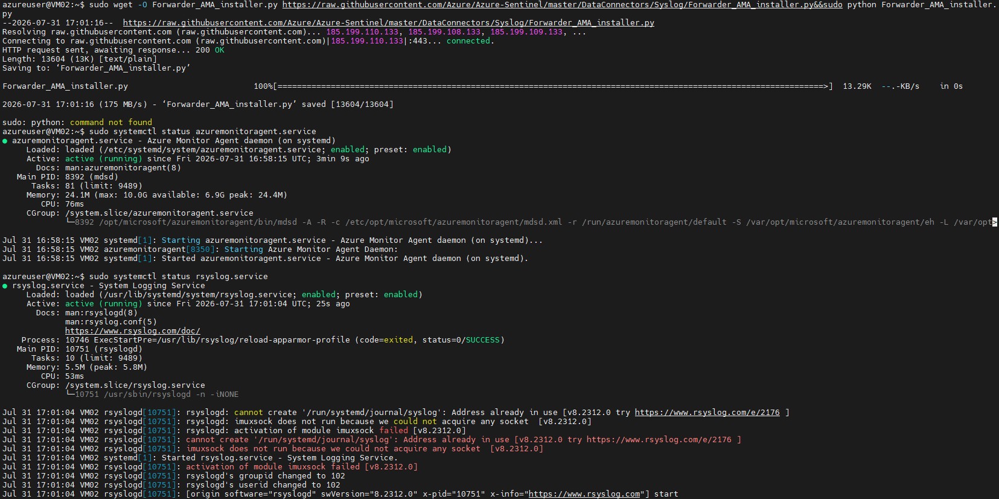

---

### Task 7 — Connect Syslog to VM02

**What it is:** Separate from CEF, plain **Syslog** is collected into its own `Syslog` table — useful for general OS/system-level events (auth attempts, cron, kernel messages) rather than security-appliance-formatted CEF events.

**Steps:**
1. In **Data connectors**, open **Syslog via AMA**.
2. **+ Create data collection rule** → name `VM02-syslog`, resource group `RG4`.
3. **Resources:** select `VM02`.
4. **Collect:** **Linux syslog**, choosing the facilities/severities you want (e.g., `auth`, `daemon`, `kern` at `info` and above).
5. **Review + create** → **Create**.

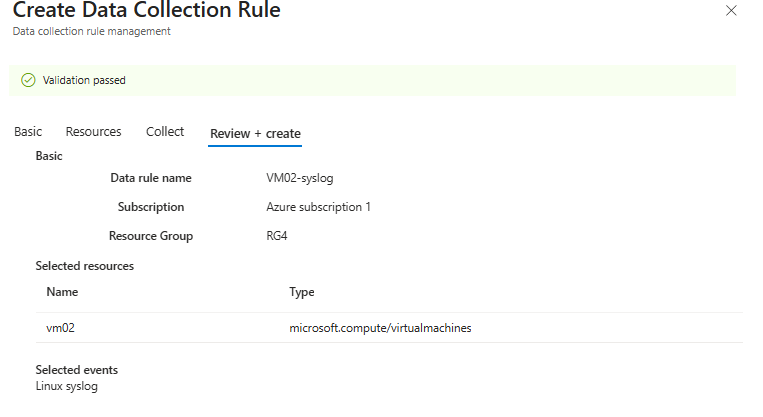

> Running CEF and Syslog as **two separate DCRs** targeting the same VM is intentional — it keeps CEF-formatted security events routed to `CommonSecurityLog` while general syslog noise lands in `Syslog`, so KQL queries and analytics rules can target the right table.

---

### Task 8 — Configure Microsoft Entra ID Logs

**What it is:** Brings Microsoft Entra ID's identity telemetry (sign-ins, audit trail, risk signals) directly into Sentinel — critical for detecting credential attacks, impossible travel, risky sign-ins, and privilege changes.

**Steps:**
1. Open the **Microsoft Entra ID** connector in Data connectors.
2. Confirm prerequisites (green checks): workspace read/write, diagnostic settings read/write, and Global/Security Administrator tenant permissions.
3. Under **Configuration**, check the log types to collect. For full coverage this lab enabled:
   - Sign-In Logs *(requires Entra ID P1/P2 for export)*
   - Audit Logs
   - Non-Interactive User Sign-In Logs
   - Service Principal Sign-In Logs
   - Managed Identity Sign-In Logs
   - Provisioning Logs
   - ADFS Sign-In Logs
   - User Risk Events / Risky Users
   - Network Access Traffic Logs
   - Risky Service Principals / Service Principal Risk Events
   - Microsoft Graph Activity Logs
   - Enriched Office 365 Audit Logs
   - Remote Network Health Logs
4. Click **Apply Changes**.

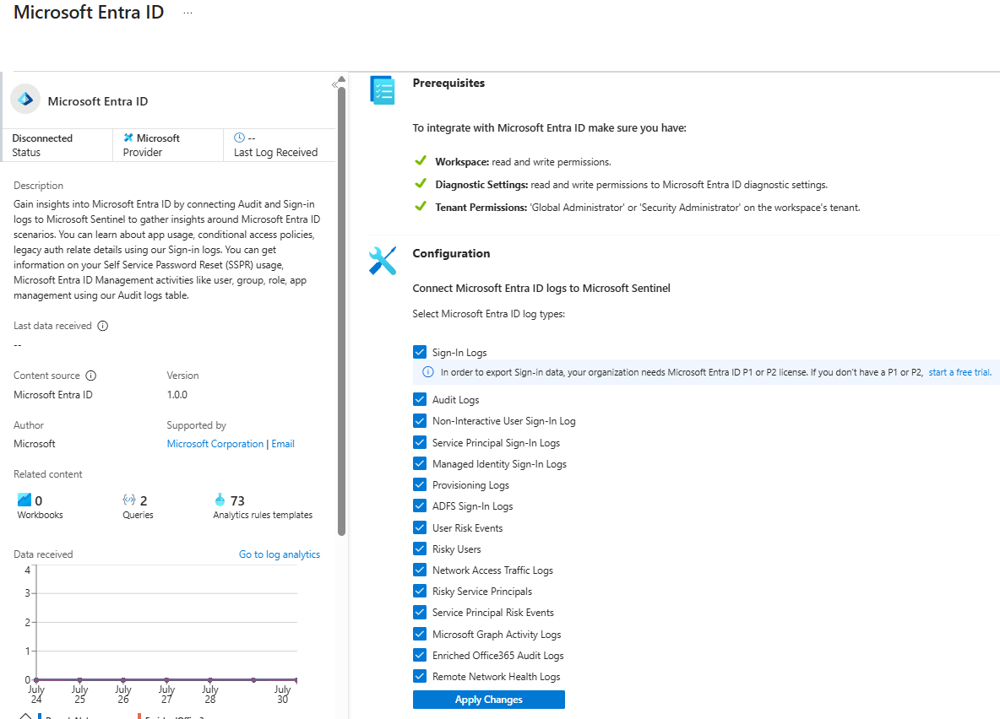

> **Solution note:** If **Sign-In Logs** stays greyed out or data never arrives, the most common cause is a missing **Entra ID P1/P2** license on the tenant — the portal flags this directly with a link to start a free trial. Everything else (Audit Logs, Risk Events, etc.) does **not** require a premium license.

---

### Task 9 — Connect Microsoft Defender XDR

**What it is:** Defender XDR unifies endpoint (Defender for Endpoint), identity (Defender for Identity), and email (Defender for Office 365) signals. Connecting it streams raw event tables (e.g., process creation, network connections) directly into the workspace for custom KQL hunting, beyond the built-in Defender alerts.

**Steps:**
1. Open the **Microsoft Defender XDR** connector.
2. Under the main event categories, select the tables to stream — this lab enabled:
   - `DeviceProcessEvents` — process creation and related events
   - `DeviceNetworkEvents` — network connection events
3. Expand **Microsoft Defender for Office 365 (1/5 connected)** and enable `EmailEvents` — email delivery/blocking telemetry.
4. Leave the remaining tables (`DeviceFileEvents`, `DeviceRegistryEvents`, `DeviceLogonEvents`, etc.) unchecked to control ingestion cost, or enable them for broader hunting coverage.

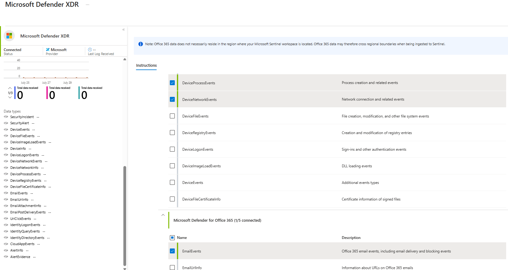

> **Cost tip:** Every additional `Device*Events` table increases ingestion volume (and billing) substantially — `DeviceProcessEvents` and `DeviceNetworkEvents` alone are usually the highest-volume tables. Enable only what your analytics rules/hunting queries actually need.

---

### Task 10 — Connect Microsoft 365

**What it is:** Streams **Exchange**, **SharePoint**, and **Teams** activity logs (file access, mailbox changes, sharing events, etc.) into the `OfficeActivity` table.

**Steps:**
1. Open the **Microsoft 365 (formerly, Office 365)** connector.
2. Confirm workspace read/write and Global/Security Administrator tenant permissions.
3. Check the three record types: **Exchange**, **SharePoint**, **Teams**.
4. Click **Apply Changes**.
5. Under **Previously connected tenants**, confirm the tenant is listed (single-tenant connection model).

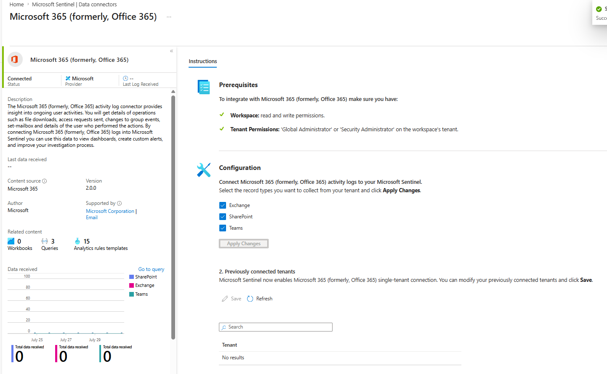

> **Note shown in-portal:** *Office 365 data does not necessarily reside in the region where your Sentinel workspace is located* — M365 data may cross regional boundaries during ingestion. Factor this into any data-residency/compliance requirements before enabling in a production tenant.

---

### Task 11 — Connect Windows Security Events

**What it is:** Streams Windows Security Event Log entries (logons, privilege use, process creation if auditing is enabled, etc.) from `VM01` into the `SecurityEvent` table — the Windows counterpart to the Linux Syslog/CEF pipeline built in Tasks 5–7.

**Steps:**
1. Open **Windows Security Events via AMA**.
2. Click **+ Create data collection rule**.
3. **Basic:** name `VM01-swe`, resource group `RG1`.
4. **Resources:** select `VM01` (`microsoft.compute/virtualmachines`).
5. **Collect:** choose the event set — this lab selected **AllEvents** (full security log; alternatives include "Common" or "Minimal" event sets for lower volume).
6. **Review + create** → confirm **Validation passed** → **Create**.

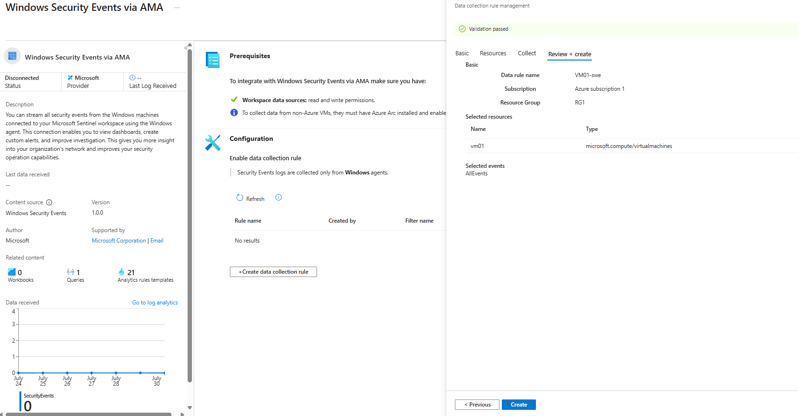

> **Note:** For non-Azure or hybrid VMs, this connector requires **Azure Arc** to be installed and enabled first, since AMA depends on the Arc-managed extension framework outside of native Azure VMs.

---

### Task 12 — Verify Log Ingestion with KQL

**What it is:** The final proof step — a single KQL query that fans out across *every* table in the workspace and reports which ones have received data recently.

**Query used:**
```kql
union withsource=MySourceTable *
| where TimeGenerated > ago(7d)
| summarize
    TotalLogs = count(),
    LastReceived = max(TimeGenerated)
    by MySourceTable
| order by TotalLogs desc
```

**How it works:**
- `union withsource=MySourceTable *` — queries **all** tables in the workspace at once, tagging each result row with the table it came from (aliased as `MySourceTable`).
- `where TimeGenerated > ago(7d)` — restricts to the last 7 days, keeping the scan relevant and fast.
- `summarize TotalLogs = count(), LastReceived = max(TimeGenerated) by MySourceTable` — counts rows and finds the most recent event, grouped per table.
- `order by TotalLogs desc` — surfaces the busiest tables first.

**Results observed:**

| Source Table | Total Logs | Last Received (UTC) |
|---|---|---|
| Heartbeat | 137 | 7/31/2026 5:48:55 PM |
| AADNonInteractiveUserSignInLogs | 96 | 7/31/2026 5:45:24 PM |
| SecurityEvent | 48 | 7/31/2026 5:45:03 PM |
| Usage | 4 | 7/31/2026 5:00:00 PM |
| AuditLogs | 2 | 7/31/2026 5:31:53 PM |
| CommonSecurityLog | 1 | 7/31/2026 4:52:21 PM |
| AADManagedIdentitySignInLogs | 1 | 7/31/2026 5:29:36 PM |
| Operation | 1 | 7/31/2026 4:41:24 PM |

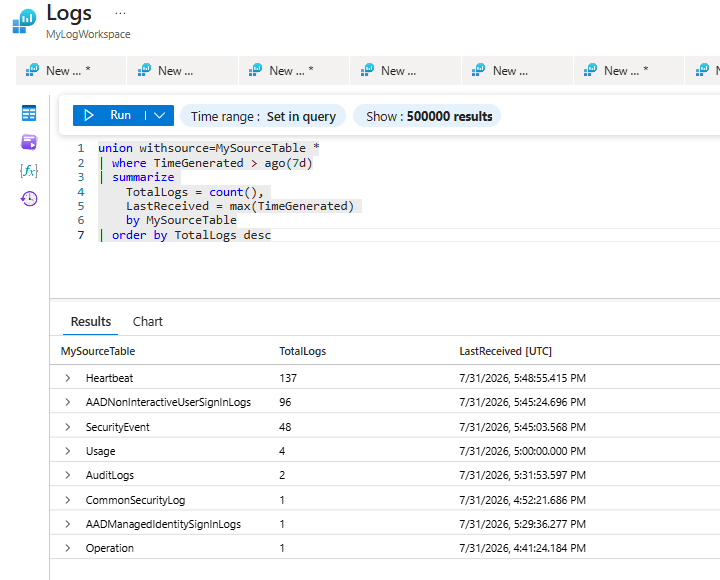

**Interpretation:**
- `Heartbeat` confirms the AMA agents on `VM01`/`VM02` are alive and checking in.
- `SecurityEvent` confirms the Windows connector (Task 11) is delivering data.
- `AADNonInteractiveUserSignInLogs` / `AuditLogs` / `AADManagedIdentitySignInLogs` confirm the Entra ID connector (Task 8) is working.
- `CommonSecurityLog` confirms the CEF pipeline (Tasks 5–6) is functioning, even with only one event so far — expected in a fresh lab with light traffic.
- No rows yet for `Syslog`, `OfficeActivity`, or `DeviceProcessEvents`/`EmailEvents` at query time simply reflects that those sources hadn't generated/ingested events within the 7-day window yet — not a failure. Re-running the query after generating relevant activity (e.g., a Teams message, a file signed in from a new device) would populate those tables.

---

## Troubleshooting Log

| Issue | Root Cause | Solution |
|---|---|---|
| `sudo: python: command not found` when running the AMA/Syslog installer | Ubuntu 22.04+ only ships `python3` by default | Run with `python3` explicitly, or symlink `python` → `python3` |
| `rsyslogd: cannot create '/run/systemd/journal/syslog': Address already in use` | `systemd-journald` already holds the syslog socket that rsyslog's `imuxsock` module tries to bind | Confirm both services still show `active (running)`; optionally disable `imuxsock` in `rsyslog.conf` or set `ForwardToSyslog=no` in `journald.conf` and restart both services |
| Sign-In Logs greyed out / no data in Entra ID connector | Tenant lacks Entra ID P1/P2 license | Enable a P1/P2 trial, or accept that Sign-In Logs export is unavailable on a free tier |
| SSH left open to `0.0.0.0/0` on VM02 | Default lab convenience setting flagged by the portal | Replace with Azure Bastion, a VPN, or an NSG rule scoped to a specific source IP before using outside a lab |
| Some tables empty in the Task 12 query | No qualifying events generated yet within the 7-day window for that source (e.g., Syslog, OfficeActivity) | Generate representative activity for that source, then re-run the query |

## Key Takeaways

- Sentinel is not a standalone product — it's Log Analytics + a security-focused UI/rules engine layered on top, so workspace design decisions (region, resource group, retention) matter from day one.
- AMA-based connectors (CEF, Syslog, Windows Security Events) all follow the same pattern: **connector → Data Collection Rule → target resource → event/facility selection**.
- Cloud-native connectors (Entra ID, Defender XDR, Microsoft 365) are permission-gated by tenant role (Global/Security Administrator) rather than DCRs.
- Service-level warnings (like the rsyslog/journald socket conflict) don't always mean data isn't flowing — always confirm with an actual query against the workspace, as done in Task 12, rather than trusting service status alone.
- Enabling every available table (especially under Defender XDR) has real cost implications; scope ingestion to what supports your detections.

## Repo Structure

```
.
├── README.md
├── task1-create-log-analytics-workspace.png
├── task2-add-sentinel-to-log-workspace.png
├── task3-sentinel-data-connectors.png
├── task4-create-ubuntu-vm.png
├── task5-connect-CEF-to-sentinel.png
├── task6-verify-connection.png
├── task7-connect-syslog-to-vm02.png
├── task8-configure-entra-id-logs.png
├── task9-connect-xdr.png
├── task10-connect-microsoft-365.png
├── task11-connect-windows-security-events.png
└── task12-sentinel-logs.png
```

All images referenced above are expected to sit **in the same directory as this README** — clone/download the repo as-is and the relative links (`./task1-....png`, etc.) will resolve correctly on GitHub or any Markdown viewer.
