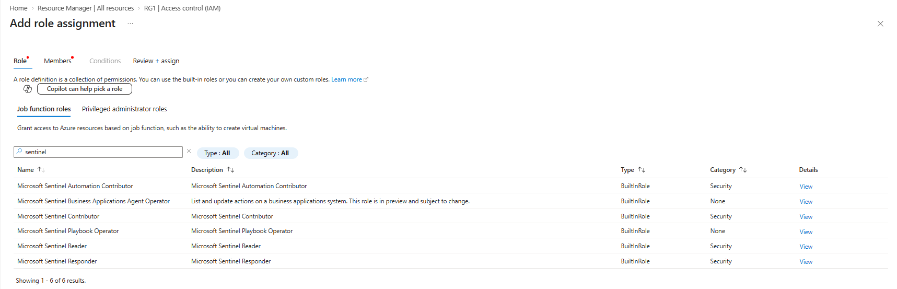
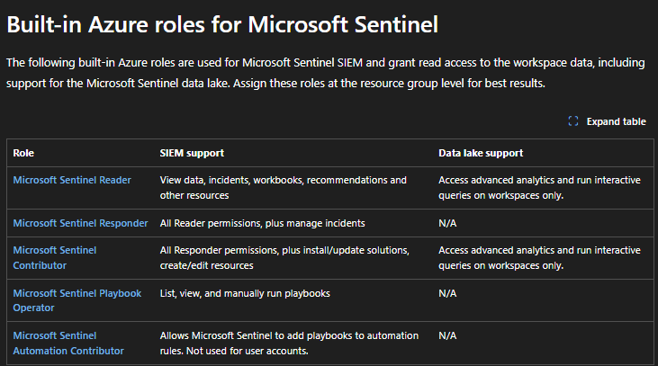
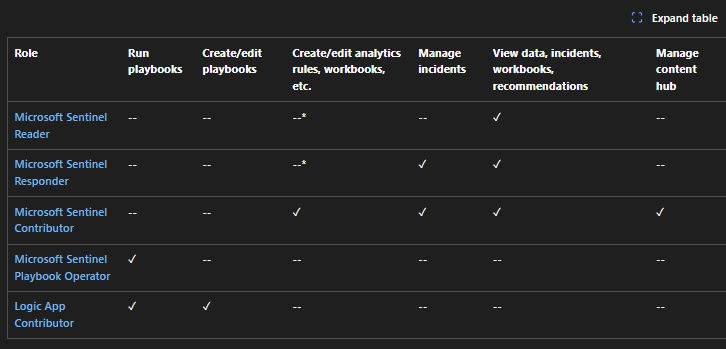
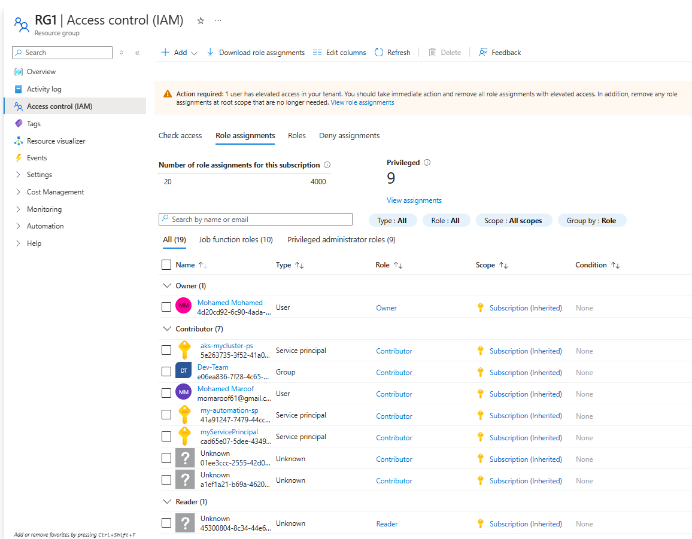
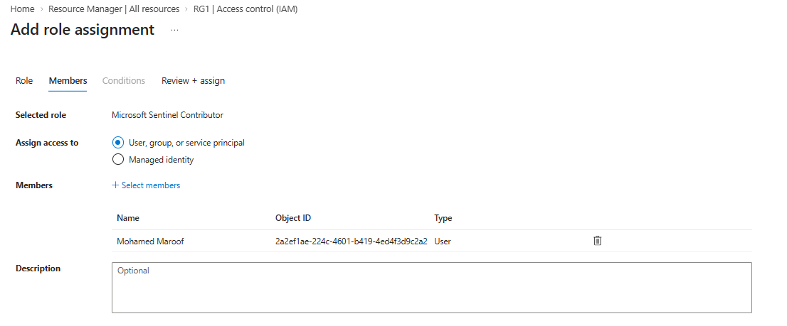

# Topic 23: Microsoft Sentinel RBAC Roles

> This picks up the RBAC thread from Topics 13 (Defender custom roles vs. Entra ID roles) and 17 (device group scoping) and applies it specifically to **Microsoft Sentinel**. Sentinel uses **native Azure RBAC** — role assignments at the resource group or subscription level — rather than its own separate permission system. This topic covers the five built-in Sentinel roles, exactly what each one can/can't do, and how to actually assign one.

---

## 1. Where Sentinel Roles Live — Azure RBAC, Not a Separate System

Path: **Azure Portal → Resource group (e.g., RG1) → Access control (IAM) → Add → Add role assignment**

> *"A role definition is a collection of permissions. You can use the built-in roles or you can create your own custom roles."*

Filtering the **Job function roles** list by `sentinel` surfaces exactly six built-in roles:

| Name | Description | Type | Category |
|---|---|---|---|
| Microsoft Sentinel Automation Contributor | Microsoft Sentinel Automation Contributor | BuiltInRole | Security |
| Microsoft Sentinel Business Applications Agent Operator | *List and update actions on a business applications system. This role is in preview and subject to change.* | BuiltInRole | None |
| Microsoft Sentinel Contributor | Microsoft Sentinel Contributor | BuiltInRole | Security |
| Microsoft Sentinel Playbook Operator | Microsoft Sentinel Playbook Operator | BuiltInRole | None |
| Microsoft Sentinel Reader | Microsoft Sentinel Reader | BuiltInRole | Security |
| Microsoft Sentinel Responder | Microsoft Sentinel Responder | BuiltInRole | Security |

⚠️ **Key architectural point:** unlike Defender's own custom roles (Topic 13), Sentinel roles are assigned through the **exact same Azure RBAC mechanism** used for VM access (Topic 9) and resource group permissions in general. This means a Sentinel role assignment shows up in the *same* Access control (IAM) blade as every other Azure role — there's no separate "Sentinel permissions" page to configure.

**A "Copilot can help pick a role" button** is also visible — a newer AI-assisted role-selection aid, useful when you're unsure which built-in role fits a described job function.

---

## 2. The Five Practical Roles — SIEM & Data Lake Support

> *"The following built-in Azure roles are used for Microsoft Sentinel SIEM and grant read access to the workspace data, including support for the Microsoft Sentinel data lake. **Assign these roles at the resource group level for best results.**"*

| Role | SIEM support | Data lake support |
|---|---|---|
| **Microsoft Sentinel Reader** | View data, incidents, workbooks, recommendations and other resources | Access advanced analytics and run interactive queries on workspaces only |
| **Microsoft Sentinel Responder** | All Reader permissions, **plus manage incidents** | N/A |
| **Microsoft Sentinel Contributor** | All Responder permissions, **plus install/update solutions, create/edit resources** | Access advanced analytics and run interactive queries on workspaces only |
| **Microsoft Sentinel Playbook Operator** | List, view, and manually run playbooks | N/A |
| **Microsoft Sentinel Automation Contributor** | Allows Microsoft Sentinel to add playbooks to automation rules. **Not used for user accounts.** | N/A |

⚠️ **Important note buried in that last row:** **Automation Contributor is not meant to be assigned to actual human users** — it's a role Sentinel itself uses (typically via a managed identity) to attach playbooks to automation rules programmatically. Assigning it to a person doesn't make sense functionally; this is a role for the automation *system*, not the SOC analyst.

⚠️ **The recommendation to assign at the resource group level** (not subscription-wide, not on the individual Log Analytics workspace alone) is itself a testable best practice — it scopes Sentinel access tightly to the specific resource group containing the workspace, avoiding the broader blast radius of a subscription-level assignment while still covering everything the role needs within that group.

---

## 3. The Detailed Permission Matrix

This table breaks the five roles down against six specific capabilities:

| Role | Run playbooks | Create/edit playbooks | Create/edit analytics rules, workbooks, etc. | Manage incidents | View data, incidents, workbooks, recommendations | Manage content hub |
|---|---|---|---|---|---|---|
| **Microsoft Sentinel Reader** | -- | -- | --* | -- | ✓ | -- |
| **Microsoft Sentinel Responder** | -- | -- | --* | ✓ | ✓ | -- |
| **Microsoft Sentinel Contributor** | -- | -- | ✓ | ✓ | ✓ | ✓ |
| **Microsoft Sentinel Playbook Operator** | ✓ | -- | -- | -- | -- | -- |
| **Logic App Contributor** | ✓ | ✓ | -- | -- | -- | -- |

⚠️ **Notice the asterisk (`--*`) on Reader and Responder under "Create/edit analytics rules, workbooks, etc."** — this indicates a **conditional/partial exception** rather than a flat "no" (Microsoft's documentation typically clarifies these asterisked cells with a footnote — worth checking the linked docs for the exact nuance if you encounter this in practice, since it's not simply "cannot do this at all").

**Two genuinely important gaps to internalize:**

1. **Not even Sentinel Contributor can "Run playbooks."** Only **Sentinel Playbook Operator** and **Logic App Contributor** have that checkmark. This means a Contributor-level admin who can create/edit analytics rules and manage incidents still **cannot manually trigger a playbook** without also holding Playbook Operator (or Logic App Contributor). This is a genuine least-privilege design: managing detection/incident logic and manually executing automation are treated as separate permissions.

2. **"Logic App Contributor" isn't a Sentinel-specific role at all** — it's a general Azure Logic Apps role, included in this table because playbooks are literally built on Logic Apps (Topic 21, Section 7). It's the *only* role here that can both **run and create/edit playbooks**, but it grants no Sentinel-specific incident/analytics visibility whatsoever.

**Why this matters for SC-200:** a scenario like "an analyst needs to manually re-run a playbook against an incident but should not be able to modify analytics rules" points specifically to **Sentinel Playbook Operator** — not Contributor, not Responder. Matching a described job function to the *exact* minimum role (rather than reflexively assigning Contributor) is the tested skill, echoing Topic 13's least-privilege principle applied here to Sentinel specifically.

---

## 4. Viewing Existing Role Assignments on the Resource Group

Path: **RG1 → Access control (IAM) → Role assignments**

🚩 **Warning banner at the top:** *"Action required: 1 user has elevated access in your tenant. You should take immediate action and remove all role assignments with elevated access. In addition, remove any role assignments at root scope that are no longer needed."*

This is a genuine, real security finding worth pausing on — **elevated access** typically refers to a user who's been granted **Global Administrator + "Access management for Azure resources"** simultaneously, giving them the ability to assign themselves *any* Azure RBAC role, including on resource groups they shouldn't normally touch. This is exactly the kind of privilege-escalation path a real security audit (and an exam scenario) would flag as something to remediate immediately, not leave in place.

### Current role assignments summary

| Metric | Value |
|---|---|
| Number of role assignments for this subscription | 20 (out of 4000 max) |
| **Privileged** | **9** |
| All (19) / Job function roles (10) / Privileged administrator roles (9) | *(tab breakdown)* |

### Assignment list (grouped by role)

| Group | Name | Type | Role | Scope |
|---|---|---|---|---|
| Owner (1) | Mohamed Mohamed | User | Owner | Subscription (Inherited) |
| Contributor (7) | aks-mycluster-ps | Service principal | Contributor | Subscription (Inherited) |
| | Dev-Team | Group | Contributor | Subscription (Inherited) |
| | Mohamed Maroof | User | Contributor | Subscription (Inherited) |
| | my-automation-sp | Service principal | Contributor | Subscription (Inherited) |
| | myServicePrincipal | Service principal | Contributor | Subscription (Inherited) |
| | Unknown (x2) | Unknown | Contributor | Subscription (Inherited) |
| Reader (1) | Unknown | Unknown | Reader | Subscription (Inherited) |

⚠️ **Two "Unknown" identities holding Contributor, and one holding Reader, is itself worth flagging.** An "Unknown" type typically means the underlying Entra ID object (a user or service principal) has since been **deleted**, but the role assignment referencing it was never cleaned up — an orphaned permission. This is exactly the kind of access-review finding a SOC/governance process should catch and remove, since it represents a stale, unaccountable grant of access tied to an identity that no longer exists.

**Also notice:** every assignment shown here has **Scope: Subscription (Inherited)** — meaning these are broad, subscription-wide grants, not scoped down to just this resource group. This directly contradicts Section 2's best-practice recommendation to assign Sentinel roles *at the resource group level* — none of these existing assignments follow that guidance, they're all inherited from a much broader scope.

---

## 5. Assigning a Sentinel Role — Members Step

Continuing the **Add role assignment** wizard from Section 1, now on the **Members** tab:

| Field | Value |
|---|---|
| Selected role | **Microsoft Sentinel Contributor** |
| Assign access to | **User, group, or service principal** *(selected)* — vs. Managed identity *(alternative option)* |
| Members | Mohamed Maroof — Object ID `2a2ef1ae-224c-4601-b419-4ed4f3d9c2a2` — Type: User |
| Description | *(optional, left blank)* |

**The "Assign access to" choice matters:** picking **User, group, or service principal** is for assigning a role to a *person* or an app registration acting on their behalf. Picking **Managed identity** instead would be for assigning the role to an Azure-managed identity — exactly the mechanism referenced in Section 2 for how **Automation Contributor** actually gets used (a Sentinel-managed identity, not a human account).

---

## Full Topic Recap

1. Sentinel roles are plain **Azure RBAC roles**, assigned via the standard **Access control (IAM)** blade — no separate Sentinel-specific permission system
2. Five practical roles exist: **Reader, Responder, Contributor, Playbook Operator, Automation Contributor** — each with a specific SIEM/data lake capability level
3. **Automation Contributor** is designed for Sentinel's own managed identity use, not for human accounts
4. The detailed permission matrix reveals that **running a playbook is a separate permission** from managing incidents or editing analytics rules — even Contributor lacks it
5. **Assign roles at the resource group level** for tightest, most appropriate scoping — but real-world tenants often drift from this (Section 4's example shows everything inherited from subscription scope instead)
6. Watch for **elevated access warnings** and **orphaned "Unknown" identity assignments** during any access review — both are real governance red flags, not just cosmetic portal noise

---

## Key Terms to Know

- **Azure RBAC** — the native Azure role-based access control system Sentinel roles are built on, distinct from Defender's own custom roles (Topic 13)
- **Microsoft Sentinel Reader / Responder / Contributor / Playbook Operator / Automation Contributor** — the five built-in Sentinel roles
- **Logic App Contributor** — a general (non-Sentinel-specific) Azure role needed to create/edit and run playbooks
- **Elevated access** — a privileged combination (e.g., Global Admin + Azure resource access management) enabling broad, often unintended, self-escalation
- **Scope: Subscription (Inherited)** — indicates a role assignment made at a broader level than the resource group being viewed, inherited downward
- **Managed identity** — an Azure-managed credential used by services (like Sentinel automation) instead of a human user account

---

## Quick Self-Check

- [ ] Can you name all five built-in Sentinel roles and the one capability that distinguishes each from the next tier down?
- [ ] Do you understand why Automation Contributor is "not used for user accounts"?
- [ ] Can you explain why even Sentinel Contributor cannot run a playbook, and which two roles can?
- [ ] Do you know why Microsoft recommends assigning Sentinel roles at the resource group level rather than subscription-wide?
- [ ] Can you explain what an "elevated access" warning and an "Unknown" identity role assignment each represent as security findings?

---

*Keep `add-role-assignments.png`, `sentinel-built-in-roles.png`, `sentinel-built-in-roles-2.png`, `sentinel-resource-group-role-assignments.png`, and `sentinel-resource-group-role-assignments-1.png` in this same folder as this README so the image links resolve correctly on GitHub.*
