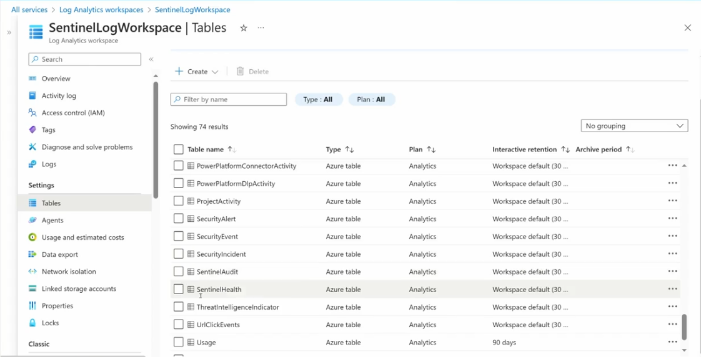
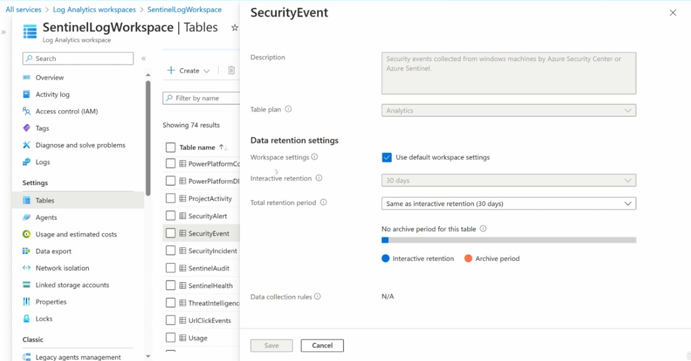
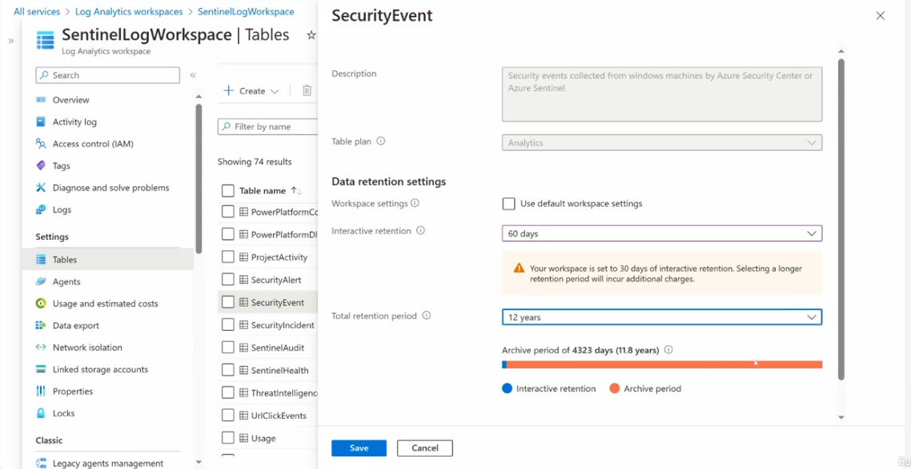

# Topic 24: Log Retention & Archive Tiers in the Sentinel Workspace

> This topic answers a question left open since Topic 21 (8.2M events/week flowing in) and Topic 19 (ingestion cost concerns): **how long does Sentinel actually keep all that data, and what does it cost?** The Log Analytics workspace underlying Sentinel lets you tune retention *per table*, splitting it into a fast/expensive "interactive" tier and a cheap/slow "archive" tier — this topic covers exactly how that split works.

---

## 1. The Tables View — Where Retention Is Configured

Path: **Log Analytics workspaces → SentinelLogWorkspace → Settings → Tables**

This workspace has **74 tables** — each one corresponds to a distinct data type ingested (recall Topic 19's data source categories, and Topic 22's ASIM normalized schemas — many of these tables are exactly what gets normalized). Visible tables include:

| Table name | Type | Plan | Interactive retention | Archive period |
|---|---|---|---|---|
| PowerPlatformConnectorActivity | Azure table | Analytics | Workspace default (30...) | -- |
| PowerPlatformDlpActivity | Azure table | Analytics | Workspace default (30...) | -- |
| ProjectActivity | Azure table | Analytics | Workspace default (30...) | -- |
| **SecurityAlert** | Azure table | Analytics | Workspace default (30...) | -- |
| **SecurityEvent** | Azure table | Analytics | Workspace default (30...) | -- |
| **SecurityIncident** | Azure table | Analytics | Workspace default (30...) | -- |
| **SentinelAudit** | Azure table | Analytics | Workspace default (30...) | -- |
| **SentinelHealth** | Azure table | Analytics | Workspace default (30...) | -- |
| ThreatIntelligenceIndicator | Azure table | Analytics | Workspace default (30...) | -- |
| UrlClickEvents | Azure table | Analytics | Workspace default (30...) | -- |
| **Usage** | Azure table | Analytics | **90 days** *(overridden — not workspace default)* | -- |

⚠️ **Notice almost every table shows "Workspace default (30...)"** except **Usage**, which has its own explicit **90 days** setting. This confirms the core mechanism this topic is about: **retention can be configured per-table**, overriding the workspace-wide default when a specific table warrants longer (or shorter) retention.

**Why per-table retention matters:** not all data is equally valuable to keep long-term. `SecurityIncident` and `SecurityAlert` (your actual investigated incidents) might justify years of retention for compliance/historical investigation purposes, while a high-volume, low-forensic-value table might be fine at the 30-day default — tuning this per table is how you control cost without blanket-cutting retention everywhere.

---

## 2. Table Detail — Workspace Default Settings (SecurityEvent, unmodified)

Clicking into the **SecurityEvent** table (before any customization):

| Field | Value |
|---|---|
| Description | *"Security events collected from windows machines by Azure Security Center or Azure Sentinel."* |
| Table plan | Analytics |
| **Use default workspace settings** | ✅ Checked |
| Interactive retention | 30 days *(greyed out — inherited from workspace default, not editable while the checkbox above is checked)* |
| Total retention period | Same as interactive retention (30 days) |
| Archive period | **"No archive period for this table"** |
| Data collection rules | N/A |

This is the **baseline, unmodified state** — the table simply inherits whatever the workspace-wide default is (30 days here), with **zero archive period**, meaning data older than 30 days is simply gone, not moved anywhere cheaper.

---

## 3. Table Detail — Customized Retention with Archive Tier (SecurityEvent, modified)

Same **SecurityEvent** table, now customized:

| Field | Value |
|---|---|
| Table plan | Analytics |
| **Use default workspace settings** | ☐ Unchecked *(now editable)* |
| **Interactive retention** | **60 days** |
| **Total retention period** | **12 years** |
| **Archive period** | **4323 days (11.8 years)** — calculated automatically as Total retention − Interactive retention |

⚠️ **Warning shown on screen:** *"Your workspace is set to 30 days of interactive retention. Selecting a longer retention period will incur additional charges."* — a direct, explicit cost warning tied to increasing interactive retention specifically.

**The visual bar** at the bottom splits the 12-year total retention into two colored segments:
- 🔵 **Interactive retention** — the first 60 days (small blue segment)
- 🟠 **Archive period** — the remaining ~11.8 years (large orange segment)

---

## 4. Interactive Retention vs. Archive Period — The Core Concept

This is the central concept of the whole topic, and it's a genuine cost/performance trade-off:

| | Interactive retention | Archive period |
|---|---|---|
| **Query speed** | Fast — full KQL query support, instantly queryable | Slow — requires a **search job** or **restore** operation before querying |
| **Cost** | Higher — full indexed, hot storage | Much lower — cold/archive storage pricing |
| **Use case** | Active investigation, recent incidents, day-to-day hunting | Compliance retention, rare historical lookups, long-term audit requirements |
| **Total retention period** | Interactive retention + Archive period = Total retention period | (combined figure) |

**Why this two-tier model exists:** most security investigation happens against **recent** data (the last 30–90 days) — that's what needs to be instantly, interactively queryable. But compliance requirements (e.g., "retain security logs for 7 years") often mandate keeping data far longer than anyone will realistically query on a daily basis. Paying full interactive-tier pricing for years of rarely-touched historical data would be wasteful — the **archive tier** solves this by storing that older data much more cheaply, at the cost of needing an explicit (and slower) retrieval step if you ever do need to look at it.

**How the math works:** Total retention period (12 years) = Interactive retention (60 days) + Archive period (4323 days ≈ 11.8 years). Changing either the interactive retention or the total retention period automatically recalculates the archive period to fill the gap.

---

## 5. Table Types & Plans — What's Actually Being Configured

From Section 1's table list, every visible table shows:

| Column | Meaning |
|---|---|
| **Type** | "Azure table" — a standard Log Analytics table type |
| **Plan** | "Analytics" — the table plan determines cost structure and query capability |

⚠️ **"Analytics" plan is not the only option** — Log Analytics/Sentinel also supports a **Basic logs** plan (and, per Topic 21's "data lake" references, newer **Auxiliary/data lake tier** options) for high-volume, lower-value tables where full analytics-grade indexing isn't needed. Choosing **Analytics** vs. a cheaper plan for a given table is itself a cost-management decision, parallel to the interactive/archive retention split covered here — a table's *plan* and its *retention settings* are two separate levers, both aimed at controlling the same underlying ingestion/storage cost problem from Topic 19.

---

## 6. Why This Matters for SC-200

- **"Manage a security operations environment"** (the largest exam domain) includes cost-aware workspace configuration — knowing that retention is tunable per-table, and that archived data isn't instantly queryable, is directly relevant to designing a sustainable, compliant Sentinel deployment.
- **Compliance scenarios** — a question describing a regulatory requirement ("retain security event logs for 7 years, but only need fast search on the last 90 days") is pointing directly at this exact interactive/archive split as the solution.
- **Investigation nuance** — if an analyst needs to investigate an incident from 2 years ago and the relevant table's interactive retention is only 60 days, they need to know a **search job/restore** is required first — you can't just run a normal KQL query against archived data the same way.

---

## Key Terms to Know

- **Log Analytics workspace** — the underlying data store for Sentinel (introduced conceptually in Topic 19)
- **Interactive retention** — the period during which data remains fully, instantly queryable via normal KQL
- **Archive period** — the (much cheaper) period after interactive retention during which data is retained but not instantly queryable
- **Total retention period** — Interactive retention + Archive period combined
- **Workspace default settings** — the baseline retention applied to any table that hasn't been individually customized
- **Table plan (Analytics / Basic / Auxiliary)** — determines a table's cost structure and query capability, independent of its retention settings
- **Search job / restore** — the operations required to query data that has moved into the archive tier

---

## Quick Self-Check

- [ ] Can you explain the difference between interactive retention and archive period, both in terms of cost and query speed?
- [ ] Do you understand how total retention period, interactive retention, and archive period relate mathematically?
- [ ] Can you explain why a table like `Usage` might have a different retention setting (90 days) than the rest of the workspace default (30 days)?
- [ ] Do you know what you'd need to do to query data that has already moved into the archive tier?
- [ ] Can you explain why compliance requirements often drive long total retention periods, while interactive retention is usually kept much shorter for cost reasons?

---

*Keep `sentinel-logs-tables.png`, `sentinel-retention-settings.png`, and `sentinel-archive-tier.png` in this same folder as this README so the image links resolve correctly on GitHub.*
