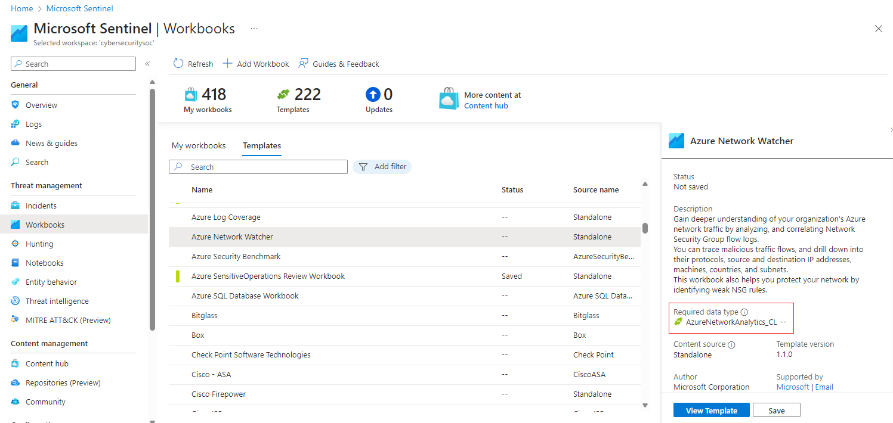
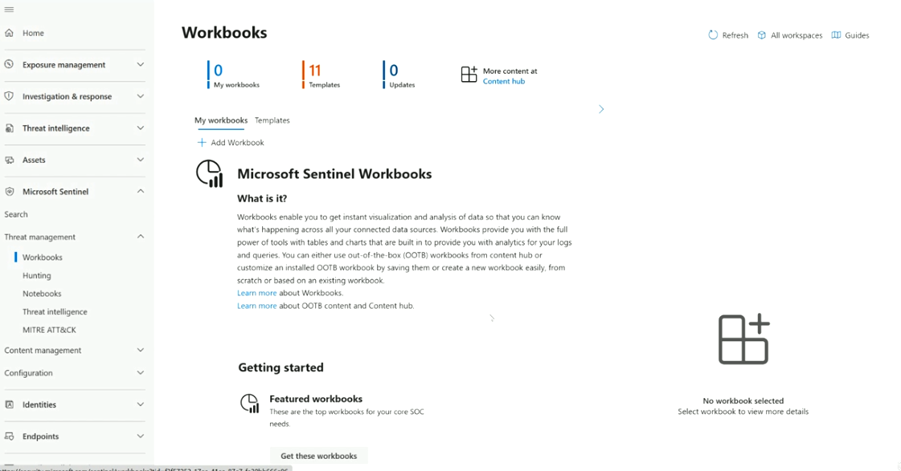
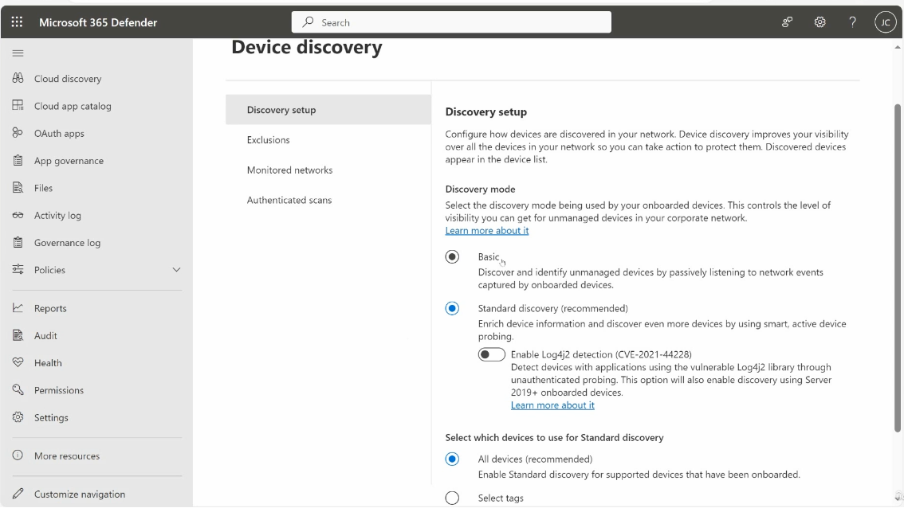
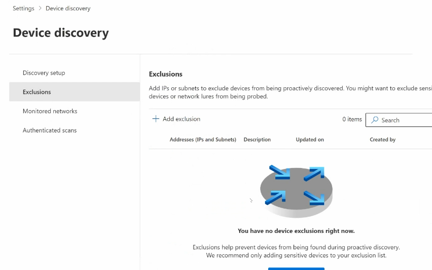

# Topic 23 — Microsoft Sentinel Workbooks & Device Discovery

Part of the **SC-200: Microsoft Security Operations Analyst** study series.
This topic covers two related SOC capabilities: visualizing data with **Microsoft Sentinel Workbooks**, and finding unmanaged endpoints with **Device Discovery** (Microsoft Defender for Endpoint / Defender for Cloud Apps).

---

## 1. Microsoft Sentinel Workbooks

### What are Workbooks?
Workbooks give you interactive dashboards on top of your ingested log data. They combine text, queries (KQL), charts, and tables so a SOC team can visualize trends, monitor data connector health, and track incident/response metrics — without building a BI tool from scratch.

- Built on the same framework as Azure Monitor Workbooks.
- Can be fully custom, or dropped in as **out-of-the-box (OOTB)** templates.
- Support parameters (time range, filters) so one workbook adapts to many scenarios.

### Where to find them
**Microsoft Sentinel → Threat management → Workbooks**, with two tabs:

| Tab | Purpose |
|---|---|
| **My workbooks** | Workbooks you've saved/instantiated into your workspace |
| **Templates** | OOTB templates shipped by Microsoft or solution vendors (from Content Hub) |

### Installing a template workbook
Templates are tied to a **data connector / solution**. Selecting a template shows:
- Description of what it visualizes
- **Required data type(s)** (e.g., `AzureNetworkAnalytics_CL`) — the workbook won't populate without this data flowing in
- Content source, author, version, support contact

Click **View Template** to preview it live, or **Save** to add it to *My workbooks* for editing/pinning.

Many templates ship as part of a **Content Hub solution** (bundles of analytics rules + workbooks + hunting queries + data connectors together), e.g. installing "Amazon Web Services" pulls in its workbooks automatically.

### Common/most-used templates (exam-relevant)

| Workbook Template | What it shows |
|---|---|
| **Security Operations Efficiency** | SOC team performance metrics — average response time, incident counts |
| **Identity & Access** | Sign-in analysis, MFA usage, failed logon attempts |
| **Microsoft Defender for Endpoint** | General overview of endpoint alerts |
| **Analytics Efficiency** | Which analytics rules need tuning / aren't firing usefully |
| **Data collection health monitoring** | Whether data connectors have gaps/outages in ingestion |

### Browsing available templates
The **Templates** tab lists everything installed/available by source connector — AWS, Azure Activity, CEF, Linux/Syslog, Defender for Endpoint, Defender for Identity, Defender for Office 365, Microsoft Entra ID, etc.

### Example: Microsoft Entra ID Audit Logs workbook
A practical OOTB workbook that visualizes Entra ID directory audit activity:

- **Filters**: time range, user, category, result
- **Categories volume**: breakdown by RoleManagement / UserManagement / DirectoryManagement etc.
- **User activities table**: operation name, count, trend sparkline, category
- **Top active users** donut chart
- **Result status**: success/failure counts per operation

This is useful for investigating privilege escalation (role additions), directory changes, and identifying anomalous admin activity — all without writing raw KQL.

### Unified Microsoft Defender XDR + Sentinel workbooks
When Sentinel is connected to the unified **Microsoft Defender portal**, workbooks appear under the Sentinel node in the Defender navigation (alongside Exposure management, Investigation & response, Threat intelligence, Assets). This reflects the SC-200 shift toward a single XDR-plus-SIEM console rather than separate Azure portal blades.

**Key exam points:**
- Workbooks are for *visualization*, not alerting — use **Analytics rules** for that.
- A workbook needing data you haven't connected will render empty/blank, not an error.
- You can clone/edit an OOTB workbook, which creates your own copy in *My workbooks*.
- Workbooks can call **ARM actions** and support drill-through to logs.

---

## 2. Device Discovery (Defender for Cloud Apps / Defender for Endpoint)

### Purpose
Device Discovery gives visibility into **unmanaged** devices on your corporate network — endpoints that aren't onboarded to Defender for Endpoint. This closes blind spots for shadow IT, rogue devices, and unmanaged assets that could be an attack entry point.

Found under: **Microsoft 365 Defender → Cloud discovery → Device discovery** (also configurable via **Settings → Device discovery**).

### Discovery modes

| Mode | How it works |
|---|---|
| **Basic** | Passive only — listens to network traffic captured by already-onboarded devices. No probing. |
| **Standard discovery (recommended)** | Adds **active/smart probing** of the network to enrich device data and find more unmanaged devices |

Standard discovery can also optionally enable **Log4j2 detection (CVE-2021-44228)** — actively probes for vulnerable Log4j2 libraries via unauthenticated probing (also enables discovery via onboarded Server 2019+ devices).

You can scope Standard discovery to:
- **All devices** (recommended) — every onboarded, supported device participates in probing
- **Select tags** — restrict active probing to specific device groups (e.g., only devices in a lower-risk segment)

### Exclusions
Some devices shouldn't be actively probed — sensitive systems, decoys/honeypots ("network lures"), or fragile legacy equipment that could misbehave under active scanning.

**Settings → Device discovery → Exclusions** lets you add specific **IPs or subnets** to exempt from proactive discovery, with a description and audit trail (created by / updated on).

### Monitored networks
Shows every network segment where device discovery has run, tagging each as onboarded or not, along with its **network monitor state**. This is how you confirm discovery is actually covering the network segments you expect (and catch coverage gaps).

**Key exam points:**
- Device Discovery requires at least some devices already onboarded to Defender for Endpoint — it works *through* onboarded endpoints, it isn't a separate agent.
- **Standard discovery** = active probing → more detail, but slightly more network chatter; **Basic** = fully passive.
- Discovered devices show up in the **Device inventory**, tagged by discovery source, and can be triaged/onboarded from there.
- Exclusions protect sensitive assets and honeypots from being fingerprinted by active probing.
- This capability maps to exam objective area: *"Manage assets and environments"* / endpoint discovery under Defender for Endpoint.

---

## Quick self-check
1. What's the difference between a Sentinel **workbook** and an **analytics rule**?
2. Why might an installed workbook template show no data at all?
3. Which discovery mode uses active network probing, and what extra CVE detection can it enable?
4. Where would you exclude a honeypot device from being probed by Device Discovery?

*(Answers: 1) Workbooks visualize, analytics rules detect/alert — 2) required data connector isn't ingesting data yet — 3) Standard discovery; CVE-2021-44228 (Log4j2) — 4) Settings → Device discovery → Exclusions)*
