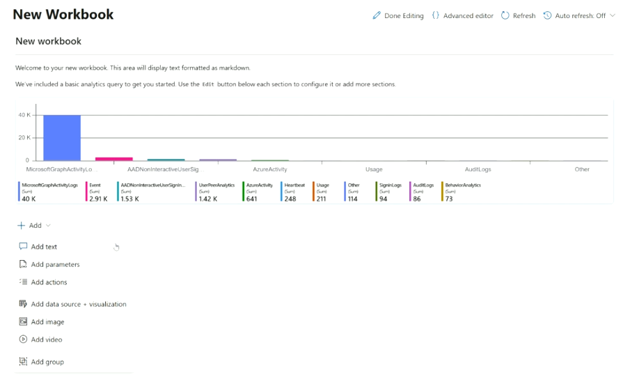
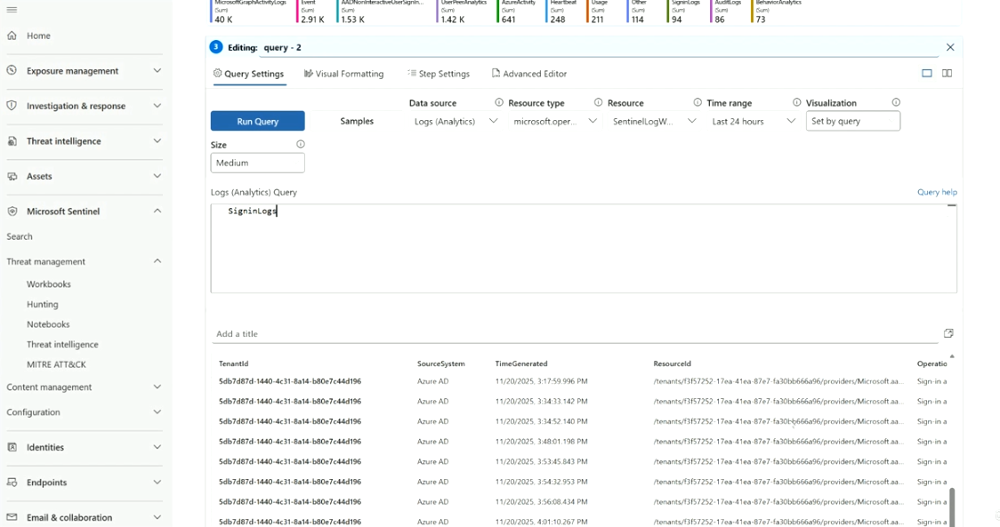

# Topic 24 — Building Custom Microsoft Sentinel Workbooks

Part of the **SC-200: Microsoft Security Operations Analyst** study series.
This topic follows on from Topic 23 (OOTB workbook templates & Device Discovery) and covers how to **build a workbook from scratch** rather than installing a pre-made one.

---

## Creating a new workbook

From **Microsoft Sentinel → Threat management → Workbooks → + Add Workbook**, choosing **New Workbook** opens a blank canvas rather than a template.

Microsoft pre-populates it with:
- A markdown text block ("Welcome to your new workbook...")
- One starter analytics query, rendered as a bar chart of event volume by table (e.g., `MicrosoftGraphActivityLogs`, `AADNonInteractiveUserSignInLogs`, `AzureActivity`, `Usage`, `SigninLogs`, `AuditLogs`, `BehaviorAnalytics`)

This gives you a working example to edit rather than starting from a truly empty page.



### The Add menu — building blocks
Every workbook is assembled from blocks, added via **+ Add**:

| Block | Purpose |
|---|---|
| **Add text** | Markdown for headers, instructions, context between sections |
| **Add parameters** | Reusable inputs (time range, subscription, user, severity) that other blocks reference, so one workbook adapts to different filters |
| **Add actions** | Clickable links/buttons — e.g., pivot to an incident, another workbook, or an external URL |
| **Add data source + visualization** | The core block: a query rendered as a table, chart, tile, map, or graph |
| **Add image** | Static images — branding, diagrams, screenshots |
| **Add video** | Embedded video (e.g., a how-to clip for analysts) |
| **Add group** | A collapsible container to organize related blocks together |

**Toolbar options** while editing: **Advanced editor** (raw JSON of the whole workbook — useful for export/import or source control), **Refresh**, and **Auto refresh** (schedule periodic re-runs, off by default).

---

## Editing a data source + visualization block

Clicking **Edit** below any query block opens its configuration panel with four tabs:

| Tab | What it configures |
|---|---|
| **Query Settings** | Data source, resource(s), time range, visualization type, KQL query itself |
| **Visual Formatting** | Colors, thresholds, column formatting for the rendered chart/table |
| **Step Settings** | Conditional visibility — e.g., only show this step if a parameter is set |
| **Advanced Editor** | Raw JSON for just this one step |

### Query Settings fields
- **Data source**: Logs (Analytics), Azure Resource Graph, ARM, JSON, or workspace metadata — Logs (Analytics) is the most common for KQL-based visuals
- **Resource type / Resource**: which Log Analytics workspace(s) the query runs against (here: `SentinelLogW...`)
- **Time range**: independent, or tied to a workbook-level time parameter
- **Visualization**: Table, chart types (bar/line/pie/etc.), or **Set by query** — lets the KQL `render` operator decide
- **Size**: vertical space the block occupies (Small/Medium/Large)
- **Run Query** / **Samples**: preview results immediately, or load a sample query to start from

### The KQL query box
This is a live Log Analytics query editor. In the example, the query is simply:

```kql
SigninLogs
```

Running it returns raw sign-in events — `TenantId`, `SourceSystem`, `TimeGenerated`, `ResourceId`, `OperationName`, etc. — displayed as a table beneath the editor so you can validate the query before wiring it into a chart/visualization.



**Key exam points:**
- Every visual in a workbook is backed by an editable **KQL query** — workbooks are a presentation/visualization layer on top of Log Analytics, they don't store data themselves.
- **Parameters** are what make a single workbook reusable across scopes/time ranges instead of hardcoding values into every query.
- **Advanced Editor** at the workbook level exports/imports the entire workbook as JSON — this is how workbooks get version-controlled or deployed via ARM/Bicep/Logic App automation.
- A custom workbook you build lives in **My workbooks**; it is not automatically shared as a template unless you explicitly publish/export it.
- Visualization can be explicitly chosen, or set dynamically by the KQL `render` statement itself (**"Set by query"**).
- **Actions** blocks are what let a workbook function as a lightweight navigation/triage tool — e.g., clicking a suspicious user drills into another workbook or the Entra ID portal.

---

## Quick self-check
1. What does a brand-new (non-template) workbook come pre-loaded with?
2. Which tab in the block editor lets you set conditional visibility for a step?
3. Why would you use a **parameter** instead of hardcoding a time range into every query block?
4. Where do you go to view or edit an entire workbook's raw JSON definition?

*(Answers: 1) A markdown welcome block + one starter analytics query chart — 2) Step Settings — 3) So every block in the workbook updates together when the parameter changes, instead of editing each query individually — 4) Advanced Editor, at the workbook level)*
