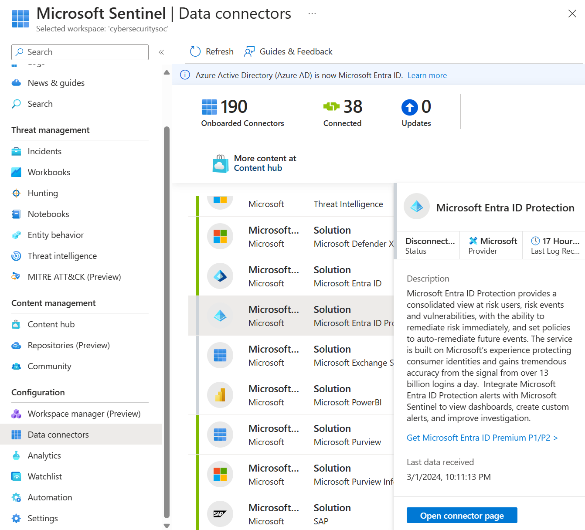
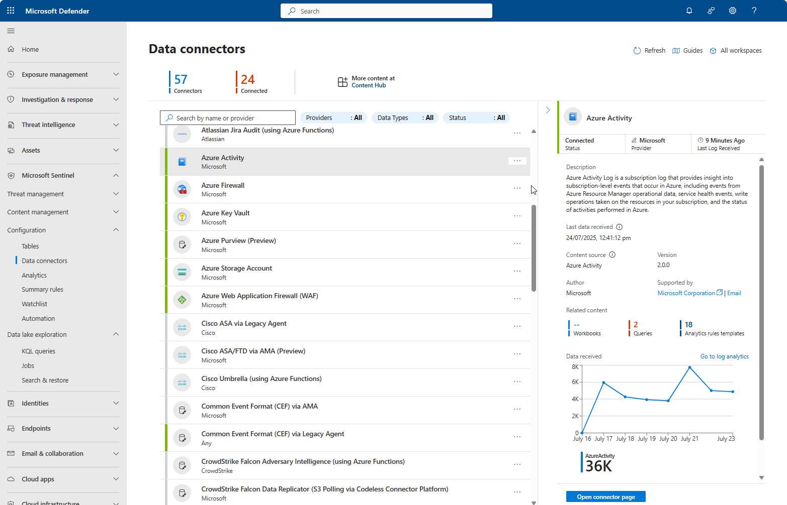
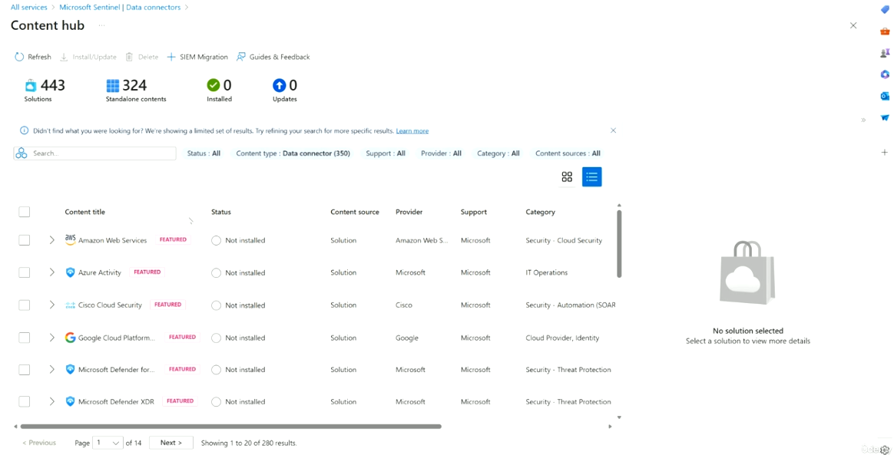

# Topic 25 — Data Connectors & Content Hub

Part of the **SC-200: Microsoft Security Operations Analyst** study series.
This topic covers how log data actually gets **into** Microsoft Sentinel (Data Connectors), and how Microsoft packages/distributes connectors, workbooks, analytics rules, and hunting queries together (**Content Hub**).

---

## 1. Data Connectors

### What they are
A **Data Connector** ingests logs from a specific source — Azure services, Microsoft 365, other clouds (AWS, GCP), on-prem infrastructure, network/firewall appliances, or third-party SaaS/security products — into your Sentinel-enabled Log Analytics workspace. No connector = no data = nothing to alert on, hunt through, or visualize in workbooks.

Found under: **Microsoft Sentinel → Configuration → Data connectors**.

### Connector list overview
The connectors page shows two key counters:

| Metric | Meaning |
|---|---|
| **Onboarded / Total Connectors** | How many connector types are available to this workspace |
| **Connected** | How many are actually configured and flowing data |
| **Updates** | Connector definitions with a newer version available |

The same page in the **unified Microsoft Defender portal** shows the connector catalog alongside Defender's own navigation (Exposure management, Investigation & response, Assets, etc.) — this is the modern experience most SC-200 scenarios now use.

### Anatomy of a connector's detail pane
Selecting any connector (e.g., **Azure Activity**, **Microsoft Entra ID Protection**) shows:

- **Status**: Connected / Disconnected / Not configured
- **Provider**: who authored the connector (Microsoft, Cisco, CrowdStrike, AWS, etc.)
- **Last Log Received / Last data received**: timestamp — critical for spotting a silently broken connector
- **Description**: what the data source covers and why you'd want it
- **Content source & Version**: which Content Hub solution it ships from
- **Related content**: how many Workbooks / Queries (hunting) / Analytics rule templates come bundled with this connector
- **Data received graph**: ingestion volume over time — a quick visual health check
- **Open connector page**: takes you to the full setup/configuration instructions

**Example — Microsoft Entra ID Protection connector:**
Surfaces risky users, risky sign-ins, and vulnerabilities detected by Entra ID Protection into Sentinel, so you can build custom alerts/dashboards on identity risk signals instead of relying only on the native Entra portal.

**Example — Azure Activity connector:**
Subscription-level control-plane logs — Resource Manager operations, service health events, and "who changed what" audit data across your Azure subscription.

### Connector categories you'll see (exam-relevant)
- **Microsoft first-party**: Microsoft Entra ID, Microsoft Defender XDR, Defender for Endpoint, Defender for Cloud Apps, Defender for Identity, Microsoft 365, Azure Activity, Azure Firewall, Azure Key Vault, Azure WAF
- **Multi-cloud**: AWS (CloudTrail, GuardDuty, VPC Flow Logs, CloudWatch), Google Cloud Platform
- **Network/security appliances**: Cisco ASA, Cisco Umbrella, Palo Alto, Fortinet — often via **Common Event Format (CEF)** or **Syslog**
- **Generic/custom ingestion paths**:
  - **CEF via AMA** (Azure Monitor Agent) — modern, recommended
  - **CEF via Legacy Agent** — older Log Analytics agent, being deprecated
  - **Azure Functions–based connectors** — for sources without a native agent (e.g., Atlassian Jira Audit, Cisco Umbrella, CrowdStrike Falcon Adversary Intelligence)
  - **Codeless Connector Platform (CCP)** — newer framework for polling REST APIs without writing a Function (e.g., CrowdStrike Falcon Data Replicator via S3 Polling)

**Key exam points:**
- **AMA (Azure Monitor Agent)** is the modern, supported agent for CEF/Syslog ingestion — the **Legacy Agent (MMA/OMS)** path is being retired and Microsoft steers new deployments to AMA.
- A connector showing **Connected** but with an old **Last data received** timestamp usually means a broken pipe (agent stopped, firewall change, expired credentials) — not a Sentinel-side issue.
- Connectors are tied 1:1 to a specific data source, but a single **solution** (see below) can bundle several connectors together.
- Not every connector requires an agent — many (Microsoft 365, Entra ID, Defender XDR products) connect natively via API/OAuth with just a **Connect** button.

---

## 2. Content Hub

### What it is
**Content Hub** (Sentinel → Content management → Content hub) is the marketplace/catalog for all installable Sentinel content — bundled as **Solutions** or offered as **Standalone content**.

| Type | Contains |
|---|---|
| **Solution** | A themed bundle: one or more data connectors + workbooks + analytics rule templates + hunting queries + playbooks, all for one product/vendor (e.g., "Amazon Web Services", "Microsoft Defender XDR") |
| **Standalone content** | A single item (just a workbook, or just a hunting query) not part of a larger packaged solution |

### Browsing Content Hub
The catalog page shows:

- **Solutions** count and **Standalone contents** count
- **Installed** vs **Updates available**
- Filters: **Status**, **Content type**, **Support**, **Provider**, **Category**, **Content sources**
- Each row: content title, install status, content source, provider, support tier, and category (e.g., *IT Operations*, *Security - Cloud Security*, *Security - Threat Protection*, *Cloud Provider, Identity*)

Selecting a solution (as seen in Topic 23 with **Amazon Web Services**) shows exactly what it installs — count of Data Connectors, Analytics rules, Hunting queries, and Workbooks — before you commit to installing it.

**Key exam points:**
- Installing a **Solution** from Content Hub is the fastest way to stand up a fully-working detection package for a new data source, rather than manually building connectors/rules/workbooks one by one.
- **SIEM Migration** (visible in the Content Hub toolbar) is a dedicated flow for importing existing rules/content from another SIEM (e.g., Splunk) into Sentinel.
- Content Hub items can show **Updates** — always review release notes before updating, since analytics rule logic can change.
- Category tags (Cloud Security, Threat Protection, IT Operations, Identity) map to how Microsoft organizes solutions — useful for narrowing a search when you know the type of source you're onboarding.

---

## Quick self-check
1. What's the difference between a **Solution** and **Standalone content** in Content Hub?
2. A connector shows status "Connected" but *Last data received* is 6 days old — what's the likely cause?
3. Which ingestion path is Microsoft steering customers toward for CEF/Syslog sources: AMA or the Legacy Agent?
4. Where would you go to migrate existing rules from another SIEM platform into Sentinel?

*(Answers: 1) A Solution bundles multiple content types around one source/vendor; Standalone content is a single item — 2) The pipeline (agent/API/credentials) has broken somewhere upstream, not a Sentinel-side fault — 3) AMA (Azure Monitor Agent) — 4) Content Hub → SIEM Migration)*
