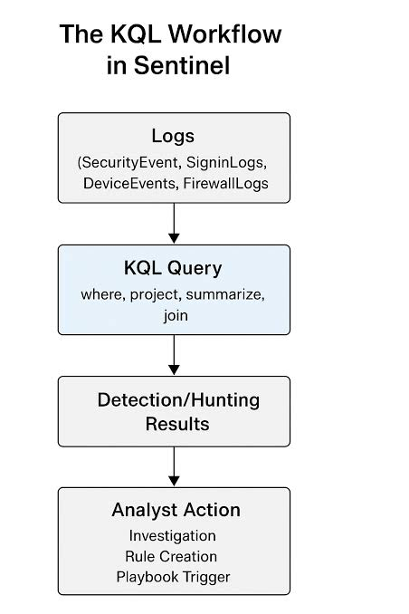
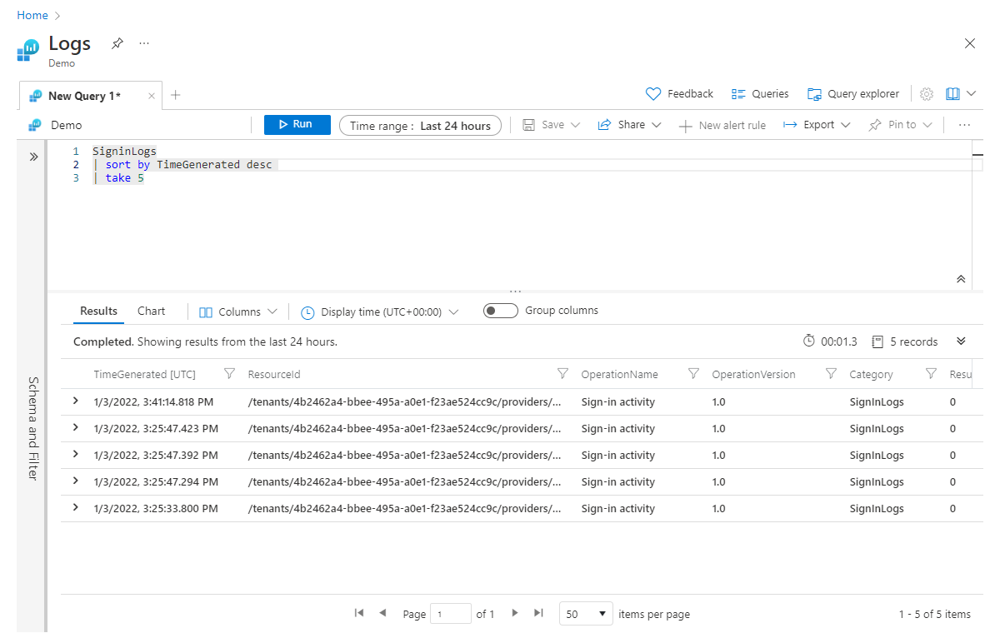
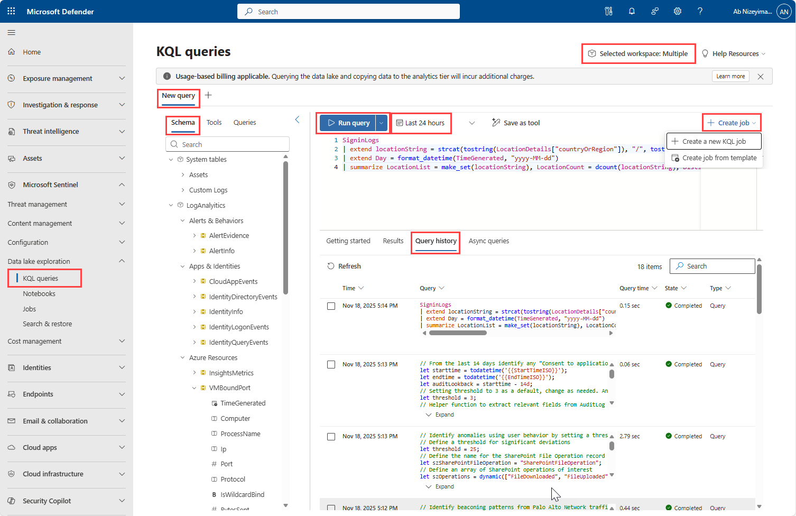

# Topic 26 — KQL Fundamentals for Sentinel Detection & Hunting

Part of the **SC-200: Microsoft Security Operations Analyst** study series.
This topic covers **Kusto Query Language (KQL)** — the query language behind Log Analytics, Microsoft Sentinel, and Advanced Hunting in Defender — and where you actually write/run it day to day.

---

## 1. The KQL workflow in Sentinel

At a high level, KQL sits between raw ingested logs and the actions an analyst takes:

```
Logs (SecurityEvent, SigninLogs, DeviceEvents, FirewallLogs)
        │
        ▼
KQL Query (where, project, summarize, join)
        │
        ▼
Detection / Hunting Results
        │
        ▼
Analyst Action (Investigation, Rule Creation, Playbook Trigger)
```



**Reading the pipeline:**
1. **Logs** — every connected data source lands in tables (`SecurityEvent`, `SigninLogs`, `DeviceEvents`, `FirewallLogs`, etc.) inside the Log Analytics workspace.
2. **KQL Query** — you filter (`where`), shape (`project`), aggregate (`summarize`), and combine (`join`) that raw data into something meaningful.
3. **Detection/Hunting Results** — the query's output either feeds a scheduled **Analytics rule** (detection) or is run ad hoc by an analyst (**hunting**).
4. **Analyst Action** — results drive what happens next: opening an **investigation**, turning the query into a permanent **rule**, or triggering a **playbook** (Logic App automation) for response.

This is the core mental model for the exam: KQL isn't just "a query language," it's the mechanism that turns raw telemetry into every detection, hunt, and workbook visual in Sentinel.

---

## 2. Writing and running KQL — Log Analytics (classic Logs blade)

The **Logs** experience (Azure Monitor Logs / Log Analytics) is the primary place to write and test KQL against a workspace.

Example query:
```kql
SigninLogs
| sort by TimeGenerated desc
| take 5
```

- **`SigninLogs`** — start from the table (the data source)
- **`| sort by TimeGenerated desc`** — pipe the results into a sort operator, newest first
- **`| take 5`** — limit to 5 rows for a quick sample

Key UI elements:
- **Time range** picker (top toolbar) — scopes the query window (e.g., *Last 24 hours*) independently of any `where TimeGenerated` clause you write
- **Run** — executes the query
- **Save / Share / New alert rule / Export / Pin to** — turn a working query directly into a Sentinel analytics rule, export results, or pin the output to a dashboard/workbook
- **Results / Chart** tabs — tabular results, or a quick visualization of the same data
- **Schema and Filter** pane (left) — browse available tables/columns without memorizing schema



**Key exam point:** "New alert rule" directly from the Logs blade is one of the fastest paths from an ad hoc hunting query to a production **Scheduled analytics rule** — you don't have to rebuild the query from scratch in the Analytics rule wizard.

---

## 3. KQL queries in the unified Defender portal (Data lake exploration)

In the modern **Microsoft Defender portal**, KQL has its own dedicated area: **Data lake exploration → KQL queries** — separate from the classic "Logs" blade, reflecting Sentinel's data now living in a unified data lake alongside Defender XDR signals.



Notable features visible here:

| Feature | Purpose |
|---|---|
| **Schema / Tools / Queries tabs** | Browse table schema, built-in tools, and saved queries |
| **Schema tree** (System tables, LogAnalytics categories like *Alerts & Behaviors*, *Apps & Identities*, *Azure Resources*) | Navigate available tables (e.g., `CloudAppEvents`, `IdentityLogonEvents`, `IdentityQueryEvents`) without memorizing names |
| **Run query / time range picker** (*Last 24 hours*) | Same execution model as classic Logs |
| **Save as tool** | Persist a query as a reusable tool, not just a one-off |
| **+ Create job → Create a new KQL job / Create job from template** | Schedule a query to run repeatedly as a background **job** — useful for recurring hunts or data summarization pipelines |
| **Getting started / Results / Query history / Async queries tabs** | Query history shows prior runs with time, query text, duration, and completion state — handy for reusing or auditing past hunts |
| **Selected workspace: Multiple** | KQL here can span **multiple workspaces** at once, not just one |

The example queries in **Query history** illustrate common real-world KQL patterns worth knowing:
- Extracting a country/region string and formatting a date to bucket sign-ins by day (`extend`, `format_datetime`, `summarize ... make_set`, `dcount`)
- Using `let` statements to define reusable variables (`starttime`, `endtime`, `threshold`) at the top of a query for readability and easy tuning
- Detecting anomalous SharePoint file operations by defining thresholds and an array of operations of interest (`dynamic([...])`)
- Identifying beaconing patterns in Palo Alto network traffic — a classic hunting scenario (regular, low-variance connection intervals suggesting C2 activity)

**Key exam points:**
- `let` is used to declare a variable/constant at the top of a query — makes thresholds and time windows easy to tune without hunting through the query body.
- **Usage-based billing** applies when querying the data lake tier vs. the standard analytics tier — a cost consideration Microsoft explicitly surfaces in the UI.
- A **job** (Create job from template / Create a new KQL job) is how you schedule a KQL query to run on a recurring basis outside of a formal Analytics rule — useful for data transformation/summarization pipelines feeding other tables.
- Query results can be scoped across **multiple workspaces** simultaneously in the unified portal — critical for MSSPs or large orgs with several Sentinel workspaces.

---

## Core KQL operators to know for the exam

| Operator | Purpose |
|---|---|
| `where` | Filter rows by condition |
| `project` | Select/rename specific columns |
| `extend` | Add a computed column without dropping existing ones |
| `summarize` | Aggregate (count, sum, dcount, make_set, etc.), typically with `by` |
| `join` | Combine rows from two tables on a matching key |
| `sort by` / `order by` | Reorder results |
| `take` / `limit` | Cap the number of rows returned |
| `let` | Define a reusable variable/constant |
| `render` | Suggest a chart type for the result set |

---

## Quick self-check
1. In the KQL workflow diagram, what comes immediately after "Detection/Hunting Results"?
2. What's the fastest way to turn a working ad hoc query in the Logs blade into a production detection?
3. What does the `let` keyword let you do in a KQL query?
4. In the unified Defender portal, where would you schedule a KQL query to run repeatedly?

*(Answers: 1) Analyst Action (investigation, rule creation, or playbook trigger) — 2) Click "New alert rule" directly from the Logs blade — 3) Define a reusable variable/constant, e.g. a threshold or time window, at the top of the query — 4) Data lake exploration → KQL queries → Create job)*
