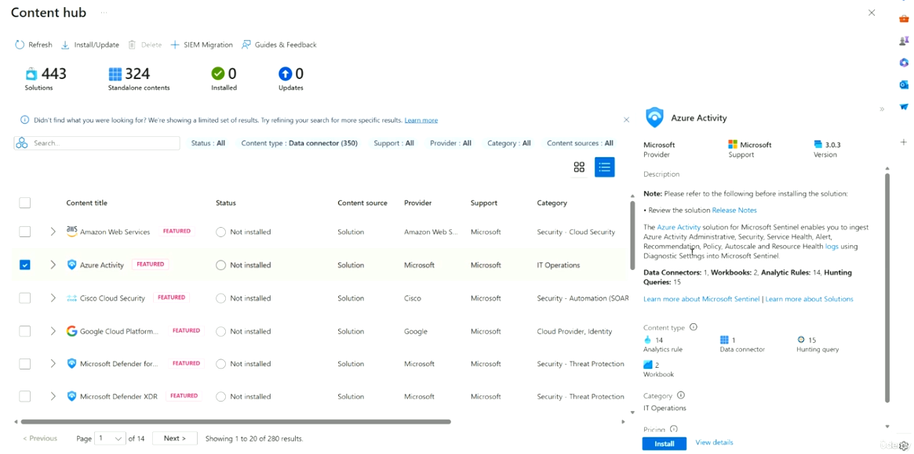
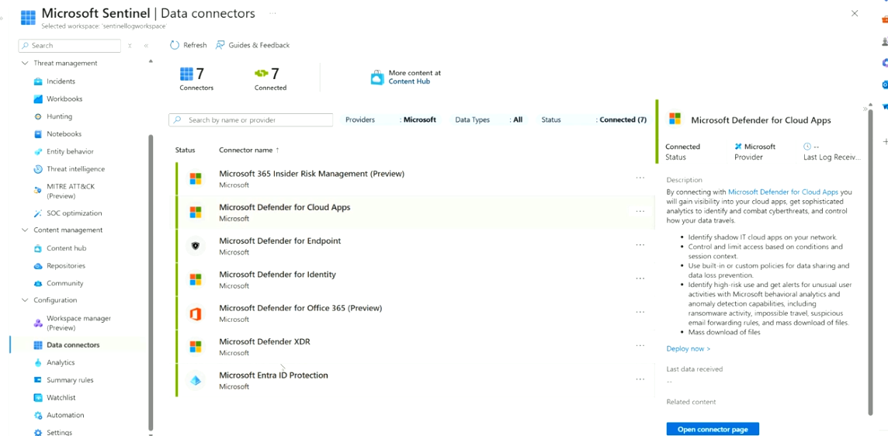

# Topic 27 — Installing Solutions & Managing Microsoft Data Connectors

Part of the **SC-200: Microsoft Security Operations Analyst** study series.
This topic builds directly on Topic 25 (Data Connectors & Content Hub), zooming into the **install workflow** and how to work with the **Microsoft-provided connector family** once installed.

---

## 1. Installing a solution from Content Hub

Selecting a solution (here: **Azure Activity**) in **Content management → Content hub** opens a detail pane before you commit to installing anything.

### What the detail pane tells you
| Field | Meaning |
|---|---|
| **Provider / Support** | Who publishes it and who supports it (both Microsoft here) |
| **Version** | Current solution version (e.g., `3.0.3`) — compare against installed version to know if an update is available |
| **Description / Notes** | What the solution does, plus a reminder to review **Release Notes** before installing |
| **Content type breakdown** | Exact counts of what installing this solution will add: **Analytics rule** (14), **Data connector** (1), **Hunting query** (15), **Workbook** (2) |
| **Category** | How Microsoft classifies it (here: *IT Operations*) |
| **Pricing** | Whether the solution itself is free (the underlying data ingestion is billed separately via Log Analytics) |

### Why review this before clicking Install
- The counts tell you the **blast radius** of the install — 14 new analytics rules is a meaningful addition to your rule set that needs tuning/triage capacity, not just "free content."
- **Release Notes** matter because analytics rule logic and KQL inside a solution can change between versions — installing an update isn't purely additive.
- A solution only shows **Install** as available when nothing is currently installed; if a version is already present you'll see **Update** instead.

**Key exam point:** installing a solution is the fastest way to get a fully working detection package (connector + rules + hunting queries + workbooks) for a new source — but as an analyst you're still responsible for reviewing and tuning what gets installed, especially analytics rule thresholds that may not match your environment.

---

## 2. Filtering and reviewing connectors by provider

Once connectors exist in your workspace, the **Data connectors** page (Sentinel → Configuration → Data connectors) supports **filtering** to quickly find the ones you care about.

In this example, the connector list is filtered to **Providers: Microsoft**, **Status: Connected**, showing exactly **7 of 7** Microsoft-provided connectors, all connected:

- Microsoft 365 Insider Risk Management (Preview)
- Microsoft Defender for Cloud Apps
- Microsoft Defender for Endpoint
- Microsoft Defender for Identity
- Microsoft Defender for Office 365 (Preview)
- Microsoft Defender XDR
- Microsoft Entra ID Protection

### Connector detail pane — Microsoft Defender for Cloud Apps example
Selecting a connector shows its purpose and connected capabilities. For **Microsoft Defender for Cloud Apps**, the description highlights what connecting brings into Sentinel:

- Visibility into cloud app usage and **shadow IT** discovery
- Analytics to identify and combat cyberthreats across cloud apps
- Conditional/session-based access control and custom **DLP** (data loss prevention) policies
- Alerts on high-risk activity via behavioral analytics/anomaly detection — e.g., **ransomware activity, impossible travel, suspicious mail-forwarding rules, mass file downloads**

The **Deploy now >** link jumps straight to configuring the connector if it isn't already connected; **Open connector page** and **Last data received** are the same health/status fields covered in Topic 25.

**Key exam points:**
- Filtering the connector list by **Provider**, **Data Types**, and **Status** is the practical way to audit "what's actually flowing" versus "what's just available" in a large workspace with hundreds of possible connectors.
- The **Microsoft first-party connector family** (Defender for Cloud Apps, Endpoint, Identity, Office 365, XDR, Entra ID Protection, 365 Insider Risk Management) together forms the backbone of Microsoft's XDR signal set feeding into Sentinel — these are usually prioritized first in any Sentinel onboarding.
- Behaviors like **impossible travel** and **mass download of files** called out in the Defender for Cloud Apps description are classic exam scenarios for anomaly-based cloud app detections — know that these come from Cloud App Security's behavioral analytics engine, not a generic Sentinel analytics rule.
- A connector can be **Preview** (e.g., Microsoft 365 Insider Risk Management, Defender for Office 365 shown as Preview) — expect preview connectors to have fewer SLAs/guarantees, a relevant nuance for production readiness questions.

---

## Quick self-check
1. Before installing the Azure Activity solution, what four content types would be added, and how many of each?
2. Why should you check a solution's Release Notes even when just updating, not doing a fresh install?
3. Which Microsoft connector is responsible for detecting "impossible travel" and mass file downloads?
4. What does filtering the Data connectors list by **Provider: Microsoft, Status: Connected** actually verify?

*(Answers: 1) 14 Analytics rules, 1 Data connector, 15 Hunting queries, 2 Workbooks — 2) Because analytics rule logic and KQL inside the solution can change between versions, not just add new content — 3) Microsoft Defender for Cloud Apps — 4) That every Microsoft-provided connector expected in the environment is actually connected and flowing data, not just installed/available)*
