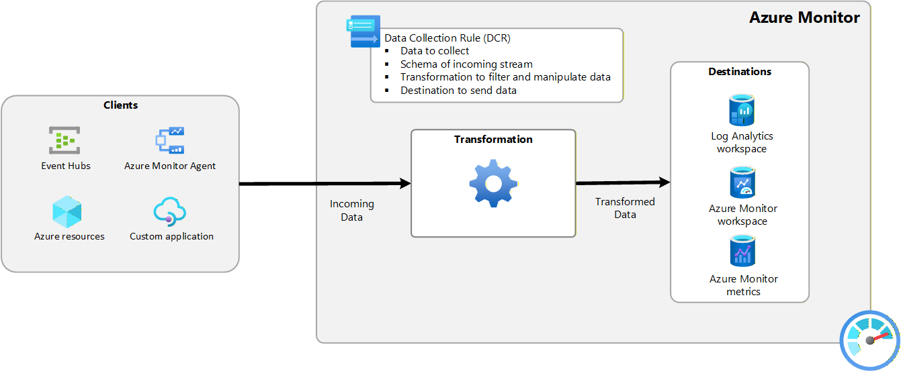
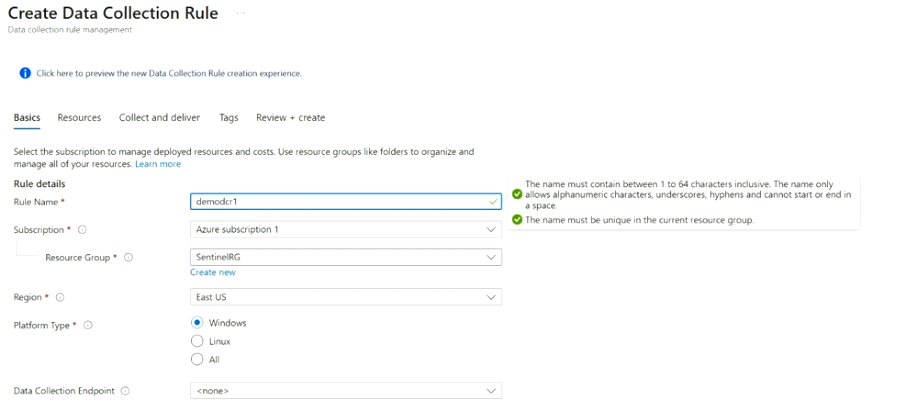
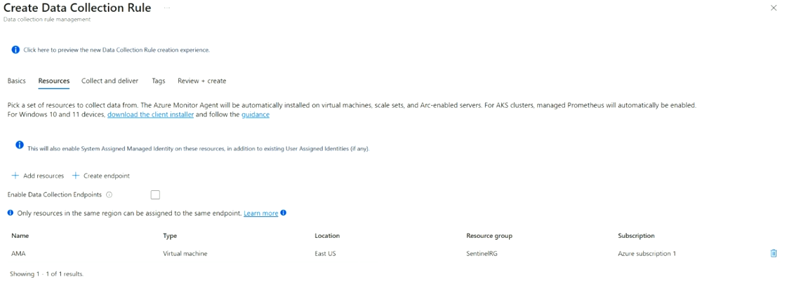
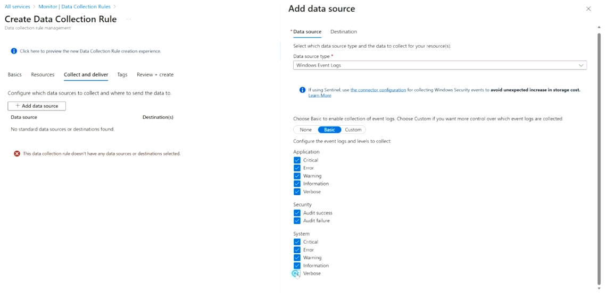
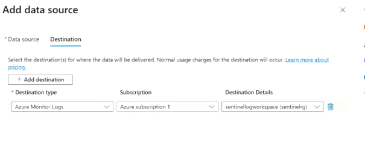
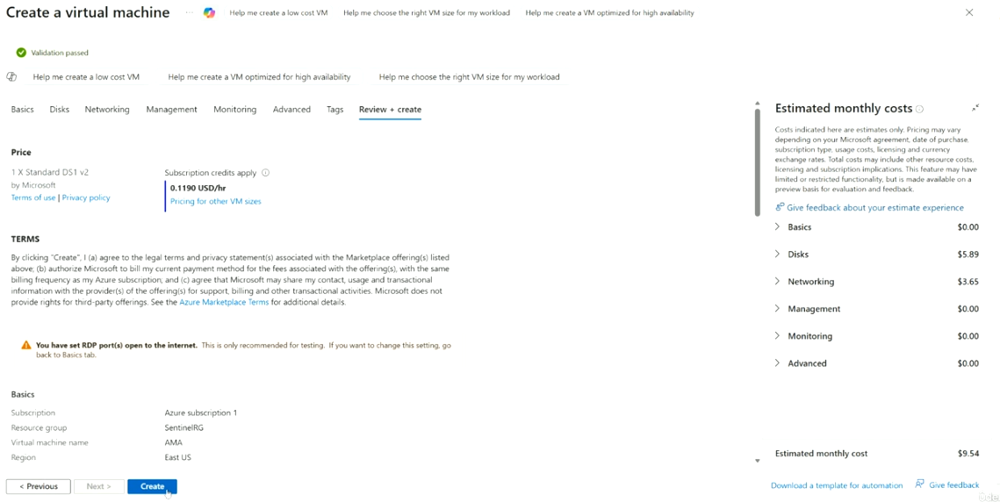

# Lab 28 — Data Collection Rules (DCR) & the Azure Monitor Pipeline

Part of the **SC-200: Microsoft Security Operations Analyst** study series.
This lab covers how log data actually travels from a client (VM, custom app, Event Hub) into Sentinel — via **Azure Monitor Agent (AMA)** and **Data Collection Rules (DCRs)** — and walks through creating one end to end.

---

## 1. The Azure Monitor data pipeline

Before AMA/DCRs, data collection was configured per-agent, per-workspace. The modern model decouples **what to collect**, **how to transform it**, and **where to send it**, all defined centrally in a DCR.

```
Clients                          Azure Monitor
────────                         ─────────────────────────────
Event Hubs         ┐             ┌─ Data Collection Rule (DCR) ─┐
Azure Monitor Agent├─ Incoming → │  • Data to collect            │
Azure resources    │   Data      │  • Schema of incoming stream  │
Custom application ┘             │  • Transformation to filter/  │
                                  │    manipulate data            │
                                  │  • Destination to send data   │
                                  └────────────┬───────────────────┘
                                               ▼
                                        Transformation (⚙)
                                               │
                                       Transformed Data
                                               ▼
                                          Destinations
                                   • Log Analytics workspace
                                   • Azure Monitor workspace
                                   • Azure Monitor metrics
```



### Key concepts
- **Clients**: where data originates — Event Hubs, Azure Monitor Agent (installed on VMs), native Azure resources emitting diagnostic data, or custom applications sending data directly.
- **Data Collection Rule (DCR)**: the central configuration object defining *what* to collect, the *schema* of the incoming stream, any *transformation* (KQL-based filtering/shaping), and the *destination(s)*.
- **Transformation**: an optional KQL-based step that filters out noise or reshapes data before it's stored — reduces ingestion cost and cleans up schema mismatches.
- **Destinations**: a Log Analytics workspace (most common for Sentinel), an Azure Monitor workspace (used with managed Prometheus/metrics scenarios), or Azure Monitor metrics.

**Key exam point:** DCRs are what replaced the older Log Analytics agent's workspace-level configuration — they let you apply different collection/transformation rules to different sets of resources from one place, and are the modern, recommended path (over the legacy MMA/OMS agent).

---

## 2. Creating a Data Collection Rule — step by step

### Step 1 — Basics
Set the rule's identity and platform scope:
- **Rule Name** (e.g., `demodcr1`) — alphanumeric/underscore/hyphen, unique within the resource group
- **Subscription / Resource Group** — where the DCR itself lives
- **Region**
- **Platform Type** — Windows, Linux, or All — determines which data source types are available later
- **Data Collection Endpoint** — optional; required only for private-link/network-isolated scenarios



### Step 2 — Resources
Choose which resources this DCR applies to. Azure Monitor Agent gets **automatically installed** on any VM, VM scale set, or Arc-enabled server you add here (for AKS, managed Prometheus is auto-enabled instead; Windows 10/11 client devices need a separate client installer).

Adding a resource here also enables a **System Assigned Managed Identity** on it (in addition to any existing user-assigned identities) — AMA uses this identity to authenticate.



### Step 3 — Collect and deliver → Add data source
This is where you define **what** to collect. Selecting **Windows Event Logs** as the data source type gives you:

- **Basic** mode — simple checkboxes for standard event log categories/levels (Application: Critical/Error/Warning/Information/Verbose; Security: Audit success/failure; System: same level set)
- **Custom** mode — write your own XPath queries for granular control over exactly which events are collected
- **None** — disable this data source

⚠️ **Important callout in the UI**: if you're using Sentinel, use the dedicated **connector configuration** for collecting Windows Security events instead of a generic DCR — doing it the wrong way can cause an unexpected increase in storage/ingestion cost.



### Step 4 — Add data source → Destination
Every data source needs at least one destination. Here:
- **Destination type**: Azure Monitor Logs (i.e., a Log Analytics workspace)
- **Subscription**: which subscription hosts the target workspace
- **Destination Details**: the specific workspace (e.g., `sentinellogworkspace`)

Normal usage/ingestion charges apply to whatever lands in the destination — the UI links directly to pricing docs as a reminder.



Back on the **Collect and deliver** tab, you can **+ Add data source** repeatedly to layer multiple sources (e.g., Windows Event Logs + Performance Counters + Syslog) into the same DCR, each potentially routed to different destinations.

### Step 5 — Tags, then Review + create
Standard Azure resource tagging, then validation and deployment of the DCR.

---

## 3. Supporting lab step — creating the VM that AMA installs onto

Since AMA needs a target resource, the lab also walks through **Create a virtual machine** to have something for the DCR's Resources tab to attach to:

- **Review + create** tab shows validation status, estimated pricing breakdown (Disks, Networking, Management, Monitoring, Advanced), and total estimated monthly cost
- Notes the required Marketplace terms acknowledgment
- Flags a security-relevant warning: **"You have set RDP port(s) open to the internet. This is only recommended for testing."** — a classic SC-200-adjacent security hygiene point (don't leave RDP exposed on production systems; use Just-In-Time VM access or Bastion instead)



**Key exam point:** that open-RDP warning is exactly the kind of exposure Microsoft Defender for Cloud's recommendations and Just-In-Time VM Access are designed to catch and remediate — expect scenario questions connecting "VM with RDP open to the internet" to JIT access or NSG hardening as the correct response.

---

## Quick self-check
1. What four things does a Data Collection Rule define?
2. Why does adding a VM as a DCR resource also enable a System Assigned Managed Identity?
3. What warning does the UI give if you try to collect Windows Security events into Sentinel via a generic DCR instead of the connector configuration?
4. What security risk did the VM creation flow flag, and what's the typical remediation?

*(Answers: 1) Data to collect, schema of the incoming stream, transformation, and destination — 2) Azure Monitor Agent uses that identity to authenticate when sending data — 3) It can cause an unexpected increase in storage cost, so use the dedicated Sentinel connector configuration instead — 4) RDP open to the internet; typical fix is Just-In-Time VM access or restricting via NSG/Azure Bastion)*
