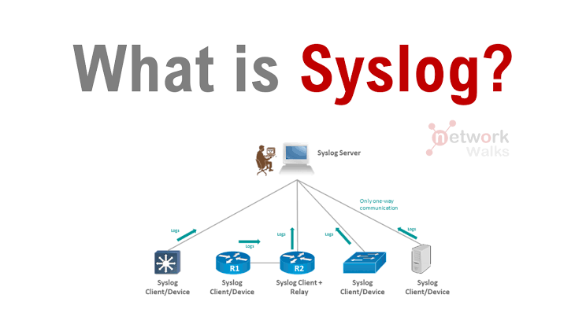
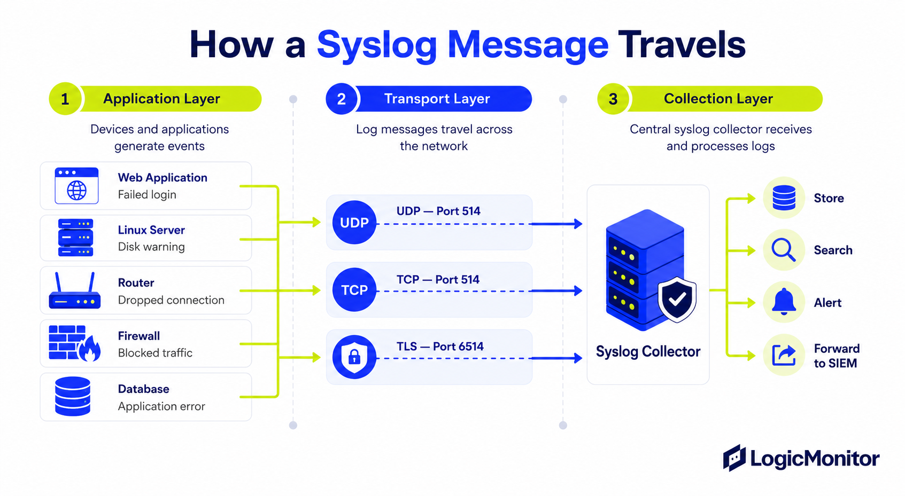
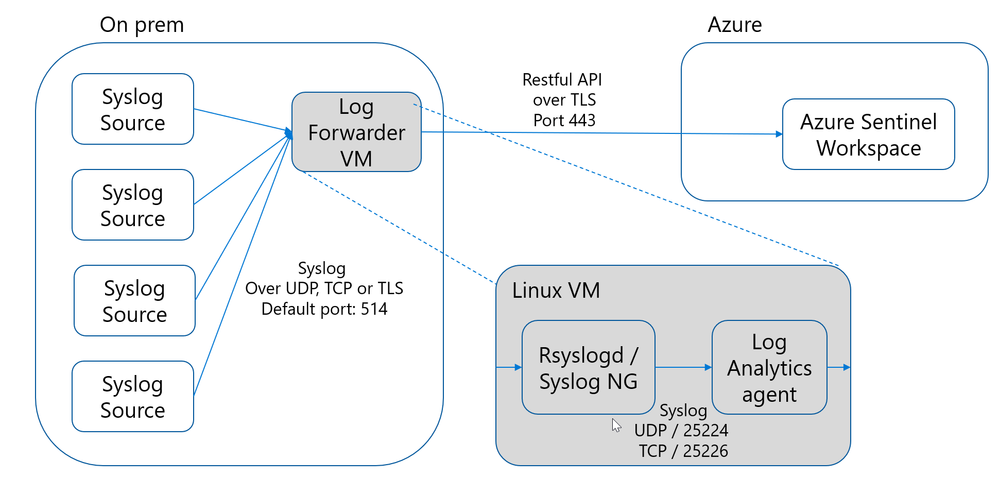
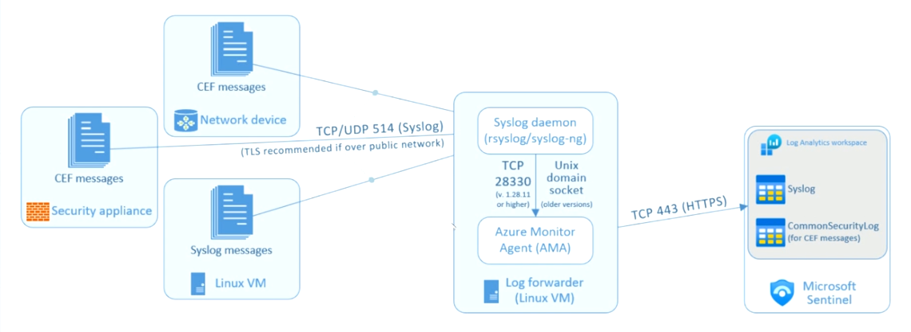
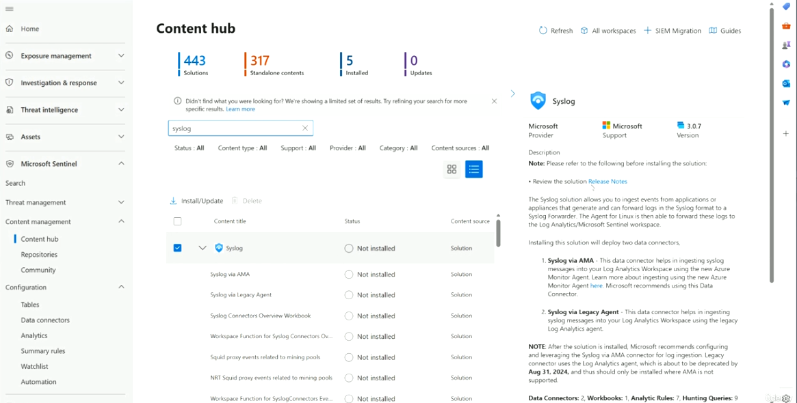
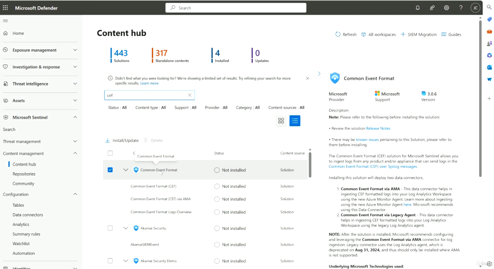

# Topic 29 — Syslog, CEF & Log Forwarding into Microsoft Sentinel

Part of the **SC-200: Microsoft Security Operations Analyst** study series.
This topic covers **Syslog** and **Common Event Format (CEF)** fundamentals, how messages actually travel from a device to a SIEM, and how to bring both into Microsoft Sentinel via Content Hub solutions.

---

## 1. What is Syslog?

Syslog is a standard logging protocol used by network devices, servers, and appliances to send event messages to a central collector. Devices (firewalls, routers, switches, servers) act as **Syslog clients**, sending log messages to a **Syslog server**. Communication is typically **one-way** — clients push logs; the server doesn't push commands back.

A **relay** (like `R2` in the diagram) can sit between clients and the server to aggregate/forward messages from multiple devices.



---

## 2. How a Syslog message travels

Breaking the journey into three layers:

| Layer | What happens |
|---|---|
| **1. Application Layer** | Devices/applications generate events — a web app logs a failed login, a Linux server raises a disk warning, a router logs a dropped connection, a firewall logs blocked traffic, a database logs an application error |
| **2. Transport Layer** | The message travels across the network over one of three protocols/ports: **UDP – port 514** (fire-and-forget, no delivery guarantee), **TCP – port 514** (reliable delivery), or **TLS – port 6514** (encrypted, reliable) |
| **3. Collection Layer** | A central **Syslog Collector** receives and processes the logs, then can **Store**, **Search**, **Alert** on, or **Forward to SIEM** |



**Key exam point:** UDP is the historical default (port 514) but offers no delivery guarantee — messages can silently drop under network congestion. TCP/TLS are preferred for reliability, and **TLS is explicitly recommended when sending over a public network** due to lack of built-in encryption in plain Syslog.

---

## 3. Ingesting Syslog into Sentinel — the Log Forwarder pattern

On-prem Syslog sources can't send directly to Sentinel — they route through a **Log Forwarder VM** (typically Linux) that runs a Syslog daemon and forwards to Azure.

### Classic path (Log Analytics agent — being retired)
```
Syslog Sources → Log Forwarder VM (UDP/TCP/TLS, port 514)
                        │
                        ▼
              Linux VM: Rsyslogd / Syslog-NG
                        │  (Syslog UDP/25224, TCP/25226)
                        ▼
                  Log Analytics agent
                        │  (RESTful API over TLS, port 443)
                        ▼
                Azure Sentinel Workspace
```



### Modern path (Azure Monitor Agent — recommended)
```
CEF messages (Network device / Security appliance)  ┐
Syslog messages (Linux VM)                           ┘→ Syslog daemon (rsyslog/syslog-ng)
                                                             │
                                        TCP/UDP 514 (Syslog) │  TLS recommended over public network
                                                             ▼
                                              Azure Monitor Agent (AMA)
                                        (TCP 28330 v1.28.11+, or Unix domain socket on older versions)
                                                             │
                                                  TCP 443 (HTTPS)
                                                             ▼
                                            Log Analytics workspace
                                        (Syslog table + CommonSecurityLog table for CEF)
                                                             │
                                                             ▼
                                                  Microsoft Sentinel
```



**Key differences to know for the exam:**
- The **legacy path** relies on the **Log Analytics agent (MMA/OMS)**, which Microsoft has **deprecated (retirement Aug 31, 2024)** — should only be used where AMA genuinely isn't supported.
- The **modern path** uses **Azure Monitor Agent (AMA)**, communicating with the local Syslog daemon over **TCP 28330** (v1.28.11+) or a **Unix domain socket** on older AMA versions, then sending to Azure over **HTTPS (443)**.
- Plain **Syslog messages** land in the **Syslog** table; **CEF-formatted messages** (a structured superset used by security appliances) land in the **CommonSecurityLog** table — different tables, different downstream KQL.

---

## 4. Installing the connectors via Content Hub

Both Syslog and CEF ship as **Content Hub solutions**, each deploying **two data connectors** — one for AMA (recommended), one for the Legacy Agent (only where AMA isn't supported).

### Syslog solution
- **Content type**: Data Connectors: 2, Workbooks: 1, Analytic Rules: 7, Hunting Queries: 9
- Deploys:
  1. **Syslog via AMA** — ingest using the modern Azure Monitor Agent
  2. **Syslog via Legacy Agent** — ingest using the deprecated Log Analytics agent
- Microsoft's explicit guidance after installing: configure and use **Syslog via AMA**; the legacy connector should only be used where AMA is unsupported.



### Common Event Format (CEF) solution
- Ingests logs from any product/appliance that can send CEF-formatted logs over Syslog messages
- Deploys:
  1. **Common Event Format via AMA** — recommended
  2. **Common Event Format via Legacy Agent** — deprecated path
- Same deprecation note: the legacy connector uses the Log Analytics agent (deprecated Aug 31, 2024) and should only be installed where AMA is not supported.



**Key exam points:**
- Installing a solution deploys **both** connector variants (AMA + Legacy) side by side, but you only actively *configure/use* one — typically AMA.
- **CommonSecurityLog** is the table CEF data lands in — remember this distinction from the plain **Syslog** table when writing KQL detections against CEF-based appliances (firewalls, network security devices).
- Content Hub always shows the **content-type breakdown** (connectors, workbooks, rules, hunting queries) before install — this is your quick way to gauge what a solution actually adds to your environment, echoing the pattern seen with other solutions (Topic 25/27).

---

## Quick self-check
1. Which Syslog transport protocol is recommended when sending logs over a public network, and why?
2. What's the difference between the **Syslog** table and the **CommonSecurityLog** table in Sentinel?
3. Which agent is deprecated (retiring Aug 31, 2024), and which should you use instead for new deployments?
4. What two connectors does installing the CEF solution from Content Hub deploy?

*(Answers: 1) TLS (port 6514), because plain Syslog isn't encrypted — 2) Syslog holds plain Syslog-formatted messages; CommonSecurityLog holds CEF-formatted messages from security appliances — 3) The Log Analytics agent (MMA/OMS) is deprecated; use Azure Monitor Agent (AMA) instead — 4) Common Event Format via AMA, and Common Event Format via Legacy Agent)*
