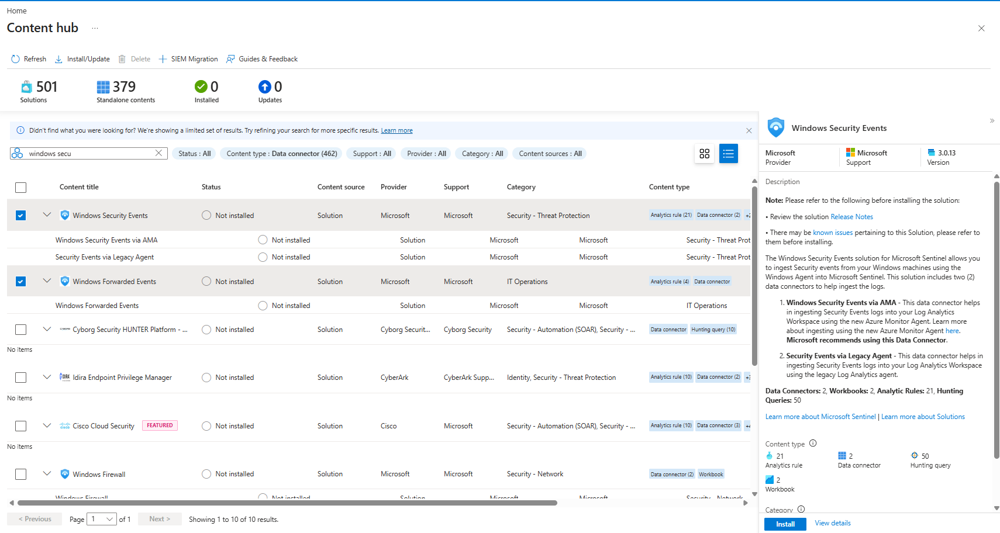
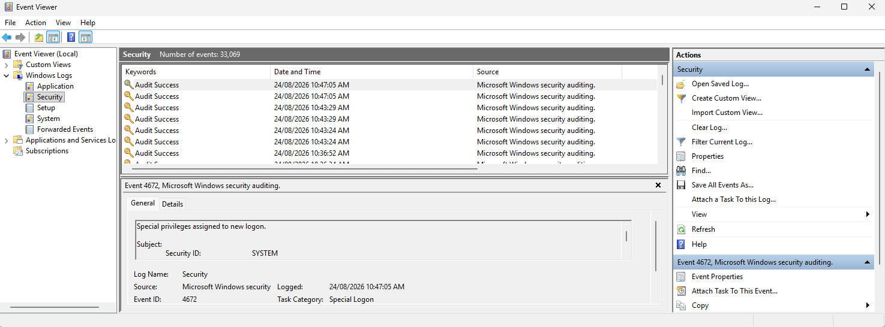
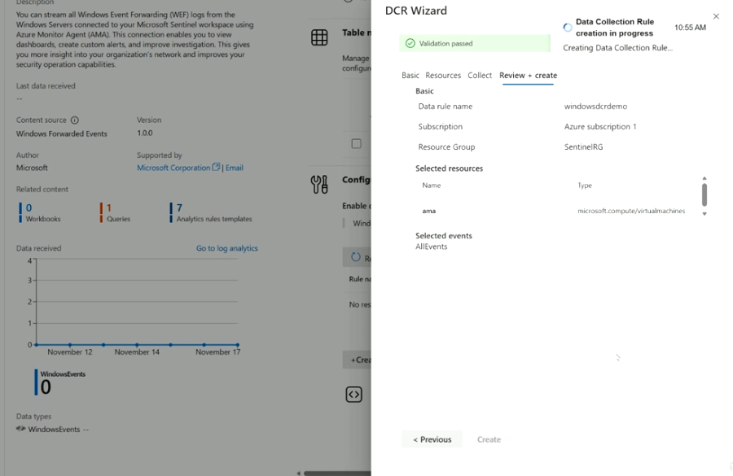

# Topic 30 — Windows Security Events & Windows Forwarded Events (WEF)

Part of the **SC-200: Microsoft Security Operations Analyst** study series.
This topic covers ingesting **Windows Security Events** and **Windows Forwarded Events** into Microsoft Sentinel — the two dedicated Content Hub solutions for Windows-based telemetry, plus a look at the underlying **Event Viewer** data and the **DCR wizard** used to wire it up.

---

## 1. Windows Security Events vs Windows Forwarded Events — two different solutions

Searching Content Hub for "windows secu" surfaces both solutions side by side, each with its own connector pair:

| Solution | Purpose | Data connectors |
|---|---|---|
| **Windows Security Events** | Ingest Security event logs directly from Windows machines that have the Azure Monitor Agent installed | Windows Security Events via AMA · Security Events via Legacy Agent |
| **Windows Forwarded Events** | Ingest events that have already been centralized via native **Windows Event Forwarding (WEF)** onto a collector server | Windows Forwarded Events (via AMA) |

### Windows Security Events — detail
- **Content**: Data Connectors: 2, Workbooks: 2, Analytic Rules: 21, Hunting Queries: 50
- Ingests **Security event logs** from Windows machines using AMA
- Two connectors:
  1. **Windows Security Events via AMA** — recommended, modern path
  2. **Security Events via Legacy Agent** — uses the deprecated Log Analytics agent, only for machines that can't run AMA

### Windows Forwarded Events — detail
- **Content**: Analytics rule (4), Data connector (1) — smaller footprint than the full Security Events solution
- Designed for orgs that already run native **WEF**: event logs from many Windows Servers get centralized to a WEC (Windows Event Collector) server, and that single server streams them into Sentinel via AMA — rather than installing AMA on every single endpoint.
- Description explicitly: *"You can stream all Windows Event Forwarding (WEF) logs from the Windows Servers connected to your Microsoft Sentinel workspace using Azure Monitor Agent (AMA)."*
- Lands in the **WindowsEvents** table (visible in the connector's *Data types* section).

**Key exam point:** choose **Windows Security Events** when you want AMA installed on each machine individually; choose **Windows Forwarded Events** when your environment already centralizes logs via WEF and you just need that one collector talking to Sentinel — much lighter agent footprint across a large server fleet.

---

## 2. Where the raw data comes from — Windows Event Viewer

Before any of this reaches Sentinel, it originates in the local **Event Viewer** on each Windows machine, specifically the **Security** log under *Windows Logs*.

Example: **Event ID 4672 – "Special privileges assigned to new logon"** — a classic security-relevant event showing a `SYSTEM` (or other privileged) account being granted elevated rights at logon. Each event includes:
- **Keywords** (e.g., Audit Success)
- **Date and Time**
- **Source** (`Microsoft Windows security auditing`)
- **General/Details tabs** with Subject (Security ID), Log Name, Task Category

Note the **Forwarded Events** node in the tree — this is where events arriving via WEF from *other* machines land locally on a collector, distinct from that machine's own **Security** log.

**Key exam point:** Event ID 4672 is a commonly tested/referenced event for privilege-escalation-adjacent detections (privileged logon activity) — know that it fires whenever a logon session is granted special/admin-level privileges, which is exactly the kind of signal the **Windows Security Events** analytics rules are built to catch.

---

## 3. Wiring it up — the DCR Wizard for Windows Forwarded Events

Installing the **Windows Forwarded Events** connector launches a guided **DCR Wizard** (Data Collection Rule wizard) rather than the fully manual DCR creation flow from Lab 28.

Steps: **Basic → Resources → Collect → Review + create**

On **Review + create**, the wizard summarizes:
- **Data rule name**: e.g., `windowsdcrdemo`
- **Subscription / Resource Group**: e.g., `Azure subscription 1` / `SentinelRG`
- **Selected resources**: the machine(s) to collect from (e.g., `ama`, type `microsoft.compute/virtualmachines`)
- **Selected events**: `AllEvents` — i.e., forward everything received via WEF, rather than filtering to specific event IDs

Clicking **Create** kicks off **"Data Collection Rule creation in progress"**, after which the connector's data page (left side) shows **Last data received**, a **Data received** trend chart, and **Data types: WindowsEvents**.

**Key exam point:** this connector-specific wizard is a shortcut over manually building a DCR from scratch (as in Lab 28) — Microsoft pre-configures the data source type and schema for you; you're really only choosing **which resources** to attach and **which events** to forward.

---

## Quick self-check
1. What's the key architectural difference between the Windows Security Events and Windows Forwarded Events solutions?
2. Which table does data land in via the Windows Forwarded Events connector?
3. What does Windows Event ID 4672 represent, and why does it matter for security monitoring?
4. In the DCR Wizard for Windows Forwarded Events, what does selecting "AllEvents" mean?

*(Answers: 1) Windows Security Events installs AMA per machine to read its local Security log directly; Windows Forwarded Events streams already-centralized WEF logs from a single collector server — 2) WindowsEvents — 3) "Special privileges assigned to new logon" — flags a logon session granted elevated/admin rights, relevant to privilege escalation detection — 4) Forward every event received via WEF rather than filtering to a specific subset of event IDs)*
