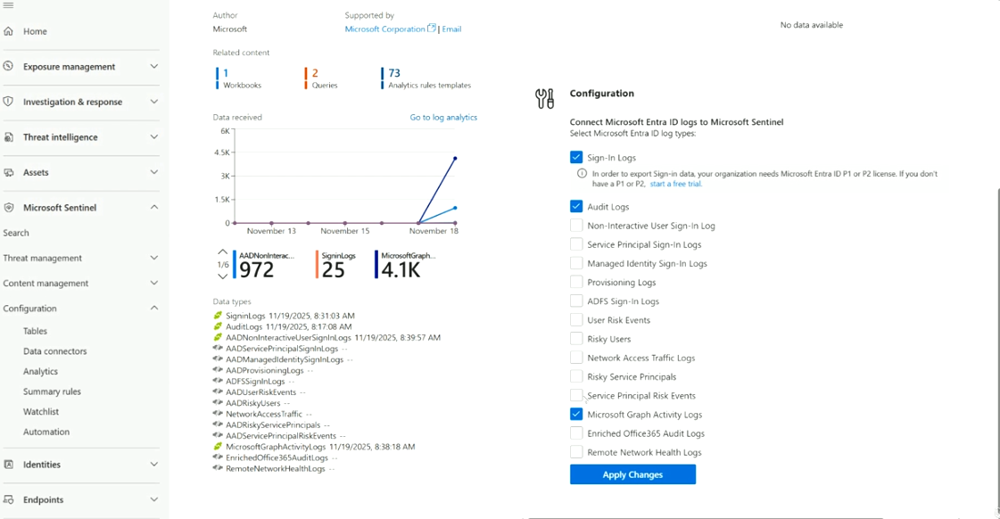
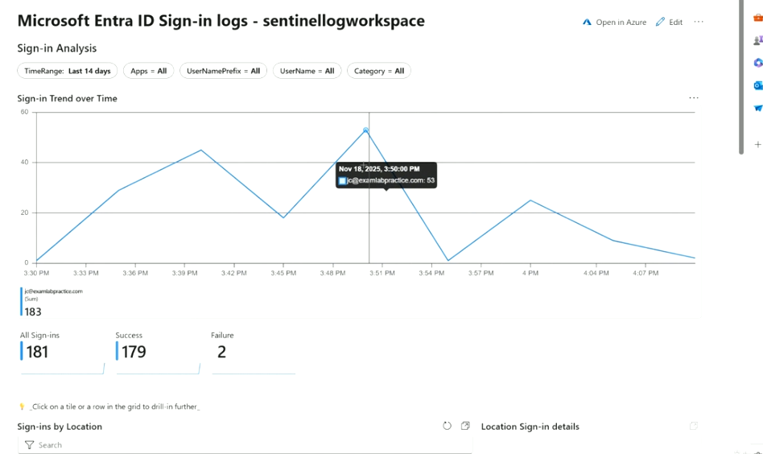
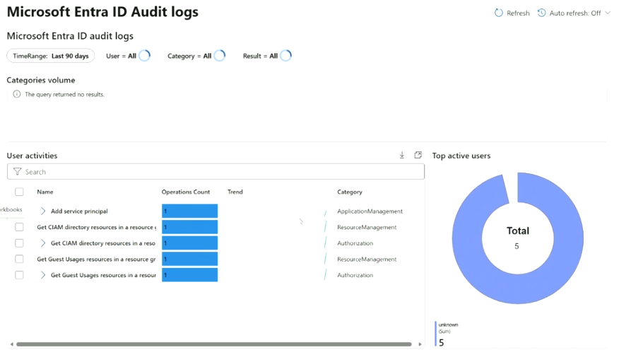
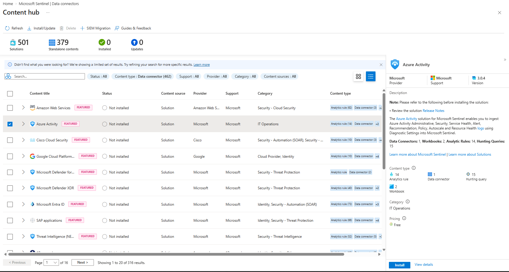
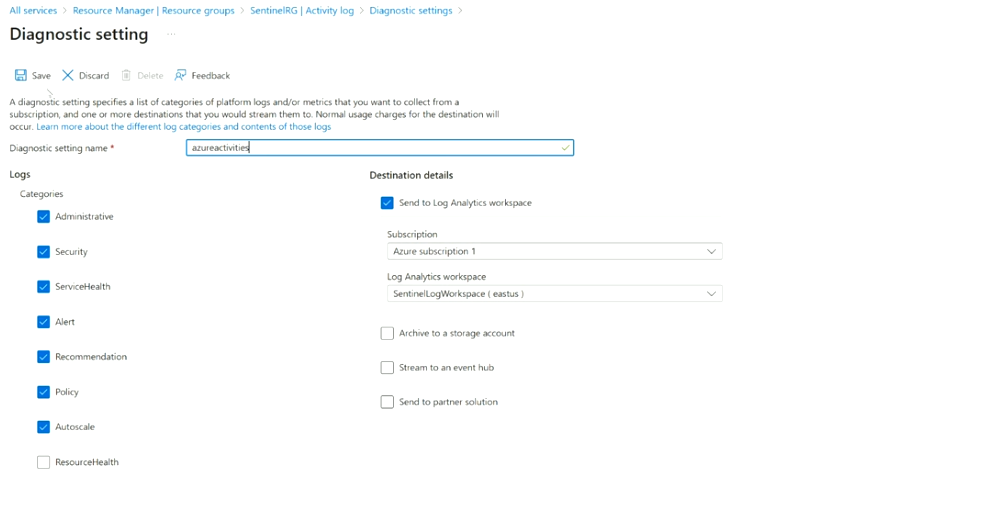
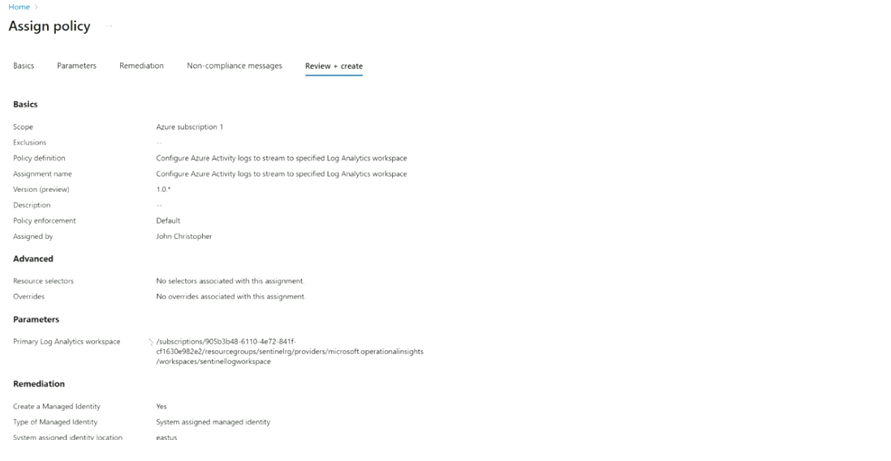

# Topic 31 — Connecting Microsoft Entra ID & Azure Activity Logs

Part of the **SC-200: Microsoft Security Operations Analyst** study series.
This topic covers connecting **Microsoft Entra ID** and **Azure Activity** data to Sentinel, the workbooks each one powers, and the two ways to wire up ingestion: manual **Diagnostic settings** vs. **Azure Policy**-based auto-remediation at scale.

---

## 1. Configuring the Microsoft Entra ID connector

The **Microsoft Entra ID** solution is one of the largest available in Content Hub — related content includes **1 Workbook, 2 Queries, 73 Analytics rule templates**, reflecting how central identity telemetry is to detection engineering.

### Configuration panel
Connecting Entra ID logs to Sentinel means choosing which **Microsoft Entra ID log types** to stream in:

| Log type | Notes |
|---|---|
| **Sign-In Logs** ✅ | Requires **Microsoft Entra ID P1 or P2** license to export |
| **Audit Logs** ✅ | Directory changes/admin actions |
| Non-Interactive User Sign-In Log | Service/background sign-ins |
| Service Principal Sign-In Logs | App/service principal auth events |
| Managed Identity Sign-In Logs | Managed identity auth events |
| Provisioning Logs | User/group provisioning activity |
| ADFS Sign-In Logs | On-prem AD FS federation sign-ins |
| User Risk Events / Risky Users | Entra ID Protection risk signals |
| Network Access Traffic Logs | Network-level access telemetry |
| Risky Service Principals / Service Principal Risk Events | Risk signals on app identities |
| **Microsoft Graph Activity Logs** ✅ | Graph API call activity |
| Enriched Office 365 Audit Logs | O365 audit enrichment |
| Remote Network Health Logs | Health telemetry for remote network connections |

Enable the checkboxes you need, then **Apply Changes**. The pane also shows **Data received** (per log type, trending over days) and a **Data types** list confirming exactly which tables are actively populated (e.g., `SigninLogs`, `AuditLogs`, `AADNonInteractiveUserSignInLogs`, `MicrosoftGraphActivityLogs`) with last-received timestamps.

**Key exam point:** Sign-In Logs specifically require an **Entra ID P1 or P2 license** to export — a common gotcha when a customer expects sign-in data but hasn't licensed for it.

---

## 2. Workbooks powered by Entra ID data

### Microsoft Entra ID Sign-in logs workbook
Shows **Sign-in Analysis** over a chosen time range (here: Last 14 days), filterable by Apps, UserNamePrefix, UserName, Category:

- **Sign-in Trend over Time** line chart — hovering shows a specific user's sign-in count at a point in time
- **All Sign-ins / Success / Failure** summary tiles (e.g., 181 total, 179 success, 2 failure)
- **Sign-ins by Location** — geographic breakdown, useful for spotting impossible-travel-style anomalies

### Microsoft Entra ID Audit logs workbook
Same workbook style seen in Topic 23, but note what happens when there's **no matching data** for the current filter/time window: *"The query returned no results"* under Categories volume, while **User activities** and **Top active users** still render for whatever narrower dataset does exist (5 total operations here, all "unknown" user).

**Key exam point:** a workbook showing "no results" for one panel but data in another usually means different panels query **different tables or time windows** — it's not necessarily a broken connector, just a filter/data-availability mismatch. Always check the **TimeRange** and filter chips at the top before assuming ingestion is broken.

---

## 3. Connecting Azure Activity logs

The **Azure Activity** solution (Content Hub) ingests subscription-level Administrative, Security, Service Health, Alert, Recommendation, Policy, Autoscale, and Resource Health logs into Sentinel using **Diagnostic Settings**.

- **Content**: Data Connectors: 1, Workbooks: 2, Analytic Rules: 14, Hunting Queries: 15
- Pricing: **Free** (you still pay standard Log Analytics ingestion charges for the data itself)

### Method 1 — Manual: Diagnostic settings
Azure Activity logs are subscription-scoped, so connecting them means configuring a **Diagnostic setting** at the subscription level (Activity log → Diagnostic settings):

- **Diagnostic setting name** (e.g., `azureactivities`)
- **Categories** to collect: Administrative, Security, ServiceHealth, Alert, Recommendation, Policy, Autoscale, ResourceHealth (each toggle independently — ResourceHealth left unchecked in this example)
- **Destination details**: check **Send to Log Analytics workspace**, pick Subscription + workspace (e.g., `SentinelLogWorkspace (eastus)`)
- Other destination options available: **Archive to a storage account**, **Stream to an event hub**, **Send to partner solution**

**Limitation:** this has to be configured **per subscription** — tedious across a large tenant with many subscriptions.

### Method 2 — Scaled: Azure Policy
For multi-subscription environments, Microsoft provides a built-in policy: **"Configure Azure Activity logs to stream to specified Log Analytics workspace."** Assigning it auto-remediates diagnostic settings across every subscription in scope.

Reviewing the assignment (**Review + create**) shows:
- **Scope**: e.g., `Azure subscription 1` (can be a management group for broader scale)
- **Policy definition / Assignment name**: Configure Azure Activity logs to stream to specified Log Analytics workspace
- **Policy enforcement**: Default
- **Parameters → Primary Log Analytics workspace**: the target workspace resource ID
- **Remediation → Create a Managed Identity**: Yes, **System assigned managed identity** — the policy needs its own identity to go configure diagnostic settings on your behalf across all in-scope subscriptions

**Key exam point:** Azure Policy-based onboarding is the **scalable/enterprise answer** to "how do I make sure every current and future subscription automatically sends Activity logs to Sentinel?" — vs. manually visiting Diagnostic settings on each subscription one at a time. Expect exam scenarios where "hundreds of subscriptions" or "new subscriptions should automatically onboard" points to the **Policy** approach, not manual diagnostic settings.

---

## Quick self-check
1. Which Entra ID log type requires a P1 or P2 license to export?
2. A workbook panel shows "The query returned no results" while another panel on the same workbook shows data — what does that most likely mean?
3. What are the two ways to connect Azure Activity logs to a Log Analytics workspace, and when would you choose the scaled option?
4. Why does the Azure Activity policy assignment need a system-assigned managed identity?

*(Answers: 1) Sign-In Logs — 2) Different panels rely on different data/time windows; check filters before assuming a broken connector — 3) Manual per-subscription Diagnostic settings, or an Azure Policy assignment for auto-remediation across many/future subscriptions; choose Policy when managing many subscriptions or wanting new subscriptions to auto-onboard — 4) So the policy itself has permission to go configure diagnostic settings across all in-scope subscriptions on your behalf)*
