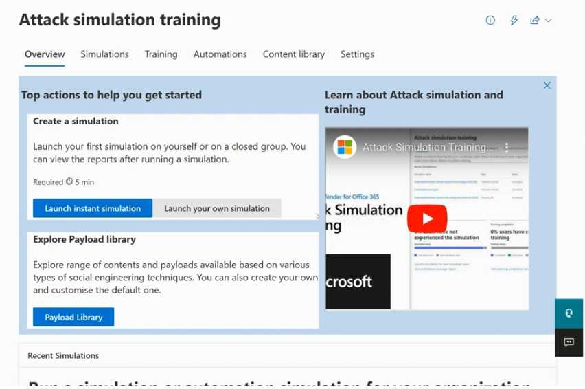
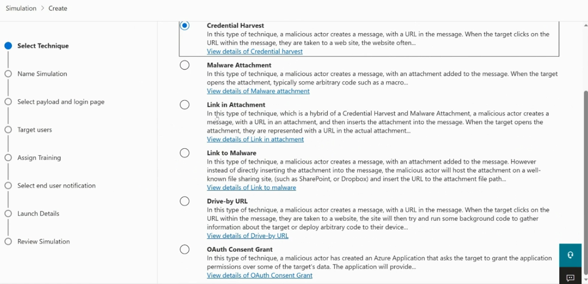
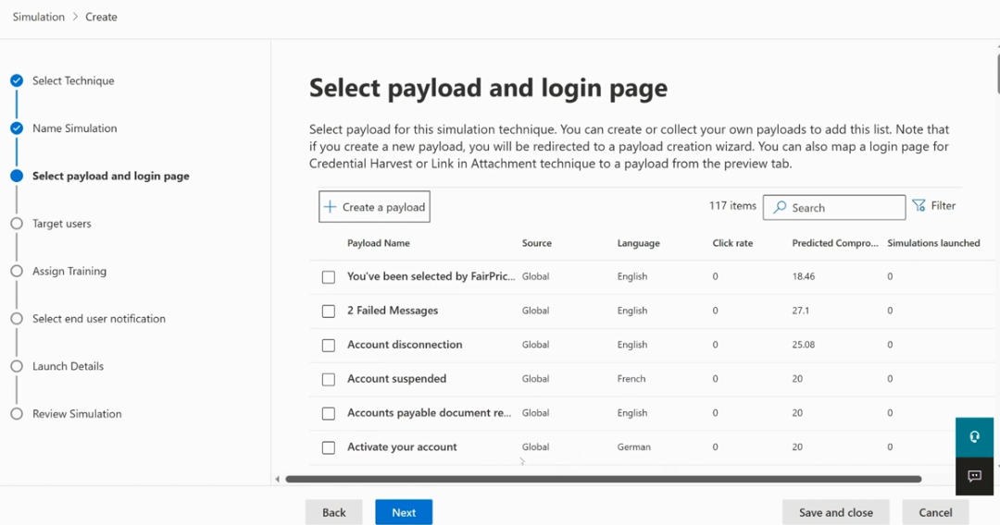
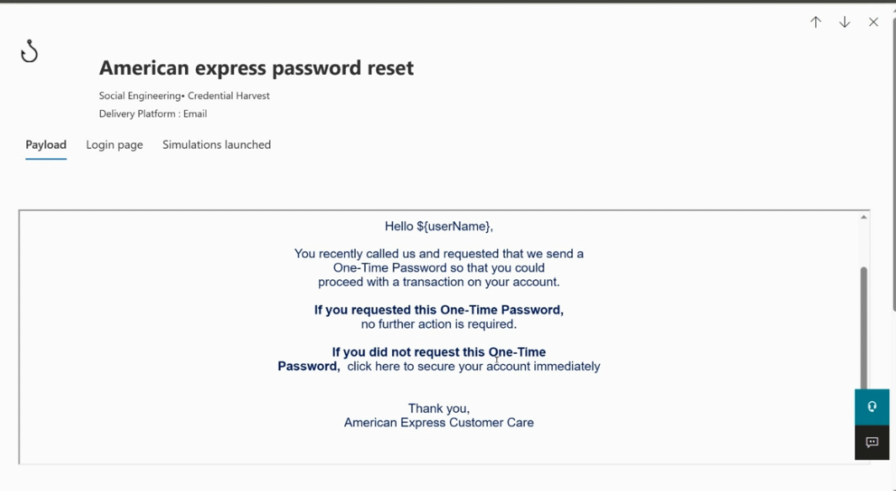
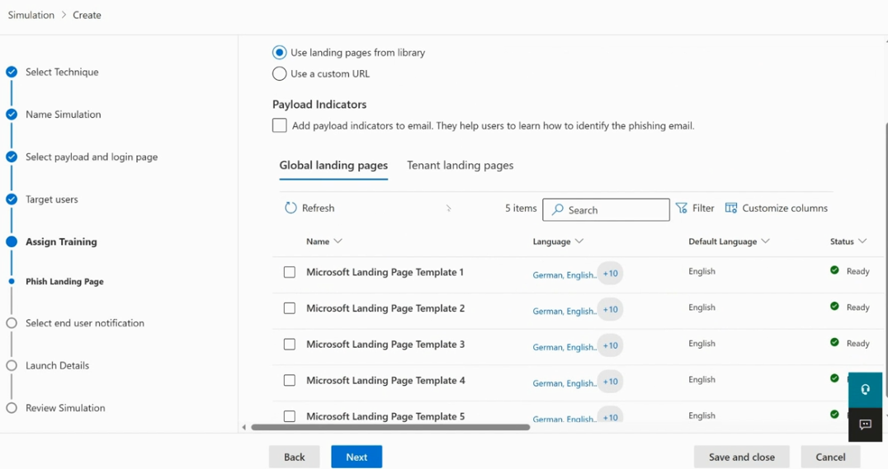
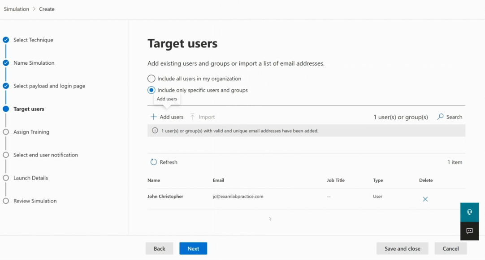
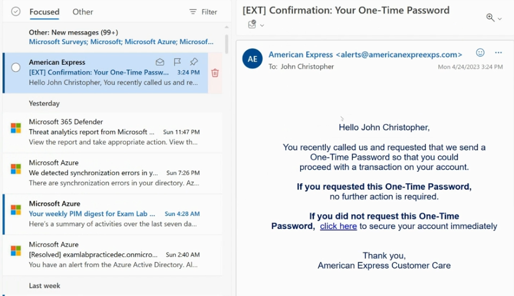
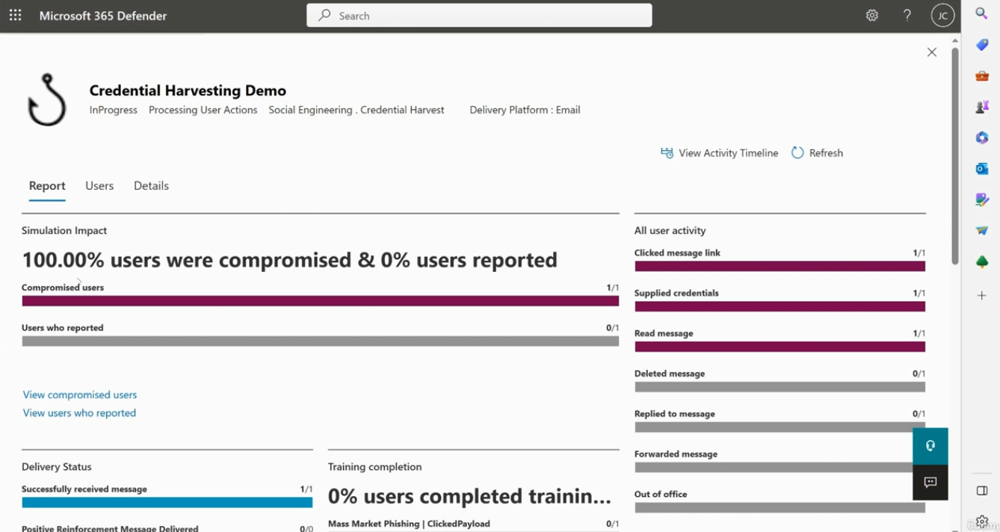

# Topic 32 — Attack Simulation Training (Microsoft Defender for Office 365)

Part of the **SC-200: Microsoft Security Operations Analyst** study series.
This topic covers **Attack Simulation Training** — Microsoft's built-in phishing simulation and security-awareness training tool — from launching a simulation through reviewing the results.

---

## 1. Overview

Found at: **Microsoft 365 Defender → Attack simulation training** (requires Defender for Office 365 Plan 2 or equivalent licensing).

Tabs: **Overview · Simulations · Training · Automations · Content library · Settings**

The Overview page's "Top actions to help you get started":
- **Create a simulation** — launch on yourself or a closed group first, then view reports (~5 min, required first step)
  - **Launch instant simulation** vs **Launch your own simulation** — instant uses a quick preset flow; "own simulation" is the full customizable wizard
- **Explore Payload library** — browse phishing content/payloads organized by social engineering technique, or build custom ones

---

## 2. Building a simulation — the wizard

Creating your own simulation walks through a linear set of steps: **Select Technique → Name Simulation → Select payload and login page → Target users → Assign Training → Select end user notification → Launch Details → Review Simulation**

### Step 1 — Select Technique
Choose the social engineering technique the simulation will emulate:

| Technique | What it does |
|---|---|
| **Credential Harvest** | Message with a URL → clicking takes the target to a fake site (often mimicking a login page) designed to capture credentials |
| **Malware Attachment** | Message with an attachment → opening it would run arbitrary code (e.g., a macro) in a real attack |
| **Link in Attachment** | Hybrid — a URL is embedded *inside* an attachment rather than the message body |
| **Link to Malware** | Message with a URL pointing to an attacker-hosted file (e.g., on SharePoint/Dropbox) rather than a direct attachment |
| **Drive-by URL** | Clicking a URL runs background code to gather info about the target or deploy exploit code, without a credential prompt |
| **OAuth Consent Grant** | Simulates a malicious Azure AD app requesting the target grant it permissions/consent over their data |

### Step 2 — Select payload and login page
Choose the actual email content ("payload") the simulation will send. Microsoft ships **117+ built-in payloads** searchable/filterable by name, source (Global), language, and — crucially — historical **Click rate** and **Predicted Compromise rate** from prior real-world usage, which helps you pick a payload that's a meaningfully realistic difficulty level. You can also **Create a payload** from scratch.

**Example payload — "American Express password reset":**
- Category: *Social Engineering • Credential Harvest*, Delivery Platform: *Email*
- Tabs: **Payload** (the email body), **Login page** (the fake landing page shown after clicking), **Simulations launched** (history of use)
- The email uses a classic urgency/fear-based pretext: an unrequested "One-Time Password" notice with a "click here to secure your account immediately" link — textbook social engineering bait.

### Step 3 — Landing page selection
For **Credential Harvest** simulations, choose the fake login page users land on after clicking:
- **Use landing pages from library** (recommended, default) vs **Use a custom URL**
- **Payload Indicators** toggle — optionally adds visible hints in the email that help train users to spot phishing red flags (useful for awareness-focused, lower-stakes simulations)
- **Global landing pages** vs **Tenant landing pages** — Microsoft ships several ready-to-use templates (multi-language support, e.g., German/English +10 more), each with a **Ready** status

### Step 4 — Target users
Choose who receives the simulation:
- **Include all users in my organization**, or
- **Include only specific users and groups** — add individually (**+ Add users**) or **Import** a list of email addresses

In this example, a single test target (`John Christopher`) is added before proceeding — a sensible pattern for testing a simulation before rolling it out broadly.

### Remaining steps
- **Assign Training**: attach specific training modules that non-compliant/compromised users automatically receive
- **Select end user notification**: what (if anything) tells the user afterward that this was a simulation, and links to training
- **Launch Details**: schedule start/end dates
- **Review Simulation**: final summary before launch

---

## 3. What the target actually sees

The simulated phishing email lands in the target's real inbox exactly like a genuine attack would — subject line `[EXT] Confirmation: Your One-Time Password`, sender `American Express <alerts@americanexpreexps.com>` (note the intentionally slightly-off spoofed domain), addressed personally, with the same urgency/CTA language shown in the payload editor.

**Key exam point:** the `[EXT]` tag and the subtly misspelled domain (`americanexpreexps.com`) are realistic phishing tells — good simulations intentionally include the same subtle red flags real attacks use, so training genuinely improves detection skills rather than being trivially obvious.

---

## 4. Reviewing simulation results

After the simulation runs, the **Report** tab shows the outcome per simulation (e.g., "Credential Harvesting Demo," status **InProgress / Processing User Actions**):

- **Simulation Impact**: e.g., *100.00% users were compromised & 0% users reported* — the two headline KPIs of any simulation
- **Compromised users** vs **Users who reported** bar counts (1/1 compromised, 0/1 reported here)
- **Delivery Status**: Successfully received message (1/1)
- **Training completion**: % of users who completed assigned training (0% here — simulation still in progress)
- **All user activity** breakdown: Clicked message link (1/1), Supplied credentials (1/1), Read message (1/1), Deleted message (0/1), Replied to message (0/1), Forwarded message (0/1), Out of office (0/1)
- **Users / Details** tabs and **View Activity Timeline** for drilling into individual user actions and timing

**Key exam points:**
- The two most important top-line metrics are **% compromised** (clicked/supplied credentials) vs **% reported** (used the "Report phishing" button/add-in) — a healthy security culture should trend toward low compromise and high reporting over repeated simulations.
- Attack Simulation Training integrates with **assigned training content** — compromised users can be automatically enrolled in remediation training, closing the loop from simulation to education.
- Results here feed the broader **Human Risk / Security Awareness** metrics Microsoft Defender tracks, and can inform which users need additional Conditional Access scrutiny or targeted awareness campaigns.
- This is a proactive/preventive control, distinct from the reactive detection/response tooling (Sentinel analytics rules, incidents) covered elsewhere in the course — but the two are connected: users flagged as repeatedly compromised are good candidates for tighter Conditional Access or MFA enforcement.

---

## Quick self-check
1. What's the difference between the **Credential Harvest** and **Drive-by URL** techniques?
2. Why does Microsoft show historical **Click rate** and **Predicted Compromise rate** on each payload in the library?
3. What are the two headline metrics on a simulation's Report tab?
4. What real-world phishing "tell" was intentionally present in the American Express payload's sender address?

*(Answers: 1) Credential Harvest leads to a fake login page designed to capture credentials; Drive-by URL runs background code to gather info or deploy exploit code without necessarily prompting for credentials — 2) So you can choose a payload with realistic difficulty based on how effective it's proven to be historically — 3) % of users compromised, and % of users who reported the simulation — 4) A subtly misspelled/spoofed domain, `americanexpreexps.com`, instead of the real American Express domain)*
