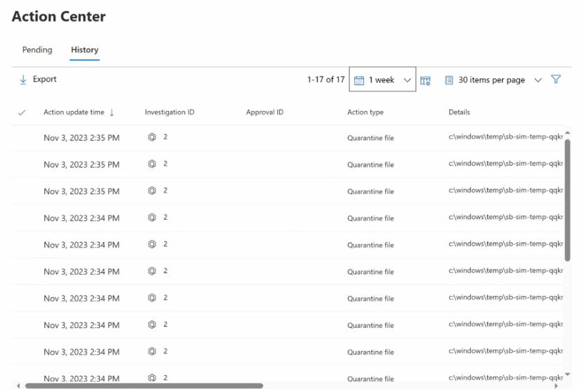
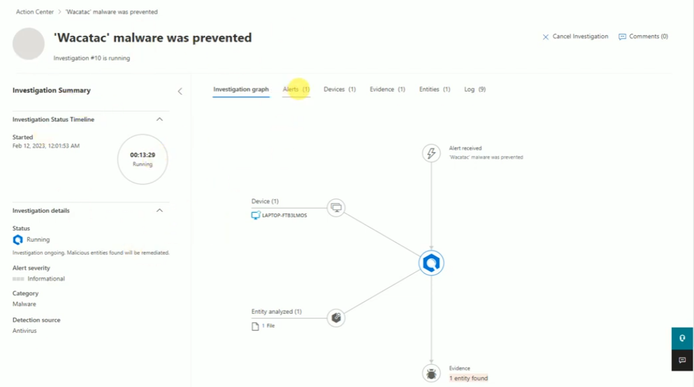
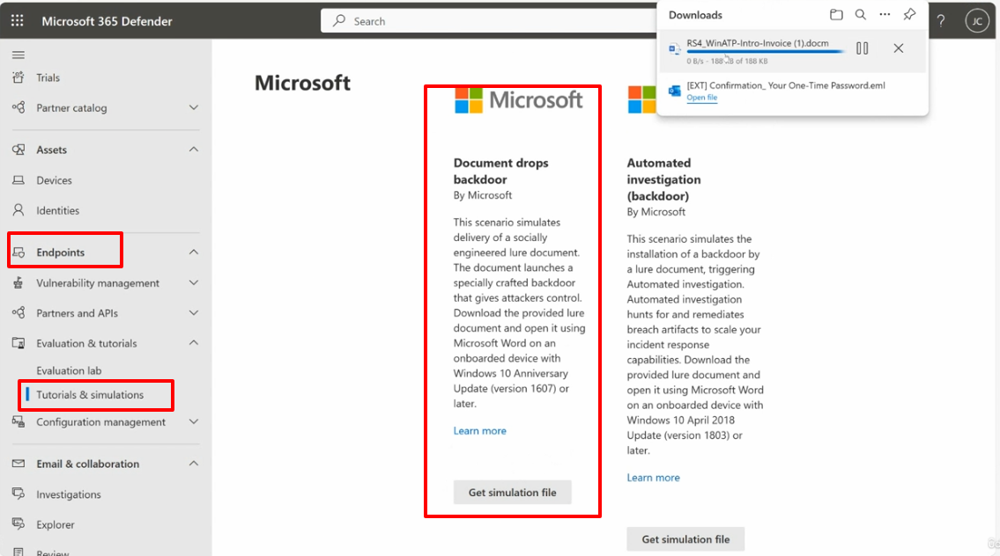
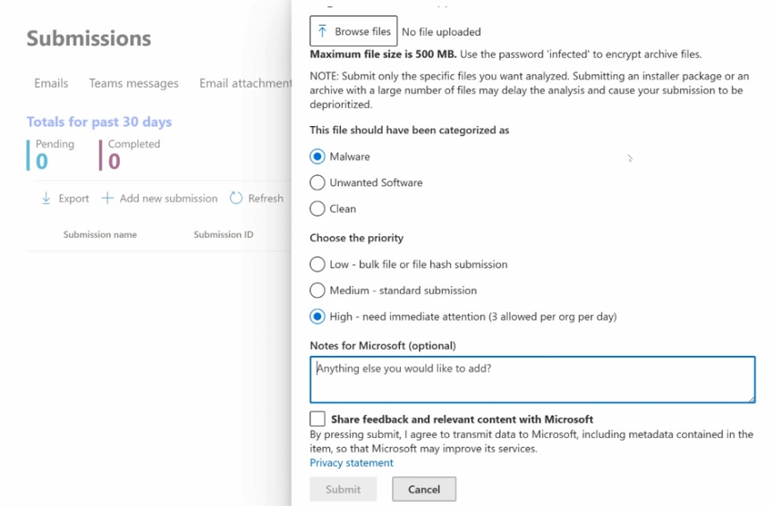
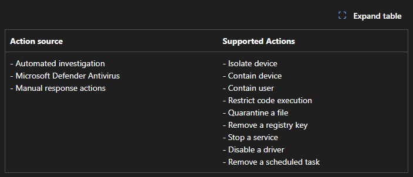

# Topic 33 — Action Center, Automated Investigation & Response

Part of the **SC-200: Microsoft Security Operations Analyst** study series.
This topic covers the **Action Center** (where automated/manual remediation actions are tracked and approved), how **Automated Investigation** works end to end, testing it safely with **endpoint attack simulations**, and submitting suspicious files to Microsoft via **Submissions**.

---

## 1. Action Center

Found at: **Microsoft 365 Defender → Action Center**. This is the single place to see every remediation action taken — automatically or manually — across your endpoints.

Two tabs:
- **Pending** — actions awaiting analyst approval (relevant when automation level requires human sign-off)
- **History** — a full audit log of completed actions

The **History** view shows: Action update time, Investigation ID, Approval ID, Action type, and Details (e.g., file path). In this example, 17 **Quarantine file** actions were taken over the course of a few minutes, all tied to **Investigation #2**, on files under `c:\windows\temp\sb-sim-temp-qqkr...` — the `sb-sim` naming pattern is a strong hint this came from a **Microsoft-provided simulation**, not a real incident.

Toolbar options: **Export**, time range filter (e.g., *1 week*), items-per-page, and column filters — useful when auditing a large volume of automated remediation.

**Key exam point:** every action an Automated Investigation or Defender Antivirus takes is logged here, giving you a full audit trail — this is the go-to place to verify *what actually happened* after an automated remediation, or to approve/reject pending actions if your org runs with semi-automated remediation levels.

---

## 2. Drilling into the Automated Investigation

Clicking an Investigation ID (e.g., from the quarantine actions above) opens the investigation detail page — here, alert **"'Wacatac' malware was prevented"**, Investigation #10, status **Running**.

### Investigation Summary panel
- **Investigation Status Timeline**: elapsed time (`00:13:29`) and current state (Running)
- **Investigation details**: Status, Alert severity (Informational), Category (Malware), Detection source (Antivirus)

### Main investigation graph
Visualizes the full chain, tab by tab:
- **Investigation graph** (default view): `Alert received` → `Device (1)` (`LAPTOP-FTB3LMOS`) and `Entity analyzed (1)` (1 File) both feed into the automated investigation engine → `Evidence` (1 entity found)
- **Alerts (1)**, **Devices (1)**, **Evidence (1)**, **Entities (1)**, **Log (9)** tabs — each drills into that specific dimension of the investigation

Top-right actions: **Cancel Investigation** (stop it mid-flight) and **Comments** (analyst notes/collaboration).

**Key exam point:** Automated Investigation and Response (AIR) doesn't just alert — it automatically traces the full chain (device → entity → evidence), and every remediation step it takes shows up back in the Action Center's History. This is the core AIR mental model: **detect → automatically investigate → automatically remediate (or queue for approval) → log every action**.

---

## 3. Testing it safely — endpoint attack simulations

Found at: **Endpoints → Tutorials & simulations** (under Evaluation & tutorials). Microsoft provides pre-built, harmless simulation files that trigger real detections/investigations without any actual malicious payload — the safe way to validate your Defender for Endpoint configuration.

Example scenarios:
| Scenario | What it does |
|---|---|
| **Document drops backdoor** | Simulates delivery of a socially engineered lure document; opening it launches a specially crafted (harmless) "backdoor" simulating attacker control. Requires an onboarded device with Windows 10 (Anniversary Update, 1607+) |
| **Automated investigation (backdoor)** | Simulates a lure document installing a backdoor, triggering Automated Investigation, which then hunts for and remediates the simulated breach artifacts — testing AIR's full incident-response scaling behavior. Requires Windows 10 April 2018 Update (1803+) |

Each card has a **Get simulation file** button, downloading the lure document (e.g., `RS4_WinATP-Intro-Invoice (1).docm`) to open on an onboarded test device — this is exactly the kind of activity that produced the earlier "Wacatac malware was prevented" investigation and quarantine actions.

**Key exam point:** these simulations are the recommended, supported way to validate AIR/Defender for Endpoint behavior end-to-end in a lab or pre-production environment — they're not "real" malware, so they're safe to run on a properly onboarded test machine, but they still exercise the genuine detection → investigation → remediation pipeline.

---

## 4. Submitting suspicious files to Microsoft

Found at: **Submissions** (Emails / Teams messages / Email attachments / Files tabs). Use this when you have a file you believe is malicious (or wrongly flagged) and want Microsoft's analysts/ML to review it.

Submission form fields:
- **Browse files** — upload the file (max 500 MB; use password `infected` to encrypt archive files before upload for safe transport)
- ⚠️ Submit only the *specific* files you want analyzed — bulk installer packages or large archives may delay analysis and get **deprioritized**
- **This file should have been categorized as**: Malware / Unwanted Software / Clean — i.e., you're telling Microsoft what the *correct* verdict should have been
- **Choose the priority**: Low (bulk file/hash submission), Medium (standard submission), **High** (need immediate attention — capped at **3 allowed per org per day**)
- **Notes for Microsoft** (optional context)
- Optional: **Share feedback and relevant content with Microsoft** (consent to transmit data/metadata to improve their services)

**Key exam points:**
- Submissions is how you correct **false negatives** (something malicious wasn't flagged) and **false positives** (something clean got quarantined) — feeding back into Microsoft's detection engine improves signatures/ML for everyone, not just your tenant.
- The **High priority** tier is explicitly rate-limited (3/day/org) — reserve it for genuinely urgent cases, not routine submissions.
- Password-protecting archive submissions with `infected` is a standard malware-handling convention (prevents accidental execution/scanning-engine false triggers in transit).

---

## 5. Supported automated remediation actions

Whatever the trigger, remediation actions fall into a defined, supported set:

| Action source | Supported Actions |
|---|---|
| Automated investigation | Isolate device |
| Microsoft Defender Antivirus | Contain device |
| Manual response actions | Contain user |
| | Restrict code execution |
| | Quarantine a file |
| | Remove a registry key |
| | Stop a service |
| | Disable a driver |
| | Remove a scheduled task |

**Key exam points:**
- These same actions can originate from **three different sources**: fully automated (AIR), the antivirus engine itself, or a manual analyst response action — the *action* is the same regardless of trigger, which is why Action Center unifies them into one audit trail.
- **Contain device** vs **Isolate device** is a commonly tested distinction: **Isolate device** cuts off nearly all network communication except to Defender for Endpoint's cloud service; **Contain device** is a lighter-touch network restriction targeting a specific unmanaged/compromised device without fully isolating it (often used for devices Defender can see but hasn't fully onboarded).
- **Contain user** — a newer identity-focused containment action, restricting what a compromised *account* can do, complementing device-level containment.

---

## Quick self-check
1. Where would you go to see every remediation action Defender has taken over the past week, and approve any pending ones?
2. What's the difference between the "Document drops backdoor" and "Automated investigation (backdoor)" simulation scenarios?
3. Why should you avoid submitting a full installer package to Submissions?
4. Name three action sources that can all trigger the same set of supported remediation actions.

*(Answers: 1) Action Center — Pending tab for approvals, History tab for the full audit log — 2) The first just simulates the backdoor drop/lure delivery; the second specifically triggers and exercises Automated Investigation's hunting/remediation response — 3) It may delay analysis and get deprioritized, since Microsoft wants only the specific suspicious file(s), not a large bundle — 4) Automated investigation, Microsoft Defender Antivirus, and manual response actions)*
