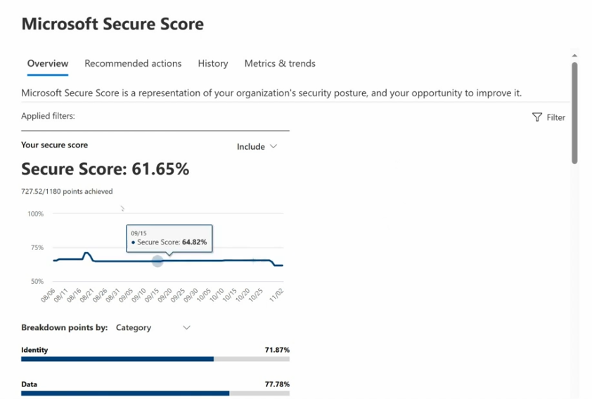
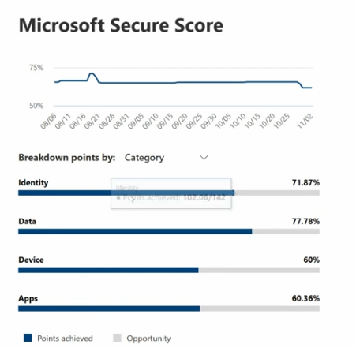
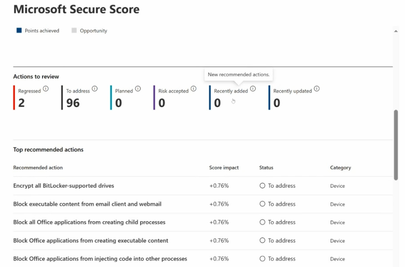

# Topic 34 — Microsoft Secure Score

Part of the **SC-200: Microsoft Security Operations Analyst** study series.
This topic covers **Microsoft Secure Score** — the measurable representation of your organization's security posture, and the primary tool for prioritizing what to fix next.

---

## 1. Overview

Found at: **Microsoft 365 Defender → Microsoft Secure Score**. Tabs: **Overview · Recommended actions · History · Metrics & trends**

> "Microsoft Secure Score is a representation of your organization's security posture, and your opportunity to improve it."

### Reading the score
- **Secure Score: 61.65%** — a percentage derived from **points achieved vs. total points possible** (here: 727.52 / 1180)
- A trend line chart shows the score over time (Aug 6 – Nov 2 in this example), with tooltips showing the exact score on any given date (e.g., 09/15 → 64.82%)
- **Filter** control lets you scope the score view (e.g., by license, by specific workload)
- **Applied filters** row shows what scoping is currently active — "Include" filters narrow which recommendations count toward the displayed score

### Breakdown by category
Points achieved are broken down by category (toggleable — here shown as **Category**, but can also be broken down by *Product* or other groupings):

| Category | Score |
|---|---|
| **Identity** | 71.87% |
| **Data** | 77.78% |
| **Device** | 60% |
| **Apps** | 60.36% |

Each bar shows **Points achieved** (dark blue) vs **Opportunity** (light grey) — i.e., how much more is available in that category if all recommended actions were completed. Hovering a bar shows exact points (e.g., Identity: 102.06/142).

**Key exam point:** Secure Score isn't a single monolithic number to chase blindly — the category breakdown tells you *where* your organization is weakest (here, Device and Apps trail Identity and Data), which should drive prioritization of remediation effort.

---

## 2. Recommended actions

The **Recommended actions** tab (or scrolling further on Overview) shows the actionable backlog behind the score, split into status buckets:

| Status | Meaning |
|---|---|
| **Regressed** | Previously completed actions that have since reverted/broken (2 in this example — worth investigating why) |
| **To address** | Not yet implemented (96 here — the bulk of the backlog) |
| **Planned** | Acknowledged, scheduled for future work |
| **Risk accepted** | Deliberately not implementing — the org has accepted the residual risk |
| **Recently added** | New recommendations Microsoft has introduced |
| **Recently updated** | Existing recommendations whose scoring/guidance changed |

### Top recommended actions table
Each row shows: the specific action, its **Score impact** (how many percentage points completing it would add), current **Status**, and **Category**.

Example top actions (all **Device** category, +0.76% each):
- Encrypt all BitLocker-supported drives
- Block executable content from email client and webmail
- Block all Office applications from creating child processes
- Block Office applications from creating executable content
- Block Office applications from injecting code into other processes

**Key exam points:**
- The last four actions listed are all classic **Attack Surface Reduction (ASR) rules** in Microsoft Defender for Endpoint — Secure Score surfaces ASR rule gaps directly as recommended actions, tying Secure Score to concrete, implementable Defender for Endpoint configuration.
- A **Regressed** action is a strong signal worth investigating immediately — it means a control that was working has since been disabled, misconfigured, or rolled back (accidentally or by a policy change), which is a real posture regression, not just an unmet target.
- **Score impact** lets you prioritize by "biggest bang for the buck" — when triaging 96 "To address" items, sort by score impact to tackle the highest-value fixes first.
- **Risk accepted** is a legitimate outcome — not every recommendation fits every environment; Secure Score explicitly supports documenting *why* something won't be implemented rather than forcing 100% compliance.

---

## Quick self-check
1. How is the Secure Score percentage calculated?
2. Looking at the category breakdown (Identity 71.87%, Data 77.78%, Device 60%, Apps 60.36%), which two categories should get remediation priority?
3. What does a "Regressed" recommended action indicate, and why does it deserve immediate attention?
4. What Defender for Endpoint feature do the top Device recommendations (blocking Office child processes, executable content, code injection) map to?

*(Answers: 1) Points achieved divided by total points possible, expressed as a percentage — 2) Device and Apps, since they have the lowest scores/most opportunity — 3) A previously implemented control has broken or been rolled back — it represents an active posture regression, not just an unmet goal — 4) Attack Surface Reduction (ASR) rules)*
