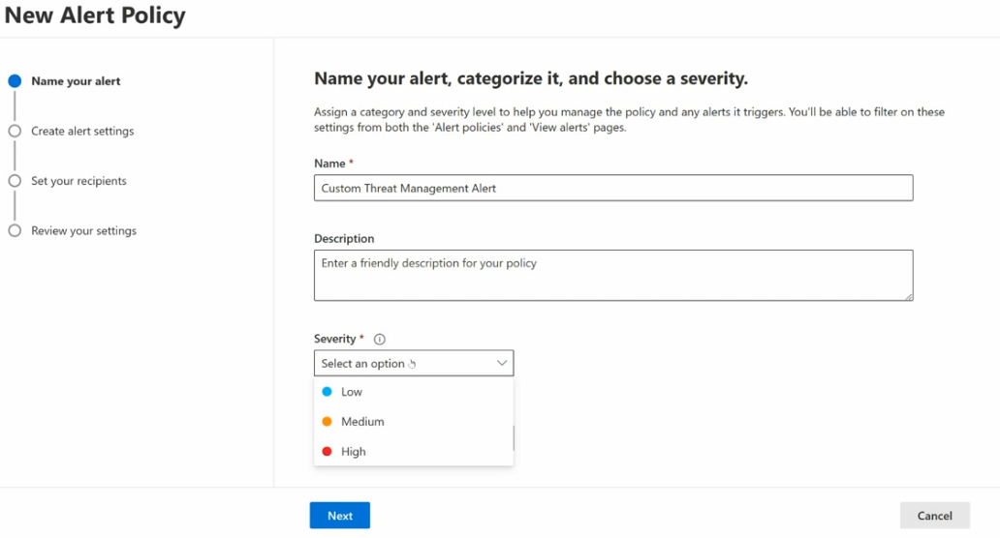
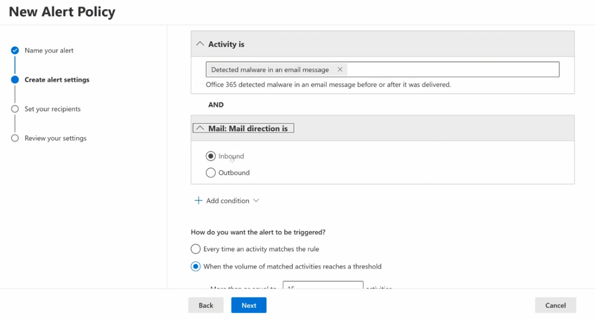
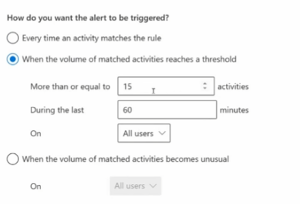
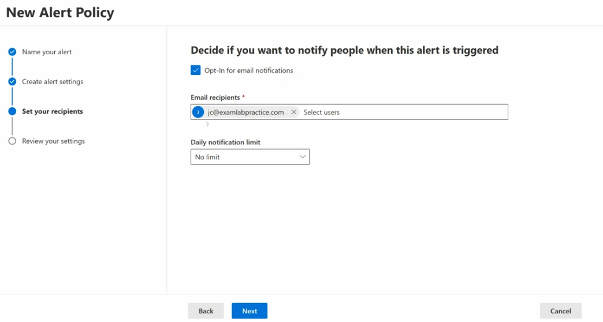
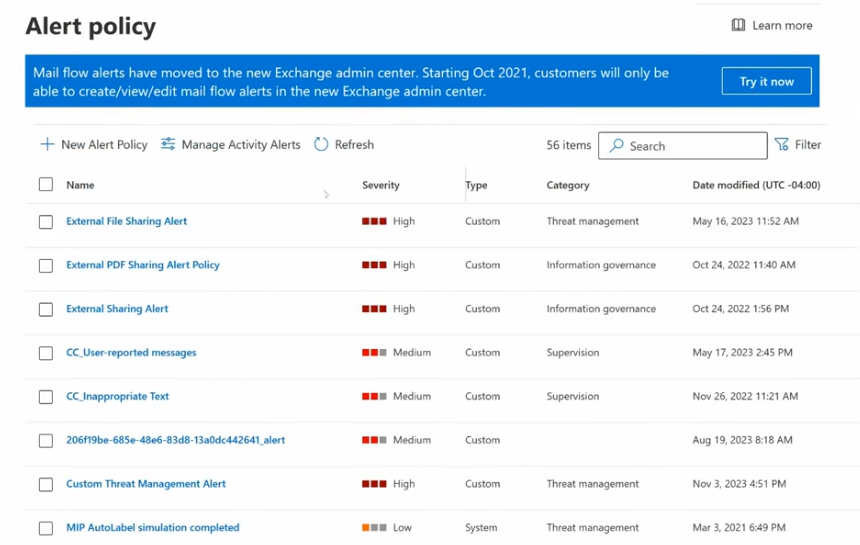

# Topic 36 — Alert Policies (Microsoft Purview / Microsoft 365 Compliance)

Part of the **SC-200: Microsoft Security Operations Analyst** study series.
This topic covers **Alert policies** — the mechanism for defining custom conditions across Microsoft 365 activity (mail flow, DLP, sharing, compliance) that trigger notifications and feed into your SOC's alerting pipeline.

---

## 1. Creating a new alert policy — step by step

The wizard: **Name your alert → Create alert settings → Set your recipients → Review your settings**

### Step 1 — Name your alert
- **Name** (required) — e.g., `Custom Threat Management Alert`
- **Description** — friendly explanation for other admins
- **Severity** (required): **Low / Medium / High** — used for filtering later on both the *Alert policies* list and the *View alerts* page

### Step 2 — Create alert settings
Define the condition(s) that trigger the alert:
- **Activity is**: the specific activity to watch for — e.g., **"Detected malware in an email message"** (*"Office 365 detected malware in an email message before or after it was delivered"*)
- **+ Add condition**: chain additional filters with **AND** logic — e.g., **Mail: Mail direction is → Inbound** (vs Outbound), narrowing the alert to only inbound malware detections

**How do you want the alert to be triggered?**
| Option | Behavior |
|---|---|
| **Every time an activity matches the rule** | Fires on every single matching event — noisy but immediate |
| **When the volume of matched activities reaches a threshold** | Only fires once matches cross a defined bar — reduces noise for high-volume/expected activity |
| **When the volume of matched activities becomes unusual** | Anomaly-based — fires when volume deviates from the user's/org's normal baseline, not a fixed number |

### Threshold configuration detail
When "reaches a threshold" is selected, you configure:
- **More than or equal to** `15` **activities**
- **During the last** `60` **minutes**
- **On**: `All users` (or scope to specific users/groups)

**Key exam point:** threshold-based and anomaly-based triggers exist specifically to solve **alert fatigue** — "every time" triggers are appropriate for rare/high-severity events (like malware detection), while high-frequency activities (like file downloads or sharing) are better served by threshold or unusual-volume triggers so the SOC isn't flooded with noise for routine behavior.

### Step 3 — Set your recipients
- **Opt-In for email notifications** checkbox
- **Email recipients** — add specific users (e.g., `jc@examlabpractice.com`)
- **Daily notification limit** — cap how many notification emails go out per day for this policy (default: **No limit**), protecting recipients from inbox flooding if the alert fires repeatedly

### Step 4 — Review your settings
Final summary before the policy is created/enabled.

**Key exam point:** a **Daily notification limit** is a practical safeguard — if a policy has a misconfigured or overly broad condition, capping notifications prevents the alert from becoming background noise (or overwhelming an inbox) while the underlying rule gets tuned.

---

## 2. Managing alert policies

The **Alert policy** list page (Microsoft Purview compliance portal) shows all existing policies — **56 items** in this example — with columns: Name, Severity, Type (Custom vs System), Category, Date modified.

Example policies visible:
| Name | Severity | Type | Category |
|---|---|---|---|
| External File Sharing Alert | High | Custom | Threat management |
| External PDF Sharing Alert Policy | High | Custom | Information governance |
| External Sharing Alert | High | Custom | Information governance |
| CC_User-reported messages | Medium | Custom | Supervision |
| CC_Inappropriate Text | Medium | Custom | Supervision |
| Custom Threat Management Alert | High | Custom | Threat management |
| MIP AutoLabel simulation completed | Low | **System** | Threat management |

Toolbar actions: **+ New Alert Policy**, **Manage Activity Alerts**, **Refresh**, **Search**, **Filter**.

A banner also flags an important platform change: *mail flow alerts have moved to the new Exchange admin center* — starting Oct 2021, mail flow alert creation/editing must happen there instead of the classic alert policy page.

**Key exam points:**
- **Type: System** policies are Microsoft-provided defaults (e.g., MIP AutoLabel simulation completed) vs **Custom** policies built by your admins — know that both coexist in the same list and both can be filtered/managed together.
- **Category** groups policies by function: **Threat management**, **Information governance**, **Supervision**, **Data loss prevention**, etc. — useful for quickly finding all policies relevant to a specific compliance/security domain.
- The **mail flow → Exchange admin center** migration is a good example of Microsoft consolidating overlapping admin surfaces — expect exam awareness that not all alerting configuration lives in one single portal; some categories (mail flow specifically) have moved elsewhere.
- Alert policies here are distinct from **Microsoft Sentinel Analytics rules** — these live in the Microsoft Purview compliance layer (covering DLP, sharing, information governance, supervision) rather than the SIEM/XDR detection layer, though both can ultimately feed the same SOC workflow.

---

## Quick self-check
1. What's the difference between "Every time an activity matches the rule" and "When the volume of matched activities reaches a threshold"?
2. Why would you set a Daily notification limit on an alert policy?
3. What changed about mail flow alerts starting October 2021?
4. What's the difference between a "System" and "Custom" alert policy Type?

*(Answers: 1) The first fires on every single match (immediate, noisy); the second only fires once matches cross a defined volume within a time window (reduces noise) — 2) To prevent an alert from flooding recipients' inboxes if it fires repeatedly, especially useful while tuning a new policy — 3) They moved to the new Exchange admin center; customers can only create/view/edit them there going forward — 4) System policies are Microsoft-provided defaults; Custom policies are built by your own admins)*
