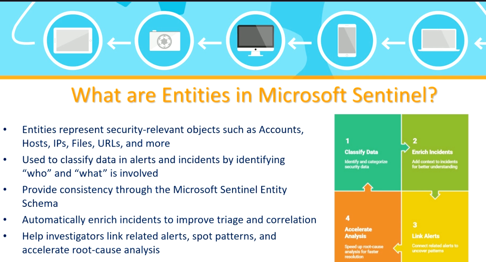
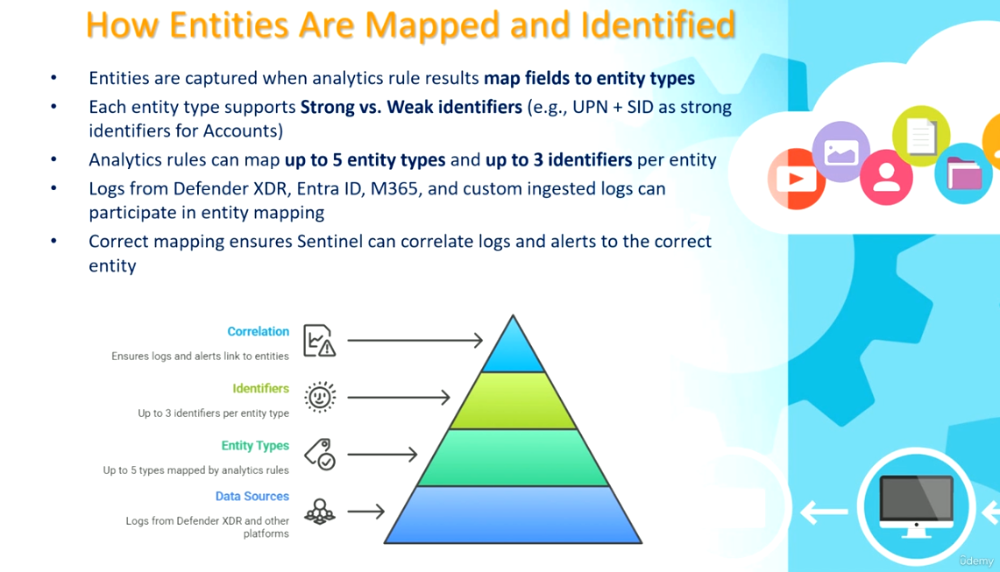
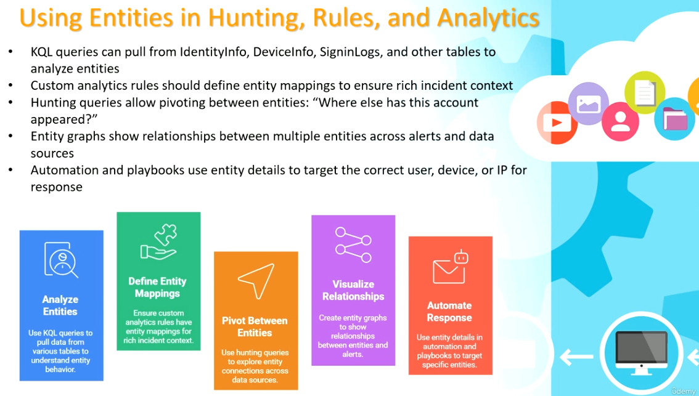
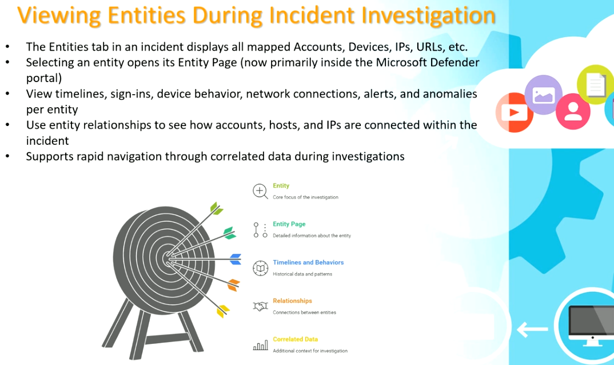
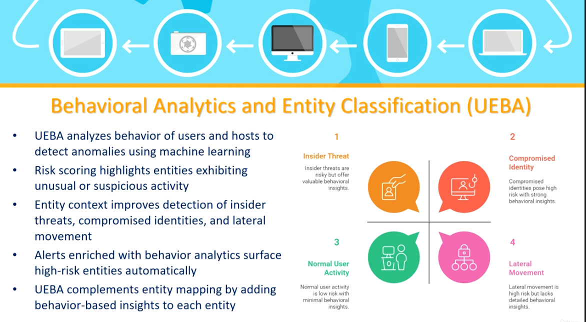

# Topic 37 — Entities, Entity Mapping & UEBA in Microsoft Sentinel

Part of the **SC-200: Microsoft Security Operations Analyst** study series.
This topic covers **Entities** — the core objects (accounts, hosts, IPs, files, URLs) that Sentinel uses to give alerts and incidents context — how they're mapped, how analysts use them during investigation, and how **UEBA** (User and Entity Behavior Analytics) layers risk scoring on top.

---

## 1. What are Entities in Microsoft Sentinel?

Entities represent **security-relevant objects** — Accounts, Hosts, IPs, Files, URLs, and more. They exist to answer the two fundamental investigation questions: **"who"** and **"what"** is involved in a piece of security data.

Entities serve four connected purposes:

| Step | Purpose |
|---|---|
| **1. Classify Data** | Identify and categorize security data |
| **2. Enrich Incidents** | Add context to incidents for better understanding |
| **3. Link Alerts** | Connect related alerts to uncover patterns |
| **4. Accelerate Analysis** | Speed up root-cause analysis for faster resolution |

Entities provide **consistency** through the Microsoft Sentinel Entity Schema — a shared, standardized structure so every alert/incident describes the same entity type the same way regardless of source.



**Key exam point:** the value of entities isn't just labeling — it's that a standardized schema lets Sentinel **automatically correlate** the same account or host across completely different alerts and data sources, which is what makes incident correlation and investigation graphs possible.

---

## 2. How entities are mapped and identified

Entities aren't automatic — they're **captured when analytics rule results map fields to entity types**. This mapping happens in a layered structure:

```
        ▲ Correlation
        │  Ensures logs and alerts link to entities
        │
        ▲ Identifiers
        │  Up to 3 identifiers per entity type
        │
        ▲ Entity Types
        │  Up to 5 types mapped by analytics rules
        │
        ▲ Data Sources
           Logs from Defender XDR and other platforms
```

Key rules/limits:
- Each entity type supports **Strong vs. Weak identifiers** — e.g., for an **Account** entity, **UPN + SID** together form a strong identifier (unambiguous), while a bare username alone would be weaker/more ambiguous.
- An analytics rule can map **up to 5 entity types**, and **up to 3 identifiers per entity**.
- Data feeding entity mapping can come from **Defender XDR, Entra ID, M365**, and **custom ingested logs**.
- Correct mapping is what lets Sentinel **correlate logs and alerts to the correct entity** — get the mapping wrong (e.g., only a weak identifier), and the same real-world account might show up as multiple disconnected "entities."



**Key exam point:** this is a frequently tested detail — remember the specific limits: **5 entity types max**, **3 identifiers per entity type max**, and the **strong vs. weak identifier** concept (UPN+SID = strong for Accounts). When building a custom analytics rule, always map the *strongest available* identifier combination to maximize correlation accuracy.

---

## 3. Using entities in Hunting, Rules, and Analytics

Entities aren't just passive metadata — they're actively used across the SOC workflow:

| Capability | How it uses entities |
|---|---|
| **Analyze Entities** | KQL queries pull data from tables like `IdentityInfo`, `DeviceInfo`, `SigninLogs` to analyze entity behavior |
| **Define Entity Mappings** | Custom analytics rules should always define entity mappings to ensure rich incident context downstream |
| **Pivot Between Entities** | Hunting queries let you explore entity connections across data sources — e.g., "Where else has this account appeared?" |
| **Visualize Relationships** | Entity graphs show relationships between multiple entities across alerts and data sources |
| **Automate Response** | Automation/playbooks use entity details to target the *correct* user, device, or IP for a remediation action |



**Key exam point:** the "pivot between entities" hunting pattern ("where else has this account appeared?") is a core investigative technique — it's how an analyst goes from a single suspicious sign-in to discovering the same account involved in a broader compromise across multiple systems.

---

## 4. Viewing entities during incident investigation

Inside an open incident, the **Entities tab** displays every mapped Account, Device, IP, URL, etc. tied to that incident. Selecting one opens its dedicated **Entity Page** (now primarily surfaced inside the unified **Microsoft Defender portal**).

An Entity Page centers the investigation around that specific object, surfacing:

| Element | What it shows |
|---|---|
| **Entity** | The core focus of the investigation |
| **Entity Page** | Detailed information about that specific entity |
| **Timelines and Behaviors** | Historical data patterns — sign-ins, device behavior, network connections, alerts, anomalies |
| **Relationships** | Connections between this entity and others (accounts, hosts, IPs) within the incident |
| **Correlated Data** | Additional context pulled in to support the investigation |



**Key exam point:** this supports **rapid navigation through correlated data** — instead of manually cross-referencing multiple log tables, an analyst can click an entity and immediately see its full behavioral history and relationships, dramatically speeding up triage.

---

## 5. Behavioral Analytics and Entity Classification (UEBA)

**UEBA (User and Entity Behavior Analytics)** layers machine-learning-driven behavioral analysis on top of the entity model — analyzing the behavior of users and hosts to detect anomalies, and applying **risk scoring** to highlight entities exhibiting unusual or suspicious activity.

UEBA improves detection across four risk categories:

| Quadrant | Risk profile |
|---|---|
| **1. Insider Threat** | Risky, but offers valuable behavioral insights |
| **2. Compromised Identity** | High risk with strong behavioral insights |
| **3. Normal User Activity** | Low risk with minimal behavioral insights |
| **4. Lateral Movement** | High risk, but lacks detailed behavioral insights (harder to characterize from behavior alone) |



**Key exam points:**
- UEBA **complements** entity mapping rather than replacing it — entity mapping tells you *who/what* is involved; UEBA adds *how risky/anomalous* their behavior is.
- Alerts enriched with behavior analytics **automatically surface high-risk entities** — this is how Sentinel prioritizes triage without an analyst manually reviewing every single alert.
- Lateral movement is flagged as high-risk but with comparatively weaker behavioral signal — meaning UEBA alone often isn't sufficient to catch lateral movement; it typically needs to be corroborated with network/device telemetry and analytics rules specifically designed for that pattern.

---

## Quick self-check
1. What's the maximum number of entity types an analytics rule can map, and identifiers per entity type?
2. What makes UPN + SID a "strong" identifier for an Account entity, versus a bare username?
3. What's the difference between what entity mapping tells you and what UEBA adds on top?
4. In the UEBA risk quadrants, why is Lateral Movement considered high risk but with weaker behavioral insight?

*(Answers: 1) Up to 5 entity types, up to 3 identifiers per entity type — 2) UPN + SID together uniquely and unambiguously identify a specific account, whereas a bare username could be ambiguous or reused — 3) Entity mapping identifies who/what is involved (identity/classification); UEBA adds behavioral risk scoring on top (how anomalous/suspicious that entity's activity is) — 4) Lateral movement often unfolds across multiple systems/protocols in ways that don't produce a single clear behavioral anomaly signal, making it harder to characterize purely from behavior analytics alone)*
