# Microsoft Sentinel — Detection, Incident Response & SOAR Automation Lab

A follow-on lab that takes a Microsoft Sentinel workspace from "logs are flowing" to a full **detect → triage → investigate → respond** workflow: writing a custom analytics rule to catch RDP brute-force attempts, validating the detection logic in KQL, triaging the resulting incident, pivoting into entity/threat-intel context, confirming attacker success/failure with a hunting query, and finally building and running a SOAR playbook that can automatically remediate the threat via Microsoft Defender for Endpoint.

---

## Table of Contents

1. [Objectives](#objectives)
2. [Scenario](#scenario)
3. [Architecture / Flow](#architecture--flow)
4. [Prerequisites](#prerequisites)
5. [Step-by-Step Walkthrough](#step-by-step-walkthrough)
   - [Task 1 — Create the Analytics Rule](#task-1--create-the-analytics-rule)
   - [Task 2 — Validate Detection Logic with KQL](#task-2--validate-detection-logic-with-kql)
   - [Task 3 — Review Triggered Incidents](#task-3--review-triggered-incidents)
   - [Task 4 — Incident Details & Attack Story](#task-4--incident-details--attack-story)
   - [Task 5 — Entity Investigation (IP Enrichment)](#task-5--entity-investigation-ip-enrichment)
   - [Task 6 — Investigate: Did the Attack Succeed?](#task-6--investigate-did-the-attack-succeed)
   - [Task 7 — Add the Microsoft Defender for Endpoint Connector](#task-7--add-the-microsoft-defender-for-endpoint-connector)
   - [Task 8 — Manage the Incident](#task-8--manage-the-incident)
   - [Task 9 — Explore Playbook Templates](#task-9--explore-playbook-templates)
   - [Task 10 — Create a Custom Playbook](#task-10--create-a-custom-playbook)
   - [Task 11 — Run the Playbook on the Incident](#task-11--run-the-playbook-on-the-incident)
6. [Troubleshooting & Solutions](#troubleshooting--solutions)
7. [Key Takeaways](#key-takeaways)
8. [Repo Structure](#repo-structure)

---

## Objectives

- Write a **Scheduled Analytics Rule** in KQL that detects RDP brute-force behavior (repeated failed logons from the same source IP).
- Confirm the detection logic manually against raw `SecurityEvent` data before trusting the automated rule.
- Work a generated **incident** end-to-end inside the Sentinel/Defender incident queue: attack story, entity graph, IP enrichment, classification, assignment.
- Use **Advanced Hunting** to answer the actual security question — *did the brute-force attempt succeed?*
- Install the **Microsoft Defender for Endpoint** solution from Content Hub to unlock ready-made remediation playbooks.
- Build a custom **Logic Apps playbook** wired to the Microsoft Sentinel connector, and trigger it manually against a live incident (SOAR).

## Scenario

Multiple failed RDP (Remote Desktop Protocol) login attempts are observed against a monitored account from a single external IP address in a short window — a classic brute-force signature (Windows Event ID `4625`, `LogonType 10`). The lab builds a detection for this pattern, walks through triaging the resulting incident like an analyst would, and closes the loop with an automated response playbook.

## Architecture / Flow

```
 SecurityEvent (EventID 4625, LogonType 10)
              │
              ▼
   Analytics Rule: "RDP Brute Force Detection"
   (runs every 5 min, ≥3 failed attempts / IP+Account / 5-min bin)
              │
              ▼
        Incident created
    (Sentinel Incidents queue)
              │
   ┌──────────┼───────────────┐
   ▼          ▼               ▼
Attack     IP Entity      Advanced Hunting
 Story     Enrichment    (was logon 4624
(graph)   (geo/ASN/rep)   ever successful?)
   │          │               │
   └──────────┴───────────────┘
              ▼
      Manage incident
  (severity, status, owner)
              │
              ▼
   Defender for Endpoint connector
     (Content Hub — remediation
        playbook templates)
              │
              ▼
   Custom Playbook: Block-IP-DefenderEndpoint
     (Logic App, Sentinel-triggered)
              │
              ▼
       Run playbook on incident
         (manual SOAR trigger)
```

## Prerequisites

- A Microsoft Sentinel workspace already receiving `SecurityEvent` data (see the prior lab: *Microsoft Sentinel SIEM Deployment Lab*).
- Permissions to create Analytics Rules and Automation Rules/Playbooks in Sentinel (typically **Microsoft Sentinel Contributor** + **Logic App Contributor**).
- **Microsoft Sentinel Automation Contributor** role (or equivalent) to authorize a playbook's managed identity against Sentinel.
- Access to Content Hub to install the **Microsoft Defender for Endpoint** solution.
- Basic KQL familiarity for writing/reading the detection query.

---

## Step-by-Step Walkthrough

### Task 1 — Create the Analytics Rule

**What it is:** An Analytics Rule is a saved KQL query Sentinel runs on a schedule; when the query returns results above a threshold, Sentinel raises an **alert** and (optionally) groups it into an **incident**.

**Steps:**
1. **Microsoft Sentinel → Analytics → + Create → Scheduled query rule**.
2. **General tab:**
   - **Name:** `RDP Brute Force Detection`
   - **Description:** *Detect multiple failed RDP logins from the same IP*
   - **Tactics (MITRE ATT&CK):** Credential Access
   - **Severity:** High
   - **Status:** Enabled
3. **Set rule logic tab** — the detection query:
   ```kql
   SecurityEvent
   | where EventID == 4625
   | where LogonType == 10                                   // restrict to RDP logons only
   | where isnotempty(IpAddress) and IpAddress != "-" and IpAddress != "127.0.0.1"
   | where TimeGenerated > ago(5m)                            // match the rule period
   | summarize FailedAttempts = count() by IpAddress, Account, bin(TimeGenerated, 5m)
   | where FailedAttempts >= 3
   ```
   - **Rule frequency:** every 5 minutes · **Rule period:** last 5 minutes of data · **Rule start time:** Automatic.
   - **Rule threshold:** trigger if query returns **more than 0** results.
   - **Event grouping:** trigger an alert for each event.
   - **Entity mapping:**
     - Entity 1 — **IP**: identifier `Address`, value `IpAddress`
     - Entity 2 — **Account**: identifier `Name`, value `Account`

     Entity mapping is what lets Sentinel draw the incident graph and correlate this IP/Account across other alerts later.
4. **Incident settings tab:** Create incidents from this rule = **Enabled**; Alert grouping = **Disabled** (each alert becomes its own incident in this lab); Incident correlation = **Tenant default**.
5. **Automated response tab:** left empty here (playbook wiring happens later, in Tasks 9–11).
6. **Review + create** → **Create**.

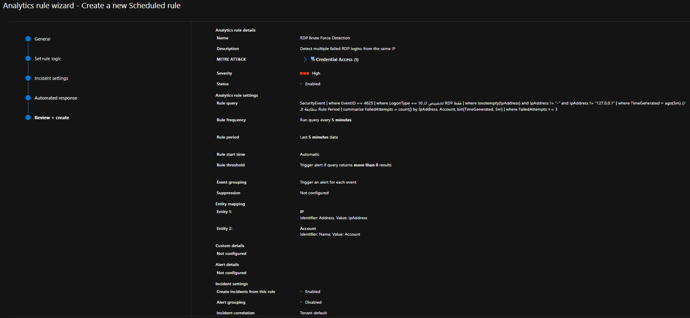

> **Design note:** `EventID == 4625` is *any* failed logon; adding `LogonType == 10` scopes it specifically to RDP/RemoteInteractive sessions, so the rule doesn't fire on failed console or service logons. Filtering out `IpAddress == "-"` and `127.0.0.1` removes local/loopback noise that can otherwise generate false positives.

---

### Task 2 — Validate Detection Logic with KQL

**What it is:** Before trusting an automated rule, it's good practice to run the underlying logic manually against a wider time window and confirm real matching data exists.

**Steps:**
1. **Logs** blade → paste a slightly relaxed version of the rule logic to sanity-check the pattern over a longer window:
   ```kql
   SecurityEvent
   | where EventID == 4625
   | where TimeGenerated > ago(15m)
   | summarize FailedAttempts = count() by IpAddress, Account, bin(TimeGenerated, 5m)
   | where FailedAttempts >= 5
   ```
2. **Run.**

**Result:**

| IpAddress | Account | TimeGenerated (UTC) | FailedAttempts |
|---|---|---|---|
| 156.197.169.2 | MicrosoftAccount\azureadmin | 7/31/2026 7:00:00 PM | 6 |

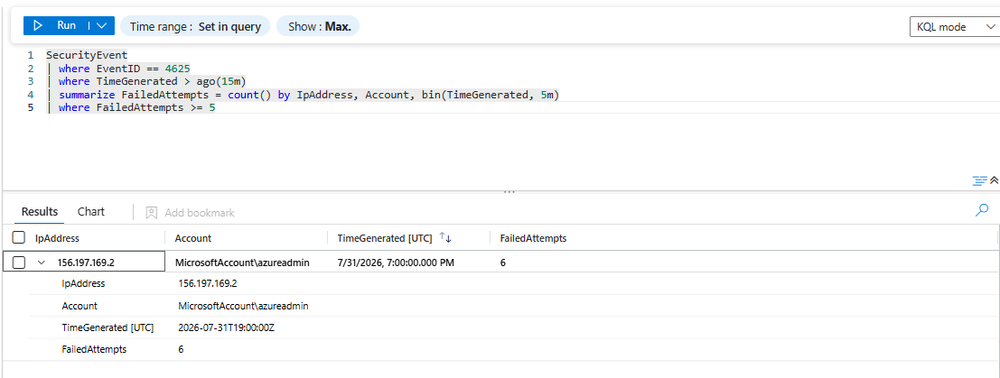

> This confirms the pattern is real: a single external IP (`156.197.169.2`) generated **6 failed logons** against the `azureadmin` account inside one 5-minute bin — comfortably above the `>= 3` threshold set in the analytics rule, so the rule is expected to fire.

---

### Task 3 — Review Triggered Incidents

**What it is:** Once the analytics rule condition is met, Sentinel raises alerts and rolls them into incidents that show up in the unified **Incidents** queue (Defender portal).

**Steps:**
1. Open **Incidents** in the Defender/Sentinel portal.
2. Filter set applied: `Status: New, In progress, Resolved`, `Alert severity: High, Medium, Low, +1`, `Priority score: 0–100, Not set`.
3. Observe **2 incidents**, both titled `RDP Brute Force Detection` (IDs 1 and 2), Severity **High**, Investigation state **Credential access**, Impacted asset `MicrosoftAccount\azureadmin`, Service source **Microsoft Sentinel**, Detection source **Scheduled detection**.

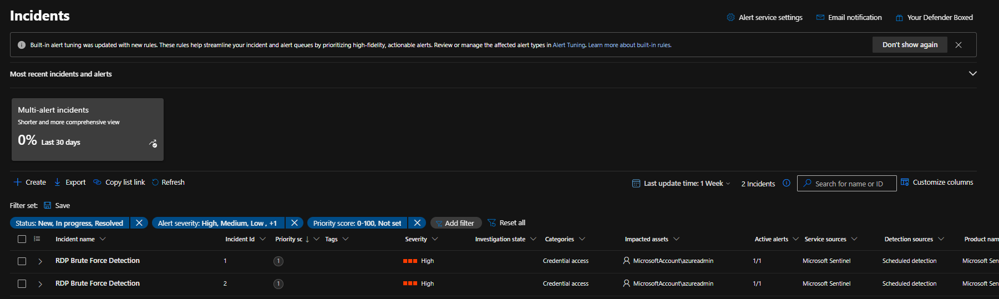

> **Why two incidents?** With **Alert grouping disabled** on the rule (Task 1), each qualifying alert becomes its own incident rather than being merged — so two separate 5-minute windows that each crossed the `>=3` threshold produced two distinct incidents instead of one combined case.

---

### Task 4 — Incident Details & Attack Story

**What it is:** Drilling into an incident surfaces the **attack story** — a visual/relational view of the alert, its entities, and how they connect — plus tabs for alerts, activities, assets, investigations, and evidence.

**Steps:**
1. Open **ID 1: RDP Brute Force Detection**.
2. Review the header: Severity **High**, Status **Active**, Owner **Unassigned**, Classification **Undassified**, and timestamps for first/last activity and creation time.
3. Review the **Alerts** panel: one alert, `MicrosoftAccount\azureadmin` flagged.
4. Review the **Incident graph**: shows the `156.197.169.2` IP entity linked to the `MicrosoftAccount\azureadmin` account entity via a **Communication** edge (dashed = association).

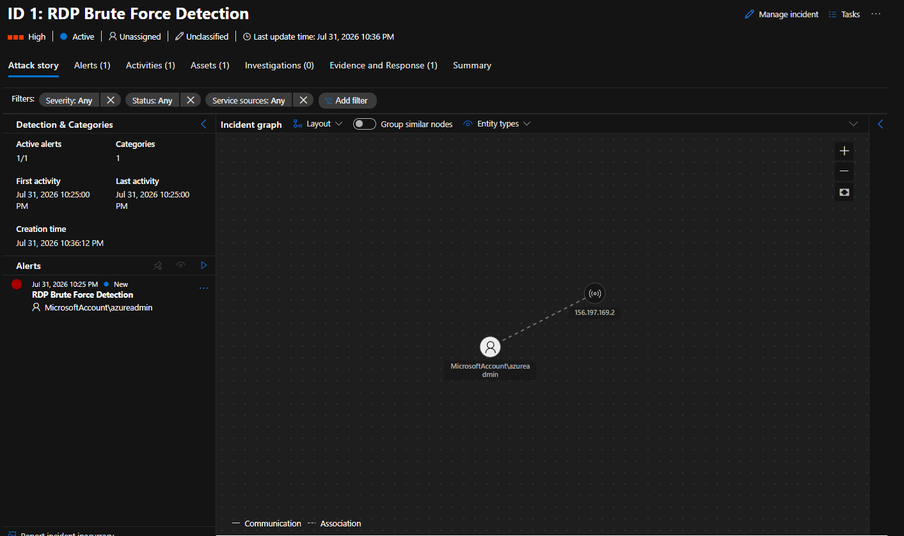

> The entity graph exists **because** of the entity mapping configured back in Task 1 — without mapping `IpAddress` and `Account` as entities on the rule, this graph would just show a bare alert with no relational context.

---

### Task 5 — Entity Investigation (IP Enrichment)

**What it is:** Clicking into the IP entity node opens Sentinel's built-in enrichment for that indicator — geolocation, ASN/ISP, entity reputation, and a rollup of how many incidents/alerts reference it.

**Steps:**
1. From the incident graph, select the `156.197.169.2` node.
2. Review the enrichment panel:
   - **Organization (ISP):** TE Data · **ASN:** 8452
   - **Country/Region:** Egypt · **State/City:** Al Qahirah
   - **Detection:** 1 active alert in 1 incident, severity breakdown (High: 1)
   - **Entity reputation:** Suspicious (1/100)
   - **Log activity:** First seen / Last seen timestamps

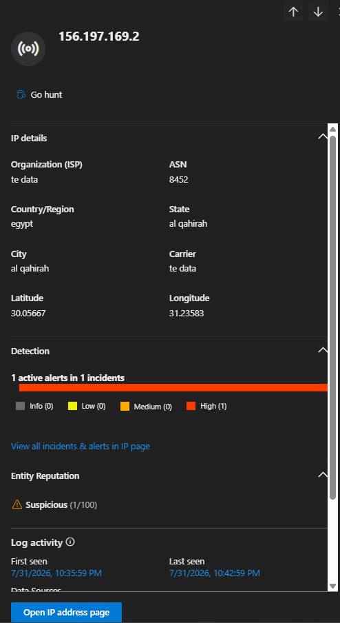

> **Analyst read:** A "Suspicious (1/100)" reputation score is *low-confidence* — it's flagged, but this alone isn't a smoking gun. Geolocating to a residential/consumer ISP (TE Data, a well-known Egyptian consumer ISP) combined with a burst of RDP failures is consistent with either a compromised home machine or a rented VPS/proxy — worth pivoting to hunting (Task 6) rather than concluding maliciousness from IP reputation alone.

---

### Task 6 — Investigate: Did the Attack Succeed?

**What it is:** The real question an analyst needs answered isn't "were there failed logons" — it's **"did any of them ever succeed?"** This is done in **Advanced Hunting**, checking for a *successful* interactive logon (`EventID 4624`) from the same source IP.

**Steps:**
1. Open **Advanced hunting** (workspace: `mylogworkspace`).
2. Run:
   ```kql
   SecurityEvent
   | where EventID == 4624
   | where TimeGenerated > ago(24h)
   | where IpAddress == "156.197.169.2"
   | project TimeGenerated, Account, IpAddress, LogonType, Computer
   | sort by TimeGenerated desc
   ```
3. **Result: 0 items — "No results found in the specified time frame."**

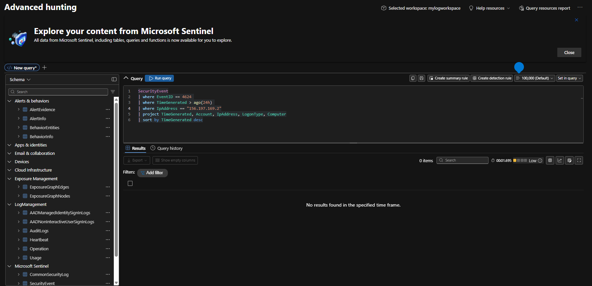

> **Conclusion:** The brute-force attempts from `156.197.169.2` **did not result in a successful logon** in the last 24 hours. This is the key evidence that downgrades this from "active breach" to "failed intrusion attempt" — still worth blocking the source and monitoring, but not an active compromise requiring incident escalation to containment/forensics.

---

### Task 7 — Add the Microsoft Defender for Endpoint Connector

**What it is:** Installing the **Microsoft Defender for Endpoint** solution from **Content Hub** brings in the data connector *and* a library of ready-made remediation playbooks (isolate device, run AV scan, block file hash, etc.) that can be wired into automation rules.

**Steps:**
1. **Sentinel → Content hub → search "Microsoft Defender for Endpoint" → Install.**
2. Review the installed solution: **28 installed content items**, **23 requiring configuration**.
   - **Content breakdown:** 1 Analytics rule, 1 Data connector, 2 Parsers, 2 Hunting queries, **22 Playbooks**.
   - **Category:** Security – Threat Protection · **Pricing:** Free.
3. Note dependencies: relies on the **Codeless Connector Platform / Native Microsoft Sentinel Polling**.

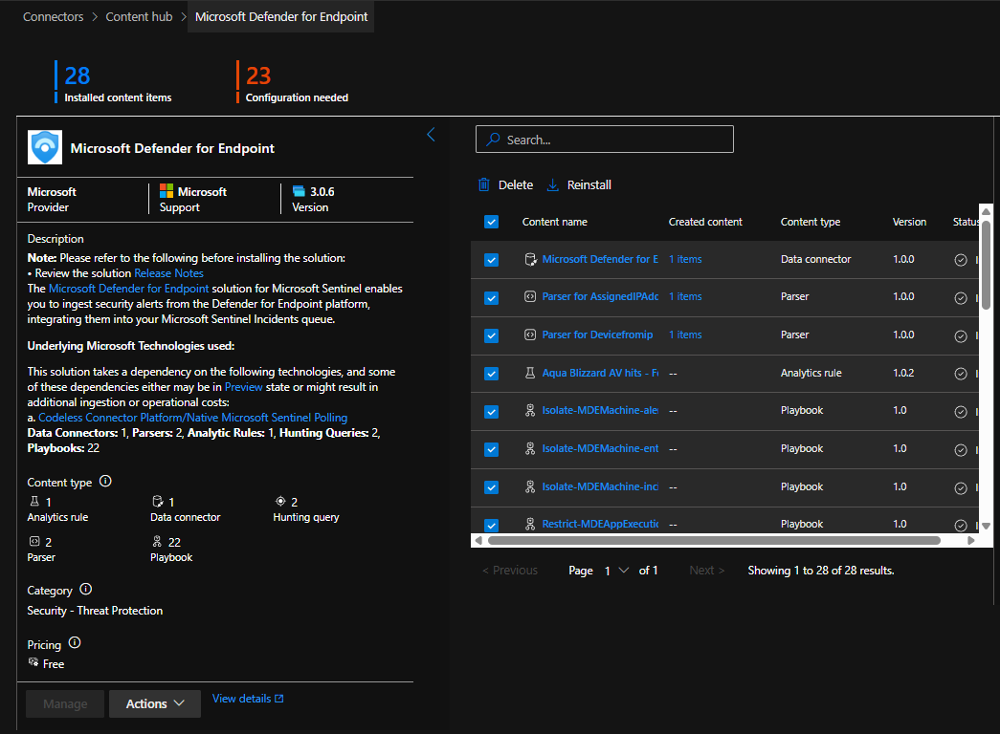

> Installing the solution **does not automatically deploy or enable** all 22 playbooks — each still needs its own connection/managed identity set up ("23 Configuration needed"), which is what Tasks 9–10 continue with.

---

### Task 8 — Manage the Incident

**What it is:** The **Manage incident** panel is where an analyst records triage decisions — assignment, severity confirmation, status, and classification — so the incident's lifecycle is auditable.

**Steps:**
1. On the incident, click **Manage incident**.
2. Set:
   - **Incident name:** RDP Brute Force Detection
   - **Severity:** High (confirmed as-is)
   - **Incident tags:** (optional — none added in this lab)
   - **Assign to:** `Mohamed2312001@outlook.com`
   - **Status:** In Progress
   - **Classification:** Unclassified (pending final determination)
3. **Save.**

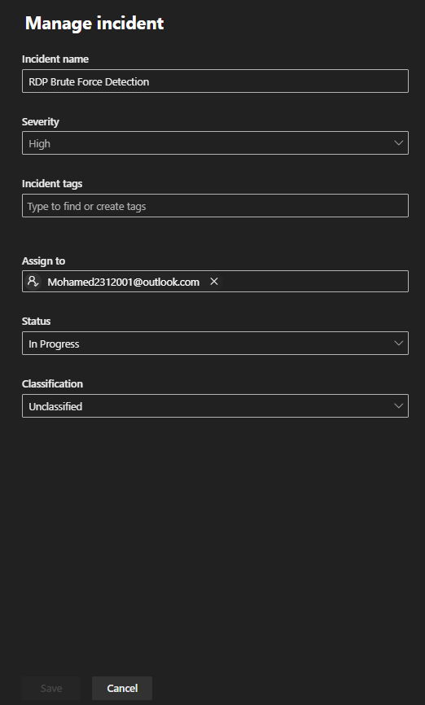

> Given the Task 6 finding (no successful logon), the eventual classification here would typically move to **"True Positive – suspicious activity"** rather than a benign/false-positive close, since the pattern is real even though it didn't succeed.

---

### Task 9 — Explore Playbook Templates

**What it is:** **Playbook templates** are Microsoft- and partner-authored Logic App blueprints (installed via Content Hub, e.g. from the Defender for Endpoint solution in Task 7) that can be deployed with a few clicks instead of building automation from scratch.

**Steps:**
1. **Sentinel → Automation → Playbook templates** tab.
2. Note current automation posture: **0 automation rules, 0 enabled rules, 0 enabled playbooks** — nothing deployed yet.
3. Browse available MDE-related templates, e.g.:
   - `Restrict MDE URL - Entity Triggered`
   - `Restrict MDE FileHash - Alert Triggered`
   - `Unisolate MDE Machine using entity...`
   - `Revoke Entra ID Sign-in session using...`
   - `Isolate endpoint - MDE - Incident...`
   - `Run MDE Antivirus - Alert Triggered` / `- Incident Triggered`
   - `Restrict MDE Domain / IP Address / App Execution - Alert Triggered`
   - `Reset Microsoft Entra ID User Password...`

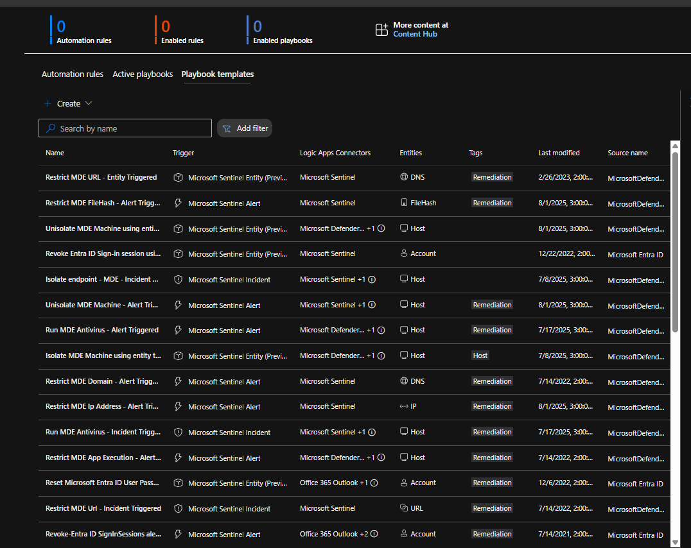

> Each template lists its **Trigger** (Sentinel Alert, Incident, or Entity-triggered) and **Logic Apps Connectors** used — useful for picking a template that matches how you want automation to fire (e.g., per-alert vs. per-incident vs. on-demand from an entity page).

---

### Task 10 — Create a Custom Playbook

**What it is:** Rather than deploying a template as-is, this step builds a **custom Logic App playbook** from scratch, wired to the Microsoft Sentinel connector so it can be triggered from an incident.

**Steps:**
1. **Automation → Active playbooks → + Create → Playbook with incident trigger** (Logic App).
2. **Basics:**
   - **Subscription:** Azure subscription 1
   - **Resource group:** `RG4`
   - **Region:** East US
   - **Playbook name:** `Block-IP-DefenderEndpoint`
   - **Diagnostics logs workspace:** `MyLogWorkspace`
3. **Connections:** Microsoft Sentinel connector → **Connect with managed identity**.
4. **Review and create** → **Create**.

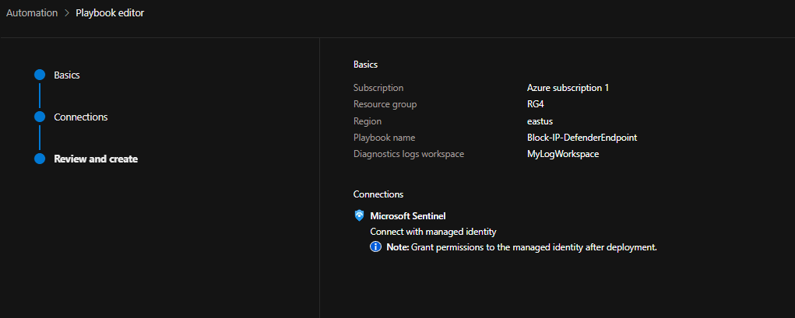

> **Important note surfaced in-portal:** *"Grant permissions to the managed identity after deployment."* A freshly created playbook's managed identity has **no permissions** by default — it must be explicitly granted a role (typically **Microsoft Sentinel Responder** or a scoped custom role, plus **Microsoft Defender for Endpoint** API permissions for this specific use case) before it can actually act on an incident or call MDE's isolate/block APIs. Skipping this step is the most common reason a playbook "runs" but does nothing.

---

### Task 11 — Run the Playbook on the Incident

**What it is:** The final step closes the loop — manually invoking the new playbook against the live incident from Task 3/4, simulating what an **automation rule** would otherwise do automatically on every matching future incident.

**Steps:**
1. Open the incident (**RDP Brute Force Detection, ID: 1**) → **⋯ → Run playbook** (or **Actions → Run playbook**).
2. On the **Run playbook on incident** panel, the **Playbooks** tab lists eligible playbooks — filtered to only those *enabled and configured with the Microsoft Sentinel incident trigger*.
3. Select `Block-IP-DefenderEnd...` (`Block-IP-DefenderEndpoint`, resource group `RG4`) → **Run playbook**.

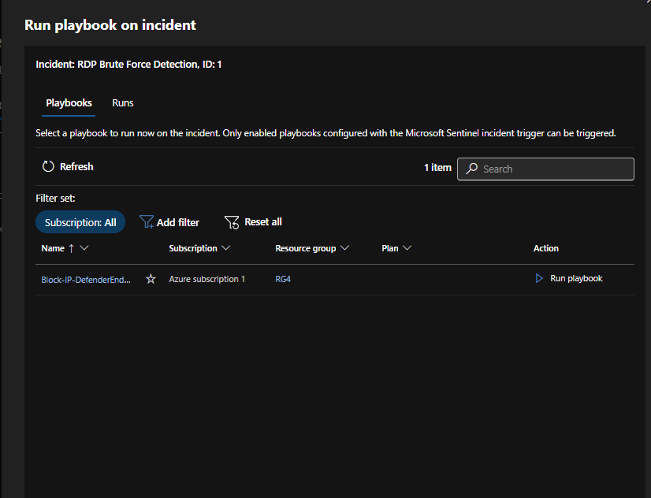

> The panel explicitly states: *"Only enabled playbooks configured with the Microsoft Sentinel incident trigger can be triggered."* If a playbook doesn't appear in this list, the two most common causes are (a) it was built with a different trigger (e.g., **Entity** or **Alert** trigger instead of **Incident** trigger), or (b) it's disabled in the Logic App resource itself.

---

## Troubleshooting & Solutions

| Issue | Root Cause | Solution |
|---|---|---|
| Analytics rule created but no incident appears | Underlying data doesn't actually meet the threshold yet | Manually re-run the rule's KQL logic in Logs (Task 2) with a wider time window to confirm matching data exists before assuming the rule is broken |
| Two separate incidents instead of one combined case | **Alert grouping** was disabled on the rule | Enable alert grouping (and configure a grouping window) on the analytics rule if a single correlated incident is preferred over one-per-alert |
| Playbook doesn't appear in "Run playbook on incident" list | Playbook trigger type doesn't match, or the playbook is disabled | Rebuild/redeploy the playbook using the **Microsoft Sentinel incident trigger**, and confirm it's enabled in the Logic App resource |
| Playbook runs but takes no remediation action | Managed identity has no permissions after deployment | Grant the playbook's managed identity the required Sentinel role (e.g., Responder) and any downstream API permissions (e.g., MDE) as flagged in the Task 10 deployment note |
| IP entity shows a low "Suspicious" reputation score and it's unclear whether to escalate | Reputation scoring alone is low-confidence signal | Corroborate with Advanced Hunting (Task 6) for successful logons before deciding escalation/classification — don't classify on reputation score alone |
| Advanced hunting query for `EventID 4624` returns 0 results | No successful logon occurred from that IP in the queried window — expected for a failed brute-force attempt | Treat as confirmation the attack failed, not as a query error; still worth blocking/monitoring the source IP |

## Key Takeaways

- A detection is only as good as its filters — `EventID == 4625` alone is noisy; adding `LogonType == 10` and excluding loopback/empty IPs is what makes this rule specifically an *RDP* brute-force detector.
- **Entity mapping** in the analytics rule (Task 1) is a prerequisite for everything downstream: the incident graph, IP enrichment pivots, and automation rules that key off entity type all depend on it.
- Reputation/enrichment data (Task 5) is context, not verdict — the real determination of impact came from directly querying for a successful logon (Task 6), not from an IP's reputation score.
- Content Hub solutions (Task 7) bundle connectors *and* playbooks together, but installing a solution ≠ configuring it — expect a "Configuration needed" count on anything with connections or managed identities.
- SOAR playbooks need explicit trigger-type alignment (**Incident** vs **Alert** vs **Entity**) and explicit managed-identity permissions — both are easy to miss and are the two most common reasons a "working" playbook doesn't actually do anything when run.

## Repo Structure

```
.
├── README.md
├── task1-create-analtics-rule.png
├── task2-query-logs.png
├── task3-triggerd-incidents.png
├── task4-incident-details.png
├── task5-incident-details.png
├── task6-investigate-query.png
├── task7-add-defender-for-endpoints-connector.png
├── task8-manage-incident.png
├── task9-playbooks-template.png
├── task10-create-playbook.png
└── task11-run-playbook.png
```

All images referenced above are expected to sit **in the same directory as this README** — the relative links (`./task1-....png`, etc.) will resolve correctly on GitHub or any Markdown viewer once uploaded together.
