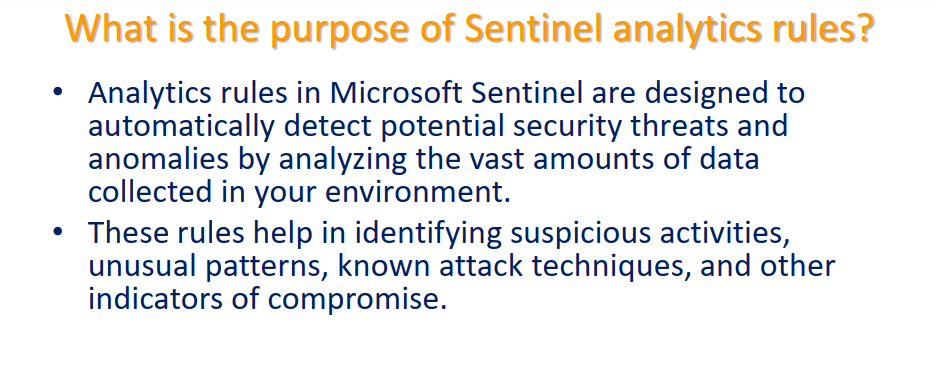
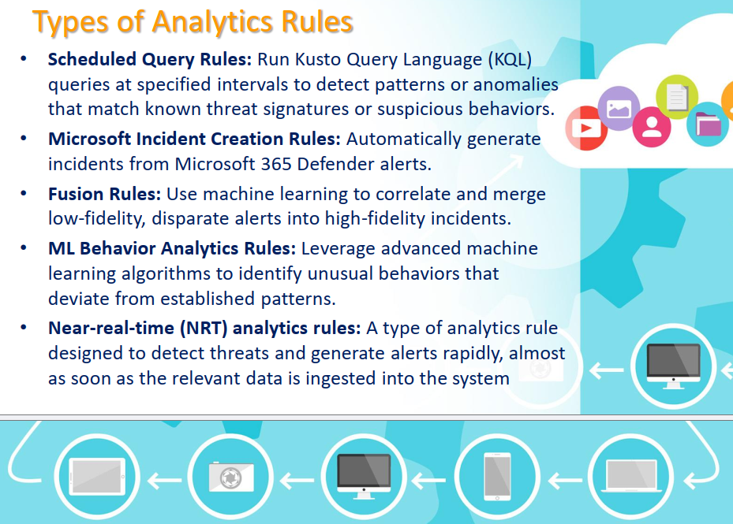
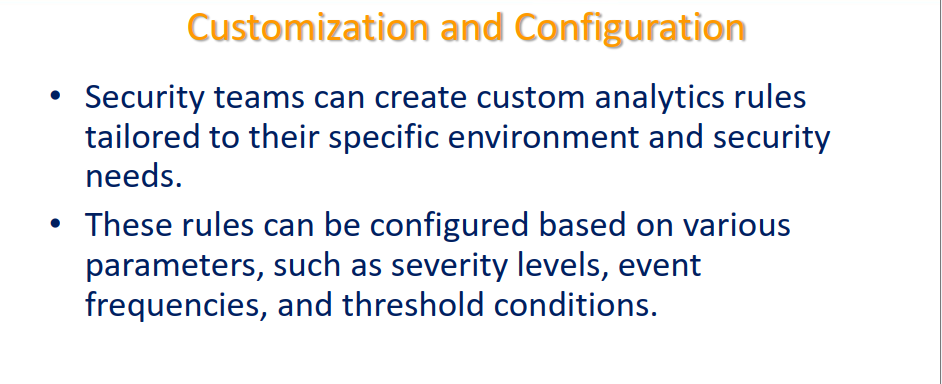
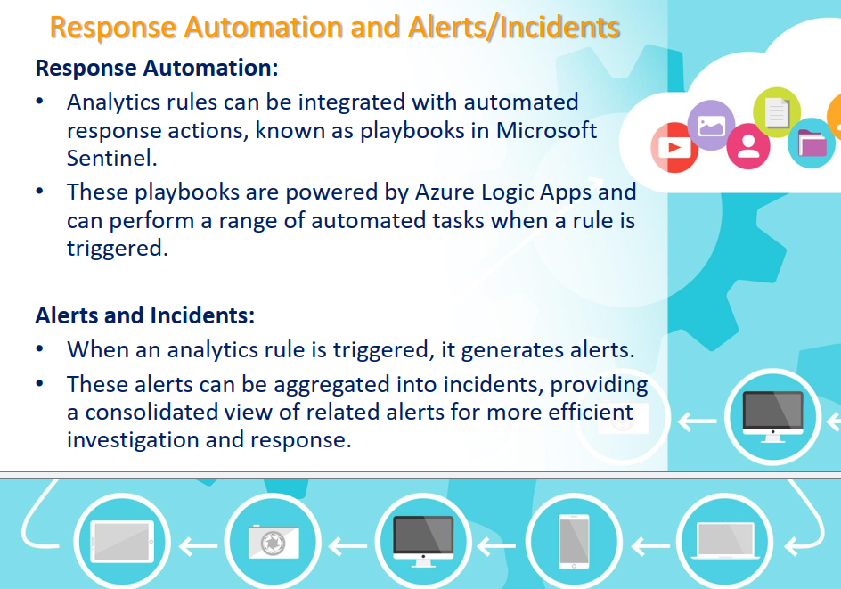

# Topic 38 — Microsoft Sentinel Analytics Rules

Part of the **SC-200: Microsoft Security Operations Analyst** study series.
This topic covers **Analytics rules** — the detection engine of Microsoft Sentinel — their purpose, the different rule types, how they're customized, and how they connect to automation (playbooks) and incidents.

---

## 1. What is the purpose of Sentinel analytics rules?

Analytics rules are designed to **automatically detect potential security threats and anomalies** by analyzing the vast amounts of data collected across your environment. They help identify:
- Suspicious activities
- Unusual patterns
- Known attack techniques
- Other indicators of compromise (IOCs)

**Key exam point:** analytics rules are the bridge between raw ingested log data (Topics 25–31: connectors, DCRs, Syslog/CEF) and actionable detections — without them, all that data is just stored logs with no automated way to surface a threat.

---

## 2. Types of Analytics Rules

Sentinel supports five distinct analytics rule types, each suited to a different detection scenario:

| Rule Type | How it works |
|---|---|
| **Scheduled Query Rules** | Run **KQL queries** at specified intervals to detect patterns or anomalies matching known threat signatures or suspicious behaviors — the most common, fully customizable rule type |
| **Microsoft Incident Creation Rules** | Automatically generate incidents directly from **Microsoft 365 Defender** alerts, without needing a custom KQL query |
| **Fusion Rules** | Use **machine learning** to correlate and merge low-fidelity, disparate alerts into a single high-fidelity incident — designed to catch multi-stage attacks that individual alerts alone wouldn't flag as severe |
| **ML Behavior Analytics Rules** | Leverage advanced ML algorithms to identify unusual behaviors that deviate from established patterns (ties into UEBA, Topic 37) |
| **Near-real-time (NRT) analytics rules** | Designed to detect threats and generate alerts **rapidly**, almost as soon as the relevant data is ingested — trading some flexibility for speed |

**Key exam points:**
- **Scheduled Query Rules** are the default choice for custom detections — they're what you build using KQL (the workflow covered in Topic 26).
- **Fusion Rules** specifically address "alert fatigue from low-fidelity signals" — a classic exam scenario is multiple *individually* low-severity alerts (e.g., an unusual sign-in + a suspicious PowerShell command on a different device) that Fusion correlates into one high-confidence incident.
- **NRT rules** trade some query complexity/flexibility for speed — use them when detection *latency* matters more than sophisticated correlation logic (e.g., detecting a critical admin action within seconds, not minutes).
- **Microsoft Incident Creation Rules** are essentially a pass-through — they don't run custom KQL, they just decide whether/how Defender XDR alerts become Sentinel incidents.

---

## 3. Customization and Configuration

Security teams aren't limited to built-in rules — they can **create custom analytics rules tailored to their specific environment and security needs**.

Custom rules can be configured based on parameters such as:
- **Severity levels**
- **Event frequencies**
- **Threshold conditions**

**Key exam point:** this mirrors the threshold-based triggering pattern seen with Purview Alert Policies (Topic 36) — the same underlying philosophy of "not every match should fire an alert" applies here too, letting teams tune rules to their actual environment's baseline of normal activity rather than generating noise.

---

## 4. Response Automation and Alerts/Incidents

### Response Automation
- Analytics rules can be integrated with automated response actions, known as **Playbooks** in Microsoft Sentinel.
- Playbooks are powered by **Azure Logic Apps** and can perform a range of automated tasks when a rule is triggered — e.g., isolating a device, disabling a user account, sending a notification, or opening a ticket in an external system.

### Alerts and Incidents
- When an analytics rule is **triggered**, it generates an **alert**.
- Alerts can be **aggregated into incidents**, providing a consolidated view of related alerts for more efficient investigation and response — rather than an analyst having to manually connect the dots across dozens of individual alerts.

**Key exam points:**
- **Playbook = Azure Logic App** — this is a direct, testable equivalence. Whenever the exam references "automated response" in Sentinel, the underlying technology is Logic Apps.
- The **alert → incident** relationship is fundamental: a single incident can bundle multiple related alerts (potentially from different analytics rules or even different products via Fusion), which is exactly what gives an analyst the "consolidated view" needed for efficient triage instead of chasing disconnected alerts one by one.
- This connects directly back to entity mapping (Topic 37) — a playbook's ability to "target the correct user, device, or IP for response" depends entirely on the analytics rule having properly mapped entities in the first place.

---

## Quick self-check
1. Which analytics rule type is best suited when you need the fastest possible detection-to-alert latency?
2. What problem do Fusion Rules specifically solve?
3. What underlying Azure technology powers Sentinel playbooks?
4. Why does a properly configured entity mapping matter for automated response via playbooks?

*(Answers: 1) Near-real-time (NRT) analytics rules — 2) Correlating and merging multiple low-fidelity, disparate alerts into a single high-fidelity incident that individual alerts wouldn't have flagged as severe — 3) Azure Logic Apps — 4) The playbook needs the correctly mapped entity (user, device, IP) to know exactly what to target for the automated response action)*
