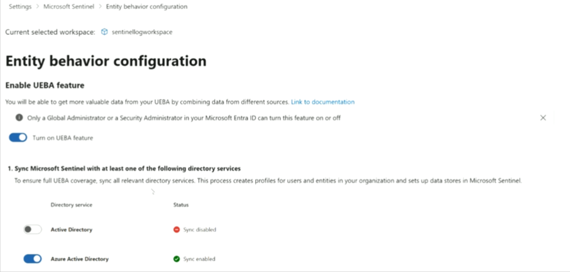
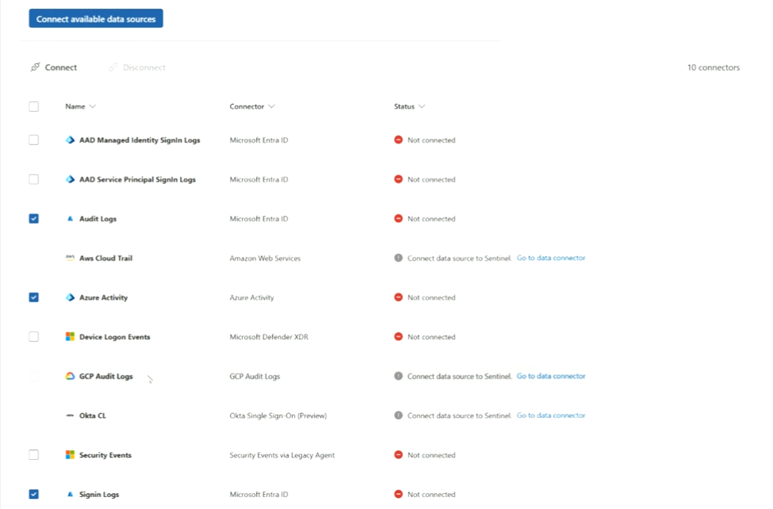
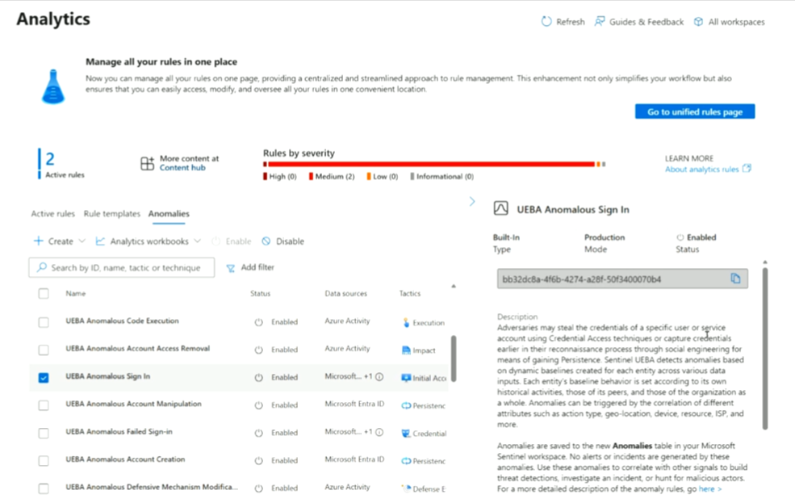

# Topic 41 — Enabling UEBA & Using Anomaly Rules

Part of the **SC-200: Microsoft Security Operations Analyst** study series.
This topic builds on Topic 37 (Entities & UEBA concepts) and Topic 38/40 (Analytics rules) with the practical setup: **enabling UEBA**, connecting its data sources, and reviewing the built-in **Anomaly** detection rules it powers.

---

## 1. Enabling the UEBA feature

Found at: **Settings → Microsoft Sentinel → Entity behavior configuration**.

- **Turn on UEBA feature** toggle
- ⚠️ **Permission requirement**: *only a Global Administrator or a Security Administrator in Microsoft Entra ID can turn this feature on or off* — a specific, testable RBAC fact.
- Turning it on unlocks richer UEBA data by **combining data from different sources**.

### Step 1 — Sync directory services
To get full UEBA coverage, sync Sentinel with at least one directory service — this builds **profiles for users and entities** in your organization and sets up the underlying data stores UEBA needs:

| Directory service | Status (example) |
|---|---|
| **Active Directory** | Sync disabled |
| **Azure Active Directory** | Sync enabled |

**Key exam point:** the **Global Administrator / Security Administrator only** restriction on toggling UEBA is a specific RBAC detail worth memorizing — a Sentinel Contributor role alone is **not** sufficient to enable/disable this feature.

---

## 2. Connecting data sources for UEBA

UEBA's behavioral baselining is only as good as the data feeding it. **Connect available data sources** lets you selectively feed specific log types into the UEBA engine:

| Data source | Connector | Status (example) |
|---|---|---|
| AAD Managed Identity SignIn Logs | Microsoft Entra ID | Not connected |
| AAD Service Principal SignIn Logs | Microsoft Entra ID | Not connected |
| ☑ **Audit Logs** | Microsoft Entra ID | Not connected |
| Aws Cloud Trail | Amazon Web Services | *(needs data connector configured first)* |
| ☑ **Azure Activity** | Azure Activity | Not connected |
| Device Logon Events | Microsoft Defender XDR | Not connected |
| GCP Audit Logs | GCP Audit Logs | *(needs data connector configured first)* |
| Okta CL | Okta Single Sign-On (Preview) | *(needs data connector configured first)* |
| Security Events | Security Events via Legacy Agent | Not connected |
| ☑ **Signin Logs** | Microsoft Entra ID | Not connected |

Checkboxes let you multi-select and **Connect** (or **Disconnect**) several sources at once — 10 connectors are listed in this example.

**Key exam points:**
- Some data sources here show *"Connect data source to Sentinel. Go to data connector"* instead of a simple checkbox — meaning the underlying **data connector itself** (Topic 25/31) must be configured first before that source can feed UEBA (e.g., AWS CloudTrail, GCP Audit Logs, Okta).
- Feeding more diverse data sources (identity, cloud activity, endpoint) gives UEBA a richer baseline to detect anomalies against — a UEBA setup fed only sign-in logs will miss anomalies that only manifest in device or cloud activity.

---

## 3. Reviewing UEBA-powered Anomaly rules

Once UEBA is enabled and syncing, its output surfaces as a dedicated **Anomalies** tab on the **Analytics** page (alongside Active rules and Rule templates).

Each anomaly rule is **Built-In**, running in **Production Mode**, and individually **Enabled/Disabled** — with a unique GUID identifier shown for reference.

### Example anomaly rules
| Name | Data sources | Tactic |
|---|---|---|
| UEBA Anomalous Code Execution | Azure Activity | Execution |
| UEBA Anomalous Account Access Removal | Azure Activity | Impact |
| **UEBA Anomalous Sign In** | Microsoft... (+1) | Initial Access |
| UEBA Anomalous Account Manipulation | Microsoft Entra ID | Persistence |
| UEBA Anomalous Failed Sign-in | Microsoft... (+1) | Credential (Access) |
| UEBA Anomalous Account Creation | Microsoft Entra ID | Persistence |
| UEBA Anomalous Defensive Mechanism Modification | Azure Activity | Defense (Evasion) |

Selecting **UEBA Anomalous Sign In** shows its full description:

> *"Adversaries may steal the credentials of a specific user or service account using Credential Access techniques or capture credentials earlier in their reconnaissance process through social engineering for means of gaining Persistence. Sentinel UEBA detects anomalies based on dynamic baselines created for each entity across various data inputs. Each entity's baseline behavior is set according to its own historical activities, those of its peers, and those of the organization as a whole. Anomalies can be triggered by the correlation of different attributes such as action type, geo-location, device, resource, ISP, and more."*

**Key exam points:**
- **Anomalies are saved to a dedicated `Anomalies` table** in your Sentinel workspace — this is a distinct table from `SecurityAlert` or `SecurityIncident`.
- **No alerts or incidents are generated directly by anomaly rules** — this is a critical, frequently-tested nuance. Anomalies are signals meant to be **correlated with other data** — used to build custom threat detections, investigate an existing incident, or hunt for malicious actors — not standalone triggers on their own.
- The baseline concept is three-layered: an entity's own historical behavior, its **peers'** behavior, and the **organization as a whole** — anomalies fire when current behavior deviates meaningfully from any/all of these baselines.
- Because anomaly rules are **Built-In**, you can't author custom logic for them the way you can a Scheduled query rule — but you *can* Enable/Disable each one, and reference the `Anomalies` table from your own custom Scheduled rules or hunting queries to build on top of what UEBA surfaces.

---

## Quick self-check
1. Who is permitted to turn the UEBA feature on or off?
2. Why might a data source like AWS CloudTrail show "Connect data source to Sentinel" instead of a simple checkbox in the UEBA data sources list?
3. Where do UEBA anomalies get stored, and do they generate alerts/incidents on their own?
4. What three baseline comparison levels does UEBA use to judge whether behavior is anomalous?

*(Answers: 1) Only a Global Administrator or Security Administrator in Microsoft Entra ID — 2) Its underlying Sentinel data connector must be configured first before it can feed into UEBA — 3) They're saved to the Anomalies table; no alerts or incidents are generated directly — they're meant to be correlated with other signals — 4) The entity's own historical behavior, its peers' behavior, and the organization as a whole)*
