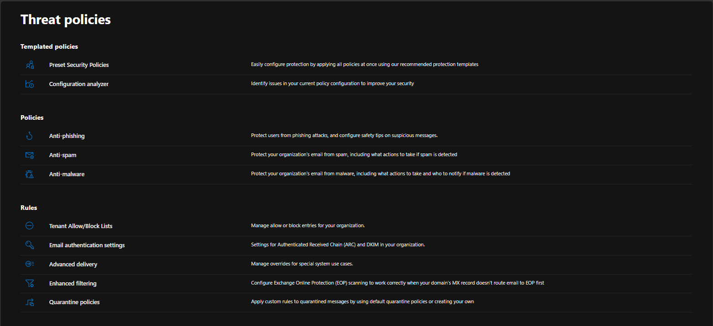
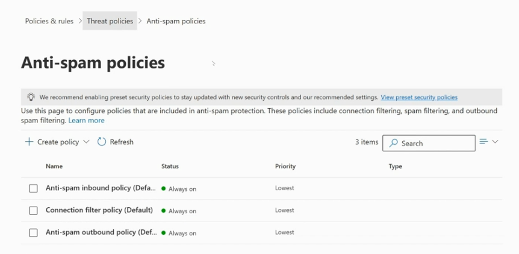
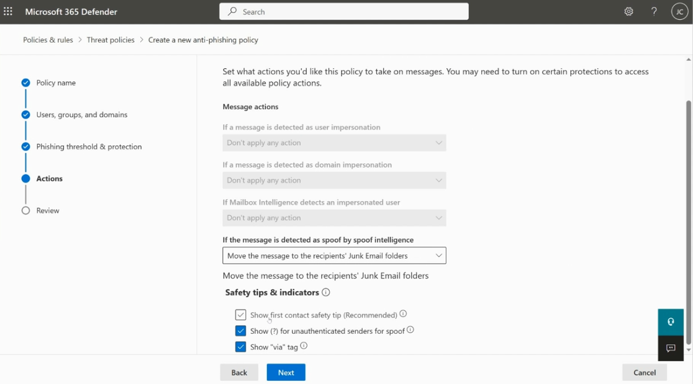
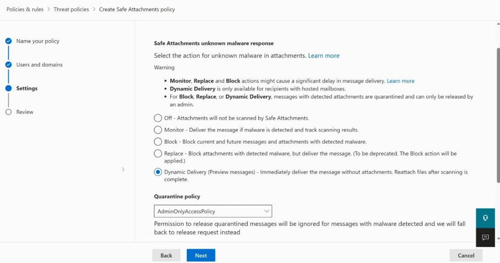
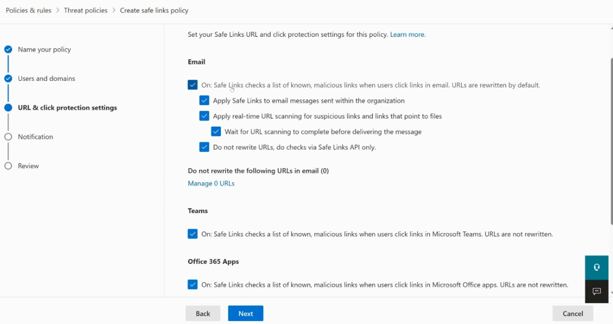
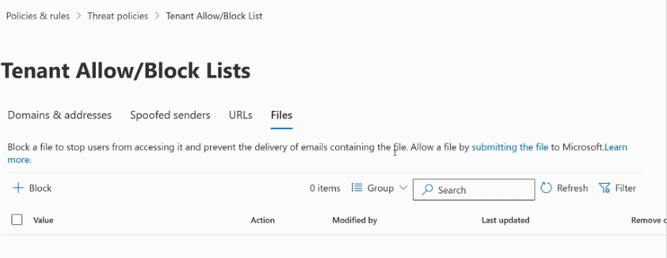
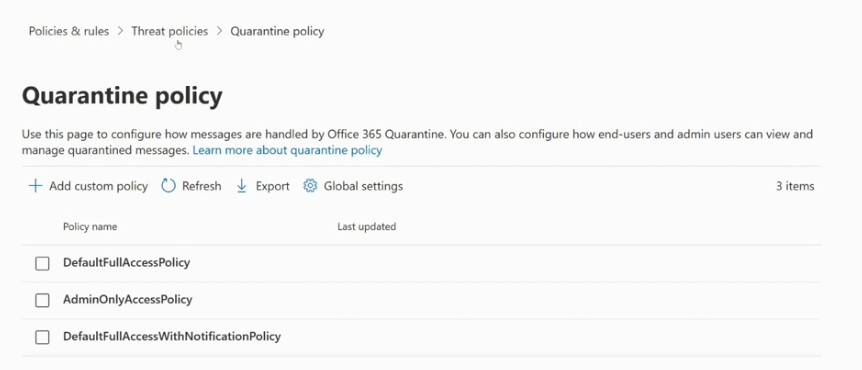
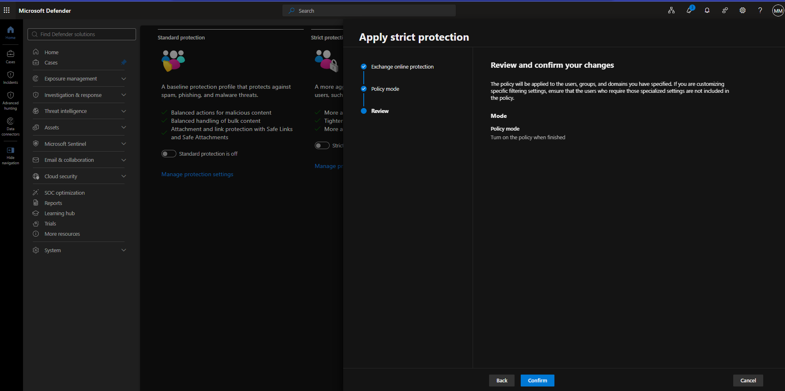
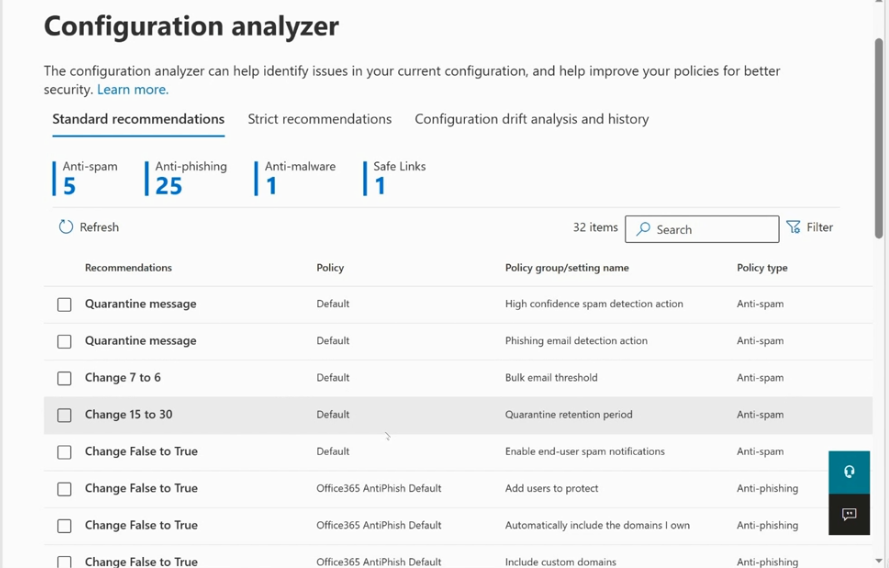

# Microsoft Defender for Office 365 — Threat Policies

This guide walks through the core **Threat Policies** in Microsoft Defender for Office 365 (Microsoft 365 Defender portal → **Email & collaboration → Policies & rules → Threat policies**). These policies work together to protect your organization's mail flow from spam, phishing, malware, and malicious links.



The Threat policies page is organized into three groups:

- **Templated policies** — Preset Security Policies and the Configuration analyzer
- **Policies** — Anti-phishing, Anti-spam, Anti-malware
- **Rules** — Tenant Allow/Block Lists, Email authentication settings, Advanced delivery, Enhanced filtering, Quarantine policies

---

## Table of Contents

1. [Anti-Spam Policy](#1-anti-spam-policy)
2. [Anti-Phishing Policy](#2-anti-phishing-policy)
3. [Safe Attachments Policy](#3-safe-attachments-policy)
4. [Safe Links Policy](#4-safe-links-policy)
5. [Tenant Allow/Block Lists](#5-tenant-allowblock-lists)
6. [Quarantine Policy](#6-quarantine-policy)
7. [Preset Security Policies (Strict Protection)](#7-preset-security-policies-strict-protection)
8. [Configuration Analyzer](#8-configuration-analyzer)

---

## 1. Anti-Spam Policy

**Purpose:** Protects your organization's mailboxes from spam and bulk email by filtering incoming/outgoing mail and defining what action to take when spam is detected (e.g., move to Junk, quarantine).

There are three built-in anti-spam policy types:

- **Anti-spam inbound policy (Default)** — filters incoming mail
- **Connection filter policy (Default)** — allows/blocks mail based on sender IP address
- **Anti-spam outbound policy (Default)** — controls outbound spam behavior and limits



### Steps to configure

1. Go to **Policies & rules → Threat policies → Anti-spam policies**.
2. Review the three default policies (Inbound, Connection filter, Outbound) — all are **Always on** with **Lowest** priority by default.
3. To create a new custom policy, select **+ Create policy** and choose **Inbound** or **Outbound**.
4. Define the policy name, users/groups/domains it applies to, and the spam filter thresholds (bulk complaint level, spam confidence level).
5. Set actions for each detection category (Spam, High confidence spam, Phishing, Bulk email) — e.g., move to Junk folder or quarantine.
6. Save and confirm.

> 💡 Tip: Microsoft recommends enabling **Preset Security Policies** to automatically stay current with recommended anti-spam settings.

---

## 2. Anti-Phishing Policy

**Purpose:** Protects users against impersonation and spoofing attacks by analyzing sender identity, domain reputation, and mailbox intelligence, then applying safety tips or automated actions.



### Steps to configure

1. Go to **Policies & rules → Threat policies → Anti-phishing**.
2. Select **+ Create** to start a new policy (or edit the default policy).
3. **Policy name** — provide a descriptive name.
4. **Users, groups, and domains** — define who the policy applies to.
5. **Phishing threshold & protection** — set the aggressiveness level and enable:
   - User impersonation protection
   - Domain impersonation protection
   - Mailbox intelligence
6. **Actions** — configure what happens for each detection type:
   - If detected as **user impersonation** → choose an action
   - If detected as **domain impersonation** → choose an action
   - If **Mailbox Intelligence** detects impersonation → choose an action
   - If detected as **spoof by spoof intelligence** → e.g., *Move the message to the recipients' Junk Email folders*
7. Enable **Safety tips & indicators**:
   - Show first contact safety tip (recommended)
   - Show "(?)" for unauthenticated senders for spoof
   - Show "via" tag
8. Review and save.

---

## 3. Safe Attachments Policy

**Purpose:** Scans email attachments in a secure sandbox environment to detect unknown malware before delivery to the recipient.



### Steps to configure

1. Go to **Policies & rules → Threat policies → Safe Attachments** → **+ Create**.
2. **Name your policy** and select **Users and domains** the policy applies to.
3. On the **Settings** page, choose the **unknown malware response** action:
   - **Off** — attachments are not scanned
   - **Monitor** — deliver the message and track scanning results
   - **Block** — block current/future messages and attachments with detected malware
   - **Replace** (being deprecated) — block the attachment but deliver the message
   - **Dynamic Delivery (recommended)** — deliver the message body immediately and reattach the file once scanning completes (only for hosted mailboxes)
4. Choose a **Quarantine policy** (e.g., `AdminOnlyAccessPolicy`) to control who can release quarantined messages with detected malware.
5. Select **Next**, review, and finish.

> ⚠️ Note: **Monitor**, **Replace**, and **Block** actions can cause a delay in message delivery. Messages with detected attachments using Block/Replace/Dynamic Delivery are quarantined and can only be released by an admin.

---

## 4. Safe Links Policy

**Purpose:** Protects users from malicious URLs in email, Teams, and Office apps by scanning links at time-of-click.



### Steps to configure

1. Go to **Policies & rules → Threat policies → Safe Links** → **+ Create**.
2. **Name your policy** and select **Users and domains**.
3. On the **URL & click protection settings** page, configure:
   - **Email**
     - Turn **On** Safe Links checks for known malicious links
     - **Apply Safe Links to email messages sent within the organization**
     - **Apply real-time URL scanning** for suspicious links and links to files
     - **Wait for URL scanning to complete before delivering the message**
     - Optionally enable **Do not rewrite URLs, do checks via Safe Links API only**
   - **Teams** — enable Safe Links checks for links clicked in Microsoft Teams
   - **Office 365 Apps** — enable Safe Links checks for links clicked inside Office apps
4. Optionally add exceptions under **Do not rewrite the following URLs in email**.
5. Continue to **Notification** settings, review, and finish.

---

## 5. Tenant Allow/Block Lists

**Purpose:** Lets admins manually allow or block specific domains, addresses, URLs, files, or spoofed senders across the whole tenant — overriding the standard filters when needed.



### Steps to configure

1. Go to **Policies & rules → Threat policies → Tenant Allow/Block Lists**.
2. Choose the relevant tab:
   - **Domains & addresses**
   - **Spoofed senders**
   - **URLs**
   - **Files**
3. To block a file, select **+ Block**, enter the file hash, and provide an expiration date/notes.
4. To allow a previously blocked file, use the **submitting the file** link to request Microsoft review it.
5. Use **Search** and **Filter** to manage existing entries.

---

## 6. Quarantine Policy

**Purpose:** Defines how quarantined messages (from anti-spam, anti-phishing, Safe Attachments, etc.) are handled, and what end users and admins are allowed to do with them (release, delete, view headers, etc.).



### Steps to configure

1. Go to **Policies & rules → Threat policies → Quarantine policy**.
2. Review the built-in policies:
   - **DefaultFullAccessPolicy** — full end-user access to their quarantined messages
   - **AdminOnlyAccessPolicy** — only admins can manage/release quarantined messages
   - **DefaultFullAccessWithNotificationPolicy** — full access plus quarantine notifications
3. To create a custom policy, select **+ Add custom policy**, define permissions (view, release, delete, etc.) and quarantine notification settings.
4. Use **Global settings** to configure organization-wide quarantine notification behavior.
5. Assign the desired quarantine policy inside your Anti-spam, Anti-phishing, Anti-malware, or Safe Attachments policies.

---

## 7. Preset Security Policies (Strict Protection)

**Purpose:** Lets Microsoft manage recommended protection levels for you instead of configuring every policy manually. Two profiles are available: **Standard** and **Strict**.



### Steps to configure

1. Go to **Policies & rules → Threat policies → Preset Security Policies**.
2. Review the two profiles:
   - **Standard protection** — baseline protection against spam, phishing, and malware
   - **Strict protection** — more aggressive protection recommended for high-value targets/users
3. Toggle **Strict protection** (or Standard) to **On**.
4. Complete the wizard:
   - **Exchange online protection** — select users/groups/domains this applies to
   - **Policy mode** — choose whether to turn the policy on immediately or leave it off after creation
   - **Review** — confirm settings
5. Select **Confirm** to apply.

> ⚠️ When customizing specific filtering settings elsewhere, make sure any users who need specialized settings are excluded from the preset policy to avoid conflicts.

---

## 8. Configuration Analyzer

**Purpose:** Scans your current security configuration against Microsoft's recommended **Standard** and **Strict** baselines and flags settings that don't meet the recommendation.



### Steps to use

1. Go to **Policies & rules → Threat policies → Configuration analyzer**.
2. Choose a tab:
   - **Standard recommendations**
   - **Strict recommendations**
   - **Configuration drift analysis and history**
3. Review the recommendation counts by category (Anti-spam, Anti-phishing, Anti-malware, Safe Links).
4. For each row, review the **Recommendation**, affected **Policy**, **Policy group/setting name**, and **Policy type**.
5. Select the checkbox next to a recommendation and apply the suggested change directly, or make the change manually in the corresponding policy.
6. Re-run analysis periodically or after making policy changes to confirm compliance.

---

## Recommended Configuration Order

For a new tenant, configure policies in this general order:

1. Anti-spam → 2. Anti-phishing → 3. Anti-malware → 4. Safe Attachments → 5. Safe Links → 6. Tenant Allow/Block Lists → 7. Quarantine policy → 8. Run Configuration Analyzer to validate → 9. Consider enabling Preset Security Policies (Standard or Strict) for simplified ongoing management.

---

## File Structure

```
.
├── README.md
└── 
    ├── threat-policies.png
    ├── anti-spam-policy.png
    ├── anti-phishing-policy.png
    ├── safe-attachment.png
    ├── safe-links-policy.png
    ├── tenant-allow-block-lists.png
    ├── quarantine-policy.png
    ├── apply-strict-protection.png
    └── configuration-analyzer.png
```
