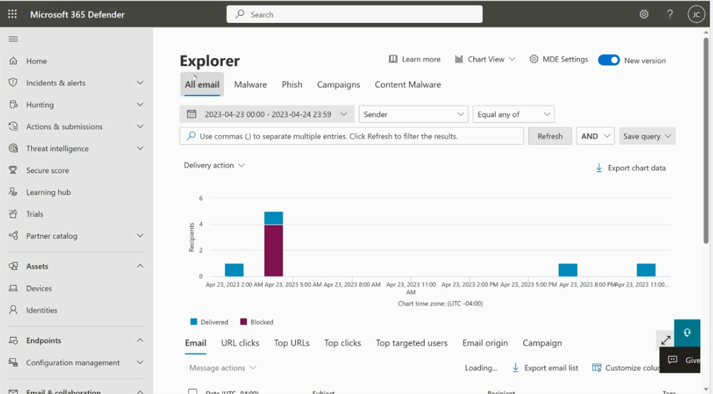
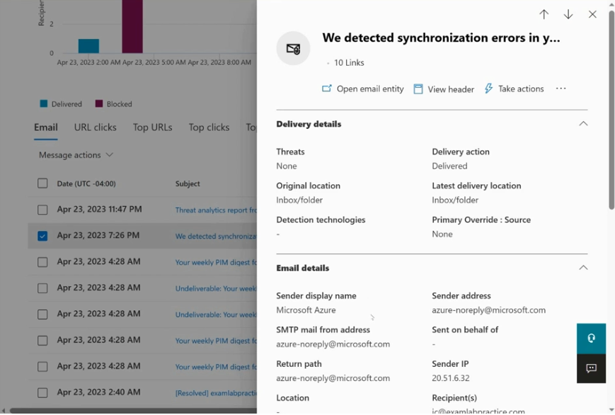
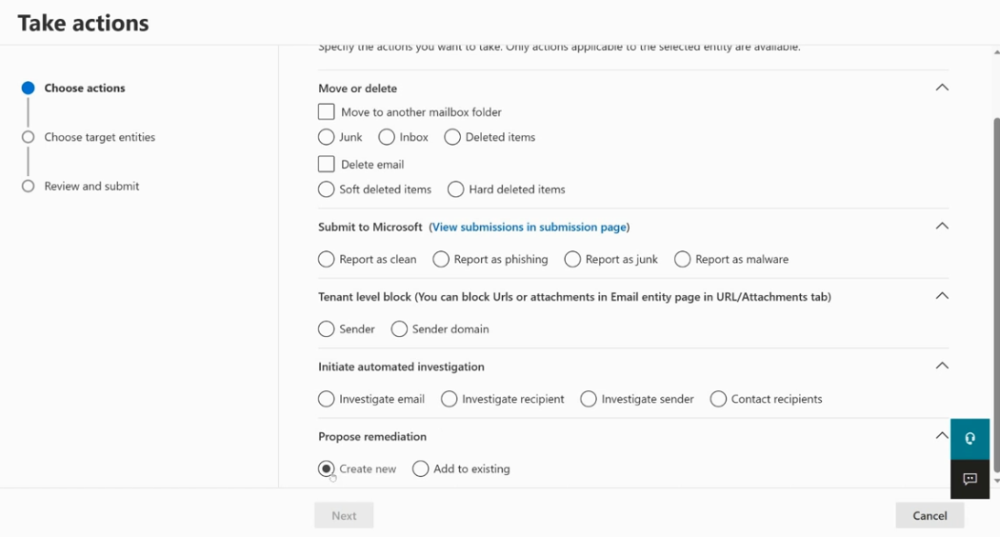
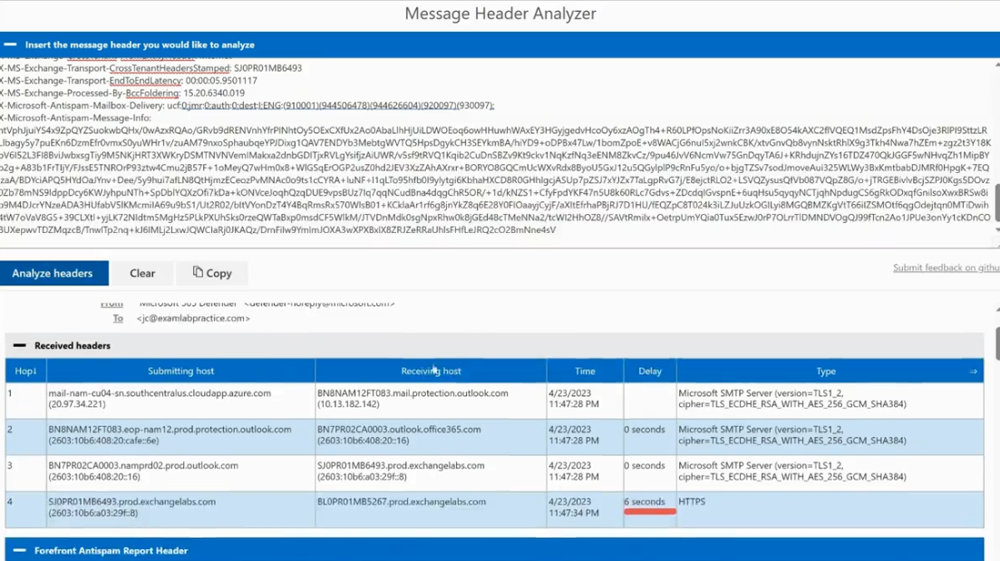

# Microsoft Defender for Office 365 — Threat Explorer & Email Investigation

This guide covers how to investigate suspicious or malicious emails in Microsoft 365 Defender using **Threat Explorer**, the **Email entity view**, **Take actions**, and the **Message Header Analyzer**.

---

## Table of Contents

1. [Threat Explorer](#1-threat-explorer)
2. [Email Details (Entity View)](#2-email-details-entity-view)
3. [Take Actions on Email](#3-take-actions-on-email)
4. [Message Header Analyzer](#4-message-header-analyzer)

---

## 1. Threat Explorer

**Purpose:** A near real-time reporting tool used to investigate malicious email, malware, and phishing activity across your tenant, and to take remediation actions directly from search results.



### Steps to use

1. Go to **Microsoft 365 Defender → Email & collaboration → Explorer**.
2. Choose a view tab: **All email**, **Malware**, **Phish**, **Campaigns**, or **Content Malware**.
3. Set the **date/time range** for the investigation window.
4. Add filters (e.g., **Sender**, **Recipient**, **Subject**, **URL**) using the property and operator dropdowns (**Equal any of**, etc.), then select **Refresh**.
5. Review the chart, which breaks down messages by **Delivery action** (e.g., Delivered vs Blocked) over time.
6. Scroll down to the results grid and use the sub-tabs:
   - **Email** — list of matching messages
   - **URL clicks**
   - **Top URLs**
   - **Top clicks**
   - **Top targeted users**
   - **Email origin**
   - **Campaign**
7. Select one or more messages, then use **Message actions** to take bulk remediation actions, or select a single message to open its **Email details** pane.
8. Use **Export email list** / **Export chart data** to download results for reporting.
9. Use **Save query** to reuse common searches.

---

## 2. Email Details (Entity View)

**Purpose:** Provides a deep-dive summary of a single email — delivery outcome, detection technologies, sender/recipient details, and quick links to headers and remediation actions.



### What to review

1. From Threat Explorer, select a message subject to open the **Email details** flyout pane.
2. **Delivery details** section:
   - **Threats** detected (or None)
   - **Delivery action** (e.g., Delivered, Blocked, Junked)
   - **Original location** vs **Latest delivery location** (tracks if the message moved after delivery, e.g., to Junk/Inbox)
   - **Detection technologies** used to evaluate the message
   - **Primary Override : Source** (shows if a rule/policy overrode the verdict)
3. **Email details** section:
   - Sender display name and address
   - SMTP mail from address
   - Sent on behalf of
   - Return path
   - Sender IP
   - Recipient(s)
4. Use the top action bar to:
   - **Open email entity** — full-page entity view with more tabs (URLs, attachments, similar emails)
   - **View header** — opens the raw message header for analysis
   - **Take actions** — start a remediation workflow (see below)

---

## 3. Take Actions on Email

**Purpose:** Lets an admin remediate a malicious or unwanted email directly — moving/deleting it from mailboxes, submitting it to Microsoft, blocking the sender, or launching an automated investigation.



### Steps to configure

1. From the Email details pane or entity page, select **Take actions**.
2. On the **Choose actions** step, pick from the available categories (only actions applicable to the selected entity are shown):
   - **Move or delete**
     - Move to another mailbox folder → **Junk**, **Inbox**, or **Deleted items**
     - Delete email → **Soft deleted items** or **Hard deleted items**
   - **Submit to Microsoft**
     - Report as **Clean**, **Phishing**, **Junk**, or **Malware**
     - (Track submissions via **View submissions in submission page**)
   - **Tenant level block**
     - Block the **Sender** or **Sender domain**
     - (URLs/attachments are blocked separately from the Email entity page's URL/Attachments tab)
   - **Initiate automated investigation**
     - **Investigate email**, **Investigate recipient**, **Investigate sender**, or **Contact recipients**
   - **Propose remediation**
     - **Create new** remediation action or **Add to existing** one
3. Select **Next** to move to **Choose target entities**.
4. Confirm the affected users/mailboxes.
5. Move to **Review and submit**, verify the summary, and submit the action.

---

## 4. Message Header Analyzer

**Purpose:** Parses a raw email message header to trace the message's delivery path (hop-by-hop), timing/delay, authentication results, and anti-spam scoring — useful for diagnosing delivery delays or spoofing.



### Steps to use

1. Open the **Message Header Analyzer** tool (available at `mha.azurewebsites.net` or via **View header** from an Email details pane).
2. Paste the full raw message header into the **Insert the message header you would like to analyze** box.
3. Select **Analyze headers**.
4. Review the **Received headers** table:
   - **Hop #** — order the message passed through mail servers
   - **Submitting host** / **Receiving host** — source and destination at each hop
   - **Time** and **Delay** — spot unusual delays between hops (e.g., a 6-second delay on the final hop)
   - **Type** — protocol/server details (e.g., Microsoft SMTP Server, TLS version, cipher)
5. Scroll down to review additional parsed sections, such as:
   - **Forefront Antispam Report Header** — spam confidence/bulk complaint scoring
   - Authentication results (SPF/DKIM/DMARC), when present in the header
6. Use **Copy** to copy the parsed output, or **Clear** to reset and analyze a new header.

---

## Typical Investigation Workflow

1. Start in **Threat Explorer**, filter by sender/subject/date to find suspicious messages.
2. Open **Email details** to check delivery action and detection technologies.
3. Use **View header** → **Message Header Analyzer** if you need to trace hops, delays, or authentication results.
4. Use **Take actions** to remediate — move/delete the message, block the sender, submit it to Microsoft, or launch an automated investigation.
5. Track remediation status from **Actions & submissions** in the Defender portal.

---

## File Structure

```
.
├── README.md
├── threat-explorer.png
├── email-details.png
├── take-actions-on-email.png
└── message-header-analyzer.png
```
