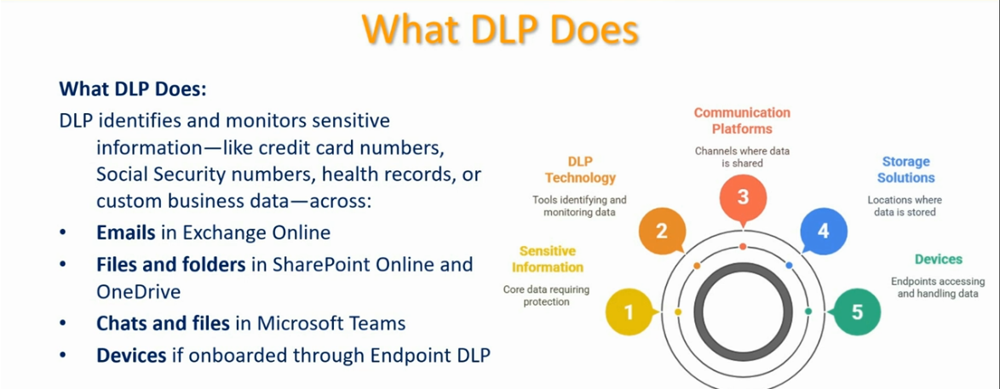
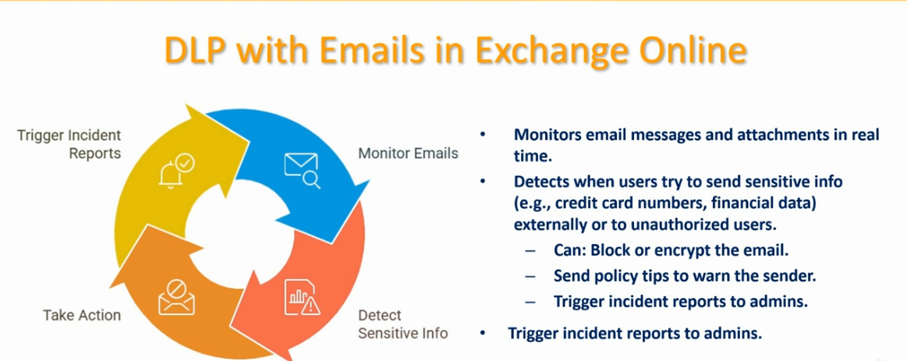
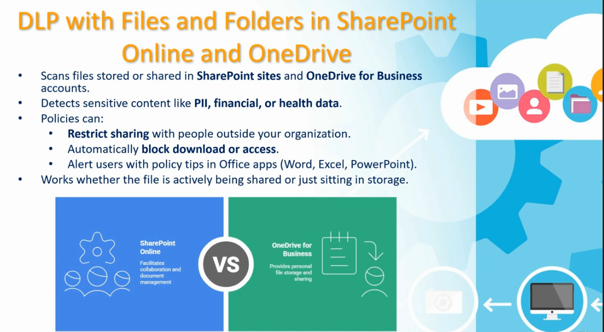
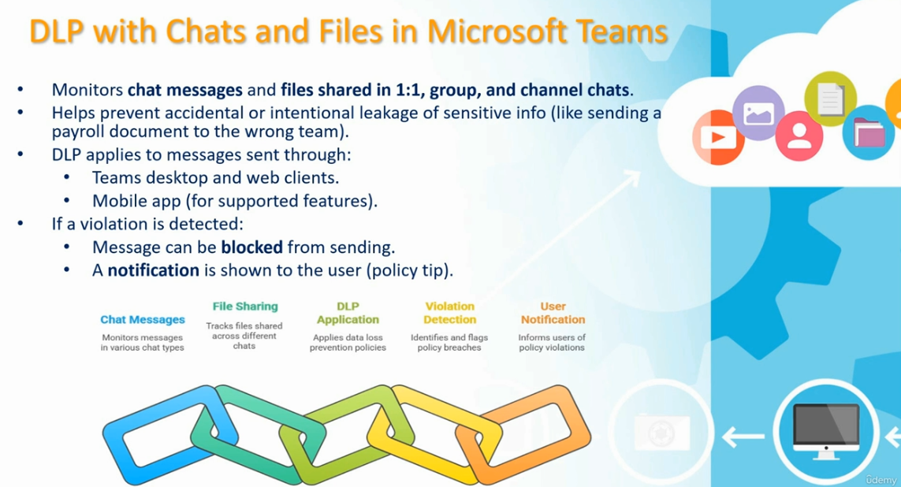
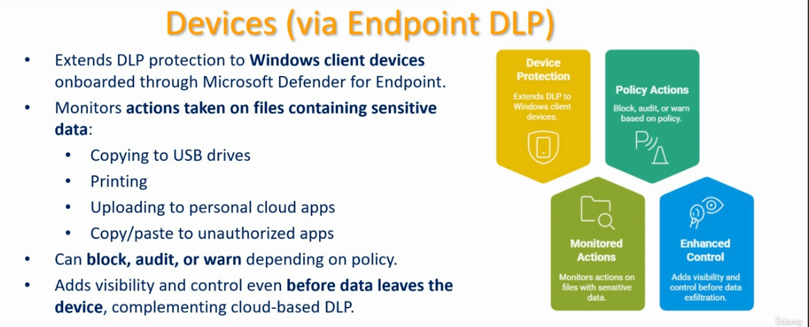
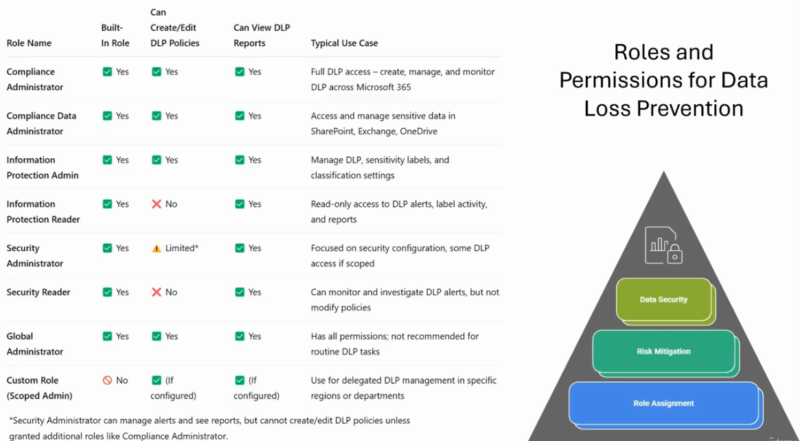
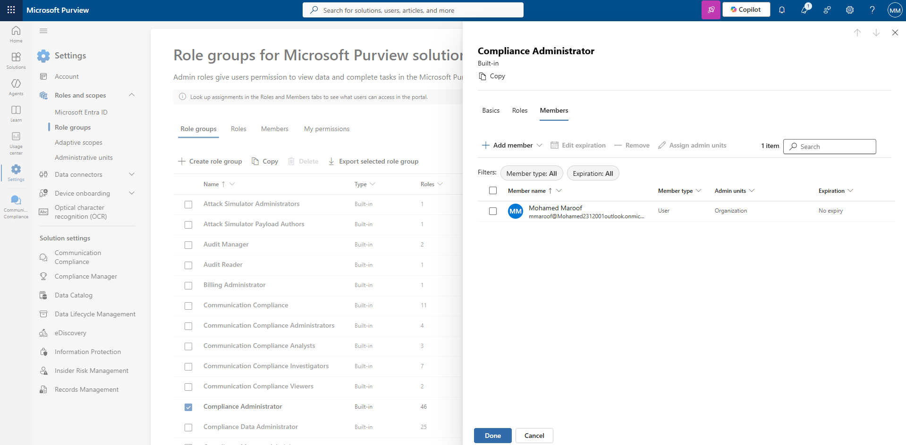
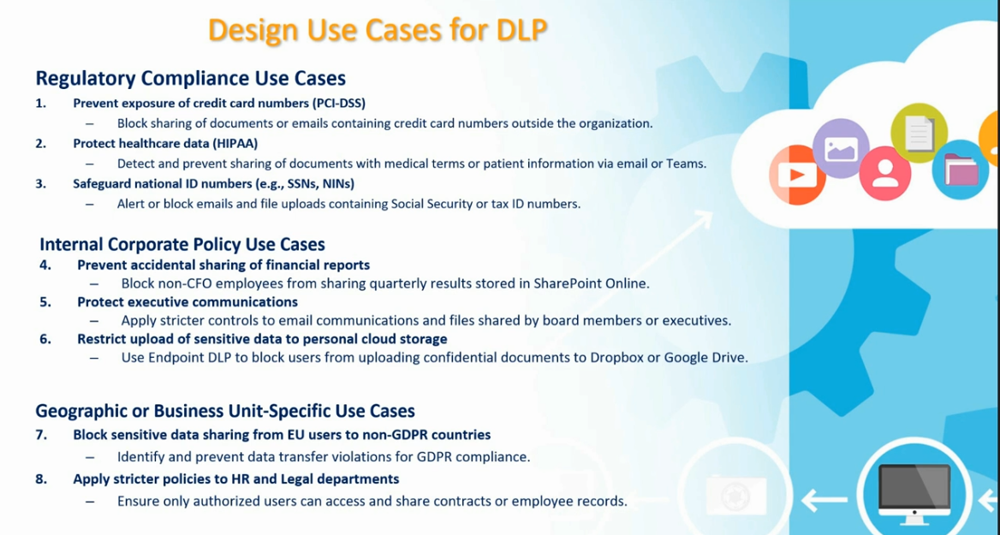
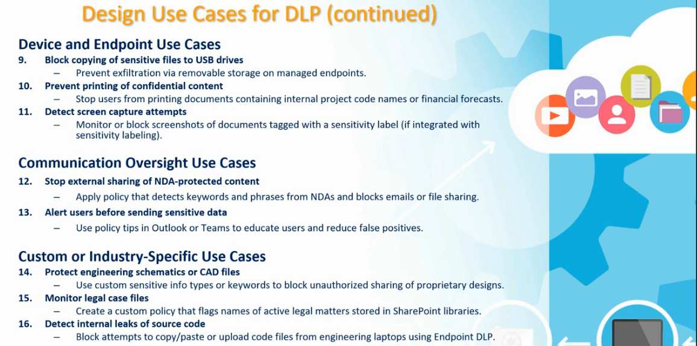

# Data Loss Prevention (DLP) — Microsoft Purview

This guide explains what Data Loss Prevention (DLP) does, where it applies across Microsoft 365 workloads, the roles/permissions needed to manage it, and common use cases to design policies around.

---

## Table of Contents

1. [What DLP Does](#1-what-dlp-does)
2. [DLP with Emails in Exchange Online](#2-dlp-with-emails-in-exchange-online)
3. [DLP with Files and Folders in SharePoint Online and OneDrive](#3-dlp-with-files-and-folders-in-sharepoint-online-and-onedrive)
4. [DLP with Chats and Files in Microsoft Teams](#4-dlp-with-chats-and-files-in-microsoft-teams)
5. [DLP for Devices (Endpoint DLP)](#5-dlp-for-devices-endpoint-dlp)
6. [Roles and Permissions for DLP](#6-roles-and-permissions-for-dlp)
7. [Assigning a Role in Microsoft Purview](#7-assigning-a-role-in-microsoft-purview)
8. [Design Use Cases for DLP](#8-design-use-cases-for-dlp)

---

## 1. What DLP Does

**Purpose:** DLP identifies and monitors sensitive information — such as credit card numbers, Social Security numbers, health records, or custom business data — across the places that information is created, stored, and shared.



DLP protection spans five core areas:

1. **Sensitive Information** — the core data requiring protection
2. **DLP Technology** — the tools that identify and monitor that data
3. **Communication Platforms** — the channels where data is shared (Exchange, Teams)
4. **Storage Solutions** — the locations where data is stored (SharePoint, OneDrive)
5. **Devices** — endpoints accessing and handling data (via Endpoint DLP)

DLP covers, at a minimum:

- **Emails** in Exchange Online
- **Files and folders** in SharePoint Online and OneDrive
- **Chats and files** in Microsoft Teams
- **Devices**, if onboarded through Endpoint DLP

---

## 2. DLP with Emails in Exchange Online

**Purpose:** Monitors email messages and attachments in real time to catch sensitive data before it leaves the organization.



### How it works

1. **Monitor Emails** — scans messages and attachments as they are sent.
2. **Detect Sensitive Info** — flags content such as credit card numbers or financial data being sent externally or to unauthorized users.
3. **Take Action** — depending on policy, DLP can:
   - Block or encrypt the email
   - Send policy tips to warn the sender before they send it
   - Trigger incident reports to admins
4. **Trigger Incident Reports** — closes the loop by notifying admins of the violation for review.

---

## 3. DLP with Files and Folders in SharePoint Online and OneDrive

**Purpose:** Scans files stored or shared in SharePoint sites and OneDrive for Business accounts to detect sensitive content, whether the file is actively being shared or just sitting in storage.



### What it does

- Detects sensitive content such as **PII**, **financial**, or **health data**.
- Policies can:
  - **Restrict sharing** with people outside your organization.
  - Automatically **block download or access**.
  - **Alert users** with policy tips directly inside Office apps (Word, Excel, PowerPoint).
- Works across both:
  - **SharePoint Online** — facilitates collaboration and document management
  - **OneDrive for Business** — provides personal file storage and sharing

---

## 4. DLP with Chats and Files in Microsoft Teams

**Purpose:** Monitors chat messages and files shared in 1:1, group, and channel chats to prevent accidental or intentional leakage of sensitive information.



### How it works

DLP applies to messages sent through:

- Teams desktop and web clients
- The mobile app (for supported features)

The detection flow works in five stages:

1. **Chat Messages** — monitors messages in various chat types
2. **File Sharing** — tracks files shared across different chats
3. **DLP Application** — applies data loss prevention policies
4. **Violation Detection** — identifies and flags policy breaches
5. **User Notification** — informs users of policy violations

If a violation is detected:

- The message can be **blocked** from sending.
- A **notification** (policy tip) is shown to the user.

---

## 5. DLP for Devices (Endpoint DLP)

**Purpose:** Extends DLP protection to Windows client devices onboarded through Microsoft Defender for Endpoint, adding visibility and control even before data leaves the device.



### What it monitors

Endpoint DLP monitors actions taken on files containing sensitive data, including:

- Copying to USB drives
- Printing
- Uploading to personal cloud apps
- Copy/paste to unauthorized apps

### Capabilities

| Capability | Description |
|---|---|
| **Device Protection** | Extends DLP to Windows client devices |
| **Policy Actions** | Block, audit, or warn based on policy |
| **Monitored Actions** | Monitors actions on files with sensitive data |
| **Enhanced Control** | Adds visibility and control before data exfiltration |

Endpoint DLP complements cloud-based DLP by giving admins the ability to **block, audit, or warn** depending on policy — before the data ever leaves the device.

---

## 6. Roles and Permissions for DLP

**Purpose:** Defines who can create/edit DLP policies, view DLP reports, and manage sensitive data across Microsoft 365 — following a layered model of Role Assignment → Risk Mitigation → Data Security.



| Role Name | Built-In Role | Can Create/Edit DLP Policies | Can View DLP Reports | Typical Use Case |
|---|---|---|---|---|
| **Compliance Administrator** | Yes | Yes | Yes | Full DLP access — create, manage, and monitor DLP across Microsoft 365 |
| **Compliance Data Administrator** | Yes | Yes | Yes | Access and manage sensitive data in SharePoint, Exchange, OneDrive |
| **Information Protection Admin** | Yes | Yes | Yes | Manage DLP, sensitivity labels, and classification settings |
| **Information Protection Reader** | Yes | No | Yes | Read-only access to DLP alerts, label activity, and reports |
| **Security Administrator** | Yes | Limited* | Yes | Focused on security configuration, some DLP access if scoped |
| **Security Reader** | Yes | No | Yes | Can monitor and investigate DLP alerts, but not modify policies |
| **Global Administrator** | Yes | Yes | Yes | Has all permissions; not recommended for routine DLP tasks |
| **Custom Role (Scoped Admin)** | No | If configured | If configured | Use for delegated DLP management in specific regions or departments |

> \*Security Administrator can manage alerts and see reports, but cannot create/edit DLP policies unless granted additional roles like Compliance Administrator.

---

## 7. Assigning a Role in Microsoft Purview

**Purpose:** Walks through adding a member to a built-in role group (e.g., Compliance Administrator) in the Microsoft Purview compliance portal.



### Steps to assign a role

1. Go to **Microsoft Purview → Settings → Roles and scopes → Role groups**.
2. On the **Role groups** tab, select the role group you want to manage (e.g., **Compliance Administrator**).
3. In the flyout pane, review the tabs:
   - **Basics**
   - **Roles**
   - **Members**
4. Select the **Members** tab.
5. Select **+ Add member**, then search for and select the user or group to add.
6. Optionally use **Edit expiration** to set a time-bound assignment, or **Assign admin units** to scope the role to specific administrative units.
7. Review the member list (name, member type, admin units, expiration).
8. Select **Done** to save, or **Cancel** to discard changes.

---

## 8. Design Use Cases for DLP

**Purpose:** Provides real-world scenarios to guide how DLP policies should be designed, grouped by compliance driver and platform.



### Regulatory Compliance Use Cases

1. **Prevent exposure of credit card numbers (PCI-DSS)** — block sharing of documents or emails containing credit card numbers outside the organization.
2. **Protect healthcare data (HIPAA)** — detect and prevent sharing of documents with medical terms or patient information via email or Teams.
3. **Safeguard national ID numbers (e.g., SSNs, NINs)** — alert or block emails and file uploads containing Social Security or tax ID numbers.

### Internal Corporate Policy Use Cases

4. **Prevent accidental sharing of financial reports** — block non-CFO employees from sharing quarterly results stored in SharePoint Online.
5. **Protect executive communications** — apply stricter controls to email communications and files shared by board members or executives.
6. **Restrict upload of sensitive data to personal cloud storage** — use Endpoint DLP to block users from uploading confidential documents to Dropbox or Google Drive.

### Geographic or Business Unit-Specific Use Cases

7. **Block sensitive data sharing from EU users to non-GDPR countries** — identify and prevent data transfer violations for GDPR compliance.
8. **Apply stricter policies to HR and Legal departments** — ensure only authorized users can access and share contracts or employee records.



### Device and Endpoint Use Cases

9. **Block copying of sensitive files to USB drives** — prevent exfiltration via removable storage on managed endpoints.
10. **Prevent printing of confidential content** — stop users from printing documents containing internal project code names or financial forecasts.
11. **Detect screen capture attempts** — monitor or block screenshots of documents tagged with a sensitivity label (if integrated with sensitivity labeling).

### Communication Oversight Use Cases

12. **Stop external sharing of NDA-protected content** — apply a policy that detects keywords and phrases from NDAs and blocks emails or file sharing.
13. **Alert users before sending sensitive data** — use policy tips in Outlook or Teams to educate users and reduce false positives.

### Custom or Industry-Specific Use Cases

14. **Protect engineering schematics or CAD files** — use custom sensitive info types or keywords to block unauthorized sharing of proprietary designs.
15. **Monitor legal case files** — create a custom policy that flags names of active legal matters stored in SharePoint libraries.
16. **Detect internal leaks of source code** — block attempts to copy/paste or upload code files from engineering laptops using Endpoint DLP.

---

## Recommended Configuration Order

1. Confirm **roles and permissions** — assign the right admins to Compliance Administrator / Information Protection Admin roles.
2. Identify **sensitive information types** relevant to your organization (PCI, HIPAA, PII, custom keywords).
3. Design **use cases** by category (regulatory, internal policy, geographic, device, communication, custom).
4. Configure DLP policies for **Exchange Online (email)**.
5. Configure DLP policies for **SharePoint Online and OneDrive**.
6. Configure DLP policies for **Microsoft Teams**.
7. Onboard devices and configure **Endpoint DLP** for device-level protection.
8. Test policies in **simulation/audit mode** before enforcing block actions, and review incident reports.

---

## File Structure

```
.
├── README.md
├── dlp-benefit.png
├── dlp-with-emails.png
├── dlp-with-onedrive-sharepoint.png
├── dlp-with-teams.png
├── dlp-endpoint.png
├── dlp-roles.png
├── assign-role.png
├── dlp-use-cases.png
└── dlp-use-cases-continued.png
```
