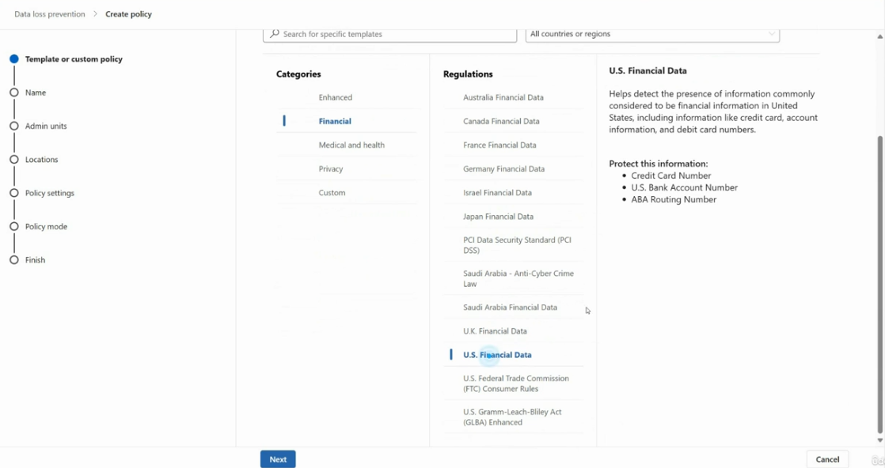
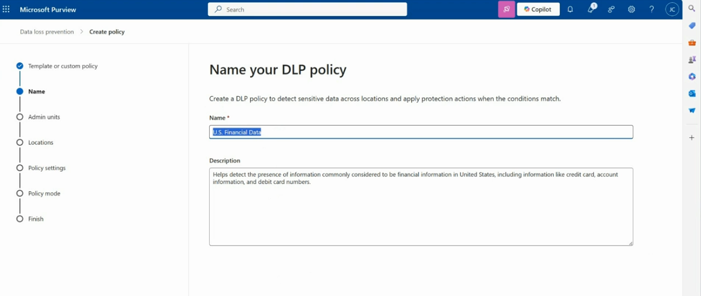
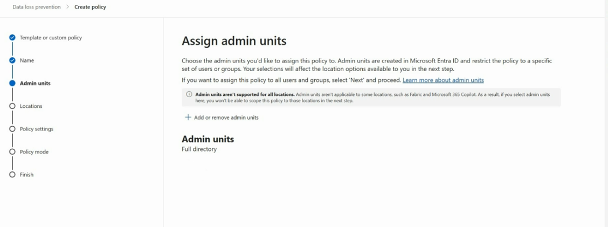
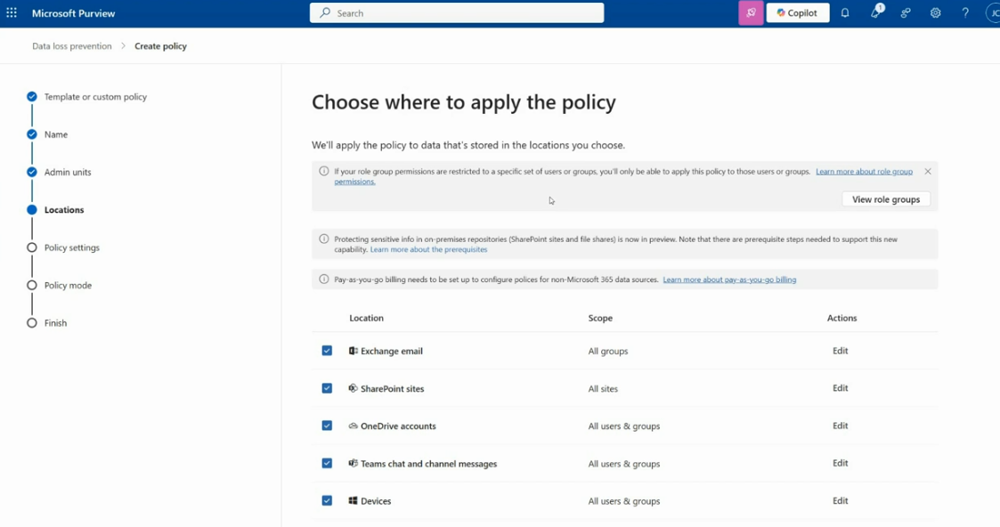
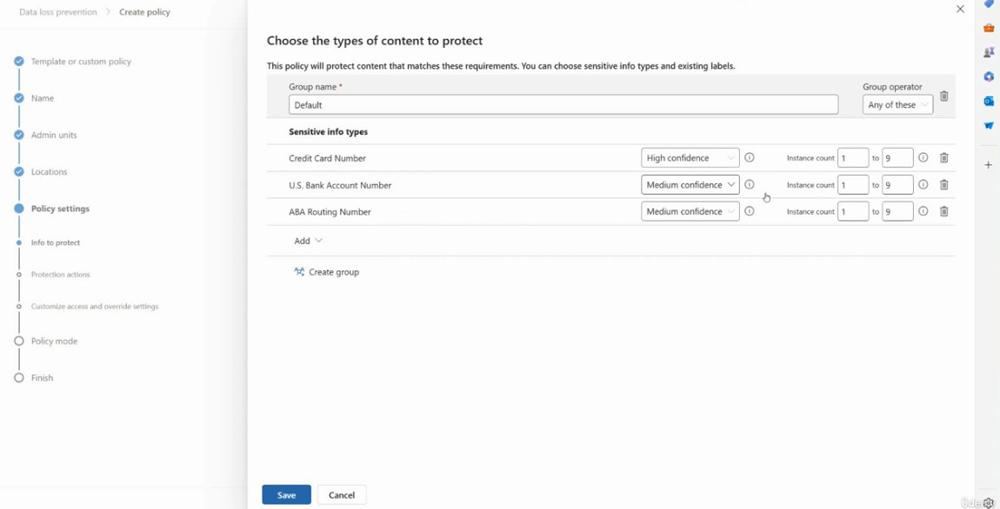
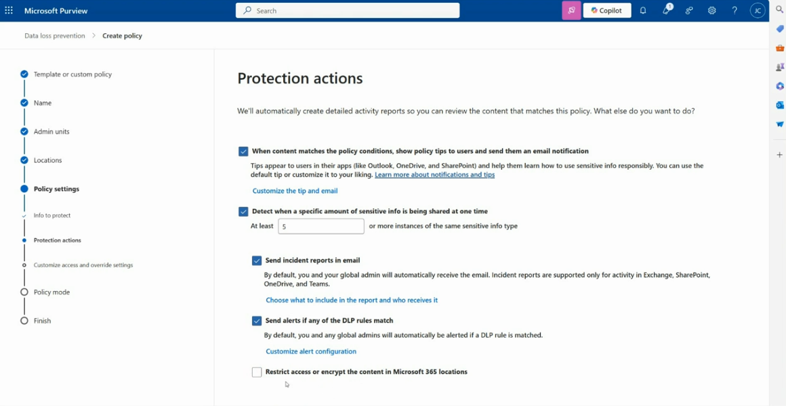
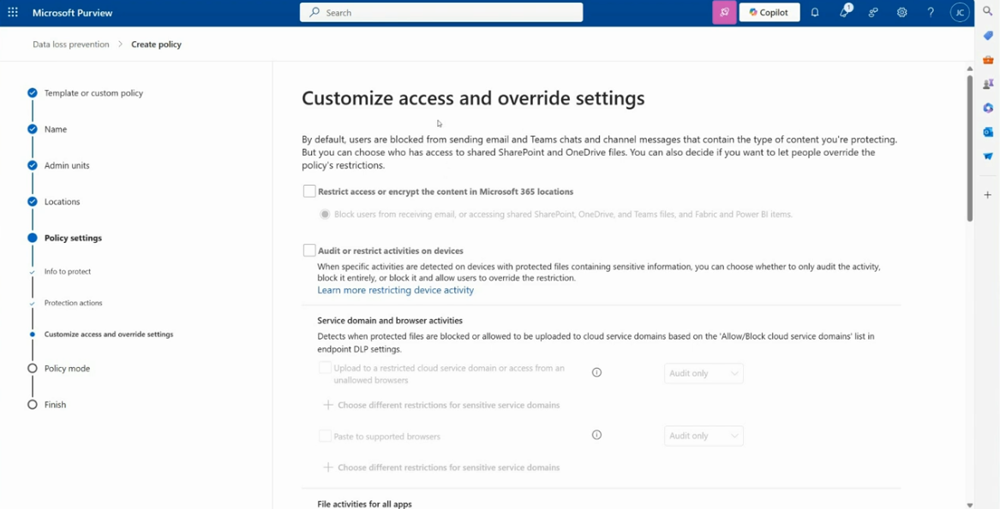
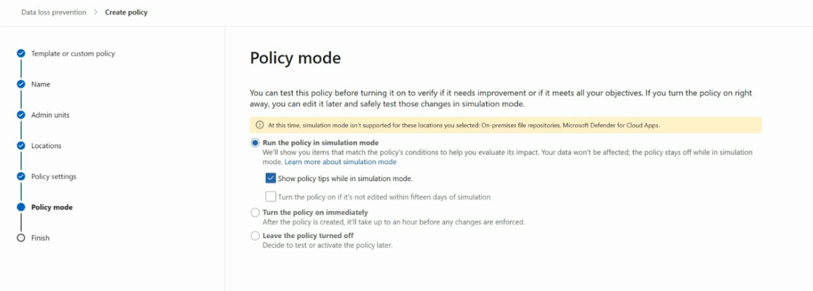

# Creating a DLP Policy in Microsoft Purview

This guide walks step-by-step through the **Create policy** wizard for Data Loss Prevention (DLP) in Microsoft Purview (**Data loss prevention → Policies → + Create policy**), using a *U.S. Financial Data* policy as the working example.

---

## Table of Contents

1. [Step 1 — Choose a Template or Custom Policy](#1-choose-a-template-or-custom-policy)
2. [Step 2 — Name Your DLP Policy](#2-name-your-dlp-policy)
3. [Step 3 — Assign Admin Units](#3-assign-admin-units)
4. [Step 4 — Choose Locations](#4-choose-locations)
5. [Step 5 — Choose the Info to Protect](#5-choose-the-info-to-protect)
6. [Step 6 — Protection Actions](#6-protection-actions)
7. [Step 7 — Customize Access and Override Settings](#7-customize-access-and-override-settings)
8. [Step 8 — Policy Mode](#8-policy-mode)

---

## 1. Choose a Template or Custom Policy

**Purpose:** Start from a Microsoft-provided regulatory template (recommended for common compliance scenarios) or build a fully custom policy from scratch.



### Steps

1. Go to **Microsoft Purview → Data loss prevention → Policies → + Create policy**.
2. On the **Categories** list, pick a category — **Enhanced**, **Financial**, **Medical and health**, **Privacy**, or **Custom**.
3. Under **Regulations**, select the specific template that matches your scenario (e.g., **U.S. Financial Data**, **PCI Data Security Standard (PCI DSS)**, **U.K. Financial Data**).
4. Review the description panel on the right — it explains what the template detects (e.g., *"Helps detect the presence of information commonly considered to be financial information in United States"*) and lists the sensitive info types it protects, such as:
   - Credit Card Number
   - U.S. Bank Account Number
   - ABA Routing Number
5. Optionally use **Search for specific templates** or filter by **All countries or regions**.
6. Select **Next** to continue.

---

## 2. Name Your DLP Policy

**Purpose:** Give the policy a clear name and description so admins can identify its purpose later.



### Steps

1. Enter a **Name** for the policy (e.g., `U.S. Financial Data`). This is pre-filled from the template but can be edited.
2. Enter a **Description** explaining what the policy detects and protects (pre-filled with the template's description, editable).
3. Select **Next**.

---

## 3. Assign Admin Units

**Purpose:** Optionally scope the policy to a specific administrative unit (a subset of users/groups defined in Microsoft Entra ID) instead of applying it tenant-wide.



### Steps

1. On the **Admin units** step, choose **+ Add or remove admin units** if you want to restrict the policy to a specific unit.
2. If you want the policy to apply to **all users and groups**, leave this as **Full directory** and select **Next**.
3. Note the warning: **admin units aren't supported for all locations** (e.g., Fabric and Microsoft 365 Copilot) — selecting an admin unit here limits which locations you can scope to in the next step.
4. Select **Next** to continue.

---

## 4. Choose Locations

**Purpose:** Defines where the policy actively scans and enforces protection — the data sources it monitors.



### Steps

1. On the **Locations** step, review the list of available locations, each with a **Scope** and **Actions (Edit)** column:
   - **Exchange email** — All groups
   - **SharePoint sites** — All sites
   - **OneDrive accounts** — All users & groups
   - **Teams chat and channel messages** — All users & groups
   - **Devices** — All users & groups
2. Check or uncheck each location depending on what you want the policy to cover.
3. Select **Edit** next to any location to scope it further (e.g., specific sites, groups, or users only).
4. Note the banners on this page:
   - If your role group permissions are restricted, you can only apply the policy to those users/groups you have access to (**View role groups** for details).
   - **On-premises repositories** (SharePoint sites and file shares) support is in **preview** and needs prerequisite setup.
   - **Pay-as-you-go billing** must be configured to protect non-Microsoft 365 data sources.
5. Select **Next**.

---

## 5. Choose the Info to Protect

**Purpose:** Defines the sensitive information types (or labels) that trigger the policy — this is the core detection logic.



### Steps

1. On the **Policy settings → Info to protect** step, select **Edit** (or it opens automatically) to configure the content group.
2. Enter a **Group name** (e.g., `Default`).
3. Set the **Group operator** — **Any of these** (OR logic) or **All of these** (AND logic) — to determine how multiple conditions combine.
4. Under **Sensitive info types**, review or adjust the pre-populated list from the template, e.g.:
   - **Credit Card Number** — confidence level (e.g., High confidence), instance count range (e.g., 1 to 9)
   - **U.S. Bank Account Number** — confidence level (e.g., Medium confidence), instance count range
   - **ABA Routing Number** — confidence level (e.g., Medium confidence), instance count range
5. Select **Add** to include additional sensitive info types, or **Create group** to add another content condition group.
6. Use the trash icon to remove a type you don't need.
7. Select **Save** to confirm, or **Cancel** to discard.

---

## 6. Protection Actions

**Purpose:** Defines what the policy does when content matches the conditions — notifications, incident reports, alerts, and restriction options.



### Steps

1. On the **Protection actions** step, note that Microsoft **automatically creates detailed activity reports** for all matching content — no action needed for that.
2. Choose which additional actions to enable:
   - ✅ **Show policy tips to users and send them an email notification** when content matches the policy conditions.
     - Select **Customize the tip and email** to adjust the wording shown to users in Outlook, OneDrive, and SharePoint.
   - ✅ **Detect when a specific amount of sensitive info is being shared at one time** — set a threshold (e.g., **At least 5** or more instances of the same sensitive info type).
   - ✅ **Send incident reports in email** — sent by default to you and your global admin; supported for Exchange, SharePoint, OneDrive, and Teams activity.
     - Select **Choose what to include in the report and who receives it** to customize.
   - ✅ **Send alerts if any of the DLP rules match** — alerts go to you and global admins by default.
     - Select **Customize alert configuration** to adjust.
   - ☐ **Restrict access or encrypt the content in Microsoft 365 locations** — leave unchecked here if you plan to configure this in detail on the next step.
3. Select **Next**.

---

## 7. Customize Access and Override Settings

**Purpose:** Controls how strictly the policy blocks/restricts access to matching content, and whether users can override those restrictions.



### Steps

1. By default, users are **blocked** from sending email, Teams chats, and channel messages that contain the protected content type. This step lets you fine-tune that behavior.
2. ☐ **Restrict access or encrypt the content in Microsoft 365 locations** — enable to block users from receiving email, or accessing shared SharePoint, OneDrive, Teams files, and Fabric/Power BI items.
3. ☐ **Audit or restrict activities on devices** — for devices with protected files containing sensitive information, choose whether to:
   - Only **audit** the activity
   - **Block** it entirely
   - **Block it and allow users to override** the restriction
4. Configure **Service domain and browser activities** (detects when protected files are uploaded to cloud service domains or unallowed browsers, based on the endpoint DLP **Allow/Block cloud service domains** list):
   - **Upload to a restricted cloud service domain or access from an unallowed browser** — set to Audit only, Block, or Block with override.
   - **Paste to supported browsers** — set to Audit only, Block, or Block with override.
   - Use **+ Choose different restrictions for sensitive service domains** to fine-tune per-domain behavior.
5. Continue reviewing **File activities for all apps** and any remaining device-activity settings further down the page.
6. Select **Next**.

---

## 8. Policy Mode

**Purpose:** Decide whether to test the policy first, activate it immediately, or leave it off until you're ready.



### Steps

1. On the **Policy mode** step, choose one of three options:
   - **Run the policy in simulation mode** *(recommended)* — shows which items would match the policy's conditions without actually affecting your data; the policy stays off while simulating.
     - Optionally enable **Show policy tips while in simulation mode**.
     - Optionally enable **Turn the policy on if it's not edited within fifteen days of simulation**.
   - **Turn the policy on immediately** — enforcement begins, with changes taking up to an hour to apply.
   - **Leave the policy turned off** — save the policy to test or activate later.
2. Note: simulation mode is **not supported** for certain locations, such as **on-premises file repositories** and **Microsoft Defender for Cloud Apps**.
3. Select **Next**, review the full policy summary on the **Finish** step, and select **Submit** to create the policy.

---

## Recommended Workflow

1. Start from a **template** matching your compliance need (or go custom).
2. **Name** the policy clearly and scope it with **admin units** if needed.
3. Select the **locations** to monitor (email, SharePoint, OneDrive, Teams, devices).
4. Define the **sensitive info types** that should trigger detection.
5. Configure **protection actions** (policy tips, incident reports, alerts).
6. Fine-tune **access/override settings**, especially for devices and cloud uploads.
7. Run in **simulation mode** first to validate impact before enforcing.
8. Review results, adjust thresholds/rules as needed, then **turn the policy on**.

---

## File Structure

```
.
├── README.md
├── create-dlp-policy.png
├── dlp-name.png
├── admin-units.png
├── dlp-locations.png
├── dlp-info-to-protect.png
├── protection-actions.png
├── customize-access-and-override.png
└── dlp-policy-mode.png
```
