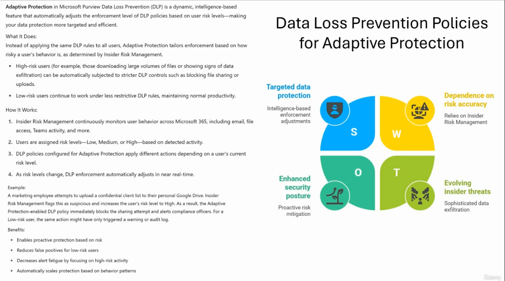
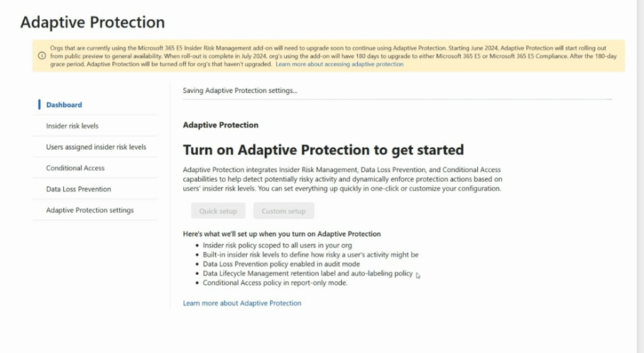
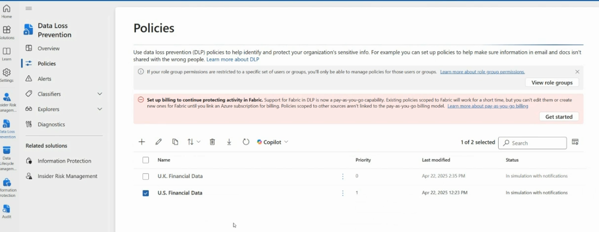
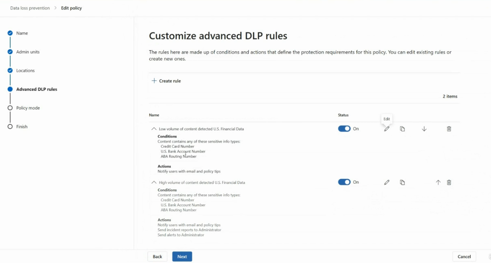

# Adaptive Protection & DLP Policy/Rule Precedence — Microsoft Purview

This guide explains **Adaptive Protection** in Microsoft Purview Data Loss Prevention (DLP), how to set it up, and how **policy** and **rule precedence** determine which DLP actions actually get applied when multiple policies or rules match the same content.

---

## Table of Contents

1. [What is Adaptive Protection](#1-what-is-adaptive-protection)
2. [Setting Up Adaptive Protection](#2-setting-up-adaptive-protection)
3. [DLP Policy Precedence](#3-dlp-policy-precedence)
4. [DLP Rule Precedence](#4-dlp-rule-precedence)

---

## 1. What is Adaptive Protection

**Purpose:** Adaptive Protection is a dynamic, intelligence-based feature that automatically adjusts the enforcement level of DLP policies based on a user's **risk level**, making data protection more targeted and efficient — instead of applying the same DLP rules to everyone.



### What it does

- **High-risk users** (e.g., those downloading large volumes of files or showing signs of data exfiltration) can automatically be subjected to stricter DLP controls, such as blocking file sharing or uploads.
- **Low-risk users** continue to work under less restrictive DLP rules, maintaining normal productivity.

### How it works

1. **Insider Risk Management** continuously monitors user behavior across Microsoft 365 — email, file access, Teams activity, and more.
2. Users are assigned a **risk level** — **Low**, **Medium**, or **High** — based on detected activity.
3. DLP policies configured for Adaptive Protection apply **different actions** depending on a user's current risk level.
4. As risk levels change, DLP enforcement **automatically adjusts in near real-time**.

### Example

A marketing employee attempts to upload a confidential client list to their personal Google Drive. Insider Risk Management flags this as suspicious and raises the user's risk level to **High**. The Adaptive Protection-enabled DLP policy immediately **blocks** the sharing attempt and alerts compliance officers. For a **Low-risk** user, the same action might only have triggered a warning or audit log entry.

### The four pillars (SWOT-style view)

| Pillar | Description |
|---|---|
| **S — Targeted data protection** | Intelligence-based enforcement adjustments |
| **W — Dependence on risk accuracy** | Relies on Insider Risk Management to correctly assess risk |
| **O — Enhanced security posture** | Enables proactive risk mitigation |
| **T — Evolving insider threats** | Must keep pace with sophisticated data exfiltration techniques |

### Benefits

- Enables proactive protection based on risk
- Reduces false positives for low-risk users
- Decreases alert fatigue by focusing on high-risk activity
- Automatically scales protection based on behavior patterns

---

## 2. Setting Up Adaptive Protection

**Purpose:** Turn on Adaptive Protection, which integrates Insider Risk Management, Data Loss Prevention, and Conditional Access to detect risky activity and dynamically enforce protection actions based on a user's insider risk level.



### Steps to configure

1. Go to **Microsoft Purview → Data Loss Prevention → Adaptive Protection**.
2. On the **Dashboard** tab, select **Turn on Adaptive Protection to get started**.
3. Choose a setup method:
   - **Quick setup** — one-click configuration using recommended defaults
   - **Custom setup** — manually configure each component
4. Review what Quick setup will create:
   - An **insider risk policy** scoped to all users in your org
   - **Built-in insider risk levels** to define how risky a user's activity might be
   - A **Data Loss Prevention policy** enabled in **audit mode**
   - A **Data Lifecycle Management** retention label and auto-labeling policy
   - A **Conditional Access policy** in **report-only mode**
5. Use the left-hand navigation to review and fine-tune each area after setup:
   - **Insider risk levels**
   - **Users assigned insider risk levels**
   - **Conditional Access**
   - **Data Loss Prevention**
   - **Adaptive Protection settings**

> ⚠️ Note: Organizations currently using the **Microsoft 365 E5 Insider Risk Management add-on** will need to upgrade to continue using Adaptive Protection. Starting **June 2024**, Adaptive Protection began rolling out from public preview to general availability; orgs using the add-on have **180 days** after rollout completes to upgrade to **Microsoft 365 E5** or **Microsoft 365 E5 Compliance**. After the grace period, Adaptive Protection will be turned off for orgs that haven't upgraded.

---

## 3. DLP Policy Precedence

**Purpose:** When multiple DLP policies could apply to the same content, **priority order** determines which policy's rules are evaluated first. Lower priority numbers are evaluated first.



### Steps to view/manage policy precedence

1. Go to **Microsoft Purview → Data Loss Prevention → Policies**.
2. Review the policy list, which shows:
   - **Name** (e.g., `U.K. Financial Data`, `U.S. Financial Data`)
   - **Priority** (e.g., `0`, `1` — priority `0` is evaluated first)
   - **Last modified**
   - **Status** (e.g., *In simulation with notifications*)
3. Use the toolbar icons to:
   - **+** Create a new policy
   - Edit, copy, reorder (**↑↓**), delete, export, or refresh policies
   - Use **Copilot** for assistance
4. Reorder policies using the up/down priority controls to change which policy is evaluated first when content matches more than one policy.
5. Note the banners at the top of the page:
   - If your **role group permissions** are restricted to specific users/groups, you can only manage policies scoped to those users/groups.
   - **Fabric** support in DLP now requires **pay-as-you-go billing** — existing policies scoped to Fabric will keep working temporarily, but can't be edited or newly created until billing is linked.

---

## 4. DLP Rule Precedence

**Purpose:** Within a single DLP policy, multiple **rules** can be defined. Rule order determines which rule is evaluated first when content matches the conditions of more than one rule inside the same policy.



### Steps to manage rule precedence

1. Go to **Data loss prevention → Policies**, select a policy, and choose **Edit policy**.
2. Navigate to the **Advanced DLP rules** step in the wizard.
3. Review the existing rules and their order (rules are evaluated top to bottom):
   - **Low volume of content detected — U.S. Financial Data**
     - **Conditions:** content contains any of these sensitive info types — Credit Card Number, U.S. Bank Account Number, ABA Routing Number
     - **Actions:** Notify users with email and policy tips
   - **High volume of content detected — U.S. Financial Data**
     - **Conditions:** same sensitive info types as above, but at higher volume
     - **Actions:** Notify users with email and policy tips, send incident reports to Administrator, send alerts to Administrator
4. Use the toolbar next to each rule to:
   - Toggle the rule **On/Off**
   - **Edit** (pencil icon) the rule's conditions and actions
   - **Copy** the rule
   - Move the rule **up (↑)** or **down (↓)** to change its precedence
   - **Delete** the rule (trash icon)
5. Select **+ Create rule** to add a new rule to the policy.
6. Select **Next** to continue to **Policy mode**, or **Back**/**Cancel** as needed.

> 💡 Tip: Rules are generally evaluated in order, and once a rule's conditions match and its actions are applied, subsequent rule evaluation behavior depends on the specific action types configured — so design rule order carefully (e.g., low-volume "just notify" rules before high-volume "block and alert" rules) to avoid conflicting or redundant actions.

---

## Recommended Workflow

1. Enable **Adaptive Protection** (Quick setup) to layer risk-based enforcement on top of your existing DLP policies.
2. Review and adjust **insider risk levels** and the users assigned to them.
3. Check **DLP policy priority** to ensure the most specific/critical policies are evaluated first.
4. Within each policy, order **rules** from least to most restrictive (e.g., notify-only rules before block/alert rules) to avoid unintended blocking of low-risk activity.
5. Monitor policies in **simulation mode** before enforcing, and adjust priority/order based on real-world match data.

---

## File Structure

```
.
├── README.md
├── adaptive-protection.png
├── adaptive-protection-quick-setup.png
├── policies-precedence.png
└── rule-precedence.png
```
