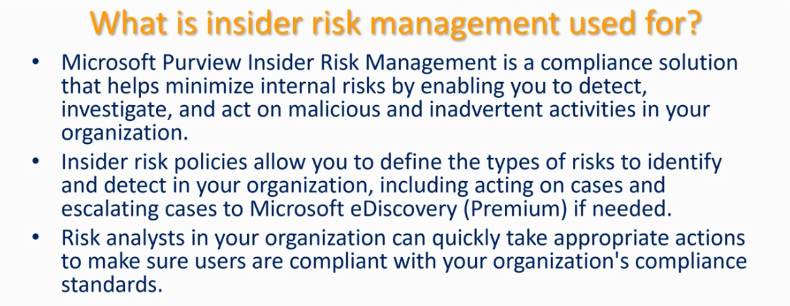
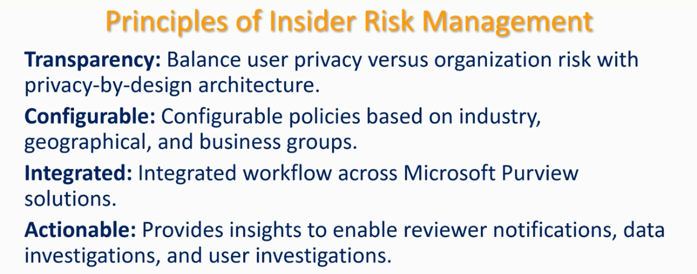
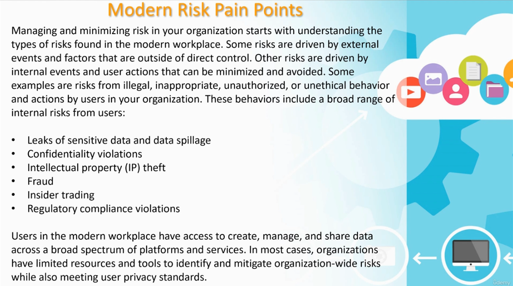
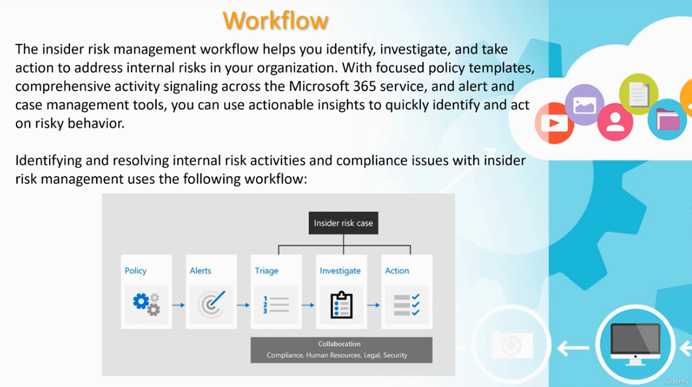
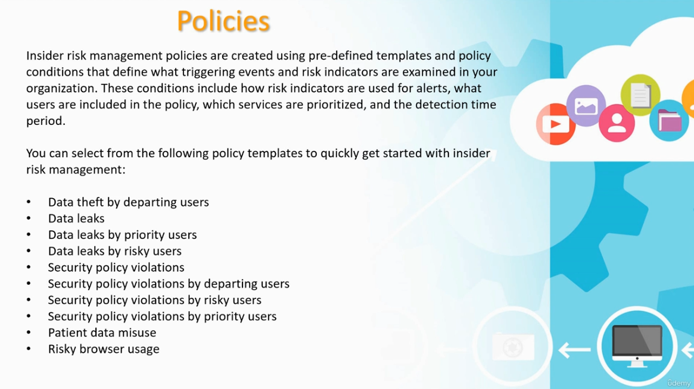
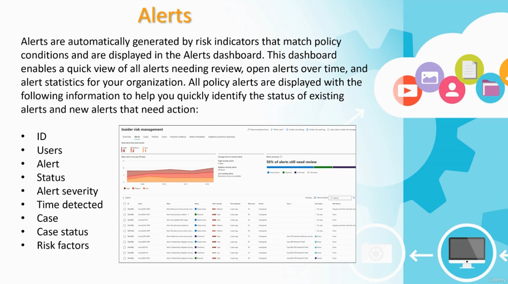
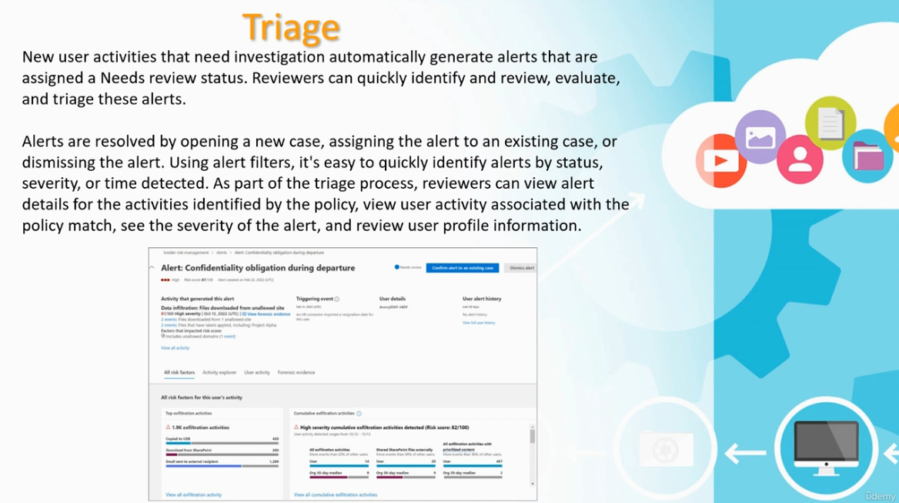
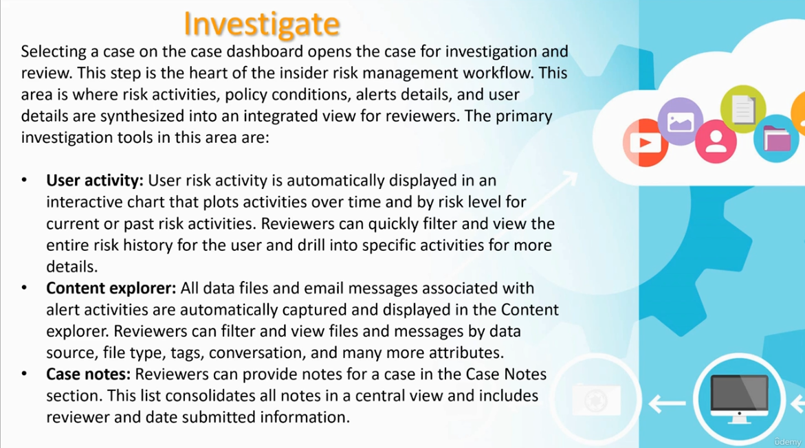
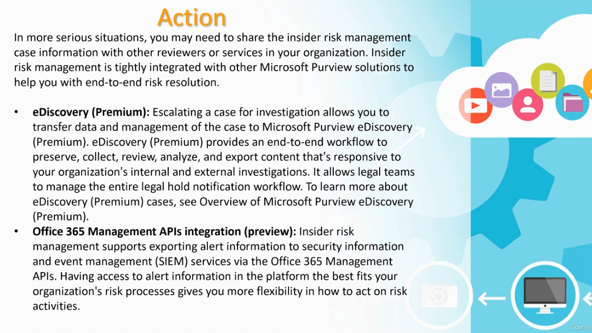

# Microsoft Purview Insider Risk Management

This guide explains what Insider Risk Management is, the risks it addresses, its guiding principles, and the end-to-end workflow (Policy → Alerts → Triage → Investigate → Action) used to detect, investigate, and resolve internal risk activity.

---

## Table of Contents

1. [What Is Insider Risk Management Used For](#1-what-is-insider-risk-management-used-for)
2. [Insider Risk Management Overview Page](#2-insider-risk-management-overview-page)
3. [Modern Risk Pain Points](#3-modern-risk-pain-points)
4. [Principles of Insider Risk Management](#4-principles-of-insider-risk-management)
5. [The Insider Risk Management Workflow](#5-the-insider-risk-management-workflow)
6. [Policies](#6-policies)
7. [Alerts](#7-alerts)
8. [Triage](#8-triage)
9. [Investigate](#9-investigate)
10. [Action](#10-action)

---

## 1. What Is Insider Risk Management Used For

**Purpose:** Microsoft Purview Insider Risk Management is a compliance solution that helps minimize internal risks by enabling you to detect, investigate, and act on malicious and inadvertent activities in your organization.



### Key points

- **Insider risk policies** let you define the types of risks to identify and detect in your organization, including acting on cases and escalating cases to **Microsoft eDiscovery (Premium)** if needed.
- **Risk analysts** in your organization can quickly take appropriate actions to make sure users are compliant with your organization's compliance standards.

---

## 2. Insider Risk Management Overview Page

**Purpose:** The landing page in Microsoft Purview where you get started with Insider Risk Management, review its benefits, and see what to expect.



### Steps to get here

1. Go to **Microsoft Purview → Insider Risk Management → Overview**.
2. Review the **Benefits** tab:
   - **Address risks in the modern workplace** — detect risky activity like sensitive data leaks and theft, security policy violations, and health record access.
   - **Get insights into potential insider risks** — insider risk analytics helps quickly identify potential risks in your org and recommends policies to address them.
   - **Collaborate on investigations** — seamless workflows allow teams across your org to work together reviewing and taking action on potential risks.
   - **Built with privacy in mind** — protects users' privacy by pseudonymizing their names across all insider risk features.
3. Switch to the **What to expect** tab for a walkthrough of the setup process.
4. Use the left-hand navigation to explore:
   - **Recommendations**, **Reports**, **Policies**, **Users** (including **Adaptive Protection** and **Forensic Evidence**), and **Settings**.
5. Related solutions linked from this page include **Communication Compliance**, **Information Protection**, and **Data Security Investigations**.

---

## 3. Modern Risk Pain Points

**Purpose:** Understand the types of internal risk found in the modern workplace before designing policies to address them.



### Key points

Managing and minimizing risk starts with understanding the types of risks in the modern workplace:

- Some risks are driven by **external events and factors** outside of direct control.
- Other risks are driven by **internal events and user actions** that can be minimized and avoided — including illegal, inappropriate, unauthorized, or unethical behavior by users.

Common internal risk behaviors include:

- Leaks of sensitive data and data spillage
- Confidentiality violations
- Intellectual property (IP) theft
- Fraud
- Insider trading
- Regulatory compliance violations

Users in the modern workplace have access to create, manage, and share data across a broad spectrum of platforms and services. In most cases, organizations have **limited resources and tools** to identify and mitigate organization-wide risks while also meeting user privacy standards.

---

## 4. Principles of Insider Risk Management

**Purpose:** The four guiding principles behind how Insider Risk Management is designed to balance detection with privacy and usability.


| Principle | Description |
|---|---|
| **Transparency** | Balance user privacy versus organization risk with privacy-by-design architecture. |
| **Configurable** | Configurable policies based on industry, geographical, and business groups. |
| **Integrated** | Integrated workflow across Microsoft Purview solutions. |
| **Actionable** | Provides insights to enable reviewer notifications, data investigations, and user investigations. |

---

## 5. The Insider Risk Management Workflow

**Purpose:** The end-to-end process used to identify, investigate, and take action on internal risks, from policy creation through resolution.



The insider risk management workflow helps you identify, investigate, and take action to address internal risks in your organization. With focused policy templates, comprehensive activity signaling across the Microsoft 365 service, and alert and case management tools, you can use actionable insights to quickly identify and act on risky behavior.

The workflow proceeds through an **Insider risk case**, made up of five stages:

1. **Policy** — configure what triggers detection
2. **Alerts** — automatically generated when policy conditions match
3. **Triage** — reviewers evaluate and assign alerts
4. **Investigate** — deep-dive into user activity, content, and evidence
5. **Action** — resolve, escalate, or export the case

All stages are supported by **Collaboration** across **Compliance, Human Resources, Legal, and Security** teams.

---

## 6. Policies

**Purpose:** Insider risk management policies are created using pre-defined templates and policy conditions that define what triggering events and risk indicators are examined in your organization.



### What policies define

These conditions include how risk indicators are used for alerts, what users are included in the policy, which services are prioritized, and the detection time period.

### Available policy templates

You can select from the following templates to quickly get started:

- Data theft by departing users
- Data leaks
- Data leaks by priority users
- Data leaks by risky users
- Security policy violations
- Security policy violations by departing users
- Security policy violations by risky users
- Security policy violations by priority users
- Patient data misuse
- Risky browser usage

### Steps to configure

1. Go to **Microsoft Purview → Insider Risk Management → Policies**.
2. Select **Create policy**.
3. Choose a policy template from the list above that matches your scenario.
4. Define the **triggering events** (e.g., a resignation date, a security alert) and **risk indicators** to monitor.
5. Scope the policy to the **users or groups** you want covered.
6. Set the **detection time period** and prioritize services as needed.
7. Review and finish to activate the policy.

---

## 7. Alerts

**Purpose:** Alerts are automatically generated by risk indicators that match policy conditions and are displayed in the Alerts dashboard for reviewers to act on.



### What the Alerts dashboard shows

This dashboard enables a quick view of all alerts needing review, open alerts over time, and alert statistics for your organization. All policy alerts are displayed with the following information to help you quickly identify status:

- **ID**
- **Users**
- **Alert**
- **Status**
- **Alert severity**
- **Time detected**
- **Case**
- **Case status**
- **Risk factors**

### Steps to review alerts

1. Go to **Insider Risk Management → Alerts**.
2. Use the summary charts at the top to review **open alerts over the past 30 days**, **average time to review alerts** (by severity), and the **percentage of alerts still needing review**.
3. Filter the alerts table by **status**, **severity**, or **time detected**.
4. Select an alert to view its details and decide how to triage it (see next section).

---

## 8. Triage

**Purpose:** New user activities that need investigation automatically generate alerts assigned a **Needs review** status. Reviewers can quickly identify, evaluate, and triage these alerts.



### How alerts are resolved

Alerts are resolved by:

- Opening a **new case**
- Assigning the alert to an **existing case**
- **Dismissing** the alert

### What reviewers can do during triage

Using alert filters, it's easy to quickly identify alerts by **status**, **severity**, or **time detected**. As part of the triage process, reviewers can:

1. View **alert details** for the activities identified by the policy.
2. View **user activity** associated with the policy match.
3. See the **severity** of the alert (e.g., a High severity alert with a risk score of 87/100).
4. Review **user profile information**, triggering events, and risk factors — such as cumulative exfiltration activity, files copied to USB, downloads from SharePoint, or emails sent to external recipients.
5. Select **Confirm alert to existing case** or **Dismiss alert** to resolve it.

---

## 9. Investigate

**Purpose:** Selecting a case on the case dashboard opens it for investigation and review — the heart of the insider risk management workflow, where risk activities, policy conditions, alert details, and user details are synthesized into an integrated view.



### Primary investigation tools

- **User activity** — user risk activity is automatically displayed in an interactive chart that plots activities over time and by risk level for current or past risk activities. Reviewers can quickly filter and view the entire risk history for the user and drill into specific activities for more details.
- **Content explorer** — all data files and email messages associated with alert activities are automatically captured and displayed. Reviewers can filter and view files and messages by data source, file type, tags, conversation, and many more attributes.
- **Case notes** — reviewers can provide notes for a case in the Case Notes section. This list consolidates all notes in a central view, including reviewer and date submitted information.

---

## 10. Action

**Purpose:** In more serious situations, share insider risk management case information with other reviewers or services to reach end-to-end risk resolution.



Insider risk management is tightly integrated with other Microsoft Purview solutions:

- **eDiscovery (Premium)** — escalating a case for investigation allows you to transfer data and management of the case to Microsoft Purview eDiscovery (Premium). eDiscovery (Premium) provides an end-to-end workflow to preserve, collect, review, analyze, and export content that's responsive to your organization's internal and external investigations. It allows legal teams to manage the entire legal hold notification workflow.
- **Office 365 Management APIs integration (preview)** — Insider risk management supports exporting alert information to security information and event management (SIEM) services via the Office 365 Management APIs. Having access to alert information in the platform that best fits your organization's risk processes gives you more flexibility in how to act on risk activities.

### Steps to escalate a case

1. Open the case from the **case dashboard**.
2. Review all gathered evidence in the **Investigate** stage (user activity, content explorer, case notes).
3. If further legal action is needed, select the option to **escalate to eDiscovery (Premium)**.
4. Alternatively, configure **SIEM export** via the Office 365 Management APIs to route alert data to your organization's preferred security platform.
5. Document the resolution and close or transfer the case as appropriate.

---

## Recommended Workflow

1. Review your organization's **modern risk pain points** to understand what you need to protect against.
2. Keep the four **principles** (Transparency, Configurable, Integrated, Actionable) in mind when designing policies.
3. Create a **policy** from a template that matches your scenario (e.g., data leaks by departing users).
4. Monitor the **Alerts** dashboard for new activity needing review.
5. **Triage** alerts — confirm to a case, add to an existing case, or dismiss.
6. **Investigate** confirmed cases using user activity, content explorer, and case notes.
7. Take **action** — resolve internally, or escalate to eDiscovery (Premium) / export to SIEM for serious cases.

---

## File Structure

```
.
├── README.md
├── what-is-insider-risk-management.png
├── insider-risk-management-overview.png
├── risk-pain-points.png
├── principles-of-insider-risk-management.png
├── workflow.png
├── policies.png
├── alerts.png
├── triage.png
├── investigate.png
└── action.png
```
