# Creating an Insider Risk Management Policy — Microsoft Purview

This guide walks through setting up **data connectors** (needed for some detection scenarios) and then creating a full **Insider Risk Management policy** step-by-step, including quick policies, policy templates, content prioritization, triggering events, and indicators.

---

## Table of Contents

1. [Data Connectors — All Connectors](#1-data-connectors--all-connectors)
2. [Data Connectors — HR Connector](#2-data-connectors--hr-connector)
3. [Create Quick Policies](#3-create-quick-policies)
4. [Step 1 — Choose a Policy Template](#4-step-1--choose-a-policy-template)
5. [Step 2 — Choose Users, Groups, & Adaptive Scopes](#5-step-2--choose-users-groups--adaptive-scopes)
6. [Step 3 — Decide Whether to Prioritize Content](#6-step-3--decide-whether-to-prioritize-content)
7. [Step 3a — Sensitivity Labels to Prioritize](#7-step-3a--sensitivity-labels-to-prioritize)
8. [Step 3b — Decide Whether to Score Only Priority Content](#8-step-3b--decide-whether-to-score-only-priority-content)
9. [Step 4 — Choose Triggering Event](#9-step-4--choose-triggering-event)
10. [Step 4a — Trigger Thresholds](#10-step-4a--trigger-thresholds)
11. [Step 5 — Indicators](#11-step-5--indicators)
12. [Step 5a — Detection Options (Sequence Detection)](#12-step-5a--detection-options-sequence-detection)
13. [Step 5b — Indicator Thresholds](#13-step-5b--indicator-thresholds)

---

## 1. Data Connectors — All Connectors

**Purpose:** Data connectors let you import non-Microsoft data (social media, HR systems, healthcare systems, etc.) into your compliance solutions, including Insider Risk Management.

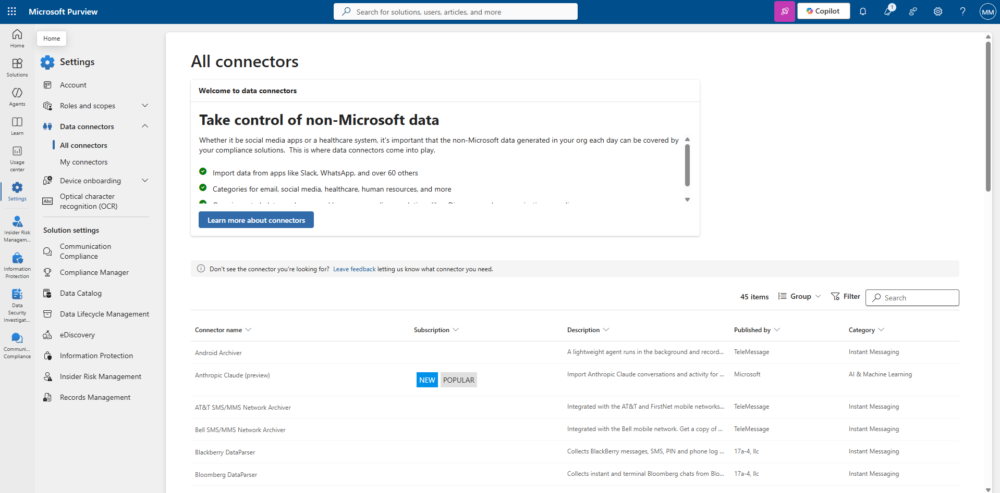

### Steps to access

1. Go to **Microsoft Purview → Settings → Data connectors → All connectors**.
2. Review the **Welcome to data connectors** panel: import data from apps like Slack, WhatsApp, and over 60 others, organized into categories for email, social media, healthcare, human resources, and more.
3. Browse the connector list, which shows **Connector name**, **Subscription**, **Description**, **Published by**, and **Category** (e.g., Android Archiver, Anthropic Claude (preview), AT&T SMS/MMS Network Archiver, Bloomberg DataParser).
4. Use **Search**, **Filter**, or **Group** to find a specific connector.
5. If the connector you need isn't listed, use **Leave feedback** to request it.

---

## 2. Data Connectors — HR Connector

**Purpose:** The HR connector pulls in HR data from CSV files (termination, resignation, performance, and profile information) so it can be used by Insider Risk Management policies to detect HR-related activity for a specific user — such as data theft by departing employees.

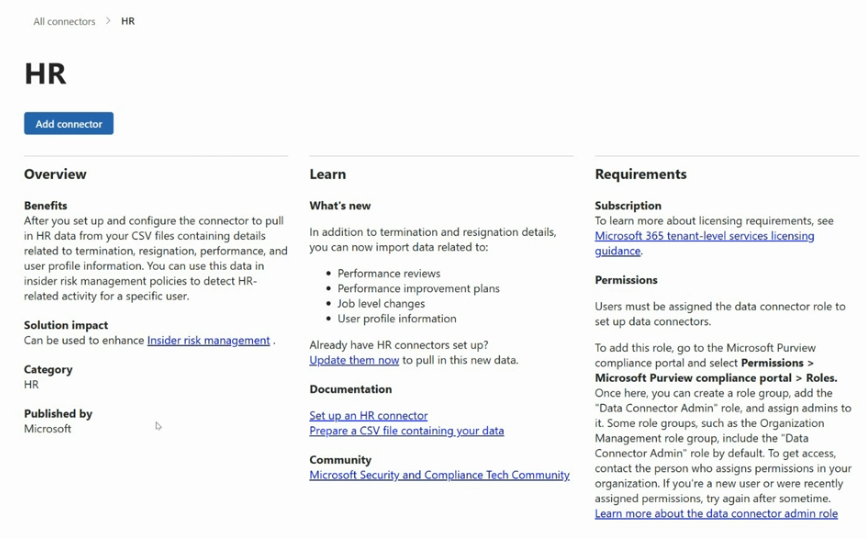

### Steps to configure

1. From **All connectors**, search for and select **HR**.
2. Review the **Overview**:
   - **Benefits** — after setup, you can pull in HR data from CSV files covering termination, resignation, performance, and user profile information, and use this data in insider risk management policies to detect HR-related activity for a specific user.
   - **Solution impact** — can be used to enhance **Insider risk management**.
   - **Category** — HR. **Published by** — Microsoft.
3. Review **What's new** — in addition to termination and resignation details, you can now import data related to performance reviews, performance improvement plans, job level changes, and user profile information.
4. Check the **Requirements**:
   - **Subscription** — review Microsoft 365 tenant-level services licensing guidance.
   - **Permissions** — users must be assigned the **Data Connector Admin** role to set up data connectors. Add this role via **Microsoft Purview compliance portal → Permissions → Roles**, creating or updating a role group as needed (some role groups, like Organization Management, include this role by default).
5. Follow the **Learn** links as needed: **Set up an HR connector**, **Prepare a CSV file containing your data**.
6. Select **Add connector** to begin the setup wizard.

---

## 3. Create Quick Policies

**Purpose:** Quick policies use preconfigured settings to set up an Insider Risk Management policy fast, based on common insider risk scenarios — an alternative to the full custom wizard.

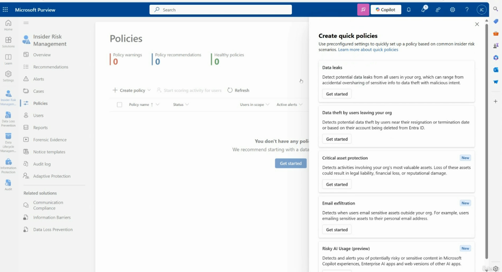

### Steps to use

1. Go to **Insider Risk Management → Policies**.
2. Review the summary counters: **Policy warnings**, **Policy recommendations**, **Healthy policies**.
3. If you have no policies yet, select **Get started**, or select **Create policy → Quick policy** to open the **Create quick policies** panel.
4. Choose a preconfigured scenario and select its **Get started** button:
   - **Data leaks** — detect potential data leaks from all users in your org, ranging from accidental oversharing of sensitive info to data theft with malicious intent.
   - **Data theft by users leaving your org** — detects potential data theft by users near their resignation or termination date, or based on their account being deleted from Microsoft Entra ID.
   - **Critical asset protection** *(New)* — detects activities involving your org's most valuable assets, where loss could result in legal liability, financial loss, or reputational damage.
   - **Email exfiltration** *(New)* — detects when users email sensitive assets outside your org, e.g., to a personal email address.
   - **Risky AI Usage (preview)** *(New)* — detects and alerts you to potentially risky or sensitive content in Microsoft Copilot experiences, Enterprise AI apps, and web versions of other AI apps.
5. Follow the guided prompts to finish creating the quick policy, or switch to a full custom policy using the steps below for more control.

---

## 4. Step 1 — Choose a Policy Template

**Purpose:** Policy templates specify the conditions and indicators that define the risk activities you want to be alerted to.

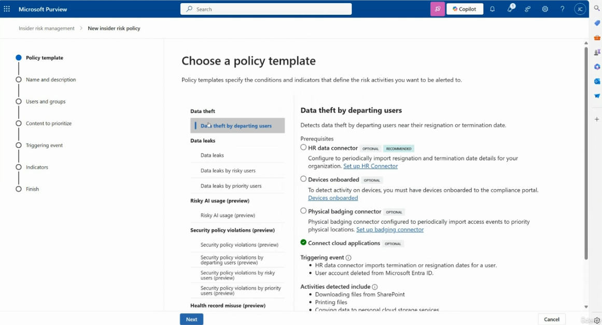

### Steps

1. Select **Create policy → Custom policy** to launch the **New insider risk policy** wizard.
2. On the **Policy template** step, browse categories on the left: **Data theft**, **Data leaks**, **Risky AI usage (preview)**, **Security policy violations (preview)**, **Health record misuse (preview)**, and more.
3. Select a specific template, e.g., **Data theft by departing users**. The right pane shows:
   - **Description** — detects data theft by departing users near their resignation or termination date.
   - **Prerequisites** — e.g., HR data connector (optional, recommended), Devices onboarded (optional), Physical badging connector (optional), Connect cloud applications (optional — shown as already connected with a green check).
   - **Triggering event** — e.g., HR data connector imports termination or resignation dates for a user; user account deleted from Microsoft Entra ID.
   - **Activities detected include** — e.g., downloading files from SharePoint, printing files, copying data to personal cloud storage services.
4. Select **Next**.

---

## 5. Step 2 — Choose Users, Groups, & Adaptive Scopes

**Purpose:** Defines which users the policy applies to.

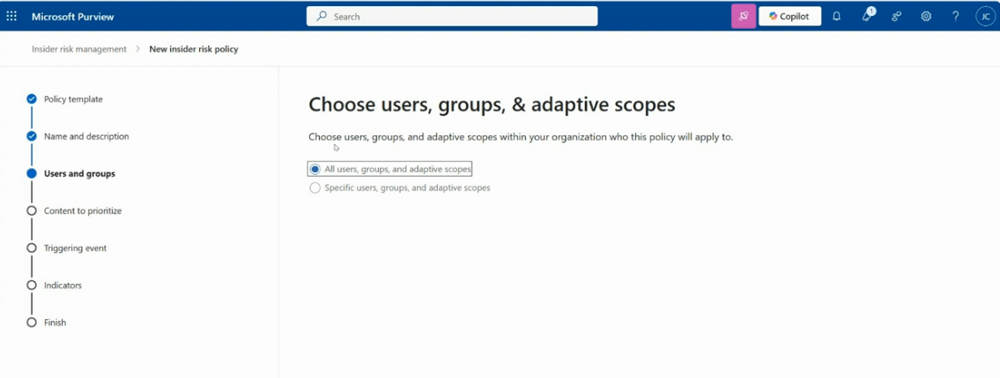

### Steps

1. On the **Users and groups** step, choose:
   - **All users, groups, and adaptive scopes** — applies the policy tenant-wide.
   - **Specific users, groups, and adaptive scopes** — scope the policy to a defined subset.
2. If choosing specific scopes, select the users, groups, or adaptive scopes to include (or exclude, if supported).
3. Select **Next**.

---

## 6. Step 3 — Decide Whether to Prioritize Content

**Purpose:** Prioritizing content increases the risk score for any activity involving high-value data, increasing the chance of generating a high-severity alert.

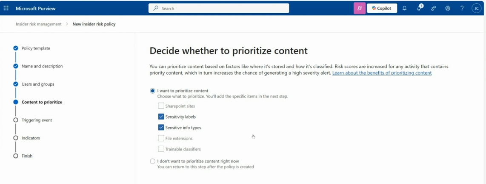

### Steps

1. On the **Content to prioritize** step, choose:
   - **I want to prioritize content** — then select what to prioritize:
     - ☐ SharePoint sites
     - ✅ Sensitivity labels
     - ✅ Sensitive info types
     - ☐ File extensions
     - ☐ Trainable classifiers
   - **I don't want to prioritize content right now** — you can return to this step after the policy is created.
2. Select **Next** to configure the specific items for each checked category (e.g., sensitivity labels).

---

## 7. Step 3a — Sensitivity Labels to Prioritize

**Purpose:** Any activity associated with content that has the selected sensitivity labels applied will be assigned a **higher risk score**.


### Steps

1. On the **Sensitivity labels** sub-step, select **+ Add or edit sensitivity labels**.
2. Choose the labels to prioritize — e.g., **Top Secret Data**.
3. Remove a label using the **X** next to it if needed.
4. Select **Next** to continue to the **Sensitive info types** sub-step (if enabled) or **Scoring**.

---

## 8. Step 3b — Decide Whether to Score Only Priority Content

**Purpose:** Controls whether risk scores are generated for all detected activity, or only for activity involving the priority content you defined.

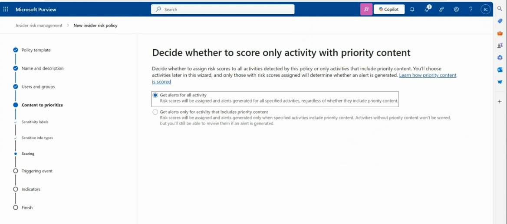

### Steps

1. On the **Scoring** sub-step, choose:
   - **Get alerts for all activity** — risk scores are assigned and alerts generated for all specified activities, regardless of whether they include priority content.
   - **Get alerts only for activity that includes priority content** — risk scores and alerts are only generated when specified activities include priority content; other activity won't be scored but can still be reviewed if an alert is generated for another reason.
2. Select **Next**.

---

## 9. Step 4 — Choose Triggering Event

**Purpose:** Defines what starts risk scoring for a user's activity — either a DLP policy match, or a direct exfiltration activity.

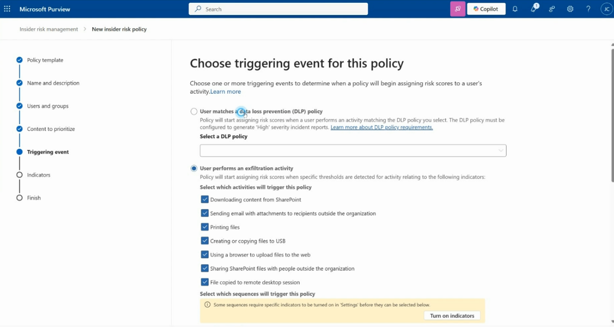

### Steps

1. On the **Triggering event** step, choose one:
   - **User matches a Data Loss Prevention (DLP) policy** — the policy starts assigning risk scores when a user performs an activity matching a selected DLP policy (the DLP policy must be configured to generate **High severity incident reports**).
     - Select the DLP policy from the **Select a DLP policy** dropdown.
   - **User performs an exfiltration activity** — the policy starts assigning risk scores when specific thresholds are detected for selected indicators.
     - Check the activities that will trigger the policy, e.g.:
       - Downloading content from SharePoint
       - Sending email with attachments to recipients outside the organization
       - Printing files
       - Creating or copying files to USB
       - Using a browser to upload files to the web
       - Sharing SharePoint files with people outside the organization
       - File copied to remote desktop session
     - Optionally select which **sequences** will trigger the policy (some sequences require indicators to be turned on in **Settings** first — use **Turn on indicators** if prompted).
2. Select **Next**.

---

## 10. Step 4a — Trigger Thresholds

**Purpose:** Fine-tune exactly how many daily events are required for each selected exfiltration activity before the policy starts assigning risk scores.

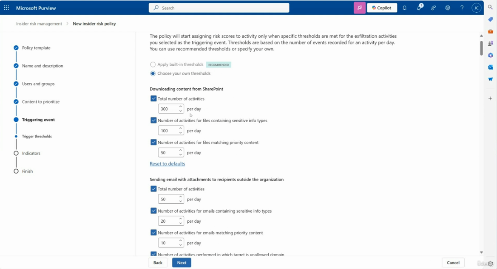

### Steps

1. On the **Trigger thresholds** sub-step, choose:
   - **Apply built-in thresholds** *(recommended)*
   - **Choose your own thresholds**
2. If customizing, set per-activity thresholds, e.g., for **Downloading content from SharePoint**:
   - Total number of activities — e.g., 300 per day
   - Number of activities for files containing sensitive info types — e.g., 100 per day
   - Number of activities for files matching priority content — e.g., 50 per day
3. Repeat for other activities, such as **Sending email with attachments to recipients outside the organization**:
   - Total number of activities — e.g., 50 per day
   - Number of activities for emails containing sensitive info types — e.g., 20 per day
   - Number of activities for emails matching priority content — e.g., 10 per day
   - Number of activities performed in which target is unallowed domain
4. Use **Reset to defaults** to revert any section to Microsoft's recommended values.
5. Select **Next**.

---

## 11. Step 5 — Indicators

**Purpose:** Indicators are the specific signals used to generate alerts for the activity detected by the policy template you selected.

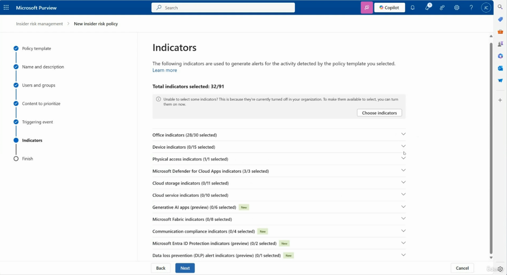

### Steps

1. On the **Indicators** step, review the **Total indicators selected** count (e.g., 32/91).
2. If some indicators can't be selected, it's because they're currently turned off in your organization — select **Choose indicators** to enable them.
3. Expand each category to review/adjust selections, e.g.:
   - Office indicators (28/30 selected)
   - Device indicators (0/15 selected)
   - Physical access indicators (1/1 selected)
   - Microsoft Defender for Cloud Apps indicators (3/3 selected)
   - Cloud storage indicators (0/11 selected)
   - Cloud service indicators (0/10 selected)
   - Generative AI apps (preview) (0/6 selected) — *New*
   - Microsoft Fabric indicators (0/8 selected)
   - Communication compliance indicators (0/4 selected) — *New*
   - Microsoft Entra ID Protection indicators (preview) (0/2 selected) — *New*
   - Data loss prevention (DLP) alert indicators (preview) (0/1 selected) — *New*
4. Select **Next**.

---

## 12. Step 5a — Detection Options (Sequence Detection)

**Purpose:** Advanced detection options used to generate alerts based on **sequences** — groups of two or more activities performed one after the other over a period of 7 days that might suggest elevated risk.

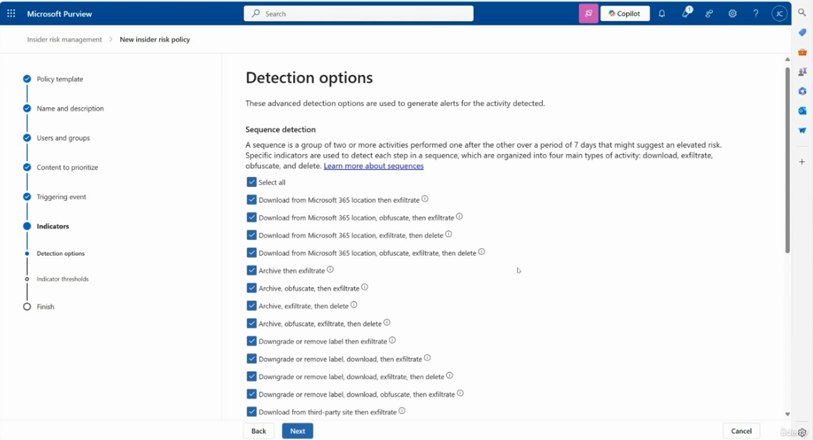

### Steps

1. Review the sequence types, organized into four main activity categories: **download, exfiltrate, obfuscate,** and **delete**.
2. Select **Select all**, or check individual sequences, such as:
   - Download from Microsoft 365 location then exfiltrate
   - Download from Microsoft 365 location, obfuscate, then exfiltrate
   - Download from Microsoft 365 location, exfiltrate, then delete
   - Archive then exfiltrate
   - Archive, obfuscate, then exfiltrate
   - Downgrade or remove label then exfiltrate
   - Downgrade or remove label, download, then exfiltrate
   - Download from third-party site then exfiltrate
3. Select **Next**.

---

## 13. Step 5b — Indicator Thresholds

**Purpose:** Choose how thresholds are applied to your selected indicators — thresholds influence an activity's risk score, which determines whether an alert's severity is low, medium, or high.

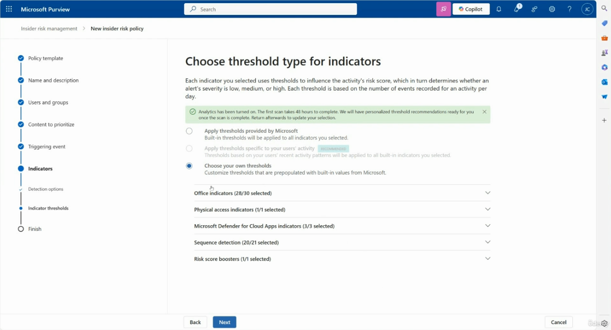

### Steps

1. Each threshold is based on the number of events recorded for an activity **per day**.
2. Choose one option:
   - **Apply thresholds provided by Microsoft** — built-in thresholds applied to all indicators you selected.
   - **Apply thresholds specific to your users' activity** *(Recommended)* — thresholds based on your users' recent activity patterns; requires **Analytics** to be turned on (the first scan takes 48 hours to complete before personalized recommendations are ready).
   - **Choose your own thresholds** — customize thresholds that are prepopulated with built-in values from Microsoft.
3. Expand each category to review/adjust its thresholds:
   - Office indicators (28/30 selected)
   - Physical access indicators (1/1 selected)
   - Microsoft Defender for Cloud Apps indicators (3/3 selected)
   - Sequence detection (20/21 selected)
   - Risk score boosters (1/1 selected)
4. Select **Next**, then continue to **Finish** to review and create the policy.

---

## Recommended Workflow

1. Set up any needed **data connectors** first (e.g., HR connector) so triggering events like resignation/termination dates are available.
2. Use a **Quick policy** for common, out-of-the-box scenarios, or build a **Custom policy** for full control.
3. Choose a **policy template** matching your risk scenario.
4. Scope the policy to the right **users and groups**.
5. Decide whether to **prioritize content** (sensitivity labels, sensitive info types) and whether to score all activity or only priority-content activity.
6. Choose the **triggering event** (DLP policy match or exfiltration activity) and tune its **thresholds**.
7. Select the **indicators** and **sequence detection options** relevant to your scenario.
8. Set **indicator thresholds** — ideally using activity-based recommendations once Analytics has run for 48 hours.
9. Review and finish to activate (or run in a testing/simulation posture first, if supported).

---

## File Structure

```
.
├── README.md
├── all-connectors.png
├── hr-connector.png
├── create-quick-policies.png
├── policy-templates.png
├── choose-users-groups.png
├── prioritize-content.png
├── labels-to-prioritize.png
├── score-activity.png
├── triggering-event.png
├── trigger-thresholds.png
├── indicators.png
├── detection-options.png
└── indicator-thresholds.png
```
