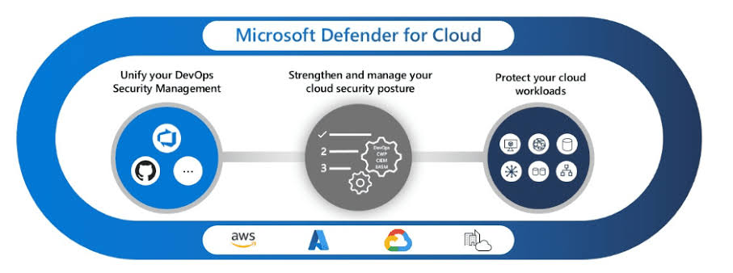
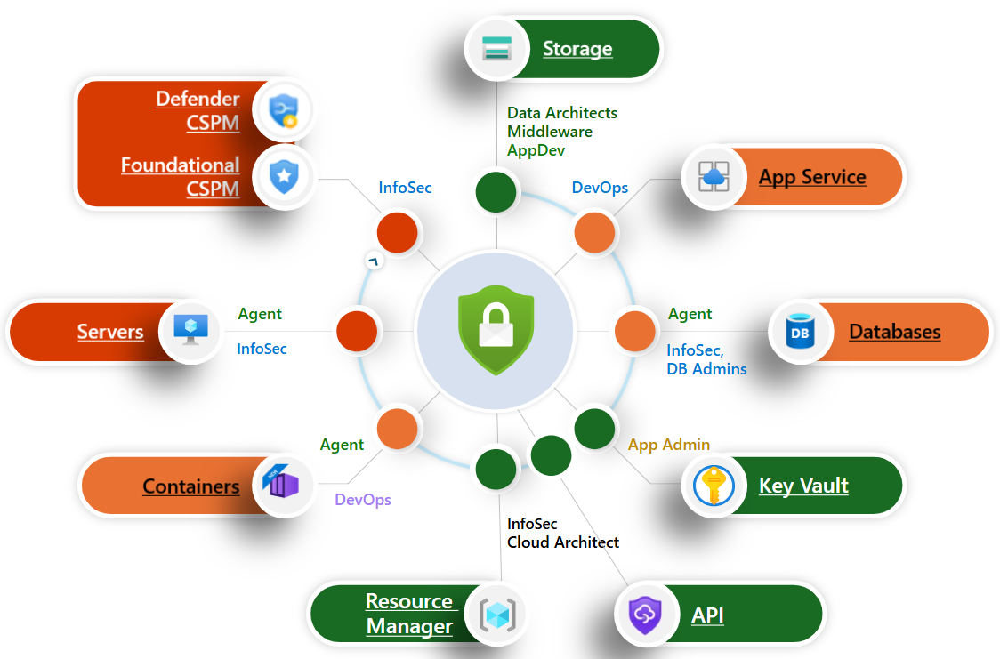
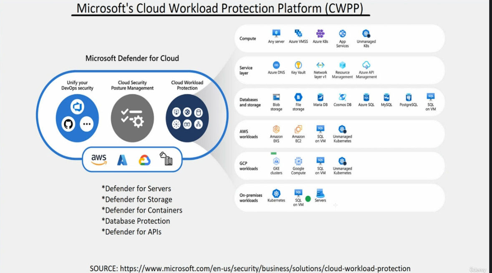
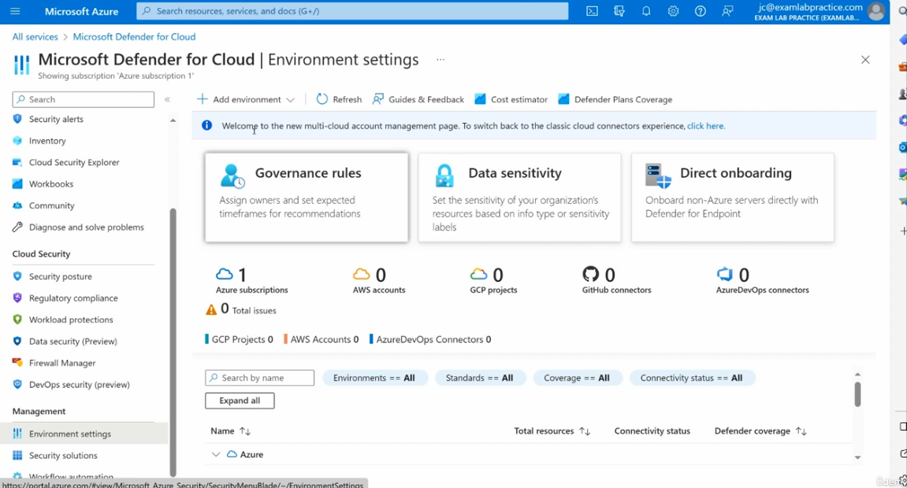
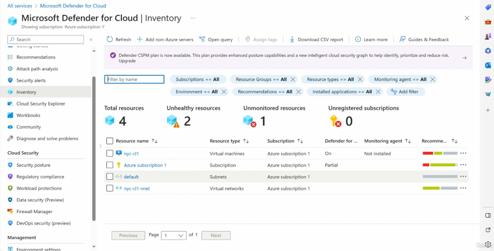
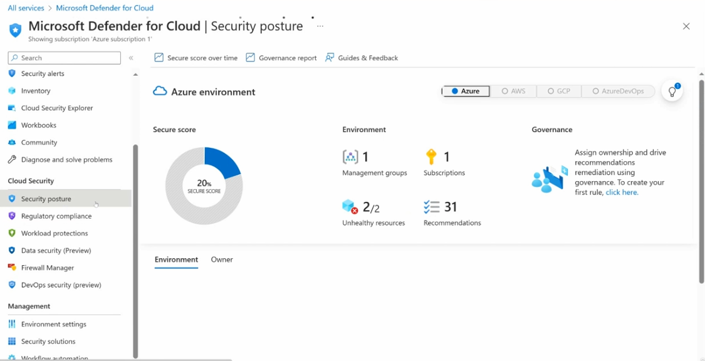
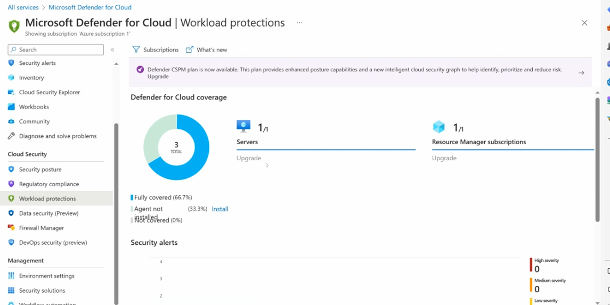
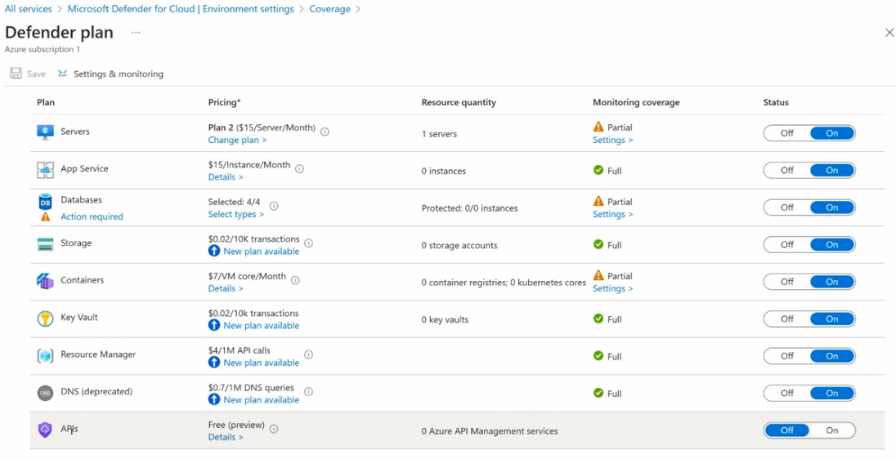

# Microsoft Defender for Cloud

This guide explains what Microsoft Defender for Cloud does, its core capabilities (CSPM and CWPP), and walks through the main pages you'll use to manage environment settings, inventory, security posture, workload protections, and Defender plans.

---

## Table of Contents

1. [What Is Microsoft Defender for Cloud](#1-what-is-microsoft-defender-for-cloud)
2. [Cloud Security Posture Management (CSPM)](#2-cloud-security-posture-management-cspm)
3. [Cloud Workload Protection Platform (CWPP)](#3-cloud-workload-protection-platform-cwpp)
4. [Environment Settings](#4-environment-settings)
5. [Inventory](#5-inventory)
6. [Security Posture](#6-security-posture)
7. [Workload Protections](#7-workload-protections)
8. [Defender Plans](#8-defender-plans)

---

## 1. What Is Microsoft Defender for Cloud

**Purpose:** Microsoft Defender for Cloud is a cloud-native application protection platform (CNAPP) that unifies DevOps security management, strengthens and manages your cloud security posture, and protects your cloud workloads — across multiple cloud providers.



### Three core pillars

1. **Unify your DevOps Security Management** — brings together security signals from DevOps tools like Azure DevOps and GitHub.
2. **Strengthen and manage your cloud security posture** — combines DevOps, Cloud Workload Protection (CWP), Cloud Security Posture Management (CSPM), and cloud infrastructure/entitlement management (CIEM) capabilities.
3. **Protect your cloud workloads** — covers compute, network, data, identity, and containers.

Defender for Cloud works across **AWS**, **Azure**, **Google Cloud (GCP)**, and on-premises environments.

---

## 2. Cloud Security Posture Management (CSPM)

**Purpose:** CSPM continuously assesses your resources, subscriptions, and organization against security best practices, giving each area an owner and a set of prioritized recommendations to reduce risk.



### Coverage areas and typical owners

| Resource | Typical Owner(s) |
|---|---|
| **Storage** | Data Architects, Middleware, AppDev |
| **App Service** | DevOps |
| **Servers** | InfoSec |
| **Databases** | InfoSec, DB Admins |
| **Containers** | DevOps |
| **Resource Manager** | InfoSec, Cloud Architect |
| **Key Vault** | App Admin |
| **API** | InfoSec, Cloud Architect |

Two CSPM tiers are available:

- **Foundational CSPM** — free, baseline posture recommendations included for all connected resources.
- **Defender CSPM** — a paid upgrade providing enhanced posture capabilities and an intelligent cloud security graph to help identify, prioritize, and reduce risk.

---

## 3. Cloud Workload Protection Platform (CWPP)

**Purpose:** CWPP protects the actual runtime workloads — compute, storage, databases, and containers — across Azure, AWS, GCP, and on-premises, using dedicated Defender plans for each workload type.



### What Defender for Cloud protects

- **Unify your DevOps security** — GitHub, Azure DevOps, and other DevOps tools.
- **Cloud Security Posture Management** — continuous posture assessment.
- **Cloud Workload Protection** — runtime threat protection for:
  - **Compute** — any server, Azure VMSS, Azure Kubernetes Service (K8s), App Services, unmanaged K8s
  - **Service layer** — Azure DNS, Key Vault, network layer v1, Resource Management, Azure API Management
  - **Databases and storage** — Blob storage, File storage, MariaDB, Cosmos DB, Azure SQL, MySQL, PostgreSQL, SQL on VM
  - **AWS workloads** — Amazon EKS, Amazon EC2, SQL on VM, unmanaged Kubernetes
  - **GCP workloads** — GKE clusters, Google Compute, SQL on VM, unmanaged Kubernetes
  - **On-premises workloads** — Kubernetes, SQL on VM, Servers

### Dedicated Defender plans

- Defender for Servers
- Defender for Storage
- Defender for Containers
- Database Protection
- Defender for APIs

> Source: [microsoft.com/en-us/security/business/solutions/cloud-workload-protection](https://www.microsoft.com/en-us/security/business/solutions/cloud-workload-protection)

---

## 4. Environment Settings

**Purpose:** The central place to onboard cloud environments (Azure, AWS, GCP), manage governance rules, set data sensitivity, and view overall connector/coverage status.



### Steps to configure

1. Go to **Microsoft Azure → All services → Microsoft Defender for Cloud → Environment settings**.
2. Use the top toolbar to:
   - **+ Add environment** — onboard a new Azure subscription, AWS account, or GCP project.
   - **Refresh**, **Guides & Feedback**, **Cost estimator**, **Defender Plans Coverage**.
3. Explore the three quick-action tiles:
   - **Governance rules** — assign owners and set expected timeframes for recommendations.
   - **Data sensitivity** — set the sensitivity of your organization's resources based on info type or sensitivity labels.
   - **Direct onboarding** — onboard non-Azure servers directly with Defender for Endpoint.
4. Review the summary counters: **Azure subscriptions**, **AWS accounts**, **GCP projects**, **GitHub connectors**, **AzureDevOps connectors**, and **Total issues**.
5. Use the filters (**Search by name**, **Environments**, **Standards**, **Coverage**, **Connectivity status**) to narrow the environment list below.
6. Expand a provider (e.g., **Azure**) to see **Total resources**, **Connectivity status**, and **Defender coverage** per environment.

---

## 5. Inventory

**Purpose:** A centralized, filterable view of every resource Defender for Cloud is aware of, along with its health, monitoring, and Defender coverage status.



### Steps to use

1. Go to **Microsoft Defender for Cloud → Inventory**.
2. Use the toolbar to **Refresh**, **+ Add non-Azure servers**, **Open query**, **Assign tags**, **Download CSV report**, or view **Guides & Feedback**.
3. Review the summary tiles: **Total resources**, **Unhealthy resources**, **Unmonitored resources**, **Unregistered subscriptions**.
4. Apply filters: **Subscriptions**, **Resource Groups**, **Resource types**, **Monitoring agent**, **Environment**, **Recommendations**, **Installed applications**, or **+ Add filter**.
5. Review the resource table, which lists **Resource name**, **Resource type**, **Subscription**, **Defender for...** status, **Monitoring agent**, and **Recommendations** (color-coded severity bar).
6. Select the **⋯** menu on any row for row-level actions.
7. Note the banner promoting the **Defender CSPM plan** for enhanced posture capabilities — select **Upgrade** if relevant.

---

## 6. Security Posture

**Purpose:** Shows your overall Secure Score, environment inventory, and governance status — a single view to track how well-protected your cloud environment is over time.



### Steps to use

1. Go to **Microsoft Defender for Cloud → Security posture**.
2. Use the toolbar: **Secure score over time**, **Governance report**, **Guides & Feedback**.
3. Switch between cloud providers using the tabs: **Azure**, **AWS**, **GCP**, **AzureDevOps**.
4. Review the three summary panels:
   - **Secure score** — shown as a percentage in a donut chart (e.g., 20%).
   - **Environment** — counts of **Management groups**, **Subscriptions**, and **Unhealthy resources** (e.g., 2/2), plus total **Recommendations** (e.g., 31).
   - **Governance** — assign ownership and drive remediation using governance rules; select the link to create your first rule.
5. Switch between the **Environment** and **Owner** tabs below to see posture broken down accordingly.

---

## 7. Workload Protections

**Purpose:** Shows Defender for Cloud coverage across your workloads (servers, subscriptions, etc.) and surfaces recent security alerts by severity.



### Steps to use

1. Go to **Microsoft Defender for Cloud → Workload protections**.
2. Use the toolbar: **Subscriptions** filter, **What's new**.
3. Review the **Defender for Cloud coverage** donut chart, showing a total resource count (e.g., 3 total) broken into:
   - **Fully covered** (e.g., 66.7%)
   - **Agent not installed** (e.g., 33.3%) — select **Install** to remediate
   - **Not covered** (e.g., 0%)
4. Review coverage ratios for **Servers** (e.g., 1/1) and **Resource Manager subscriptions** (e.g., 1/1), each with an **Upgrade** link if a higher-tier plan is available.
5. Scroll down to the **Security alerts** chart, which breaks down alerts by **High**, **Medium**, and **Low severity** over time.
6. Note the banner promoting the **Defender CSPM plan** for enhanced posture capabilities and an intelligent cloud security graph.

---

## 8. Defender Plans

**Purpose:** Lets you turn specific Defender for Cloud protection plans on or off per resource type, and review pricing and monitoring coverage for each.



### Steps to configure

1. Go to **Microsoft Defender for Cloud → Environment settings → (select a subscription) → Defender plans → Coverage → Defender plan**.
2. Review the plan table, which lists for each workload type: **Plan**, **Pricing**, **Resource quantity**, **Monitoring coverage**, and **Status**:
   - **Servers** — e.g., Plan 2 ($15/Server/Month), 1 server, Partial coverage (select **Settings** to review), toggle **On/Off**.
   - **App Service** — e.g., $15/Instance/Month, 0 instances, Full coverage.
   - **Databases** — e.g., Selected 4/4 types, 0/0 instances protected, Partial coverage — **Action required**.
   - **Storage** — e.g., $0.02/10K transactions, 0 storage accounts, Full coverage.
   - **Containers** — e.g., $7/VM core/Month, 0 container registries, 0 Kubernetes cores, Partial coverage.
   - **Key Vault** — e.g., $0.02/10k transactions, 0 key vaults, Full coverage.
   - **Resource Manager** — e.g., $4/1M API calls, Full coverage.
   - **DNS** *(deprecated)* — e.g., $0.7/1M DNS queries, Full coverage.
   - **APIs** — e.g., Free (preview), 0 Azure API Management services, currently Off.
3. Toggle each plan **On** or **Off** as needed for your subscription.
4. Select **Change plan**, **Select types**, or **Settings** links to fine-tune a specific plan's configuration.
5. Select **Save** to apply changes, or use **Settings & monitoring** for deeper per-plan configuration.

---

## Recommended Workflow

1. Onboard your cloud environments (Azure, AWS, GCP) via **Environment settings**.
2. Review **Inventory** to confirm all expected resources are visible and monitored.
3. Check **Security posture** to see your Secure Score and prioritized recommendations.
4. Review **Workload protections** to confirm Defender coverage and recent security alerts.
5. Enable the appropriate **Defender plans** per workload type (Servers, Storage, Containers, Databases, APIs, etc.) based on your risk tolerance and budget.
6. Consider upgrading from **Foundational CSPM** to **Defender CSPM** for enhanced posture management and the intelligent cloud security graph.

---

## File Structure

```
.
├── README.md
├── microsoft-defender-for-cloud.jpg
├── defender-plans.png
├── cloud-workload-protection-platform.png
├── defender-for-cloud-environment-settings.png
├── defender-for-cloud-inventory.png
├── defender-for-cloud-security-posture.png
├── defender-for-cloud-workload-protection.png
└── defender-plan.png
```
