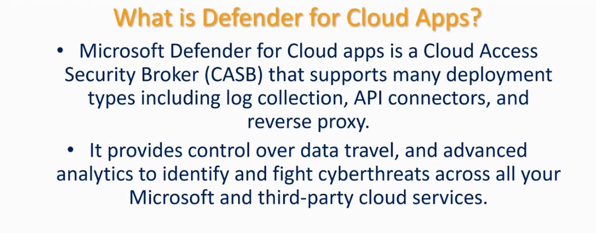
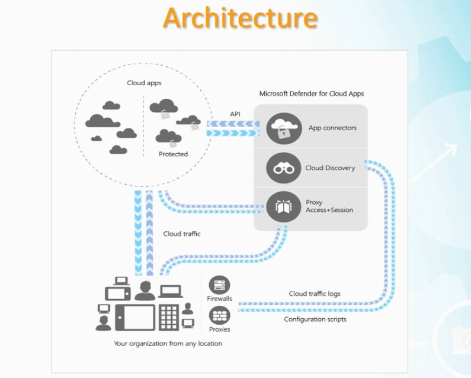
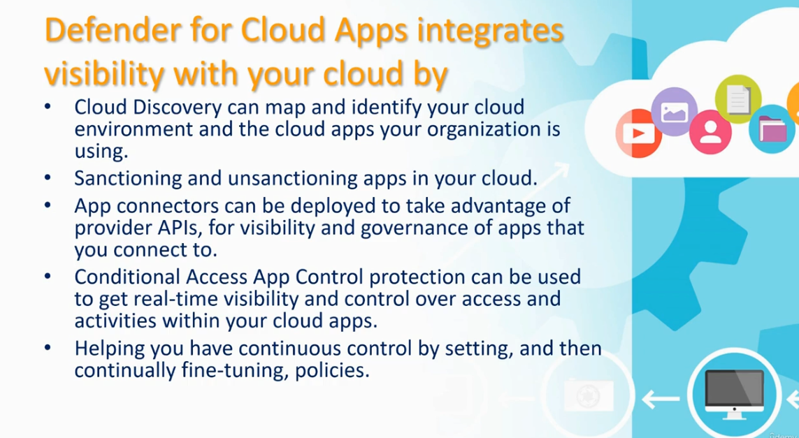
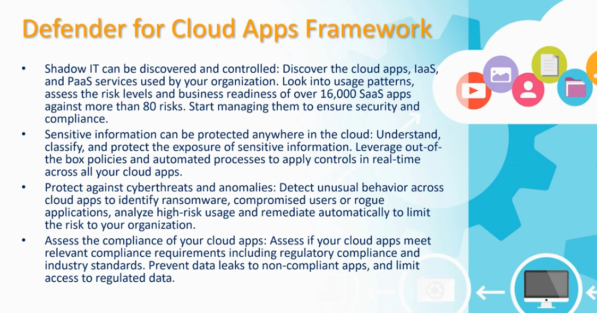
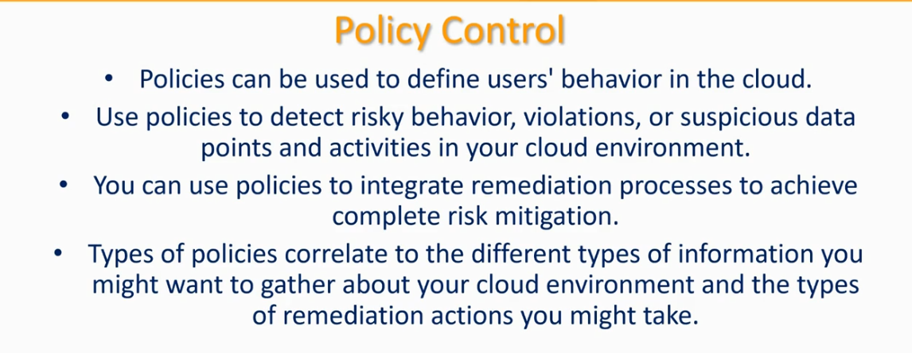
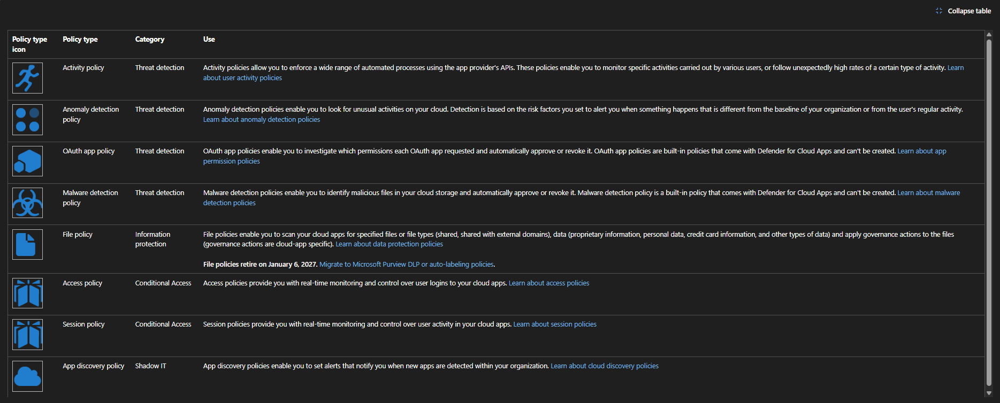

# Microsoft Defender for Cloud Apps

This guide explains what Microsoft Defender for Cloud Apps is, its architecture, how it integrates visibility into your cloud environment, its overall framework, and the policy types used to control and detect risk.

---

## Table of Contents

1. [What Is Defender for Cloud Apps](#1-what-is-defender-for-cloud-apps)
2. [Architecture](#2-architecture)
3. [How Defender for Cloud Apps Integrates Visibility](#3-how-defender-for-cloud-apps-integrates-visibility)
4. [Defender for Cloud Apps Framework](#4-defender-for-cloud-apps-framework)
5. [Policy Control](#5-policy-control)
6. [Policy Types Reference](#6-policy-types-reference)

---

## 1. What Is Defender for Cloud Apps

**Purpose:** Microsoft Defender for Cloud Apps is a Cloud Access Security Broker (CASB) that gives you visibility and control over data and threats across your cloud apps.



### Key points

- Microsoft Defender for Cloud Apps is a **Cloud Access Security Broker (CASB)** that supports many deployment types, including **log collection**, **API connectors**, and **reverse proxy**.
- It provides **control over data travel**, and advanced analytics to identify and fight cyberthreats across all your Microsoft and third-party cloud services.

---

## 2. Architecture

**Purpose:** Shows how Defender for Cloud Apps sits between your organization and your cloud apps, using three core mechanisms — App connectors, Cloud Discovery, and Proxy (Access + Session) — to gain visibility and control.



### How it fits together

1. **Cloud apps** are split into **protected** and unprotected groups.
2. **App connectors** use **API** connections to integrate directly with sanctioned cloud apps.
3. **Cloud Discovery** analyzes **cloud traffic** and **cloud traffic logs** coming from your organization's firewalls and proxies to identify all apps in use.
4. **Proxy (Access + Session)** sits in the traffic path to apply real-time access and session controls, using **configuration scripts** deployed to your organization's devices.
5. All of this data flows from **your organization** — any location, any device (desktop, mobile, servers) — through **firewalls** and **proxies**, back into Defender for Cloud Apps for analysis and control.

---

## 3. How Defender for Cloud Apps Integrates Visibility

**Purpose:** Defender for Cloud Apps integrates visibility with your cloud environment through four core mechanisms.



### Key mechanisms

- **Cloud Discovery** can map and identify your cloud environment and the cloud apps your organization is using.
- **Sanctioning and unsanctioning apps** in your cloud.
- **App connectors** can be deployed to take advantage of provider APIs, for visibility and governance of apps that you connect to.
- **Conditional Access App Control** protection can be used to get real-time visibility and control over access and activities within your cloud apps.
- Helping you have **continuous control** by setting, and then continually fine-tuning, policies.

---

## 4. Defender for Cloud Apps Framework

**Purpose:** The four functional pillars of Defender for Cloud Apps — discovering shadow IT, protecting sensitive information, defending against threats, and assessing compliance.



### The four pillars

1. **Shadow IT can be discovered and controlled** — discover the cloud apps, IaaS, and PaaS services used by your organization. Look into usage patterns, assess the risk levels and business readiness of over 16,000 SaaS apps against more than 80 risks. Start managing them to ensure security and compliance.
2. **Sensitive information can be protected anywhere in the cloud** — understand, classify, and protect the exposure of sensitive information. Leverage out-of-the-box policies and automated processes to apply controls in real-time across all your cloud apps.
3. **Protect against cyberthreats and anomalies** — detect unusual behavior across cloud apps to identify ransomware, compromised users, or rogue applications; analyze high-risk usage and remediate automatically to limit the risk to your organization.
4. **Assess the compliance of your cloud apps** — assess if your cloud apps meet relevant compliance requirements, including regulatory compliance and industry standards. Prevent data leaks to non-compliant apps, and limit access to regulated data.

---

## 5. Policy Control

**Purpose:** Policies are the mechanism used to define, detect, and remediate risky behavior across your cloud environment.



### Key points

- Policies can be used to **define users' behavior** in the cloud.
- Use policies to **detect risky behavior, violations, or suspicious data points and activities** in your cloud environment.
- You can use policies to **integrate remediation processes** to achieve complete risk mitigation.
- Types of policies correlate to the different types of information you might want to gather about your cloud environment and the types of remediation actions you might take.

---

## 6. Policy Types Reference

**Purpose:** A full reference of the policy types available in Defender for Cloud Apps, grouped by category, and what each one is used for.



| Policy Type | Category | Use |
|---|---|---|
| **Activity policy** | Threat detection | Allows you to enforce a wide range of automated processes using the app provider's APIs. Enables monitoring specific activities carried out by various users, or following unexpectedly high rates of a certain type of activity. |
| **Anomaly detection policy** | Threat detection | Enables you to look for unusual activities on your cloud. Detection is based on the risk factors you set to alert you when something happens that is different from the baseline of your organization or from the user's regular activity. |
| **OAuth app policy** | Threat detection | Enables you to investigate which permissions each OAuth app requested and automatically approve or revoke it. OAuth app policies are **built-in** policies that come with Defender for Cloud Apps and can't be created. |
| **Malware detection policy** | Threat detection | Enables you to identify malicious files in your cloud storage and automatically approve or revoke it. Malware detection policy is a **built-in** policy that comes with Defender for Cloud Apps and can't be created. |
| **File policy** | Information protection | Enables you to scan your cloud apps for specified files or file types (shared, shared with external domains), data (proprietary information, personal data, credit card information, and other types of data) and apply governance actions to the files (governance actions are cloud-app specific). ⚠️ **File policies retire on January 6, 2027** — migrate to Microsoft Purview DLP or auto-labeling policies. |
| **Access policy** | Conditional Access | Provides you with real-time monitoring and control over user logins to your cloud apps. |
| **Session policy** | Conditional Access | Provides you with real-time monitoring and control over user activity in your cloud apps. |
| **App discovery policy** | Shadow IT | Enables you to set alerts that notify you when new apps are detected within your organization. |

---

## Recommended Workflow

1. Understand what Defender for Cloud Apps does as a **CASB** — visibility, control, and threat protection across your cloud apps.
2. Review the **architecture** to understand how App connectors, Cloud Discovery, and Proxy (Access + Session) work together.
3. Use **Cloud Discovery** to surface Shadow IT and assess risk across thousands of SaaS apps.
4. Apply the **Defender for Cloud Apps Framework** pillars — discover, protect sensitive data, detect threats, assess compliance.
5. Configure **policies** by category:
   - **Threat detection** — Activity, Anomaly detection, OAuth app, Malware detection
   - **Information protection** — File policy (note: retiring January 6, 2027 — plan migration to Purview DLP/auto-labeling)
   - **Conditional Access** — Access policy, Session policy
   - **Shadow IT** — App discovery policy
6. Continually fine-tune policies as part of your ongoing risk mitigation process.

---

## File Structure

```
.
├── README.md
├── defender-for-cloud-apps.png
├── defender-for-cloud-apps-architecture.png
├── defender-for-cloud-apps-benefits.png
├── defender-for-cloud-apps-framework.png
├── defender-for-cloud-apps-policy-control.png
└── defender-for-apps-policy.png
```
