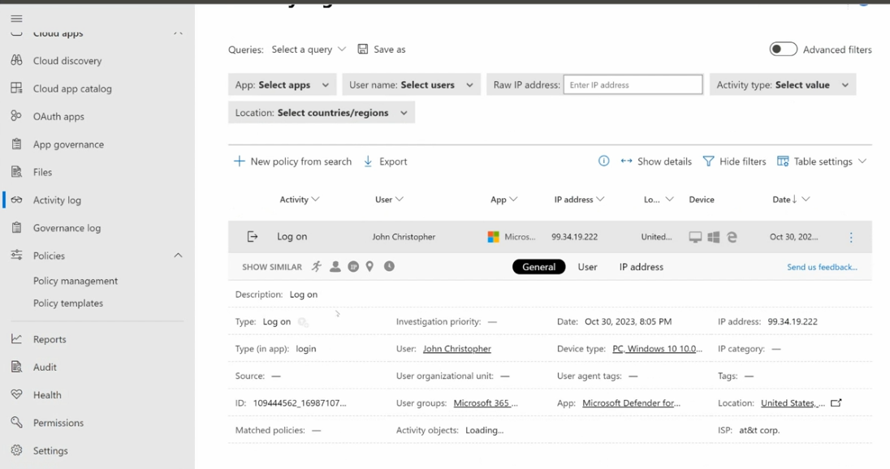
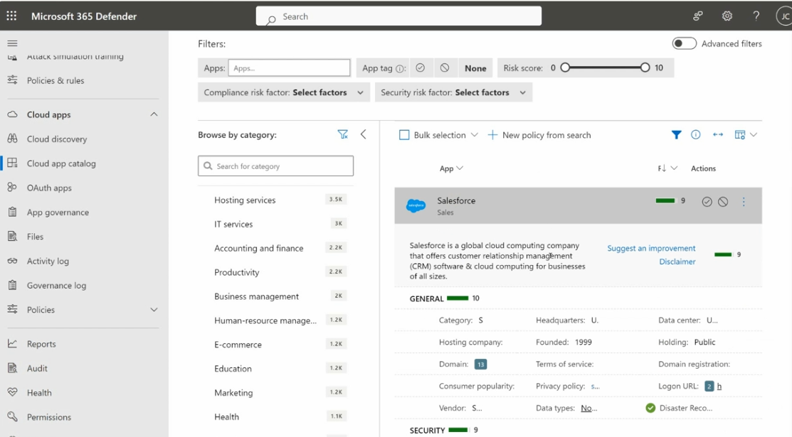
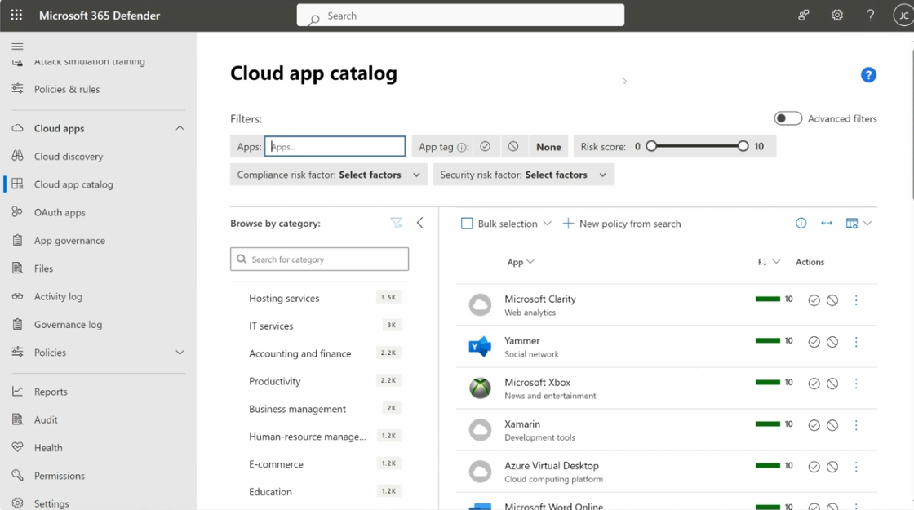
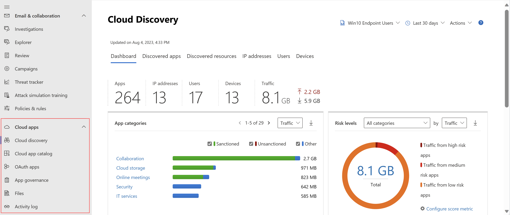
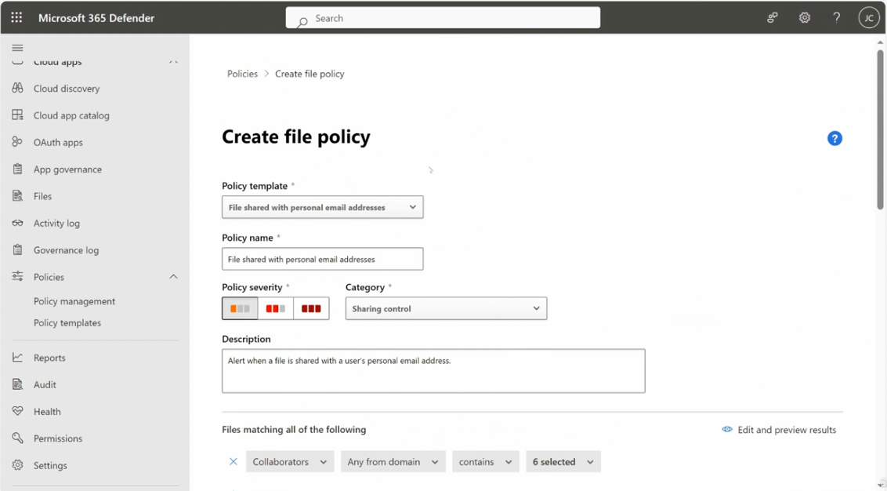
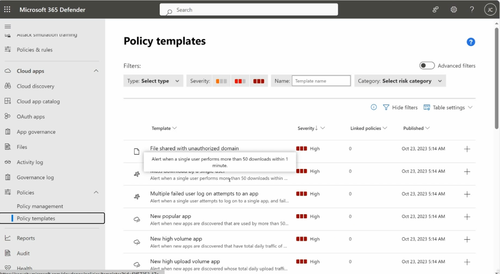

# Microsoft Defender for Cloud Apps — Portal Walkthrough

This guide walks through the key working areas of Microsoft Defender for Cloud Apps in the Microsoft 365 Defender portal: the **Activity log**, **App score / risk assessment**, **Cloud app catalog**, **Cloud Discovery**, **Create file policy**, and **Policy templates**.

---

## Table of Contents

1. [Activity Log](#1-activity-log)
2. [App Score / Risk Assessment](#2-app-score--risk-assessment)
3. [Cloud App Catalog](#3-cloud-app-catalog)
4. [Cloud Discovery](#4-cloud-discovery)
5. [Create File Policy](#5-create-file-policy)
6. [Policy Templates](#6-policy-templates)

---

## 1. Activity Log

**Purpose:** The Activity log records user activity across your connected cloud apps, letting you search, filter, and drill into individual events for investigation.



### Steps to use

1. Go to **Microsoft 365 Defender → Cloud apps → Activity log**.
2. Use the **Queries** dropdown to select a saved query, or build a new one and **Save as**.
3. Apply filters:
   - **App** — select specific apps
   - **User name** — select specific users
   - **Raw IP address** — enter an IP address
   - **Activity type** — select a value
   - **Location** — select countries/regions
   - Toggle **Advanced filters** for more granular conditions
4. Use **+ New policy from search** to turn the current filtered query into a policy, or **Export** to download the results.
5. Review the results table: **Activity**, **User**, **App**, **IP address**, **Location**, **Device**, **Date**.
6. Select a row to expand its details, including:
   - **Description**, **Type**, **Type (in app)**, **Source**
   - **Investigation priority**, **Date**, **User**, **User organizational unit**
   - **IP address**, **Device type**, **User agent tags**, **Tags**
   - **ID**, **User groups**, **App**, **Location**, **ISP**
   - **Matched policies**, **Activity objects**
7. Use **Show similar** to find related activity by **General**, **User**, or **IP address** attributes.

---

## 2. App Score / Risk Assessment

**Purpose:** Every discovered or cataloged app is assigned a risk score based on dozens of security and compliance attributes, helping you decide whether to sanction or block it.



### Steps to review an app's score

1. Go to **Cloud apps → Cloud app catalog** (or reach an app from **Cloud discovery → Discovered apps**).
2. Use the filters at the top: **Apps**, **App tag**, **Risk score** (0–10 slider), **Compliance risk factor**, **Security risk factor**.
3. Use **Browse by category** on the left to narrow by category (e.g., Hosting services, IT services, Accounting and finance, Productivity).
4. Select an app (e.g., **Salesforce**) to open its detail panel:
   - Overall **risk score** (e.g., 9/10) shown as a colored bar
   - App description and **Suggest an improvement** / **Disclaimer** links
   - **General** score breakdown (e.g., 10/10) — Category, Headquarters, Data center, Hosting company, Founded, Holding, Domain, Terms of service, Domain registration, Consumer popularity, Privacy policy, Logon URL, Vendor, Data types, Disaster Recovery
   - **Security** score breakdown (e.g., 9/10) — further security-related attributes below
5. Use the **Actions** menu (⋯) next to an app, or the ✅ / 🚫 icons, to **sanction** or **unsanction** the app directly from this view.
6. Use **+ New policy from search** to create a policy based on the current filtered app list.

---

## 3. Cloud App Catalog

**Purpose:** A searchable catalog of thousands of cloud apps (over 16,000 SaaS apps), each pre-scored for risk, that you can browse, filter, and act on.



### Steps to use

1. Go to **Cloud apps → Cloud app catalog**.
2. Apply the same filter bar as the risk assessment view: **Apps**, **App tag**, **Risk score**, **Compliance risk factor**, **Security risk factor**.
3. Use **Browse by category** to narrow results (e.g., Hosting services — 3.5K apps, IT services — 3K, Accounting and finance — 2.2K, Productivity — 2.2K, Business management — 2K, Human-resource management — 1.2K, E-commerce — 1.2K, Education — 1.2K).
4. Review the app list, each row showing:
   - App icon, name, and category (e.g., Microsoft Clarity — Web analytics, Yammer — Social network, Microsoft Xbox — News and entertainment, Xamarin — Development tools, Azure Virtual Desktop — Cloud computing platform)
   - **Risk score** bar (e.g., 10/10)
   - Quick **sanction (✅)** / **unsanction (🚫)** icons
   - **Actions** menu (⋯) for more options
5. Use **Bulk selection** to select multiple apps at once and apply an action, or **+ New policy from search** to create a policy from the current view.

---

## 4. Cloud Discovery

**Purpose:** Cloud Discovery analyzes traffic logs from your firewalls/proxies (or endpoint data) to automatically identify every cloud app in use across your organization — sanctioned or not.



### Steps to use

1. Go to **Cloud apps → Cloud discovery**.
2. Select a data source (e.g., **Win10 Endpoint Users**) and a time range (e.g., **Last 30 days**) from the top toolbar; use **Actions** for more options.
3. Review the **Dashboard** tab summary tiles:
   - **Apps** discovered (e.g., 264)
   - **IP addresses** (e.g., 13)
   - **Users** (e.g., 17)
   - **Devices** (e.g., 13)
   - **Traffic** total (e.g., 8.1 GB, with upload/download breakdown)
4. Review **App categories** — traffic broken down by category (e.g., Collaboration, Cloud storage, Online meetings, Security, IT services), each split into **Sanctioned**, **Unsanctioned**, and **Other**.
5. Review the **Risk levels** donut chart — total traffic (e.g., 8.1 GB) broken into **Traffic from high risk apps**, **medium risk apps**, and **low risk apps**. Use **Configure score metric** to adjust how risk is calculated.
6. Switch to other tabs for deeper detail: **Discovered apps**, **Discovered resources**, **IP addresses**, **Users**, **Devices**.

---

## 5. Create File Policy

**Purpose:** File policies scan your cloud apps for specific files, file types, or data patterns and apply governance actions automatically when a match is found.



### Steps to configure

1. Go to **Cloud apps → Policies → Policy management → + Create policy → File policy**.
2. Choose a **Policy template** — e.g., **File shared with personal email addresses** (or start from scratch/another template).
3. Enter a **Policy name** — e.g., `File shared with personal email addresses`.
4. Set the **Policy severity** — Low, Medium, or High (color-coded).
5. Choose a **Category** — e.g., **Sharing control**.
6. Enter a **Description** — e.g., *"Alert when a file is shared with a user's personal email address."*
7. Under **Files matching all of the following**, define the conditions, e.g.:
   - **Collaborators** — **Any from domain** — **contains** — a set of selected domains (e.g., 6 selected)
8. Use **Edit and preview results** to validate the policy against existing data before saving.
9. Continue scrolling to configure **governance actions** (e.g., notify, quarantine, remove collaborators), then **Create**.

> ⚠️ Note: File policies are scheduled to retire on **January 6, 2027** — plan to migrate file-based scanning to **Microsoft Purview DLP** or **auto-labeling policies**.

---

## 6. Policy Templates

**Purpose:** Pre-built templates that define common risk scenarios, so you can quickly create a new policy without configuring every condition from scratch.



### Steps to use

1. Go to **Cloud apps → Policies → Policy templates**.
2. Apply filters: **Type**, **Severity**, **Name**, **Category** (risk category); toggle **Advanced filters** if needed.
3. Review the templates table, showing **Template**, **Severity**, **Linked policies**, and **Published** date. Examples:
   - **File shared with unauthorized domain** — High severity — alerts when files are shared outside allowed domains.
   - **Mass download by a single user** — High severity — alert when a single user performs more than 50 downloads within 1 minute.
   - **Multiple failed user log on attempts to an app** — High severity — alert when a single user attempts to log on to a single app and fails repeatedly.
   - **New popular app** — High severity — alert when new apps are discovered that are used by more than 50 users.
   - **New high volume app** — High severity — alert when new apps are discovered that have high total daily traffic.
   - **New high upload volume app** — High severity — alert when new apps are discovered whose total daily upload traffic is high.
4. Select the **+** icon next to a template to create a new policy directly from it.
5. Hover over a template row to preview its full description before committing.

---

## Recommended Workflow

1. Run **Cloud Discovery** first to see which apps are actually in use across your organization.
2. Cross-reference discovered apps against the **Cloud app catalog** and review each app's **risk score** to decide what to sanction or block.
3. Use **Policy templates** to quickly stand up common detection scenarios (mass downloads, failed logons, new popular apps).
4. Create custom **file policies** for specific data-sharing scenarios not covered by a template (keeping the January 2027 retirement date in mind).
5. Use the **Activity log** to investigate flagged events, confirm policy matches, and build new policies directly from filtered search results.

---

## File Structure

```
.
├── README.md
├── activity-log.png
├── app-score.png
├── cloud-app-catalog.png
├── cloud-discovery.png
├── create-file-policy.png
└── policy-templates.png
```
