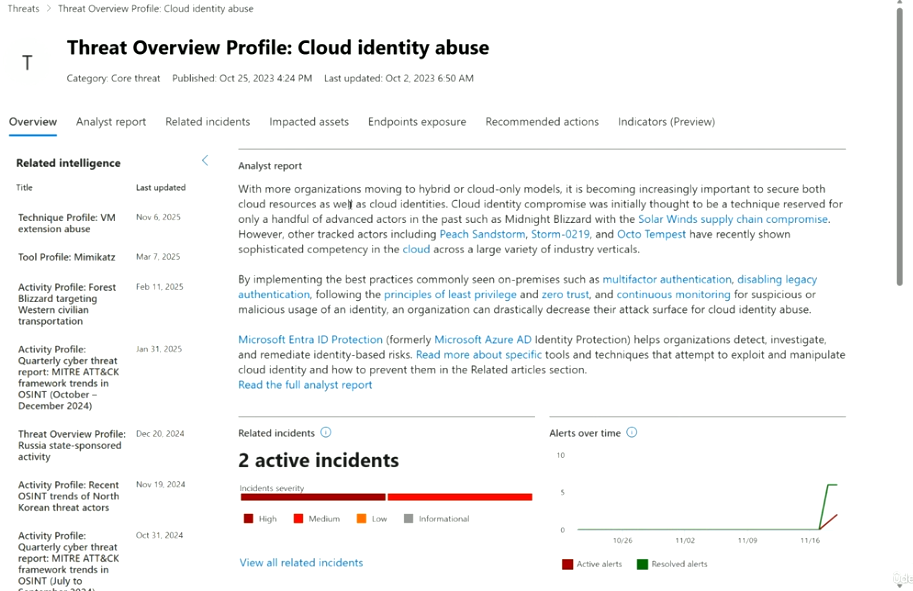
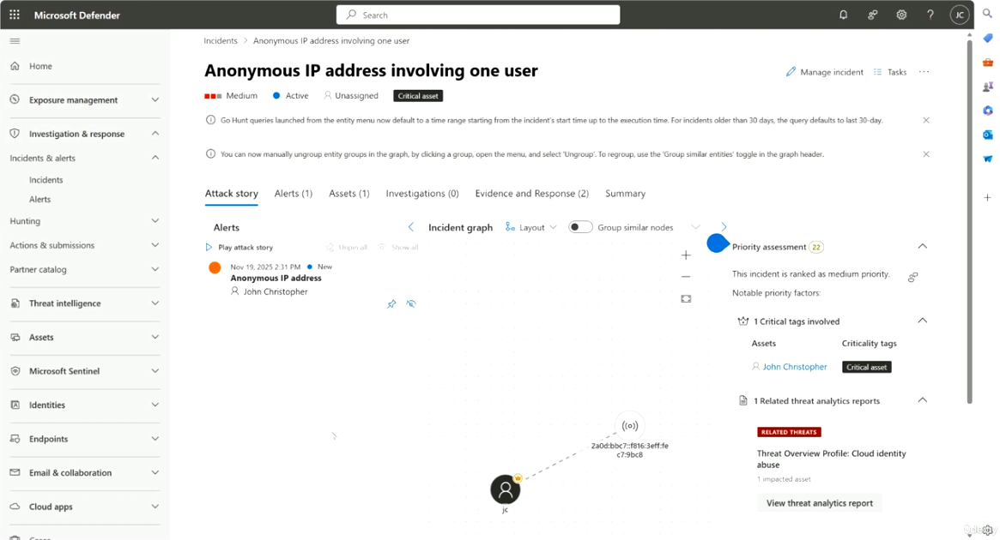
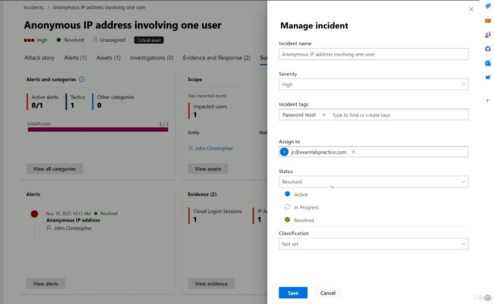
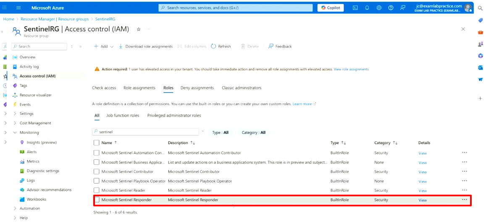

# Microsoft Defender — Incident Investigation, Threat Analytics & Sentinel Roles

This guide covers how to review a **Threat Analytics** report, investigate an **incident** in Microsoft Defender, manage that incident's status/assignment, and understand the **Microsoft Sentinel Responder** role used for incident response permissions.

---

## Table of Contents

1. [Threat Analytics — Threat Overview Profile](#1-threat-analytics--threat-overview-profile)
2. [Incident — Attack Story View](#2-incident--attack-story-view)
3. [Manage Incident](#3-manage-incident)
4. [Microsoft Sentinel Responder Role (Azure IAM)](#4-microsoft-sentinel-responder-role-azure-iam)

---

## 1. Threat Analytics — Threat Overview Profile

**Purpose:** Threat Analytics provides detailed, Microsoft-curated intelligence reports on active threats (e.g., specific techniques, tools, or threat actors), including how they impact your environment and what to do about it.



### Steps to review a report

1. Go to **Microsoft Defender → Threat intelligence → Threat analytics**.
2. Select a report — e.g., **Threat Overview Profile: Cloud identity abuse** (Category: Core threat, with **Published** and **Last updated** dates shown).
3. Use the tabs across the top to explore each section:
   - **Overview** — the analyst report summary and related incidents/alerts
   - **Analyst report** — Microsoft's full write-up, e.g., explaining how cloud identity compromise is used by actors like **Midnight Blizzard** (Solar Winds supply chain compromise), **Peach Sandstorm**, **Storm-0219**, and **Octo Tempest**, and recommending mitigations such as multifactor authentication, disabling legacy authentication, least privilege, zero trust, and continuous monitoring.
   - **Related incidents**
   - **Impacted assets**
   - **Endpoints exposure**
   - **Recommended actions**
   - **Indicators (Preview)**
4. On the left, review the **Related intelligence** panel — linked technique profiles, tool profiles, and activity profiles (e.g., *Technique Profile: VM extension abuse*, *Tool Profile: Mimikatz*, *Activity Profile: Forest Blizzard targeting Western civilian transportation*), each with a **Last updated** date.
5. In the main pane, check:
   - **Related incidents** — e.g., *2 active incidents*, with a severity breakdown (High/Medium/Low/Informational) and a **View all related incidents** link.
   - **Alerts over time** — a chart of active vs. resolved alerts over the recent period.
6. Follow **Read the full analyst report** or in-line links (e.g., **Microsoft Entra ID Protection**) for deeper guidance and remediation tooling.

---

## 2. Incident — Attack Story View

**Purpose:** The incident page brings together every alert, asset, and piece of evidence related to a single security incident, visualized as an interactive attack story graph.



### Steps to investigate

1. Go to **Microsoft Defender → Incidents & alerts → Incidents**, and select an incident — e.g., **Anonymous IP address involving one user**.
2. Review the header: severity (e.g., **Medium**), status (e.g., **Active**), assignment (e.g., **Unassigned**), and any asset tags (e.g., **Critical asset**).
3. Use the top action bar: **Manage incident**, **Tasks**, or the **⋯** menu for more options.
4. Navigate the tabs:
   - **Attack story** — the visual incident graph
   - **Alerts (1)** — individual alerts tied to this incident
   - **Assets (1)** — impacted users/devices
   - **Investigations (0)** — automated investigation status
   - **Evidence and Response (2)** — supporting evidence
   - **Summary**
5. On the **Attack story** tab:
   - Use **Play attack story** to walk through the timeline automatically.
   - Toggle **Group similar nodes** and adjust the **Layout** of the incident graph.
   - Select an alert (e.g., *Anonymous IP address* involving *John Christopher*) to highlight its place in the graph.
6. Review the **Priority assessment** panel on the right:
   - Overall priority score (e.g., 22) and ranking (e.g., *ranked as medium priority*)
   - **Notable priority factors** — e.g., **1 Critical asset involved** (with the affected user and criticality tag), and **1 Related threat analytics report** (e.g., linking back to *Threat Overview Profile: Cloud identity abuse*)
   - Select **View threat analytics report** to jump directly to the related Threat Analytics profile.

---

## 3. Manage Incident

**Purpose:** Lets an analyst update an incident's name, severity, tags, assignment, status, and classification as the investigation progresses.



### Steps to update an incident

1. From the incident page, select **Manage incident** to open the side panel.
2. Update fields as needed:
   - **Incident name** — edit the display name (e.g., *Anonymous IP address involving one user*).
   - **Severity** — e.g., change to **High**.
   - **Incident tags** — add or remove tags (e.g., *Password reset*), or type to create a new tag.
   - **Assign to** — assign the incident to a specific analyst (e.g., `jc@examlabpractice.com`).
   - **Status** — set to **Active**, **In Progress**, or **Resolved**.
   - **Classification** — set a classification (e.g., true positive/false positive), or leave as **Not set**.
3. Select **Save** to apply changes, or **Cancel** to discard.
4. Back on the main incident page, the **Summary** tab reflects the updated state, including:
   - **Alerts and categories** — active vs. total alerts, tactics involved (e.g., *InitialAccess 1/1*)
   - **Scope** — top impacted assets/users
   - **Alerts** — list of alerts with their status (e.g., *Resolved*)
   - **Evidence** — supporting evidence items (e.g., *Cloud Logon Sessions*, *IP address*)
   - Use **View all categories**, **View assets**, **View alerts**, and **View evidence** to drill into each area.

---

## 4. Microsoft Sentinel Responder Role (Azure IAM)

**Purpose:** The **Microsoft Sentinel Responder** built-in Azure role grants the permissions needed to manage incidents (assign, dismiss, change status) without full administrative control over the Sentinel workspace.



### Steps to review/assign the role

1. Go to **Microsoft Azure → Resource groups → (your Sentinel resource group, e.g., SentinelRG) → Access control (IAM)**.
2. Select the **Roles** tab.
3. Search for `sentinel` to filter the role list. Review the available built-in roles:
   - **Microsoft Sentinel Automation Contributor**
   - **Microsoft Sentinel Business Applications...** (in preview)
   - **Microsoft Sentinel Contributor**
   - **Microsoft Sentinel Playbook Operator**
   - **Microsoft Sentinel Reader**
   - **Microsoft Sentinel Responder** — a **BuiltInRole** under the **Security** category, used specifically for incident response tasks.
4. Select **View** next to **Microsoft Sentinel Responder** to see its full permission set and description.
5. To assign it, select **+ Add → Add role assignment**, choose **Microsoft Sentinel Responder**, and assign it to the appropriate user or group.
6. Note the banner warning at the top of the page: if a user has **elevated access** in your tenant, you should review and remove any unnecessary elevated role assignments — select **View role assignments** to investigate.

---

## Recommended Workflow

1. Use **Threat Analytics** to understand the broader threat context (technique, actor, recommended mitigations) behind an alert category.
2. Open the related **Incident** and walk through the **Attack story** to understand what happened, to whom, and in what order.
3. Use the **Priority assessment** panel to understand why an incident was ranked the way it was (critical assets, related threat intel).
4. Use **Manage incident** to assign ownership, update severity/status, and tag the incident as the investigation progresses.
5. Ensure analysts who need to manage incidents (without full admin rights) are assigned the **Microsoft Sentinel Responder** role via Azure IAM, and periodically audit for unnecessary elevated access.

---

## File Structure

```
.
├── README.md
├── threat-analysis.png
├── incident.png
├── Manage-incident.png
└── microsoft-sentinel-responder.png
```
