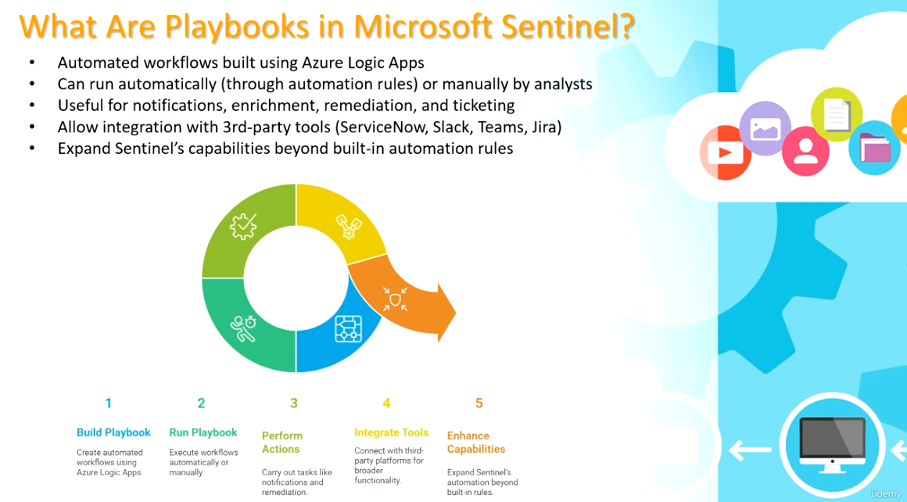
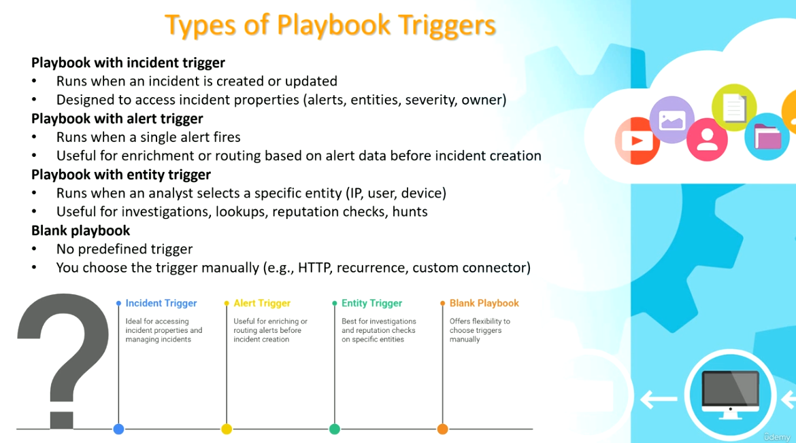
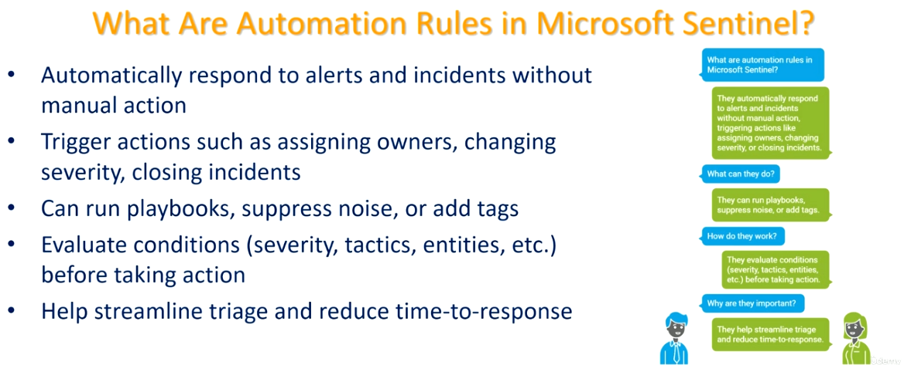
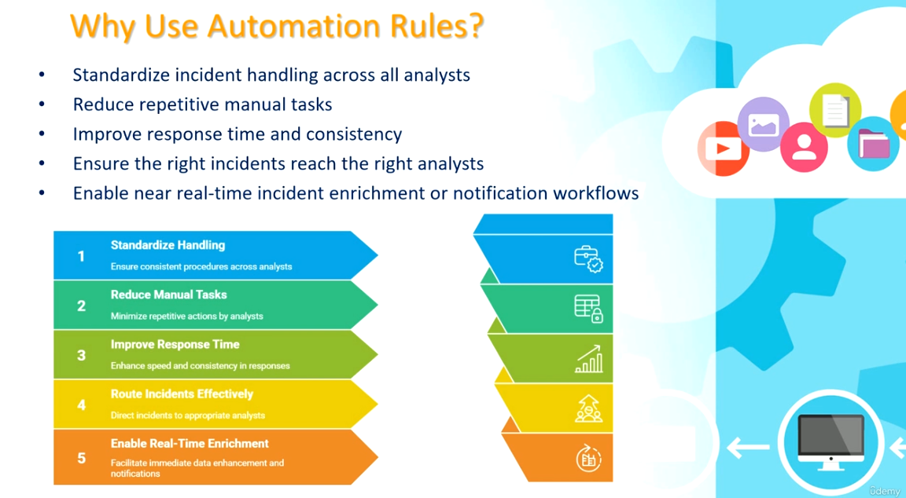

# Microsoft Sentinel — Playbooks & Automation Rules

This guide explains what Playbooks and Automation Rules are in Microsoft Sentinel, why you'd use each, and the different types of triggers available for Playbooks.

---

## Table of Contents

1. [What Are Playbooks in Microsoft Sentinel](#1-what-are-playbooks-in-microsoft-sentinel)
2. [Why Use Playbooks](#2-why-use-playbooks)
3. [Types of Playbook Triggers](#3-types-of-playbook-triggers)
4. [What Are Automation Rules in Microsoft Sentinel](#4-what-are-automation-rules-in-microsoft-sentinel)
5. [Why Use Automation Rules](#5-why-use-automation-rules)

---

## 1. What Are Playbooks in Microsoft Sentinel

**Purpose:** Playbooks are automated workflows built using Azure Logic Apps that extend Microsoft Sentinel's response capabilities beyond built-in automation rules.


### Key points

- **Automated workflows** built using **Azure Logic Apps**.
- Can run **automatically** (through automation rules) or **manually** by analysts.
- Useful for **notifications, enrichment, remediation, and ticketing**.
- Allow integration with **3rd-party tools** (ServiceNow, Slack, Teams, Jira).
- Expand Sentinel's capabilities **beyond built-in automation rules**.

### The playbook lifecycle (5 stages)

1. **Build Playbook** — create automated workflows using Azure Logic Apps.
2. **Run Playbook** — execute workflows automatically or manually.
3. **Perform Actions** — carry out tasks like notifications and remediation.
4. **Integrate Tools** — connect with third-party platforms for broader functionality.
5. **Enhance Capabilities** — expand Sentinel's automation beyond built-in rules.

---

## 2. Why Use Playbooks

**Purpose:** A closer look at how playbooks fit into the Sentinel workflow, reinforcing what they do and why they matter for extending automation.



### Key points

- **Automated workflows** built using **Azure Logic Apps**.
- Can run **automatically** (through automation rules) or **manually** by analysts.
- Useful for **notifications, enrichment, remediation, and ticketing**.
- Allow integration with **3rd-party tools** (ServiceNow, Slack, Teams, Jira).
- Expand Sentinel's capabilities **beyond built-in automation rules**.

### The playbook lifecycle (5 stages)

1. **Build Playbook** — create automated workflows using Azure Logic Apps.
2. **Run Playbook** — execute workflows automatically or manually.
3. **Perform Actions** — carry out tasks like notifications and remediation.
4. **Integrate Tools** — connect with third-party platforms for broader functionality.
5. **Enhance Capabilities** — expand Sentinel's automation beyond built-in rules.

---

## 3. Types of Playbook Triggers

**Purpose:** Playbooks can be started by different trigger types depending on what data is available and what you need the playbook to act on.



### Playbook with incident trigger

- Runs when an **incident** is created or updated.
- Designed to access incident properties (alerts, entities, severity, owner).
- **Ideal for** accessing incident properties and managing incidents.

### Playbook with alert trigger

- Runs when a **single alert** fires.
- Useful for enrichment or routing based on alert data **before** incident creation.
- **Useful for** enriching or routing alerts before incident creation.

### Playbook with entity trigger

- Runs when an analyst selects a **specific entity** (IP, user, device).
- Useful for investigations, lookups, and reputation checks.
- **Best for** investigations and reputation checks on specific entities.

### Blank playbook

- **No predefined trigger.**
- You choose the trigger manually (e.g., HTTP, recurrence, custom connector).
- **Offers flexibility** to choose triggers manually.

---

## 4. What Are Automation Rules in Microsoft Sentinel

**Purpose:** Automation rules let Sentinel automatically respond to alerts and incidents without manual action, streamlining triage across your SOC.



### Key points (Q&A format)

- **What are automation rules in Microsoft Sentinel?**
  They automatically respond to alerts and incidents without manual action, triggering actions like assigning owners, changing severity, or closing incidents.
- **What can they do?**
  They can run playbooks, suppress noise, or add tags.
- **How do they work?**
  They evaluate conditions (severity, tactics, entities, etc.) before taking action.
- **Why are they important?**
  They help streamline triage and reduce time-to-response.

---

## 5. Why Use Automation Rules

**Purpose:** The concrete operational benefits automation rules provide to a security team.



### Key benefits

1. **Standardize Handling** — ensure consistent procedures across analysts.
2. **Reduce Manual Tasks** — minimize repetitive actions by analysts.
3. **Improve Response Time** — enhance speed and consistency in responses.
4. **Route Incidents Effectively** — direct incidents to the appropriate analysts.
5. **Enable Real-Time Enrichment** — facilitate immediate data enhancement and notifications.

### Summary

- Standardize incident handling across all analysts.
- Reduce repetitive manual tasks.
- Improve response time and consistency.
- Ensure the right incidents reach the right analysts.
- Enable near real-time incident enrichment or notification workflows.

---

## Recommended Workflow

1. Build **Playbooks** in Azure Logic Apps for the specific actions you need — notifications, enrichment, remediation, or ticketing.
2. Choose the right **trigger type** for each playbook: incident trigger for incident-level actions, alert trigger for pre-incident enrichment/routing, entity trigger for on-demand investigations, or a blank playbook for fully custom triggers.
3. Create **Automation Rules** to decide *when* and *how* those playbooks run — based on conditions like severity, tactics, or entities — and to handle simpler actions directly (assign, tag, suppress, close).
4. Use automation rules to standardize triage across your whole analyst team and reduce time-to-response.
5. Periodically review both playbooks and automation rules to ensure they still route incidents to the right people and reflect current response procedures.

---

## File Structure

```
.
├── README.md
├── what-are-playbooks.png
├── Why-playbook.png
├── types-of-playbook-triggers.png
├── what-are-automation-rules.png
└── why-use-automation-rules.png
```
